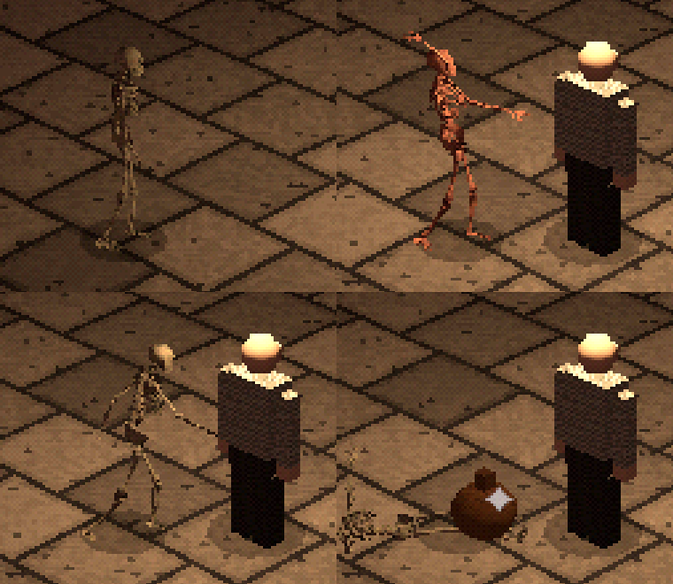
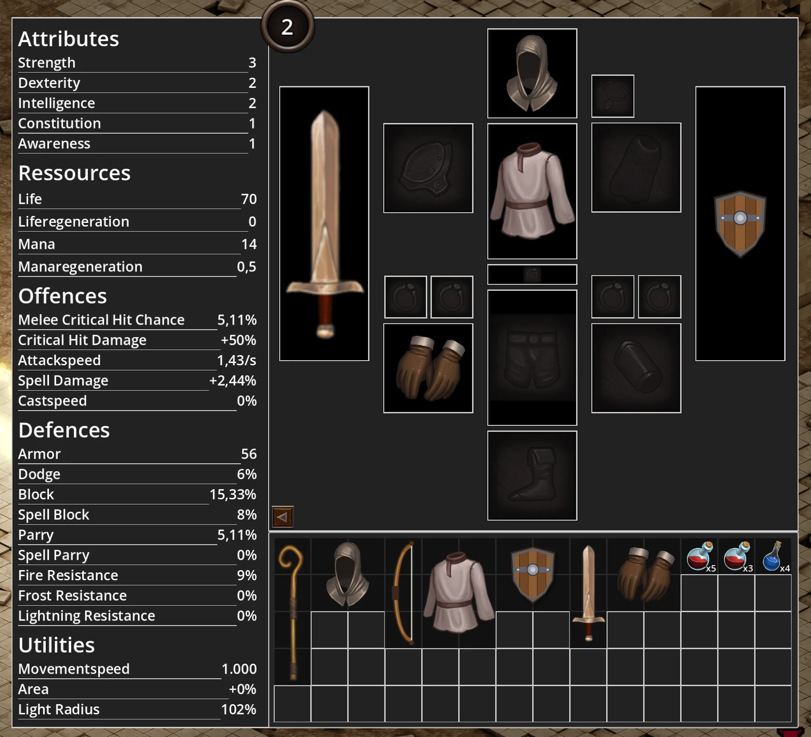
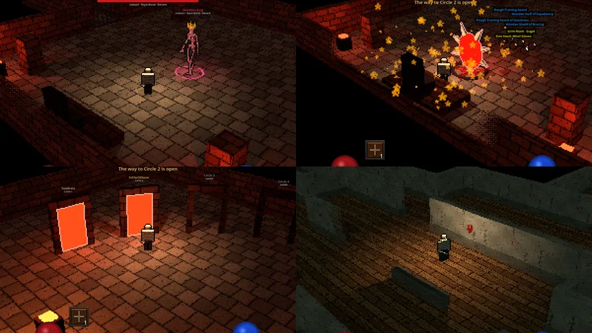
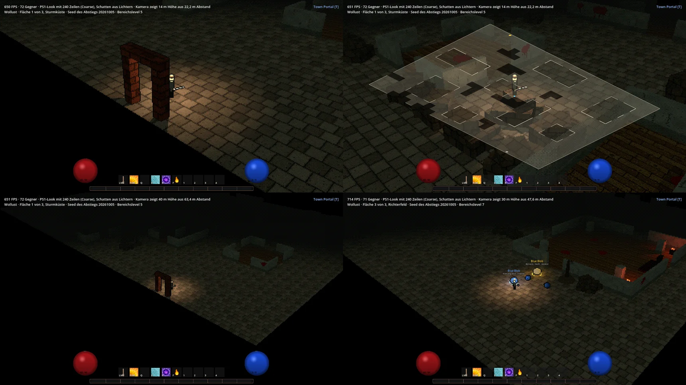
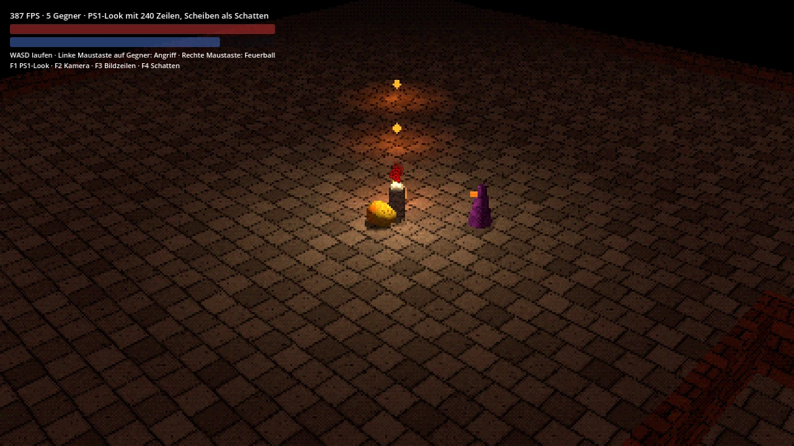
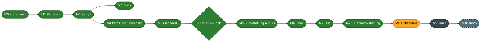

<div align="center">

# 🔥 Höllenspiralenspiel

**Ein isometrisches Action-RPG durch die neun Kreise der Hölle**

*Düster, blutig, dämonisch. Und der Held hat es sich selbst eingebrockt.*


[Feature-Umfang](#-feature-umfang) · [Steuerung](#-steuerung) · [Meilensteine](#-meilensteine) · [Loslegen](#-loslegen) · [Aufbau](#-aufbau-des-projekts)

</div>

---

## 📖 Worum geht es

Der Protagonist begeht alle Sünden gleichzeitig und landet dort, wo er hingehört.
Von einer Stadt als Ausgangspunkt steigt er Kreis für Kreis tiefer hinab.
Jeder Höllenkreis steht für eine Sünde, und ihre Strafe bestimmt das Leveldesign.

Vorbild ist Dantes Inferno, gespielt wird wie ein klassisches Action-RPG:
Gegner erschlagen, Beute sammeln, Charakter ausbauen.

| Eckpunkt | Entscheidung |
|---|---|
| Perspektive | Klassisch isometrisch, von schräg oben |
| Spielstruktur | Stadt als Hub, von dort Abstieg in einen Höllenkreis mit mehreren Ebenen |
| Level | Überwiegend prozedural, dazu handgebaute Räume und Event-Orte |
| Mehrspieler | Erst allein, Koop soll später nachrüstbar bleiben |
| 2D oder 3D | 3D im Look der PlayStation 1. Die frühere 2D-Fassung ist seit dem 29.09.2026 abgelöst |

---

## ✨ Feature-Umfang

Das ist der Stand vom 02.10.2026. Das Spiel beginnt im Hauptmenü. Vom Hub führen Portale in die Höllenkreise: in einen Testkreis mit vier erzeugten Ebenen, nach Wollust, das in M8 entsteht und aus drei freien Flächen besteht, und an einem zehnten Portal ins Schlachthaus, ein Testlevel, das immer offen ist. Im Hub stehen eine Truhe und ein Händler, bezahlt wird mit Gold.
Das Spiel läuft in 3D, mehr dazu im Abschnitt [3D im PS1-Look](#-3d-im-ps1-look).

### 🧙 Charakter

| Feature | Beschreibung |
|---|---|
| Fünf Attribute | Strength, Dexterity, Intelligence, Constitution, Awareness |
| Abgeleitete Werte | Jedes Attribut verbessert weitere Werte über eine Wachstumskurve mit Obergrenze |
| Leben und Mana | Leben: `5 + S + 3*C`, Mana: `3 + A + 5*I`, beide mit Regeneration |
| Leveling | Level 1 bis 100, pro Level ein Attributpunkt, mit Dialog und Effekt |
| Lichtradius | Wächst mit Awareness und vergrößert das Licht um den Spieler |
| Charakterbogen | Alle Werte auf einen Blick, auch Block und Parry, aktualisiert sich sofort |

<details>
<summary>Was jedes Attribut bewirkt</summary>

| Attribut | Wirkung | Obergrenze |
|---|---|---|
| Strength | Physischer Schaden | 100 % more |
| Strength | Rüstung | 300 % more |
| Dexterity | Angriffstempo | 100 % more |
| Dexterity | Ausweichen | 100 % more |
| Intelligence | Zauberschaden | 200 % more |
| Intelligence | Mana | 300 % more |
| Constitution | Leben | 100 % more |
| Constitution | Rüstung | 1000 flach |
| Awareness | Parieren | 200 % more |
| Awareness | Blocken | 200 % more |
| Awareness | Kritische Trefferchance | 200 % more |
| Awareness | Lichtradius | 400 % more |

</details>

<details>
<summary>So werden Werte verrechnet</summary>

Jeder Wert entsteht aus drei Töpfen:

```
Endwert = (Grundwert + Flat) × (1 + Summe Increased) × Produkt More
```

- **Flat** wird addiert.
- **Increased** wird untereinander addiert.
- **More** wird multipliziert.

Beispiel: 14 % und 22 % increased von der Ausrüstung, dazu 2,97 % more aus Intelligenz 4.

```
1,36 × 1,0297 = 1,4004  →  +40,04 % Zauberschaden
```

</details>

### ⚔️ Kampf

| Feature | Beschreibung |
|---|---|
| Trefferauflösung | Jeder Treffer läuft durch dieselbe Kette: Treffen, Ausweichen, Parry, Block, Krit, Minderung |
| Nahkampf | Klick auf einen Gegner, der Held schlägt sofort in seine Richtung im Takt der Waffe zu. Hingelaufen wird selbst, auch während des Schlags. Ein Schlag trifft den Gegner vor dem Helden auch ohne Klick auf ihn: Der angeklickte Gegner in Reichweite hat Vorrang, sonst der nächste im Kegel von 90° vor dem Helden |
| Fernkampf | Mit einem Bogen läuft der Held in Reichweite und schießt. Ohne Gegner unter der Maus schießt er in ihre Richtung |
| Reichweiten | Zählen vom Rand des Körpers bis zum Rand des Ziels. Ein großer Elite ist so gut zu erreichen wie ein kleiner Blob |
| ATTACK und SPELL | Attacks skalieren mit dem Waffenschaden, Spells bringen eigenen Grundschaden mit |
| Sechs Schadensarten | Crush, Pierce, Slash, Fire, Frost, Lightning, jede mit eigenem Effekt |
| Statuseffekte | Stapelnder Bleed und Burn, Shock mit Fehlschlägen, Chill mit Verlangsamung. Erhöhter Schaden über Zeit addiert sich, der Damage over Time Multiplier wirkt als More auf Bleed, Burn und jeden künftigen Effekt mit Schaden, dazu als More der Multiplikator seiner Schadensart: physisch für Bleed, Feuer für Burn. "Chance to Avoid Ailments" wehrt jeden Effekt eines Treffers ab, auch Bleed |
| Zusatzschaden | "Adds X to Y Fire Damage" und Frost und Blitz gehören zum Grundschaden der Waffe: Eine Attack mit 150 % Waffenschaden nimmt sie mit. Ebenso "Adds X to Y … to Attacks" von Handschuhen und "… to Spells" vom Stab für den Grundschaden jeder Attack oder jedes Zaubers. Jedes Element wird für sich gemindert, löst seinen eigenen Effekt aus und wächst mit erhöhtem Elementarschaden, dem eigenen Element und bei Angriffen mit Elementarschaden mit Angriffen, die zusammen zählen |
| Leben je Treffer und Kill | Life per Enemy Hit gilt für jeden getroffenen Gegner einer Attack einzeln, zehn Gegner geben zehnmal Leben. Leben und Mana je Kill bekommt, wer zuletzt traf, auch wenn ein Bleed den Gegner beendet |
| Leech | Ein Teil des physischen Schadens einer Attack kommt als Leben oder Mana zurück, gleichmäßig über 3 Sekunden. Jeder Treffer bringt eine eigene Instanz, alle heilen zugleich. Der Orb zeigt, was noch kommt, halb durchsichtig in seiner Farbe über dem Stand |
| Schadensminderung | Rüstung gegen physischen Schaden, danach "additional Physical Damage Reduction" bis 90 %. Resistenzen gegen Feuer, Frost und Blitz zählen bis zu ihrem Maximum von 75 %, das "maximum Resistance" bis höchstens 90 % hebt. "Reflects % of Physical Damage" wirft einem Nahkämpfer diesen Anteil seines physischen Schadens vor der Minderung zurück |
| Parry und Block | Parry wehrt ganz ab, Block fängt 50 % ab. Schilde und Stäbe blocken, Schwerter parieren |
| Kritische Treffer | Chance von Waffe oder Zauber, verstärkt durch Awareness. "Spell Critical Strike Chance" zählt nur für Zauber, "reduced Extra Damage from Critical Strikes" kürzt den Zusatzschaden eines Krits gegen den Helden |
| Tod und Respawn | Todesanzeige, Verlust von 10 % der XP des Levels, Rückkehr zum Startpunkt |
| Schadenszahlen | Schweben über dem Ziel, mit eigenen Farben für Krit, Heilung und jeden Statuseffekt |

<details>
<summary>Was jede Schadensart bewirkt</summary>

| Schadensart | Gruppe | Wirkung |
|---|---|---|
| Crush | Physisch | 20 % mehr Schaden |
| Pierce | Physisch | Trifft nur halb so oft, ignoriert dafür die Rüstung |
| Slash | Physisch | Bleed: 50 % des ungeminderten Treffers über 4 Sekunden, stapelt ohne Obergrenze |
| Fire | Elementar | Burn: 25 % des erlittenen Schadens über 4 Sekunden, stapelt bis 10 Mal |
| Frost | Elementar | Chill: Bewegung und Angriffe 30 % langsamer für 3 Sekunden |
| Lightning | Elementar | Shock: Aktionen schlagen 4 Sekunden lang mit 25 % Chance fehl |

Alle Zahlen stehen an einer Stelle in `Scripts/Core/Combat/CombatRules.cs`.

</details>

### ✨ Skills

| Feature | Beschreibung |
|---|---|
| Skills als Daten | Jeder Skill ist eine Resource mit Kosten, Abklingzeit, Schaden und Szene. Ein neuer Skill braucht keinen Code. Der Inspector zeigt nur die Felder der gewählten Lieferung |
| Zehn Skills | Attack, Cleave, Magma Strike, Typhoon, Darken Sky, Charged Shot, Lightning Strike, Fireball, Frost Nova und Thunderbolt |
| Projektile | Fliegen bis zum ersten Feind oder zur Wand. Der Feuerball spaltet sich und sucht die nächsten Gegner. Ein durchstoßendes Projektil fliegt nach dem Treffer weiter und trifft jeden auf seiner Bahn einmal |
| Geladener Schuss | Ein Skill, der mit gehaltener Taste lädt und beim Loslassen Richtung Maus geht. Der Held hebt den Bogen, legt einen Pfeil ein und läuft beim Laden langsamer wie bei jedem Skill. Der Waffenschaden wächst linear mit der Ladung, über voller Ladung durchstößt der Pfeil. Unter der Mindestladung verpufft der Schuss, zu lange am Maximum gehalten verpufft er mit Abklingzeit. Erhöhtes Angriffstempo lädt im selben Verhältnis schneller. Ab der Mindestladung leuchtet der Pfeil im Bogen und eine Aura pulsiert unter dem Helden, beide wachsen mit der Ladung. Der Glühpunkt zeigt die Stufe in seiner Farbe: weiß bei einem Drittel, über Gelb und Orange zu grellem Rot bei 140 %, danach schnell dunkelrot bis schwarz am Maximum. Der Schuss trifft mit der vollen Trefferchance, der Malus von Pierce gilt für ihn nicht |
| Flächen | Um den Helden oder am Mauszeiger, sofort oder mit Verzögerung |
| Bogenschlag | Ein Schlag der Nahkampfwaffe trifft jeden in einem Bogen vor dem Helden. Der Radius wächst mit der Reichweite der Waffe |
| Wirbel | Ein Skill, der läuft, solange die Taste gehalten wird. Er kostet Mana je Sekunde statt je Einsatz und trifft in Ticks jeden im Kreis um den Helden, einen Tick je Angriff des Angriffstempos mal einem Faktor aus dem Inspector. Der erste Tick kommt nach einem halben Intervall. Die Waffe geht waagerecht nach vorn, der Held dreht sich einmal je Tick mit ihr und schaut nicht zur Maus, mit den Richtungstasten läuft er langsamer wie bei jedem Skill. Zum Beginnen muss das Mana bis zum ersten Tick reichen, danach endet der Wirbel, sobald ein Takt nicht mehr bezahlt ist, beim Loslassen, beim Waffenwechsel, beim Teleport und beim Tod. Danach die Erholung eines Angriffs |
| Kugeln aus dem Ziel | Landet ein Schlag, springen Kugeln aus dem Getroffenen, fliegen im steilen Bogen und schlagen um ihn herum ein. Jede ist ein eigener Treffer mit eigenem Anteil am Waffenschaden und trifft das Ziel, solange es stehen bleibt |
| Hiebe sichtbar | Jeder Schlag mit einer Nahkampfwaffe zieht mit dem Treffer einen hellen Bogen von rechts nach links, zusammen mit der Waffe und auch ins Leere. Ein Treffer läuft durch das Ziel, Cleave zieht einen weiten Halbkreis, Typhoon bei jedem Tick einen blassblauen Ring, der von der Waffe ausgeht und bis zum nächsten Tick einmal herumläuft |
| Für jeden gleich | Wen ein Skill trifft, entscheidet die Fraktion. Gegner setzen dieselben Skills ein wie der Held |
| Skill-Leiste | Zehn Plätze mit Icon, Taste und Abklingzeit |
| Freie Belegung | Rechtsklick auf einen Platz öffnet die Liste aller Skills, darunter im Abschnitt Consumables alle Trankarten mit ihrer Zahl im Inventar |
| Tränke auf der Leiste | Ein Platz kann statt eines Skills eine Trankart halten. Oben links steht, wie viele davon im Inventar liegen. Bei 0 wird das Bild grau, der Platz bleibt belegt. Die Taste trinkt einen Trank aus dem Inventar, den kleinsten Stapel zuerst, gehalten nur einen. Truhe und Item an der Maus zählen nicht |
| Gehaltene Taste | Wiederholt den Skill, sobald er wieder bereit ist. Einen geladenen Schuss lädt sie stattdessen, bis sie losgelassen wird, einen Wirbel hält sie am Laufen |
| Kein Hinlaufen | Jeder Skill geht sofort dort los, wo der Held steht, Richtung Gegner unter der Maus oder Richtung Maus. Zu einem Gegner läuft er nicht mehr: Steht der zu weit, geht der Hieb ins Leere, und der Spieler läuft selbst heran, auch während des Schlags. Nur Truhe, Händler, Beutel und Durchgänge läuft er weiter an |
| Stehenbleiben | Mit gehaltenem `Shift` schlägt ein Nahkampfangriff auch ohne Gegner unter der Maus Richtung Maus. Wer dann vor dem Helden steht, wird getroffen. Ohne `Shift` braucht er einen Gegner unter der Maus. Fernkampf und Zauber zielen ohnehin auf die Maus. Mit `Shift` greift der Linksklick auch über Truhe, Händler oder Beutel an, statt hinzulaufen |
| Trefferzone des Schlags | Ein Schlag auf ein einzelnes Ziel hat einen Kegel von 90° vor dem Helden, so weit wie die Waffe reicht. Angeklickter Gegner in Reichweite zuerst, sonst der nächste im Kegel, gemessen von Rand zu Rand. Cleave trifft ohnehin jeden in seinem Bogen |
| Passende Waffe | Skills für Nahkampfwaffen liegen rot hinterlegt auf der Leiste, solange der Held einen Bogen trägt, Skills für den Bogen, solange er keinen trägt. Beide lösen dann nicht aus, ihr Tooltip sagt, warum |
| Skills bremsen das Laufen | Wer im Laufen einen Skill auslöst, führt ihn sofort aus. Die gehaltene Richtung geht währenddessen mit halbem Tempo weiter, danach wieder voll |
| Langsamer während Skills | Vom Ausholen, Wirken, Laden oder Wirbeln bis zum Ende der Erholung läuft der Held mit einem einstellbaren Anteil seines Tempos, Standard 50 % (`SkillWalkSpeedPercent` am Helden). 0 heißt stehen. Er dreht sich dabei nicht zur Maus, und ein Hieb trifft nur, wer am Ende noch in Reichweite steht |
| Schlag und Zauber binden | Ein Schlag dauert so lange, wie das Angriffstempo vorgibt, ein Zauber seine Wirkzeit, Standard 0,4 s. Beide lösen nach der Hälfte aus. Ein Nahkampfschlag holt bis dahin aus und zieht mit dem Treffer in 0,15 s durch. Bis zum Ende läuft der Held nur langsam, dreht sich nicht und beginnt nichts Neues. Wird währenddessen eine Skill-Taste gedrückt und gehalten, folgt ihr Skill danach |
| Kosten | Mana und Abklingzeit pro Skill, Ton bei leerem Mana |
| Tooltip mit DPS | Schaden pro Sekunde, mittlerer Treffer, Krit-Chance, Einsätze pro Sekunde, Wirkzeit und Abklingzeit, gerechnet mit den Werten des Helden. Kugeln zählen mit, der Tooltip nennt ihren mittleren Treffer. Bei einem Pfeilregen nennt er die Zahl der Pfeile und wie viele davon ein einzelnes Ziel treffen. Bei einem geladenen Schuss rechnet er mit voller Ladung und nennt Schaden und Zeit der Mindest-, der vollen und der Höchstladung beim Tempo des Helden. Bei einem Wirbel zählt er Treffer je Sekunde statt Angriffe und nennt das Mana je Sekunde |
| Bonusprojektile | Der Stat Projectiles gibt jedem Skill mit mehreren Geschossen weitere: dem Bogenschuss, dem Charged Shot, den Pfeilen von Darken Sky und den Kugeln von Magma Strike. Die zusätzlichen Pfeile eines Bogens zählen nur für seine eigenen Angriffe |

<details>
<summary>Die Skills im Überblick</summary>

| Skill | Art | Schaden | Mana | Dauer | Abklingzeit | Wirkung |
|---|---|---|---|---|---|---|
| Attack | ATTACK | 100 % Waffenschaden | 0 | 1 / Angriffstempo | keine | Treffer der Waffe, mit dem Bogen ein Pfeil |
| Cleave | ATTACK | 120 % Waffenschaden | 1 | 1 / Angriffstempo | keine | Halbkreis vor dem Helden mit der anderthalbfachen Reichweite der Waffe, trifft jeden darin. Nur mit Nahkampfwaffen |
| Magma Strike | ATTACK | 80 % Waffenschaden als Fire, jede Kugel 65 % | 2 | 1 / Angriffstempo | keine | Schlag auf ein Ziel, der physische Schaden der Waffe wird zu Feuer. Ein gelandeter Treffer wirft drei Magmakugeln aus dem Ziel, die mit 0,75 m Radius um es herum einschlagen. Nur mit Nahkampfwaffen |
| Typhoon | ATTACK | 60 % Waffenschaden je Tick | 3 je Sekunde, solange die Taste gehalten wird, nichts beim Beginn | Ein Tick je Angriff des Angriffstempos, der erste nach einem halben Intervall | keine | Taste halten lässt den Helden mit der Waffe wirbeln. Jeder Tick trifft jeden Gegner im Kreis bis zur 1,25-fachen Reichweite der Waffe. Der Held dreht sich einmal je Tick und läuft mit halbem Tempo weiter. Endet beim Loslassen oder wenn das Mana nicht mehr reicht. Nur mit Nahkampfwaffen |
| Darken Sky | ATTACK | 80 % Waffenschaden je Pfeil | 3 | 1 / Angriffstempo | 3 s | Schuss in den Himmel. Nach 0,5 s fallen eine Sekunde lang fünf Pfeile auf das Ziel oder die Stelle, auf die der Held zielte, gestreut in 2 m Radius und dichter zur Mitte, jeder mit 0,75 m Einschlag. Bonusprojektile geben weitere Pfeile. Nur mit Bogen |
| Charged Shot | ATTACK | 300 % Waffenschaden bei voller Ladung, linear von 100 % bei einem Drittel bis 450 % bei 150 % | 2, beim Schuss | Laden mit 50 % je Sekunde bei unverändertem Angriffstempo, danach die halbe Dauer eines Angriffs als Erholung | keine, 5 s nach einem verpufften Maximum | Taste halten lädt, Loslassen schießt den Pfeil des Bogens dorthin, wo die Maus liegt. Unter einem Drittel passiert nichts. Über 100 % durchstößt der Pfeil alle Ziele auf seiner Bahn. Wer das Maximum von 150 % eine halbe Sekunde hält, verliert den Schuss. Trifft mit voller Chance, ohne den Malus von Pierce. Bonusprojektile geben weitere Pfeile. Nur mit Bogen |
| Lightning Strike | ATTACK | 180 % Waffenschaden als Lightning | 3 | 1 / Angriffstempo | keine | Schwung mit Blitzprojektil |
| Fireball | SPELL | 50 bis 75 Fire | 2 | 0,4 s | 0,25 s | Projektil, das sich bis zu zweimal aufspaltet |
| Frost Nova | SPELL | 10 bis 50 Frost | 2 | 0,4 s | 0,5 s | Ring um den Helden |
| Thunderbolt | SPELL | 50 bis 350 Lightning | 4 | 0,4 s | 1 s | Einschlag am Mauszeiger nach 0,5 Sekunden |

Alle Werte sind vorläufig und stehen in `Resources/Skills`.

</details>

<details>
<summary>So rechnet der Tooltip</summary>

Alle Zahlen gelten für ein einzelnes Ziel ohne Verteidigung.

```
Mittlerer Treffer = (Min + Max) / 2 × (1 + Krit-Chance × Krit-Schaden)
Einsätze pro Sekunde = ATTACK: Angriffstempo, SPELL: 1 / (die längere von Abklingzeit und Wirkzeit)
DPS = Mittlerer Treffer × Einsätze pro Sekunde × Trefferchance + Schaden des Statuseffekts
```

| Eingerechnet | Wirkung |
|---|---|
| Schaden des Helden | Waffenschaden, Prozentsatz des Skills, Zauberschaden, physischer und elementarer Schaden |
| Krit-Chance und Krit-Schaden | Erhöhen den mittleren Treffer |
| Angriffstempo, Wirkzeit und Abklingzeit | Bestimmen die Einsätze pro Sekunde. Bei einer Attack zählt das langsamere von Angriffstempo und Abklingzeit, bei einem Spell das von Wirkzeit und Abklingzeit |
| Trefferchance | Pierce trifft nur halb so oft |
| Schadensart | Crush verursacht 20 % mehr Schaden |
| Bleed und Burn | Ihr Schaden über Zeit zählt zur DPS, mit dem Multiplikator für Schaden über Zeit. Burn endet bei 10 Stapeln, Bleed hat keine Obergrenze |
| Zusatzschaden | Zählt zum Treffer, sein Feuer brennt auch, wenn der Hauptteil nichts auslöst. Zaubertempo kürzt die Wirkzeit |
| Chill und Shock auf dem Helden | Chill senkt das Angriffstempo, unter Shock schlagen Einsätze fehl |

Mana zählt nicht zur DPS. Die Zahl gilt, solange das Mana reicht.

</details>

### 👹 Gegner

| Feature | Beschreibung |
|---|---|
| Fünf Gegnertypen | Blue Blob mit Frost, Yellow Blob mit Blitz, ein Testgegner, der Feuer spuckt, ein Skelett mit Klauen und der Skeleton King als Boss |
| Gegner als Daten | Jeder Gegner ist eine Resource mit Attributen, Ausrüstung, Skills, Beute und Verhalten. Ein neuer Gegner braucht keinen Code |
| Level | Jede Karte hat ein Bereichslevel. Attribute wachsen mit dem Level, die Beute trägt das Level des Monsters |
| Spawn-Marker | Gegner erscheinen in Gruppen, locker verstreut um festgelegte Orte. Zwischen zwei Körpern bleibt mindestens 1 m Luft, und keine Gruppe startet in Aggro-Reichweite des Helden |
| Kollision | Gegner überlappen sich nie, weder untereinander noch mit dem Helden. Auch beschworene und springende Gegner suchen sich einen freien Platz |
| Aggro | Reichweite pro Gegner, die ganze Gruppe reagiert auf einen Treffer |
| Wegfindung | Gegner laufen um Wände herum. Schützen greifen nur mit freier Sicht an |
| Aufgeben | Entkommt der Held, gibt der Gegner nach einigen Sekunden auf und geht langsam in die Nähe seines Startorts zurück |
| Elite und Rare Elite | Elite mit 1 bis 2 Mods, Rare Elite mit 3 bis 5. Beide sind größer, bringen mehr Erfahrung und mehr Beute |
| Boss | Der Skeleton King wartet auf der letzten Ebene jedes Kreises: doppelt so groß, mit Krone, festen Mods statt gewürfelter (Stalwart, Royal Brood, Berserk), eigener Farbe für Aura und Schild, zehnfacher Erfahrung, sechs Beutewürfen und zwanzigfachem Gold. Sein Lebensbalken steht oben in der Hud, solange er in Sicht ist |
| Monster-Mods | Zehn Mods von einfach bis verrückt, zusammengesteckt aus Werten, Auslösern und Aktionen |
| Angriffe | Ausholen, Treffer, Erholen. Beim Ausholen färbt sich der Gegner |
| Skills | Mehrere Skills pro Gegner mit Abklingzeiten, ohne Angabe schlägt er im Nahkampf zu |
| Tod | Erfahrung und Beute sofort, danach läuft die Todesanimation |
| Animationen mit Skelett | Das Skelett steht, läuft, holt aus, schlägt zu und fällt um. Der Treffer fällt genau auf das Ende des Ausholens, auch bei höherem Angriffstempo. Die Schritte passen zum Lauftempo |

<div align="center">

</div>

<details>
<summary>Die Mods im Überblick</summary>

| Mod | Wirkung |
|---|---|
| Hasted | 33 % mehr Angriffstempo |
| Swift | 40 % mehr Bewegungstempo |
| Stalwart | 60 % mehr Leben |
| Twin Shot | Doppelte Projektile, nur für Schützen |
| Meteor Caller | Lässt im Kampf Meteore um sich herum regnen |
| Volatile | Explodiert kurz nach dem Tod |
| Freezing Skin | Antwortet auf Treffer mit einem Frostpuls |
| Broodmother | Ruft bei halbem Leben drei Blue Blobs |
| Blinking | Springt alle 4 Sekunden neben sein Ziel, nur für Nahkämpfer |
| Berserk | Wird unter 35 % Leben deutlich schneller |
| Royal Brood | Ruft bei halbem Leben drei Skelette. Nur der Boss trägt ihn |

Ein Mod ist eine Resource unter `Resources/MonsterMods/Pool`. Feste Mods eines Bosses liegen unter `Resources/MonsterMods/Boss` und werden nie gewürfelt.
Auslöser und Aktionen lassen sich im Inspector frei kombinieren, zum Beispiel "beim Tod" mit "Skill wirken".

</details>

### 🎒 Items und Beute

| Feature | Beschreibung |
|---|---|
| Item-Basen | Schwert, Stab, Bogen, Schild, Helm, Torso, Handschuhe, Heil- und Manatrank |
| Items als Daten | Jede Item-Basis ist eine Resource mit Werten, Größe, Anforderungen und Icon. Ein neues Item braucht keinen Code |
| Parry und Block | Jede Basis kann beides mitbringen, einstellbar im Inspector |
| Affixe | 156 Affixe mit Stufen, Gewichten und Mindest-Itemlevel. Ein Affix gilt für Slots und auf Wunsch nur für bestimmte Waffentypen. Eine Stufe kann eine zweite Spanne für "Adds X to Y" tragen, ein hybrider Affix einen zweiten Stat mit eigener Spanne, etwa "+# to Armour, +# to maximum Life" |
| Affixe nach einem gängigen aRPG | 139 Affixe für die sieben Basen des Spiels, nach den Basis-Affixen eines gängigen aRPG mit allen Stufen, Itemlevels und Gewichten und mit eigenen Namen: Schwert 18, Bogen 19, Stab 34, Helm 13, Körper 12, Handschuhe 22, Schild 21. Rüstungsteile nehmen die Fassung mit Armour. Ein Name steht überall für dieselbe Stufe derselben Familie. Accuracy fehlt noch, Socketed, Chaos, Stun, Rarity, Gem-Level und die Chancen auf Ignite, Freeze und Shock bleiben weg |
| Prefix und Suffix | Bis zu 8 Affixe pro Item, keiner doppelt |
| Lokal und global | Manche Affixe verbessern das Item selbst, andere den Charakter. Lokal sind etwa Rüstung, der Block des Schilds und weitere Pfeile eines Bogens, die nur für seine eigenen Angriffe gelten |
| Seltenheit | Normal, Magic in Blau, Rare in Gelb mit erzeugtem Namen |
| Loot-Tabellen | Gewichtete Einträge, Mengen, verschachtelte Tabellen |
| Beute mit Seed | Derselbe Seed ergibt dieselbe Beute |
| Anforderungen | Level und Attribute, unerfüllte Anforderungen erscheinen rot. "Reduced Attribute Requirements" senkt die Attribute des Items, das Level nie, gerundet zur nächsten ganzen Zahl |
| Gold | Gegner lassen Münzhaufen fallen, der Held hebt sie beim Darüberlaufen auf. Ein normaler Gegner trägt mit 50 % Gold bei sich, Elite und Rare Elite immer und deutlich mehr. Beschworene Gegner tragen keins |
| Münzhaufen | Der Haufen wächst mit dem Betrag in neun Stufen: eine bis fünf lose Münzen, ein bis drei Stapel, zuletzt fünf Stapel. Gold, das neben einem Haufen fällt, landet auf ihm |
| Preise | Jede Item-Basis hat einen Grundpreis im Inspector. Magic kostet das Dreifache, Rare das Achtfache. Alle Beträge sind vorläufig |

### 🧰 Inventar und Ausrüstung

<div align="center">

</div>

| Feature | Beschreibung |
|---|---|
| Raster-Inventar | 70 Felder, Items belegen je nach Größe mehrere Felder |
| Drag-and-drop | Aufnehmen, ablegen, tauschen, auf den Boden werfen. Das Item an der Maus hat die Form seiner Felder |
| Abwerfen | Abgeworfene Items landen in einem Gitter im Kreis um den Helden, nie auf einem anderen Beutel und nie hinter einer Mauer |
| Stapel | Tränke stapeln sich bis 5, aufgehobene Tränke füllen vorhandene Stapel |
| 16 Ausrüstungsplätze | Inklusive vier Ringe. Ein angelegtes Item hat die Form seiner Felder und steht mittig im Platz |
| Zweihandwaffen | Bogen und Stab sperren den Schildplatz, der Schild wandert ins Inventar |
| Tooltips | Werte, Affixe und Anforderungen, farbig nach Seltenheit. Bei offenem Händler steht der Preis dabei |
| Vergleich | Mit gehaltenem `Shift` zeigt ein zweiter Tooltip links daneben das Item, das am selben Platz getragen wird, mit dem grauen Vermerk "Currently Equipped" unten rechts. Beide Tooltips schließen oben bündig ab. Vergleichszahlen gibt es nicht. Das gilt in Inventar, Truhe und Händler, nicht an den Ausrüstungsplätzen und nicht am Boden |
| Gold | Unter dem Inventar steht das Gold, das der Held bei sich trägt |
| Truhe | Im Hub, je Charakter, mit 140 Feldern. Sie liegt als Fenster oben links und hält auch Gold |
| Gold in der Truhe | Ins Feld passen nur Ziffern. Deposit und Withdraw buchen den Betrag, wer mehr einträgt, als da ist, bucht alles. Ein leeres Feld bucht nichts. Deposit all und Withdraw all buchen alles |
| Umlagern | `Strg` + Linksklick legt ein Item aus dem Inventar in die offene Truhe und zurück. Der Weg über die Maus geht auch: greifen und im anderen Fenster ablegen |

### 💾 Speichern

| Feature | Beschreibung |
|---|---|
| Automatisch | Das Spiel speichert beim Beenden und kurz nach jeder Änderung am Charakter |
| Laden beim Start | Der Charakter ist nach dem Neustart derselbe, mit Inventar, Ausrüstung und Skill-Leiste samt Tränken |
| Inhalt | Name, Level, XP, Attribute, offene Punkte, jedes Item mit Affixen, Namen und Platz, dazu die Reise: je Kreis Seed, Checkpoints, erkundete Karten und gefallene Gegner, außerdem das offene Town-Portal. Seit der Truhe auch Gold, Truhe samt ihrem Gold und der Bestand des Händlers |
| Drei Plätze | Das Hauptmenü bietet drei Plätze für Charaktere, jeder mit eigener Datei |
| Einstellungen | Anzeige, Look, Lautstärke und Tasten stehen in einer eigenen Datei `settings.json` und gelten für alle Plätze. Sie entsteht bei der ersten Änderung. Eine unlesbare Datei wird als `settings.json.broken` beiseitegelegt, dann gelten die Standards |
| Sicher | Ein Absturz beim Schreiben zerstört den alten Spielstand nicht |

<details>
<summary>Wo der Spielstand liegt</summary>

Die Dateien heißen `slot1.json` bis `slot3.json` und liegen im Benutzerordner von Godot.
Unter Windows ist das `%APPDATA%\Godot\app_userdata\Hoellenspiralenspiel\saves`.
Ein Spielstand aus der Zeit vor dem Hauptmenü, `character.json`, zieht beim ersten Start von selbst auf Platz 1.
Die Einstellungen liegen als `settings.json` eine Ebene darüber, direkt in `%APPDATA%\Godot\app_userdata\Hoellenspiralenspiel`.

| Wunsch | Weg |
|---|---|
| Neu anfangen | Im Hauptmenü den Charakter löschen, der zweite Klick bestätigt |
| Mit einem zweiten Charakter spielen | Im Hauptmenü einen freien Platz wählen |
| Mit einer eigenen Datei spielen | Godot mit `-- --save-file=user://saves/zweiter.json` starten |
| Die Plätze woanders ablegen | Godot mit `-- --save-dir=user://saves/test` starten |
| Mit eigenen Einstellungen testen | Godot mit `-- --settings-file=user://test_settings.json` starten |
| Ohne Spielstand testen | Im Inspector am `GameController` den Schalter `SavingEnabled` ausschalten |

Leben, Mana, Position, Beute und Gold am Boden und der Rückkauf des Händlers stehen nicht im Spielstand.
Der Spielstand hat Version 7. Ältere Spielstände lädt das Spiel weiter. Vor Version 3 beginnen sie mit 0 Gold und leerer Truhe. Bis Version 3 liegen keine Tränke auf der Leiste, und ein gespeicherter Bestand des Händlers wird beim Laden einmal nach Itemtyp neu ausgelegt, ohne neu zu würfeln. Seit Version 5 steht je Kreis der Inhaltsstand im Spielstand, mit dem seine Ebenen entstanden sind: Ändert sich ein Kreis, beginnt ein gespeicherter Abstieg dort neu, die Checkpoints bleiben. Ein Abstieg aus Version 4 gilt als passend, bis sich der Kreis das nächste Mal ändert. Seit Version 6 hängen Karte und Gefallene an einem Ort wie `f2`, ab Etappe 5 auch `f2/d0/l1` für eine Ebene im Dungeon einer Fläche. Version 5 liest Tiefe N als Fläche N. Seit Version 7 trägt ein Affix "Adds X to Y" sein Y und ein hybrider Affix seinen zweiten Stat, ältere Affixe laden ohne. Eine ältere Fassung des Spiels legt einen Spielstand einer neueren Version als `.broken` zur Seite.
Der Held startet mit vollem Leben und Mana im Hub. Hinab führen die Checkpoints und das Town-Portal.

</details>

### 🖥️ Oberfläche und Welt

| Feature | Beschreibung |
|---|---|
| Hauptmenü | Drei Plätze für Charaktere: spielen, neu anlegen mit Namen, löschen. "Settings" öffnet die Einstellungen |
| Pausenmenü | `Esc` hält das Spiel an. "Settings" öffnet die Einstellungen, `Esc` führt von dort zurück ins Menü. "Main Menu" und "Quit Game" speichern vorher. Während eines Ortswechsels bleibt das Menü zu |
| Fenster schließen | `Esc` und Close Windows, zu Beginn die Leertaste, schließen alle offenen Fenster auf einmal. Erst `Esc` ohne offenes Fenster öffnet das Pausenmenü |
| Ladebildschirm | Jeder Ortswechsel blendet ab und zeigt auf Schwarz das Ziel: den Kreis mit "Level n of m" oder den Namen des Orts. Darunter steht ein Tipp. Nennt er eine Aktion, zeigt er die Taste, die der Spieler ihr gegeben hat. Der Vorhang steht mindestens 1,5 Sekunden. Vom Hauptmenü ins Spiel steht dort "Loading..." |
| Einstellungen | Ein Fenster mit den Reitern Display, Audio und Controls, erreichbar aus Haupt- und Pausenmenü. Es ist bei jedem Reiter gleich groß |
| Hud an Ankern | Orbs, Skill-Leiste und XP-Balken hängen als Gruppe unten mittig, der Level-up-Knopf neben dem Lebens-Orb, der Charakterbogen oben rechts. Alles sitzt bei jedem Seitenverhältnis richtig, auch nach einem Wechsel im laufenden Spiel. Fenster wie der Charakterbogen liegen über den Orbs |
| Statuszeile | Oben links. Die Bildrate zeigt sie mit Show FPS aus den Einstellungen, Gegner, Look, Kamera, Ort und Seed nur im Debug-Build. Truhe und Händler verdecken sie, solange sie offen sind |
| Neuer Charakter | Alle Attribute auf 1, ein weißes Training Sword in der Haupthand, das Inventar ist leer |
| Hub | Ein ummauerter Platz mit neun Portalen, eines je Höllenkreis, und einem zehnten neben dem neunten, das immer offen ins Schlachthaus führt, das Testlevel. Gesperrte Portale sind dunkel. Nahe am Start stehen eine Truhe und ein Händler |
| Händler | Ein Klick auf ihn öffnet sein Fenster oben links, mit drei Reitern. Consumables: Heil- und Manatrank, sie gehen nie aus. Equipment: zwanzig gewürfelte Basen, davon jedes zwanzigste Magic und jedes dreißigste Rare, der Rest weiß. Buyback: alles, was der Held verkauft hat, in der Reihenfolge des Verkaufs |
| Ordnung beim Händler | Consumables und Equipment liegen nach Itemtyp: Waffen nach Art, Schilde, Rüstung vom Helm bis zu den Stiefeln, Schmuck, zuletzt Heil- und Manatrank. Innerhalb einer Art nach Basis, dann Rare, Magic, Normal. Das Gitter füllt sich Spalte für Spalte von oben nach unten. Ein Kauf aus dem Equipment lässt eine Lücke |
| Kaufen und verkaufen | Ein Rechtsklick auf eine Ware kauft, mit `Strg` einen ganzen Stapel Tränke. `Strg` + Linksklick im Inventar verkauft, ebenso ein Linksklick mit dem Item an der Maus ins Händlerfenster. Der Händler zahlt ein Viertel des Preises und verkauft zum selben Betrag zurück, bis der Held den Hub verlässt |
| Neue Ware | Der Händler würfelt sein Equipment neu, wenn der Held eine Ebene zum ersten Mal erreicht, mit deren Bereichslevel als Itemlevel, und bei jedem Stufenaufstieg. Gekauftes ist bis dahin weg |
| Testgelände | Das frühere Testlevel mit Hof und 37 Gegnern, zum Testen im Debug-Build mit `F6` erreichbar |
| Navigationsnetz | Entsteht beim Start des Levels aus den Wänden, für Gegner und Held |
| Licht und Schatten | Der Held trägt sein Licht mit sich, die Umgebung ist dunkel und neblig. Lichter werfen echte Schatten, nur das Licht des Helden nicht von ihm selbst. Er steht dafür auf einem blassen Kreis |
| Lebens- und Mana-Orb | Mit Flüssigkeits-Shader. Was ein Leech noch heilt, steht halb durchsichtig über dem Stand und füllt sich auf |
| Erfahrungsbalken | Unterteilt, mit Anzeige beim Überfahren |
| Overlay-Karte | Das Level aus dem Winkel der Kamera, nur von weiter weg, mit Map, zu Beginn `Tab`, ein- und ausgeblendet. Unter der Erde ist sie gezeichnet und zeigt nur, was der Held schon erkundet hat |
| Karte und Fenster | Die Karte liegt unter allen Fenstern und füllt nur den breitesten Streifen, den Charakterbogen, Werteliste, Truhe und Händler frei lassen, mit dem Helden in der Mitte. Ist der Streifen schmaler als 400 px, bleibt sie weg, bis wieder Platz ist. Die Grenze steht als `MinWidthPx` an `Hud/MapFrame` |
| Mauern | Jede Mauer hat einen Sockel und Mauerwerk darüber. Steht der Held hinter ihr, wird das Mauerwerk durchsichtig, so weit sein Licht reicht und nur dort, wo er die Mauer selbst sieht. Was hinter einer Ecke liegt, bleibt zu, was nur hinter offenem Mauerwerk liegt, wird mit ihm durchsichtig. Was hinter offenem Mauerwerk liegt, lässt sich anklicken |
| Räume | Ein Raum bleibt verschlossen, solange der Held nicht drin steht: Seine vorderen Mauern bleiben zu, seine hinteren werden nur halb durchsichtig |
| Licht und Sicht | Kein Licht scheint durch Mauern, weder das des Helden noch Altar, Aura oder Feuerball. Gegner und ihre Wirkungen zeigen sich erst mit Sichtkontakt |
| Sichtweite | Gegner zeigen sich bis 120 % des Lichtradius und blenden am Rand mit demselben Punktmuster ein wie die Mauern. Faktor und Rand stehen im Inspector am `EnemyController` |
| Elite | Größer als ihre Art, mit Namensschild und einer Aura in der Farbe ihres Namens |
| Beutel | Beute liegt als Beutel aus dunklem Leder am Boden, ein weißer Stern glimmt daran. Beutel liegen in einem Gitter mit 1 m Abstand und nie aufeinander |
| Schilder der Beute | Jeder Beutel trägt ein Schild mit dem Namen des Items in der Farbe der Seltenheit. Ein neues Schild weicht den anderen nach oben aus und bleibt danach starr bei seinem Beutel. Beim Laufen können Schilder deshalb zusammenrücken, zweimal Item Names richtet sie neu aus. Item Names, zu Beginn `Alt`, schaltet sie an und aus |
| Aufheben | Mit Schildern ein Klick auf das Schild, ohne Schilder ein Klick auf den Beutel. Aus der Ferne läuft der Held erst hin. Unter der Maus wird der Beutel heller |

<div align="center">

</div>

<details>
<summary>Was die Einstellungen bieten</summary>

| Reiter | Inhalt |
|---|---|
| Display | Window Mode: Borderless Fullscreen als Standard, Exclusive Fullscreen oder Windowed. Window Size gilt nur im Fenster und bietet feste Größen von 1280 x 720 bis 3840 x 2160, soweit sie samt Rahmen auf den Bildschirm passen. Dazu VSync, Frame Limit (Unlimited, 30, 60, 120, 144, 240), Show FPS, Brightness von 50 bis 150 %, Pixel Size, Dithering, Wobbly Vertices und Real Shadows |
| Audio | Master, Music und Effects von 0 bis 100 %. 50 % sind rund -12 dB, 0 % ist stumm. Die Musik läuft in der Pause weiter, Effekte halten an |
| Controls | Belegung der 20 Aktionen. Klick auf die Belegung, dann die neue Taste drücken, bei Skill-Plätzen auch eine Maustaste. `Esc` bricht ab. Reset to Defaults stellt den Standard wieder her. Aktionen und Regeln stehen unter [Steuerung](#-steuerung) |

Alles wirkt sofort und wird gespeichert, nur Modus und Größe des Fensters nicht.
Sie greifen erst mit Apply und springen nach 10 Sekunden zurück, wenn Keep nicht gedrückt ist. `Esc` und Revert nehmen sie sofort zurück.
Die Frist steht als `ConfirmSec` am Reiter Display im Inspector, Blenden, Mindestdauer und Tipps des Ladebildschirms an `Scenes/UI/curtain.tscn`.

</details>

### 🕳️ Abstieg und Ebenen

Ein Klick auf ein Portal im Hub öffnet die Checkpoints seines Kreises. Jede Ebene entsteht aus einem Seed, ihre Kellertür führt eine Ebene tiefer, ihre Treppe eine höher.

<div align="center">

</div>

| Feature | Beschreibung |
|---|---|
| Kreis | Ein Höllenkreis hat mehrere Ebenen oder Flächen, der Testkreis und das Schlachthaus je vier Ebenen, Wollust drei freie Flächen. Auf der letzten Ebene steht statt des Ausgangs der Boss-Raum, auf der letzten Fläche die Arena |
| Treppen | Die Kellertür im Ausgang führt hinab, die Treppe im Startraum hinauf, aus Ebene 1 in den Hub |
| Boss-Raum | Ein Raum von 6 x 6 Zellen mit Thron, Feuerschalen und Pfeilern, am weitesten vom Start. Betritt der Held ihn, fallen Gitter in die Türen, bis der Boss fällt oder der Held stirbt |
| Freischaltung | Fällt der Boss, öffnet sich im Hub das Portal des nächsten Kreises, und im Boss-Raum erscheint ein dämonisches Portal zurück in den Hub. Ein gefallener Boss bleibt gefallen, sein Portal steht beim nächsten Besuch von Anfang an |
| Ortswechsel | Jeder Wechsel zeigt den Ladebildschirm. Solange er steht, hält die Welt an und der Held nimmt keine Eingaben an. Gebaut wird erst hinter dem schwarzen Vorhang, die Gegner stehen bei gleichem Seed am selben Ort. Die Musik eines Kreises spielt über die Treppen weiter, statt neu zu beginnen |
| Checkpoints | Jede betretene Ebene oder Fläche schaltet ihren Start frei. Das Portal im Hub bietet alle freigeschalteten an, Flächen mit ihrem Namen |
| Town-Portal | Town Portal, zu Beginn `T`, öffnet neben dem Helden ein Portal in den Hub, nach einer Sekunde ist es offen. Im Hub steht das Gegenstück und führt zurück an dieselbe Stelle, danach schließt es sich. Abklingzeit 60 Sekunden |
| Bestand | Die Ebenen eines Kreises bleiben, wie der Held sie verließ, auch über einen Neustart des Spiels |
| Tot bleibt tot | Gefallene Gegner stehen nicht wieder auf. Beute und Gold am Boden verfallen beim Verlassen der Ebene |
| Neuer Abstieg | Im Dialog des Portals würfelt "New Descent" alle Ebenen des Kreises neu. Die Checkpoints bleiben |
| Tod | Der Held steht am Start der Ebene wieder auf. Das Gold, das er bei sich trug, liegt am Ort seines Todes und lässt sich zurückholen, solange er die Ebene nicht verlässt. Gold in der Truhe ist sicher |

<div align="center">

</div>

| Feature | Beschreibung |
|---|---|
| Ebenen aus dem Seed | Derselbe Seed ergibt dieselbe Ebene mit denselben Gegnern am selben Ort |
| Räume und Gänge | Handgebaute Räume liegen auf einem Raster aus Zellen von 4 m, der Generator zieht Gänge dazwischen |
| Rundwege | Räume hängen als Netz zusammen, nicht als Kette. Der Ausgang liegt weit vom Start und muss gesucht werden |
| Raumvorlagen | Szenen mit Anschlusspunkten, Spawn-Markern und Regeln: Häufigkeit, frühestes Bereichslevel, Höchstzahl, Pflichtraum |
| Pflichtraum | Der Schrein ist ein Event-Raum und erscheint in jeder Ebene genau einmal |
| Thema | Eine Resource legt Räume, Texturen, Licht, Musik, Gegnerpool und Spuren fest |
| Spuren | Blutige Hände, große und sehr große verlaufene Flecken mit Spritzern drumherum, Blutlachen in Räumen und Gängen und höchstens ein Pentagramm je Ebene, gewürfelt aus dem Seed. Eine Spur an der Mauer öffnet sich mit dem Mauerwerk |
| Schlachthaus | Das Testlevel am zehnten Portal: Holzplanken, grobe Zementwände, Blutspuren, Bereichslevel 5 bis 8. Es ist immer offen, sein Boss schaltet nichts frei. Es war bis zum 02.10.2026 der Platzhalter für den zweiten Kreis |
| Wollust | Der zweite Kreis, Bereichslevel 5 bis 7, öffnet sich, sobald der Boss des Testkreises gefallen ist. Er entsteht in M8 und besteht seit Etappe 3b aus drei freien Flächen, siehe unten. Bis Etappe 6 trägt er Räume, Wände und Blutspuren des Schlachthauses |
| Tiefe | Mit jeder Ebene steigt das Bereichslevel um 1, und die Ebene bekommt einen Raum mehr. Die erste Ebene des Testkreises hat Bereichslevel 1 |
| Gegner | Räume bringen ihre Spawn-Marker mit, in Gängen stehen vereinzelt kleine Gruppen aus dem Gegnerpool |
| Karte | Deckt sich beim Erkunden auf und steht im Spielstand. Sie zeigt Kellertür, Treppe und Town-Portal. `F5` zeigt im Debug-Build zum Testen die ganze Ebene |

<div align="center">

</div>

<div align="center">

</div>

### 🌫️ Freie Flächen

Seit M8 Etappe 3b besteht Wollust aus drei großen, freien Flächen hintereinander: Sturmküste, Klagende Ebene und Richterfeld. Am Rand liegt der Abgrund, auf dem Boden stehen Ruinen, Felsen und tote Bäume.

<div align="center">

</div>

| Feature | Beschreibung |
|---|---|
| Fläche | 32 x 24 Zellen von 4 m, also 128 x 96 m, rundum zwei Zellen Abgrund. Unsichtbare Mauern halten den Helden auf dem Boden, der Nebel deckt den Abgrund |
| Eingang und Ausgang | Ein Torbogen am einen Rand, ein Pfad mit zwei Lampen am gegenüberliegenden. Der Pfad führt auf die nächste Fläche, der Torbogen zurück, aus der ersten Fläche in den Hub vor das Portal. Angekommen wird am Gegenstück |
| Ruinen | 5 bis 8 je Fläche, verteilt mit Abstand zueinander. Vorerst sind es die Räume des Schlachthauses, mit Mauern und Türen |
| Hindernisse | Gruppen aus 1 bis 6 Zellen mit Felsen und toten Bäumen, rund 8 % des Bodens. Kein Hindernis schneidet Boden ab, vor Türen und an den Toren liegt keins |
| Gegner | Gruppen aus dem Pool des Kreises, eine je 40 Zellen Boden, nie am Eingang. Die Ruinen bringen ihre eigenen mit |
| Arena | Auf der letzten Fläche steht statt des Ausgangs die Arena am fernen Ende, vorerst der Boss-Raum mit dem Skeleton King |
| Karte | Freier Boden hell, Hindernisse dunkel, Ruinenmauern als Linien, Eingang und Ausgang als Zeichen. `F5` zeigt im Debug-Build die ganze Fläche |
| Licht | Jede Fläche bringt Licht, Nebelfarbe und die Tiefe des Nebels mit |
| Aus dem Seed | Derselbe Seed ergibt dieselbe Fläche mit denselben Gegnern am selben Ort, auch nach einem Neustart |

### 🧊 3D im PS1-Look

Seit dem 29.09.2026 steht fest: Das Spiel ist 3D, im Look der PlayStation 1.
Die 3D-Fassung hat die 2D-Fassung abgelöst und benutzt dieselbe Spiellogik und dieselben Daten.

<div align="center">

</div>

| Feature | Beschreibung |
|---|---|
| PS1-Look | Wackelnde Eckpunkte, verzogene Texturen, grobe Pixel, 15 Bit Farbtiefe mit Punktmuster |
| Renderskalierung | Die Welt rendert in einem eigenen Viewport im Raster der PS1, bei 1440 Zeilen und Coarse 427 x 240 Zellen, und erscheint ungeglättet um ganze Zellen vergrößert auf dem Fenster. Das Fenster rendert nur noch die Oberfläche. Bei 2560 x 1440 stieg die Bildrate im Hub so von 243 auf 846 Bilder pro Sekunde |
| Ruhiges Bild | Die Eckpunkte rasten bei jeder Pixelgröße auf dem feinen Raster ein (`SnapGrain` am Knoten `Ps1Look`), Texturen tragen Mipmaps, deren Stufe die GPU im Raster der PS1 von selbst richtig wählt, und Spuren an Mauern und Boden rücken längs des Blicks vor ihre Fläche, damit sie nicht flackern. Texturen mit Alphakanal brauchen Alpha-Bleeding, sonst mischen die Mipmaps Schwarz in die Ränder |
| Ganzzahlige Pixel | Ein PS1-Pixel deckt immer gleich viele Pixel des Bildschirms: die Fensterhöhe geteilt durch 240, 360 oder 480, gerundet. Ab 600 Zeilen ist jede feinere Stufe echt feiner, notfalls um einen Pixel kleiner als die gröbere. Darunter sind Medium und Fine gleich. Bei 1080 Zeilen sind es 5, 3 und 2 Pixel, bei 1440 Zeilen 6, 4 und 3. Geht das Fenster nicht in Zellen auf, ragt das Bild um den Rest hinaus, je zur Hälfte auf beiden Seiten |
| Einstellbar | Pixel Size (Coarse, Medium, Fine), Dithering, Wobbly Vertices, Real Shadows und Brightness stehen im Reiter Display der Einstellungen. Standard: Coarse, alle Schalter an, Brightness 100 % |
| Umriss | Held und Gegner tragen einen dunklen Rand von einem PS1-Pixel, der Gegner unter der Maus einen roten. Die Breite steht als `OutlineWidth` am Knoten `Ps1Look`. |
| Umriss für Benutzbares | Truhe, Händler, Beutel, Treppe und Kellertür tragen denselben dunklen Rand. Leuchtende Portale tragen einen Rand in einer hellen Fassung ihrer Farbe: das frei stehende Town-Portal hellblau außen herum, ein offener Kreis hellrot an seiner Portalfläche im Steinrahmen. Der Rahmen selbst und gesperrte Portale tragen keinen. Steht der Held vor einem dieser Dinge, liegt sein Rand darüber |
| Sichtbare Ausrüstung | Angelegte Waffen, Schilde und Rüstung erscheinen am Helden. Sichtbar sind alle Plätze außer den Ringen. |
| Skills | Projektile fliegen, Flächen liegen als Kreis auf dem Boden |
| Level-up | Ein Sternenregen aus Partikeln |
| Modelle | Das Skelett ist das erste echte Modell, mit Knochen und Animationen aus Blender. Held, Blobs und Testgegner sind noch Platzhalter aus Grundkörpern mit erzeugten Texturen. |

<div align="center">

</div>

<div align="center">

</div>

<div align="center">

</div>

<details>
<summary>Debug-Tasten, Kommandozeile und Mausrad</summary>

`F1` bis `F6` und die Kommandozeile wirken nur im Debug-Build, etwa beim Start aus dem Editor.
Die Tasten schalten nur zum Testen um und ändern die Einstellungen nicht.
Das Mausrad wirkt immer.

| Taste | Aktion |
|---|---|
| `F1` | PS1-Look an und aus |
| `F2` | Kamera perspektivisch oder orthogonal, das Spiel startet perspektivisch |
| `F3` | Pixel Size im Wechsel Coarse, Medium, Fine. Es beginnt mit der Stufe aus den Einstellungen |
| `F4` | Dunkle Scheiben statt Schatten aus Lichtern und zurück. Es beginnt wie unter Real Shadows eingestellt. Der Held behält seinen Kreis in beiden Fällen |
| `F5` | Ganze Karte der Ebene zeigen und zurück zum Erkundeten |
| `F6` | Ins Testgelände und zurück in den Hub |
| `Enter` | Kommandozeile oben links öffnen. `spawn <unit_id> <amount>` stellt Gegner um den Helden, außerhalb ihrer Aggro-Reichweite, etwa `spawn skeleton 3`. Bekannt sind `skeleton`, `skeleton_king`, `blue_blob`, `yellow_blob` und `test_enemy`. `Enter` schickt ab, auf leerer Zeile schließt es sie. Solange sie offen ist, gehören die Tasten dem Text. Fehleingaben stehen als Warnung im Log |
| Mausrad | Kamera in Schritten näher heranholen und zurück. Weiter weg als zum Start geht es nicht. Im Debug-Build zeigt die Statuszeile, wie viele Meter das Bild zeigt und wie weit die Kamera entfernt ist. Der Nebel rückt mit. |

</details>

### 🚧 Noch nicht enthalten

- Balance für Gold, Preise und den Boss, alle Werte sind geschätzt. Ein Kampfsimulator in den Tests rechnet die Kämpfe seit M8 Etappe 2 mit den echten Werten nach
- Töne für Gold, Truhe, Händler, Gitter und Boss
- Ein Höllenkreis in Endqualität, bisher gibt es das Testthema, das Schlachthaus als Testlevel und Wollust aus drei freien Flächen mit geliehenen Räumen als Ruinen, Platzhaltern als Requisiten und noch ohne Sturm und Dungeons
- Ein echter Boss mit eigenem Modell, der Skeleton King ist ein Platzhalter aus dem Skelett
- Eigene Modelle für den Held und die übrigen Gegner, bisher hat nur das Skelett eins
- Item-Basen für die übrigen zwölf Ausrüstungsplätze
- Klassen und Erwerb von Skills, der Held kennt vorerst alle
- Ein eigenes Theme für die Oberfläche, Schalter und Regler sind noch die kleinen aus dem Standard-Theme von Godot

---

## 🎮 Steuerung

Die Tabelle zeigt die Standardbelegung. Die Skills liegen zu Beginn wie unten auf den Tasten. Jeder Platz der Leiste lässt sich im Spiel mit einem anderen Skill oder einem Trank belegen.

Unter Settings im Reiter Controls lassen sich 20 Aktionen umbelegen: Bewegen, Stehenbleiben, die zehn Skill-Plätze, Charakterbogen, Karte, Schilder der Beute, Town-Portal und Close Windows.
Fest bleiben `Esc`, das Mausrad, die Klicks auf Items, Schilder, Beutel, Durchgänge, Truhe und Händler, `Strg` beim Klick auf ein Item, `Shift` für den Vergleich und der Rechtsklick auf die Leiste.
Jede Aktion hat eine Taste, Kombinationen gibt es nicht. Stehenbleiben ist eine eigene Aktion, die man zur Skill-Taste gedrückt hält. Maustasten (links, rechts, Mitte, Seitentasten) gibt es nur für die Skill-Plätze.
Hält eine andere Aktion die Taste schon, tauschen beide, sofern die andere die bisherige Taste nehmen darf. Sonst bleibt die Belegung, wie sie war. `F1` bis `F6` und das Mausrad lassen sich keiner Aktion geben.
Die Skill-Leiste zeigt immer die aktuelle Taste.

| Taste | Aktion |
|---|---|
| `W` `A` `S` `D` | Bewegen. Während eines Schlags, Zaubers, Ladens oder Wirbelns läuft der Held mit halbem Tempo weiter. Eine neu gedrückte Richtung bricht nur noch das Hinlaufen zu Truhe, Händler oder Durchgang ab |
| Maus | Der Held schaut immer zum Mauszeiger, auch beim Laufen. Während eines Schlags oder Zaubers dreht er sich nicht, beim Wirbeln dreht er sich mit der Waffe |
| Linke Maustaste | Attack: auf einen Gegner klicken, der Held greift sofort in seine Richtung an, mit dem Bogen schießt er |
| Rechte Maustaste | Lightning Strike in Richtung der Maus |
| `E` | Frost Nova um den Spieler |
| `R` | Thunderbolt am Mauszeiger |
| `F` | Fireball in Richtung der Maus |
| `Q` | Cleave: auf einen Gegner zeigen, der Held schlägt einen Halbkreis in seine Richtung |
| `1` | Magma Strike: auf einen Gegner zeigen, der Held schlägt mit Feuer zu, und aus einem getroffenen Ziel springen drei Magmakugeln |
| `2` | Darken Sky: auf einen Gegner oder eine Stelle zeigen, der Held schießt einen Pfeil in den Himmel, und fünf Pfeile regnen dort herab. Nur mit Bogen, sonst liegt der Platz rot |
| `3` halten | Charged Shot: Der Held hebt den Bogen und lädt, solange die Taste gehalten wird, und schießt beim Loslassen dorthin, wo die Maus dann liegt. Nur mit Bogen, sonst liegt der Platz rot |
| `4` halten | Typhoon: Der Held wirbelt mit der Nahkampfwaffe, solange die Taste gehalten wird, und trifft im Takt seines Angriffstempos jeden Gegner im Kreis. Kostet 3 Mana je Sekunde. Nur mit Nahkampfwaffe, sonst liegt der Platz rot |
| `Shift` halten + Skill-Taste | Nahkampfangriff Richtung Maus, auch ohne Gegner unter der Maus. Ein Linksklick greift dann auch über Truhe, Händler oder Beutel an, statt hinzulaufen |
| Taste gedrückt halten | Wiederholt den Skill. Charged Shot lädt stattdessen, Typhoon wirbelt weiter |
| Taste eines Platzes mit Trank | Einen Trank dieser Art aus dem Inventar trinken, gehalten nur einen |
| Rechtsklick auf einen Platz der Leiste | Skill oder Trank für diesen Platz auswählen |
| `B` | Charakterbogen und Inventar |
| `Tab` | Overlay-Karte |
| `Esc` | Offene Fenster schließen. Ohne offenes Fenster Pausenmenü öffnen und wieder schließen |
| Leertaste | Offene Fenster schließen |
| Linke Maustaste auf Portal, Treppe oder Kellertür | Der Held läuft hin und benutzt den Durchgang |
| Linke Maustaste auf Truhe oder Händler | Der Held läuft hin, das Fenster öffnet sich oben links, der Charakterbogen dazu. Wer wegläuft, schließt es |
| `Strg` + linke Maustaste auf Item | Bei offener Truhe umlagern, bei offenem Händler verkaufen |
| Rechte Maustaste auf eine Ware des Händlers | Kaufen. Mit `Strg` auf einen Trank: einen ganzen Stapel kaufen |
| `T` | Town-Portal öffnen, nur in einer Ebene |
| `Alt` | Schilder der Beute an und aus |
| Linke Maustaste auf das Schild eines Beutels | Aufheben. Sind die Schilder aus, zählt der Klick auf den Beutel selbst |
| Linke Maustaste auf Item im Inventar | Greifen und ablegen, außerhalb des Inventars abwerfen |
| Rechte Maustaste im Inventar | Item anlegen oder Trank trinken |
| `Shift` halten über einem Item | Das getragene Item am selben Platz links daneben zeigen, in Inventar, Truhe und Händler |
| Mausrad | Kamera näher heranholen und zurück |
| `F1` bis `F6`, `Enter` | Tasten zum Testen und die Kommandozeile, nur im Debug-Build. Mehr unter [3D im PS1-Look](#-3d-im-ps1-look) |

---

## 🗺️ Meilensteine



| | Meilenstein | Inhalt | Größe |
|---|---|---|---|
| ✅ | **M0** Aufräumen | Alle bekannten Fehler behoben, Repo aufgeräumt | klein |
| ✅ | **M1** Stat-Kern | Stats als reines C#, Tests, Lichtradius | mittel |
| ✅ | **M2** Kampf | Trefferauflösung, Tod des Spielers, Nahkampf, Statuseffekte | mittel |
| ✅ | **M3** Skills | Attacks und Spells als Daten, frei belegbare Leiste, Skills unabhängig vom Wirkenden | mittel |
| ✅ | **M4** Items und Speichern | Items als Daten, Inventar-Modell, Schild mit Block, Speichern und Laden | mittel |
| ✅ | **M5** Gegner-KI | Gegner als Daten, Zustandsmaschine, Wegfindung, Level, Elite mit Mods | mittel |
| ✅ | **Entscheidung** | 3D im Look der PlayStation 1, entschieden nach dem [Vergleich](docs/VERGLEICH_2D_3D.md) | klein |
| ✅ | **M5.5** Umstellung auf 3D | Die 3D-Fassung kann alles, was die 2D-Fassung konnte, und hat sie abgelöst | mittel |
| ✅ | **M6** Level | Prozedurale Level mit handgebauten Räumen, gesteuert über Seeds | groß |
| ✅ | **M7** Hub | Hauptmenü, Hub, Portale, Treppen, Checkpoints, Town-Portal, Pausenmenü, Ladebildschirm, Einstellungen, Hud an Ankern, Gold, Truhe, Händler, Platzhalter-Boss mit Boss-Raum und Freischaltung des nächsten Kreises. Etappe 4 liegt seit dem 01.10.2026 auf `master`, dazu der ruhigere PS1-Look und die Sichtlinie der Mauern | mittel |
| ✅ | **M7.5** Renderskalierung | Vorgezogen aus M9: Die Welt rendert im Raster der PS1 statt in voller Fenstergröße, gebaut am 01.10.2026 auf `master_RenderScaling`, seit demselben Tag auf `master` | klein |
| 🔨 | **M8** Höllenkreis | Wollust als kompletter Kreis in Endqualität: freie Flächen hintereinander, Dungeons per Ladezone, Sturm mit Windschatten, sechs Gegnertypen, Minos als Boss, Events, alle 16 Slots mit Item-Basen, Affixe nach der Slot-Tabelle, Balance, Ton und Musik. Etappe 1 von 20 liegt seit dem 02.10.2026 auf `master`: Wollust als Kreis 2, das Schlachthaus als Testlevel am zehnten Portal, der Inhaltsstand im Spielstand. Etappe 2 liegt seit dem 05.10.2026 auf `master`: die Grundwerte von Gegnern und Held im Kern und ein Kampfsimulator in den Tests. Etappe 3a liegt seit demselben Tag auf `master`: der Generator für freie Flächen im Kern. Etappe 3b liegt seit demselben Tag auf `master`: Wollust besteht aus drei freien Flächen, mit Kette hin und zurück, Karte und Spielstand Version 6. Ebenfalls seit demselben Tag liegen auf `master` 139 Affixe nach dem Vorbild eines gängigen aRPG für die sieben Item-Basen, mit hybriden Affixen, Bonusschaden, Reflect, Obergrenze der Resistenzen und weiteren Mechaniken, Spielstand Version 7. Vorgezogen liegt seit demselben Tag auf `master` der erste neue Skill: Cleave, dazu Stehenbleiben mit `Shift`, sichtbare Hiebe im Nahkampf und Skills, die das Laufen unterbrechen. Der zweite, Magma Strike, liegt seit dem 06.10.2026 auf `master`, zusammen mit einer Kommandozeile zum Testen, die im Debug-Build Gegner um den Helden stellt. Der dritte, Darken Sky, liegt seit dem 07.10.2026 auf `master`: ein Pfeilregen für den Bogen, dazu Bonusprojektile für Pfeile und Magmakugeln. Der vierte, Charged Shot, liegt seit demselben Tag auf `master`: ein Schuss, der mit gehaltener Taste lädt und über voller Ladung durchstößt. Mit ihm kamen neue Kampfregeln für alle Skills: Laufen mit halbem Tempo während eines Skills, kein Hinlaufen zu Gegnern mehr, eine Trefferzone vor dem Helden für Einzelschläge, `Shift` greift immer an. Der fünfte, Typhoon, ist am 07.10.2026 auf `master_Typhoon` gebaut und liegt seit demselben Tag auf `master`: ein Wirbel mit der Nahkampfwaffe, der mit gehaltener Taste läuft, Mana je Sekunde kostet und im Takt des Angriffstempos jeden im Kreis trifft | groß |
| ⬜ | **M9** Inhalt | Die übrigen Kreise, Intro, Politur | groß |
| 💤 | **M10** Koop | Optional, baut auf Kern und Seeds auf | groß |

✅ fertig · 🔨 im Bau · ⬜ offen · 💤 optional

Aufgaben, Fertig-Kriterien und alle Befunde stehen in der [Roadmap](docs/ROADMAP.md).

### Die neun Kreise

| Kreis | Sünde | Stand |
|---|---|---|
| 1 | Limbus | geplant, bis dahin steht der Testkreis an seiner Stelle |
| 2 | Wollust | im Bau seit dem 02.10.2026, M8: drei freie Flächen im ewigen Sturm, je ein Dungeon, Minos als Boss. Die Flächen stehen seit Etappe 3b, mit Räumen und Aussehen des Schlachthauses |

Das Schlachthaus, bis zum 02.10.2026 der Platzhalter für Kreis 2, bleibt als Testlevel am zehnten Portal des Hubs erhalten.
| 3 | Völlerei | geplant |
| 4 | Habgier | geplant |
| 5 | Zorn | geplant |
| 6 | Ketzerei | geplant |
| 7 | Gewalt | geplant |
| 8 | Betrug | geplant |
| 9 | Verrat | geplant |

---

## 🚀 Loslegen

**Voraussetzungen**

| Werkzeug | Version |
|---|---|
| Godot | 4.6, die .NET-Ausgabe |
| .NET SDK | 10 |

**Starten**

```bash
git clone https://github.com/sharedboidev/Hoellenspiralenspiel.git
```

Danach den Ordner in Godot als Projekt importieren und mit `F5` starten.
Die Hauptszene ist das Hauptmenü `Scenes/main_menu.tscn`. Das Spiel selbst ist `Scenes/game.tscn` und lässt sich auch direkt starten, dann spielt der Charakter auf Platz 1.

Godot importiert neue Texturen nur im Editor. Wer das Spiel ohne Editor von der Kommandozeile startet, lässt sie nach einem Pull einmal importieren, sonst fehlen sie dem Spiel:

```bash
godot --headless --path . --import
```

**Tests ausführen**

```bash
dotnet test Hoellenspiralenspiel.Tests
```

Die Kampfmatrix aus dem Simulator, Held gegen jeden Gegner auf Level 1 bis 7, druckt ein expliziter Test:

```bash
dotnet test Hoellenspiralenspiel.Tests --filter "FullyQualifiedName~Matrix_Drucken" --logger "console;verbosity=detailed"
```

Freie Flächen aus dem Generator als Textbild druckt ein weiterer expliziter Test:

```bash
dotnet test Hoellenspiralenspiel.Tests --filter "FullyQualifiedName~Flaechen_Drucken" --logger "console;verbosity=detailed"
```

---

## 🧱 Aufbau des Projekts

```
Hoellenspiralenspiel
├── Scripts
│   ├── Core            Spiellogik ohne Godot, vollständig getestet
│   │   ├── Stats       Stat-Blatt, Rechenregeln, abgeleitete Werte, Grundwerte des Helden und jeder Einheit
│   │   ├── Combat      Trefferauflösung, Schadensarten, Statuseffekte, Angriffstakt
│   │   ├── Skills      Skill-Definition, Abklingzeiten, Kosten, Belegung der Leiste
│   │   ├── Items       Item-Basis und Instanz, Inventar-Raster, Ausrüstung, Truhe, Affixe, Beute, Reihenfolge der Itemtypen
│   │   ├── Economy     Gold, Gold von Gegnern, Stufen des Münzhaufens, Preise, Händler und Handel, Eingabe im Goldfeld
│   │   ├── Enemies     Definition und Grundwerte der Gegner, Zustandsmaschine, Seltenheit bis zum Boss, Wahl der Mods, Wachstum mit dem Level
│   │   ├── Navigation  Takt für die Pfadsuche
│   │   ├── Spatial     Raster für die Suche nach Einheiten, freie Plätze für Gegner und Beutel, Stapeln der Schilder
│   │   ├── Levels      Generator für Ebenen, unter Fields der Generator für freie Flächen mit Ruinen, Hindernissen und Plätzen für Gegner, Grundriss, Raumvorlagen, Erkundung, Reise durch die Kreise, Regel für freie Sicht durch Mauern, Spuren an Mauern und Boden, Gitter des Boss-Raums, Freischaltung des nächsten Kreises
│   │   ├── Saving      Format des Spielstands, Lesen und Schreiben als JSON
│   │   ├── Settings    Einstellungen für Anzeige, Look, Ton und Tasten, tolerantes Lesen, Fenstergrößen, Lautstärkekurve, Pixelraster, Regeln der Tastenbelegung
│   │   ├── Loading     Tipps des Ladebildschirms mit der aktuellen Taste
│   │   ├── Hud         Freier Streifen für die Karte, Lage von Tooltip und Vergleich
│   │   ├── Rng         Zufallsquelle mit Seed
│   │   └── Progression XP-Tabelle, Level und Attributspunkte, XP-Verlust beim Tod
│   ├── Units           Held, Gegner, Pfadfolger, sichtbare Ausrüstung, Animationen mit Skelett
│   ├── Skills          Ausführung der Skills, Projektil und Fläche
│   ├── Items           Bibliothek aller Item-Basen
│   ├── Enemies         Bibliothek aller Monster-Mods
│   ├── World           Navigationsnetz, Kamera, PS1-Look, Spawn-Marker
│   │   └── Levels      Wechsel zwischen Hub, Ebenen und Flächen, Aufbau einer Ebene und einer Fläche, Raumvorlagen, Orte, Mauerstücke, Spuren, Boss-Raum mit Gittern
│   ├── Objects         Beutel und Münzhaufen am Boden, Truhe und Händler, Gitter des Boss-Raums, Suche nach Benutzbarem unter der Maus
│   ├── Environment     Durchgänge: Kellertür, Treppe, Eingang und Ausgang einer Fläche, Portal eines Kreises, Town-Portal, Portal des Bosses
│   ├── Saving          Dateien der Spielstände, drei Plätze, Datei der Einstellungen (SettingsStore), Autoload UserSettings
│   ├── Controllers     Gegnersteuerung, Beute, Händler, Spielablauf, Speichern
│   ├── Utils           Namen der Aktionen, Tastenbelegung in der InputMap (KeyBindings), Namen der Busse (AudioBuses), kleine Helfer
│   └── UI              Charakterbogen, Inventar, Orbs, Skill-Leiste, Tooltips, Schadenszahlen, Namensschilder, Schilder der Beute, Karte der Ebene, Hauptmenü, Pausenmenü, Dialog am Portal, Ladebildschirm, Einstellungsfenster, Gitteransicht, Fenster von Truhe und Händler, Balken des Bosses
│       └── Settings    Reiter des Einstellungsfensters: Display, Audio, Controls
├── Scenes              Szenen für Hauptmenü, Spiel, Orte, Räume, Einheiten, Items, Skills, Objekte, Requisiten und Oberfläche
├── Models              Modelle als .glb, unter Source die Dateien aus Blender. Godot übergeht Source
├── Shaders             Shader, unter Ps1 die für den PS1-Look, die Figuren und benutzbaren Dinge samt Umriss, die Sicht auf Gegner, die Spuren an Mauern und Boden und der Stern der Beutel, unter Archive2D die Effekte der 2D-Fassung
├── Resources           Item-Basen, Affixe, Loot-Tabellen, Skills, Gegner, Monster-Mods, Themen der Ebenen samt Spuren, Flächen der Kreise, Themes
├── Interfaces          Schnittstellen, darunter IHero zwischen Held und Oberfläche
├── Enums               Gemeinsame Aufzählungen
├── Hoellenspiralenspiel.Tests   Unit-Tests mit NUnit, unter Balance ein Kampfsimulator, der die Resources des Spiels liest
├── default_bus_layout.tres      Busse für den Ton: Master, Music, Effects
├── tools/python        Skripte für die Affixe nach einem gängigen aRPG: Laden der Daten, Synonyme der Namen, Generator der Affix-Dateien. Godot übergeht tools
└── docs                Roadmap, Analyse und der Vergleich von 2D und 3D
```

Die Einstellungen lädt der Autoload `UserSettings`, eingetragen in `project.godot` unter `[autoload]`.
Er hängt vor jeder Szene im Baum, damit Fenster, Ton und Tasten schon stimmen, wenn das Hauptmenü startet.

### Leitlinien

| Leitlinie | Warum |
|---|---|
| Logik getrennt von Darstellung | Macht Logik testbar und hat den Wechsel auf 3D möglich gemacht, ohne den Kern zu ändern |
| Inhalte als Daten | Neue Gegner, Skills und Items ohne Änderung am Code |
| Ein Zufallsgenerator mit Seed | Gleicher Seed ergibt gleiches Level, Voraussetzung für Koop |
| Sparsame Kommentare | Namen sprechen für sich, Aufbau und Regeln erklärt die Roadmap |

Alles unter `Scripts/Core` kommt ohne Godot aus.
Das Testprojekt bindet diesen Ordner als Quelltext ein.
Hängt dort eine Datei von Godot ab, schlägt der Test-Build fehl.

---

## 🙏 Verwendete Fremdinhalte

| Inhalt | Verwendung |
|---|---|
| Kenney Dungeon Tiles | Tiles und Figuren für das Testlevel |
| DropShadowCaster2D von csocraman | Addon für Schlagschatten |
| TexturePacker Importer von CodeAndWeb | Addon für Sprite-Sheets |
| [Retro Lowpoly PSX Skeleton](https://blendswap.com/blend/31808) von LonesomeDucky, Lizenz CC-BY | Netz, Knochen und Textur des Skeletts. Geändert: eigener Wurzelknochen, eigene Animationen, Export als `.glb`. Das Modell ist nach dem [Anatomically Correct Skeleton](https://sketchfab.com/3d-models/anatomically-correct-skeleton-3247ca2f8a6346d78142f193eeb59c88) von xandizandi entstanden |

Die Datei `LICENSE` im Wurzelordner gehört zum TexturePacker Importer.
Für das Spiel selbst ist noch keine Lizenz festgelegt.
