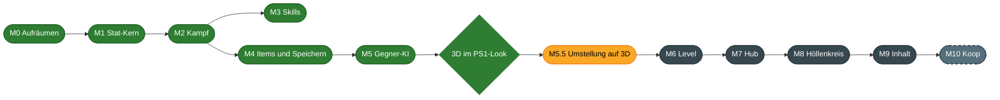

<div align="center">

# 🔥 Höllenspiralenspiel

**Ein isometrisches Action-RPG durch die neun Kreise der Hölle**

*Düster, blutig, dämonisch. Und der Held hat es sich selbst eingebrockt.*


[Feature-Umfang](#-feature-umfang) · [Steuerung](#-steuerung) · [Meilensteine](#-meilensteine) · [Loslegen](#-loslegen) · [Aufbau](#-aufbau-des-projekts)

</div>

---

## 📖 Worum geht es

Der Protagonist begeht alle Sünden gleichzeitig und landet dort, wo er hingehört.
Von einer Stadt als Ausgangspunkt steigt er Kreis für Kreis tiefer hinab.
Jeder Höllenkreis steht für eine Sünde, und ihre Strafe bestimmt das Leveldesign.

Vorbild ist Dantes Inferno, gespielt wird wie ein klassisches Action-RPG:
Gegner erschlagen, Beute sammeln, Charakter ausbauen.

| Eckpunkt | Entscheidung |
|---|---|
| Perspektive | Klassisch isometrisch |
| Spielstruktur | Stadt als Hub, von dort Abstieg in einen Höllenkreis mit mehreren Ebenen |
| Level | Überwiegend prozedural, dazu handgebaute Räume und Event-Orte |
| Mehrspieler | Erst allein, Koop soll später nachrüstbar bleiben |
| 2D oder 3D | 3D im Look der PlayStation 1. Die Umstellung steht an, spielbar ist bisher die 2D-Fassung |

---

## ✨ Feature-Umfang

Das ist der Stand, der heute im Spiel steckt. Gespielt wird in einem Testlevel.
Die Abschnitte beschreiben das 2D-Spiel, die 3D-Fassung hat einen [eigenen Abschnitt](#-3d-fassung-im-aufbau).

### 🧙 Charakter

| Feature | Beschreibung |
|---|---|
| Fünf Attribute | Strength, Dexterity, Intelligence, Constitution, Awareness |
| Abgeleitete Werte | Jedes Attribut verbessert weitere Werte über eine Wachstumskurve mit Obergrenze |
| Leben und Mana | Leben: `5 + S + 3*C`, Mana: `3 + A + 5*I`, beide mit Regeneration |
| Leveling | Level 1 bis 100, pro Level ein Attributpunkt, mit Dialog und Effekt |
| Lichtradius | Wächst mit Awareness und vergrößert das Licht um den Spieler |
| Charakterbogen | Alle Werte auf einen Blick, auch Block und Parry, aktualisiert sich sofort |

<details>
<summary>Was jedes Attribut bewirkt</summary>

| Attribut | Wirkung | Obergrenze |
|---|---|---|
| Strength | Physischer Schaden | 100 % more |
| Strength | Rüstung | 300 % more |
| Dexterity | Angriffstempo | 100 % more |
| Dexterity | Ausweichen | 100 % more |
| Intelligence | Zauberschaden | 200 % more |
| Intelligence | Mana | 300 % more |
| Constitution | Leben | 100 % more |
| Constitution | Rüstung | 1000 flach |
| Awareness | Parieren | 200 % more |
| Awareness | Blocken | 200 % more |
| Awareness | Kritische Trefferchance | 200 % more |
| Awareness | Lichtradius | 400 % more |

</details>

<details>
<summary>So werden Werte verrechnet</summary>

Jeder Wert entsteht aus drei Töpfen:

```
Endwert = (Grundwert + Flat) × (1 + Summe Increased) × Produkt More
```

- **Flat** wird addiert.
- **Increased** wird untereinander addiert.
- **More** wird multipliziert.

Beispiel: 14 % und 22 % increased von der Ausrüstung, dazu 2,97 % more aus Intelligenz 4.

```
1,36 × 1,0297 = 1,4004  →  +40,04 % Zauberschaden
```

</details>

### ⚔️ Kampf

| Feature | Beschreibung |
|---|---|
| Trefferauflösung | Jeder Treffer läuft durch dieselbe Kette: Treffen, Ausweichen, Parry, Block, Krit, Minderung |
| Nahkampf | Klick auf einen Gegner, der Held läuft hin und schlägt im Takt der Waffe zu |
| Fernkampf | Mit einem Bogen läuft der Held in Reichweite und schießt. Ohne Gegner unter der Maus schießt er in ihre Richtung |
| ATTACK und SPELL | Attacks skalieren mit dem Waffenschaden, Spells bringen eigenen Grundschaden mit |
| Sechs Schadensarten | Crush, Pierce, Slash, Fire, Frost, Lightning, jede mit eigenem Effekt |
| Statuseffekte | Stapelnder Bleed und Burn, Shock mit Fehlschlägen, Chill mit Verlangsamung |
| Schadensminderung | Rüstung gegen physischen Schaden, Resistenzen gegen Feuer, Frost und Blitz |
| Parry und Block | Parry wehrt ganz ab, Block fängt 50 % ab. Schilde und Stäbe blocken, Schwerter parieren |
| Kritische Treffer | Chance von Waffe oder Zauber, verstärkt durch Awareness |
| Tod und Respawn | Todesanzeige, Verlust von 10 % der XP des Levels, Rückkehr zum Startpunkt |
| Schadenszahlen | Schweben über dem Ziel, mit eigenen Farben für Krit, Heilung und jeden Statuseffekt |

<details>
<summary>Was jede Schadensart bewirkt</summary>

| Schadensart | Gruppe | Wirkung |
|---|---|---|
| Crush | Physisch | 20 % mehr Schaden |
| Pierce | Physisch | Trifft nur halb so oft, ignoriert dafür die Rüstung |
| Slash | Physisch | Bleed: 50 % des ungeminderten Treffers über 4 Sekunden, stapelt ohne Obergrenze |
| Fire | Elementar | Burn: 25 % des erlittenen Schadens über 4 Sekunden, stapelt bis 10 Mal |
| Frost | Elementar | Chill: Bewegung und Angriffe 30 % langsamer für 3 Sekunden |
| Lightning | Elementar | Shock: Aktionen schlagen 4 Sekunden lang mit 25 % Chance fehl |

Alle Zahlen stehen an einer Stelle in `Scripts/Core/Combat/CombatRules.cs`.

</details>

### ✨ Skills

| Feature | Beschreibung |
|---|---|
| Skills als Daten | Jeder Skill ist eine Resource mit Kosten, Abklingzeit, Schaden und Szene. Ein neuer Skill braucht keinen Code |
| Fünf Skills | Attack, Lightning Strike, Fireball, Frost Nova und Thunderbolt |
| Projektile | Fliegen bis zum ersten Feind oder zur Wand. Der Feuerball spaltet sich und sucht die nächsten Gegner |
| Flächen | Um den Helden oder am Mauszeiger, sofort oder mit Verzögerung |
| Für jeden gleich | Wen ein Skill trifft, entscheidet die Fraktion. Gegner setzen dieselben Skills ein wie der Held |
| Skill-Leiste | Zehn Plätze mit Icon, Taste und Abklingzeit |
| Freie Belegung | Rechtsklick auf einen Platz öffnet die Liste aller Skills |
| Gehaltene Taste | Wiederholt den Skill, sobald er wieder bereit ist |
| Kosten | Mana und Abklingzeit pro Skill, Ton bei leerem Mana |
| Tooltip mit DPS | Schaden pro Sekunde, mittlerer Treffer, Krit-Chance, Einsätze pro Sekunde und Abklingzeit, gerechnet mit den Werten des Helden |

<details>
<summary>Die Skills im Überblick</summary>

| Skill | Art | Schaden | Mana | Abklingzeit | Wirkung |
|---|---|---|---|---|---|
| Attack | ATTACK | 100 % Waffenschaden | 0 | keine | Treffer der Waffe, mit dem Bogen ein Pfeil |
| Lightning Strike | ATTACK | 180 % Waffenschaden als Lightning | 3 | keine | Schwung mit Blitzprojektil |
| Fireball | SPELL | 50 bis 75 Fire | 2 | 0,25 s | Projektil, das sich bis zu zweimal aufspaltet |
| Frost Nova | SPELL | 10 bis 50 Frost | 2 | 0,5 s | Ring um den Helden |
| Thunderbolt | SPELL | 50 bis 350 Lightning | 4 | 1 s | Einschlag am Mauszeiger nach 0,5 Sekunden |

Alle Werte sind vorläufig und stehen in `Resources/Skills`.

</details>

<details>
<summary>So rechnet der Tooltip</summary>

Alle Zahlen gelten für ein einzelnes Ziel ohne Verteidigung.

```
Mittlerer Treffer = (Min + Max) / 2 × (1 + Krit-Chance × Krit-Schaden)
Einsätze pro Sekunde = ATTACK: Angriffstempo, SPELL: 1 / Abklingzeit
DPS = Mittlerer Treffer × Einsätze pro Sekunde × Trefferchance + Schaden des Statuseffekts
```

| Eingerechnet | Wirkung |
|---|---|
| Schaden des Helden | Waffenschaden, Prozentsatz des Skills, Zauberschaden, physischer und elementarer Schaden |
| Krit-Chance und Krit-Schaden | Erhöhen den mittleren Treffer |
| Angriffstempo und Abklingzeit | Bestimmen die Einsätze pro Sekunde, das langsamere von beiden zählt |
| Trefferchance | Pierce trifft nur halb so oft |
| Schadensart | Crush verursacht 20 % mehr Schaden |
| Bleed und Burn | Ihr Schaden über Zeit zählt zur DPS. Burn endet bei 10 Stapeln, Bleed hat keine Obergrenze |
| Chill und Shock auf dem Helden | Chill senkt das Angriffstempo, unter Shock schlagen Einsätze fehl |

Mana zählt nicht zur DPS. Die Zahl gilt, solange das Mana reicht.

</details>

### 👹 Gegner

| Feature | Beschreibung |
|---|---|
| Drei Gegnertypen | Blue Blob mit Frost, Yellow Blob mit Blitz und ein Testgegner, der Feuer spuckt |
| Gegner als Daten | Jeder Gegner ist eine Resource mit Attributen, Ausrüstung, Skills, Beute und Verhalten. Ein neuer Gegner braucht keinen Code |
| Level | Jede Karte hat ein Bereichslevel. Attribute wachsen mit dem Level, die Beute trägt das Level des Monsters |
| Spawn-Marker | Gegner erscheinen in Gruppen an festgelegten Orten |
| Aggro | Reichweite pro Gegner, die ganze Gruppe reagiert auf einen Treffer |
| Wegfindung | Gegner laufen um Wände herum. Schützen greifen nur mit freier Sicht an |
| Aufgeben | Entkommt der Held, gibt der Gegner nach einigen Sekunden auf und geht langsam in die Nähe seines Startorts zurück |
| Elite und Rare Elite | Elite mit 1 bis 2 Mods, Rare Elite mit 3 bis 5. Beide sind größer, bringen mehr Erfahrung und mehr Beute |
| Monster-Mods | Zehn Mods von einfach bis verrückt, zusammengesteckt aus Werten, Auslösern und Aktionen |
| Angriffe | Ausholen, Treffer, Erholen. Beim Ausholen färbt sich der Gegner |
| Skills | Mehrere Skills pro Gegner mit Abklingzeiten, ohne Angabe schlägt er im Nahkampf zu |
| Tod | Erfahrung und Beute sofort, danach läuft die Todesanimation |

<details>
<summary>Die Mods im Überblick</summary>

| Mod | Wirkung |
|---|---|
| Hasted | 33 % mehr Angriffstempo |
| Swift | 40 % mehr Bewegungstempo |
| Stalwart | 60 % mehr Leben |
| Twin Shot | Doppelte Projektile, nur für Schützen |
| Meteor Caller | Lässt im Kampf Meteore um sich herum regnen |
| Volatile | Explodiert kurz nach dem Tod |
| Freezing Skin | Antwortet auf Treffer mit einem Frostpuls |
| Broodmother | Ruft bei halbem Leben drei Blue Blobs |
| Blinking | Springt alle 4 Sekunden neben sein Ziel, nur für Nahkämpfer |
| Berserk | Wird unter 35 % Leben deutlich schneller |

Ein Mod ist eine Resource unter `Resources/MonsterMods/Pool`.
Auslöser und Aktionen lassen sich im Inspector frei kombinieren, zum Beispiel "beim Tod" mit "Skill wirken".

</details>

### 🎒 Items und Beute

| Feature | Beschreibung |
|---|---|
| Item-Basen | Schwert, Stab, Bogen, Schild, Helm, Torso, Handschuhe, Heil- und Manatrank |
| Items als Daten | Jede Item-Basis ist eine Resource mit Werten, Größe, Anforderungen und Icon. Ein neues Item braucht keinen Code |
| Parry und Block | Jede Basis kann beides mitbringen, einstellbar im Inspector |
| Affixe | 17 Affixe mit Stufen, Gewichten und Mindest-Itemlevel |
| Prefix und Suffix | Bis zu 8 Affixe pro Item, keiner doppelt |
| Lokal und global | Manche Affixe verbessern das Item selbst, andere den Charakter |
| Seltenheit | Normal, Magic in Blau, Rare in Gelb mit erzeugtem Namen |
| Loot-Tabellen | Gewichtete Einträge, Mengen, verschachtelte Tabellen |
| Beute mit Seed | Derselbe Seed ergibt dieselbe Beute |
| Anforderungen | Level und Attribute, unerfüllte Anforderungen erscheinen rot |

### 🧰 Inventar und Ausrüstung

<div align="center">

</div>

| Feature | Beschreibung |
|---|---|
| Raster-Inventar | 70 Felder, Items belegen je nach Größe mehrere Felder |
| Drag-and-drop | Aufnehmen, ablegen, tauschen, auf den Boden werfen |
| Stapel | Tränke stapeln sich bis 5, aufgehobene Tränke füllen vorhandene Stapel |
| 16 Ausrüstungsplätze | Inklusive vier Ringe |
| Zweihandwaffen | Bogen und Stab sperren den Schildplatz, der Schild wandert ins Inventar |
| Tooltips | Werte, Affixe und Anforderungen, farbig nach Seltenheit |

### 💾 Speichern

| Feature | Beschreibung |
|---|---|
| Automatisch | Das Spiel speichert beim Beenden und kurz nach jeder Änderung am Charakter |
| Laden beim Start | Der Charakter ist nach dem Neustart derselbe, mit Inventar, Ausrüstung und Skill-Leiste |
| Inhalt | Level, XP, Attribute, offene Punkte, jedes Item mit Affixen, Namen und Platz |
| Sicher | Ein Absturz beim Schreiben zerstört den alten Spielstand nicht |

<details>
<summary>Wo der Spielstand liegt</summary>

Die Datei heißt `character.json` und liegt im Benutzerordner von Godot.
Unter Windows ist das `%APPDATA%\Godot\app_userdata\Hoellenspiralenspiel\saves`.

| Wunsch | Weg |
|---|---|
| Neu anfangen | Die Datei löschen |
| Mit einem zweiten Charakter spielen | Godot mit `-- --save-file=user://saves/zweiter.json` starten |
| Ohne Spielstand testen | Im Inspector am `GameController` den Schalter `SavingEnabled` ausschalten |

Leben, Mana, Position und die Welt stehen nicht im Spielstand.
Der Held startet am Startpunkt mit vollem Leben und Mana.

</details>

### 🖥️ Oberfläche und Welt

| Feature | Beschreibung |
|---|---|
| Isometrisches Testlevel | Boden, Wände und Objekte auf getrennten Ebenen |
| Navigationsnetz | Entsteht beim Start des Levels aus den Wänden, für Gegner und Held |
| Licht und Schatten | Punktlichter mit Schattenwurf in abgedunkelter Umgebung |
| Lebens- und Mana-Orb | Mit Flüssigkeits-Shader |
| Erfahrungsbalken | Unterteilt, mit Anzeige beim Überfahren |
| Overlay-Karte | Lässt sich ein- und ausblenden |

### 🧊 3D-Fassung im Aufbau

Seit dem 29.09.2026 steht fest: Das Spiel wird 3D, im Look der PlayStation 1.
Die 3D-Fassung läuft in einem eigenen Testlevel neben dem 2D-Spiel und benutzt dieselbe Spiellogik und dieselben Daten.

<div align="center">

</div>

| Feature | Beschreibung |
|---|---|
| Held und Gegner | Laufen, Nahkampf, Fernkampf, Verfolgen, Aufgeben, Tod und Respawn |
| Skills | Alle fünf Skills des Helden und die vier der Monster, als Projektil oder als Fläche auf dem Boden |
| Skill-Leiste, Orbs, XP-Balken | Dieselbe Oberfläche wie im 2D-Spiel, mit Auswahl per Rechtsklick und Tooltip |
| XP und Level | Gegner geben XP, der Held steigt mit einem Sternenregen auf, der Tod kostet XP |
| Wegfindung | Navigationsnetz aus den Wänden, zur Laufzeit gebacken |
| PS1-Look | Wackelnde Eckpunkte, verzogene Texturen, 240 Bildzeilen, 15 Bit Farbtiefe mit Punktmuster |
| Sichtbare Ausrüstung | Angelegte Waffen, Schilde und Rüstung erscheinen am Helden. Sichtbar sind alle Plätze außer den Ringen. |
| Inventar und Charakterbogen | Dieselbe Oberfläche wie im 2D-Spiel |
| Platzhalter | Alle Modelle bestehen aus Grundkörpern, die Texturen sind erzeugt |

<div align="center">

</div>

<div align="center">

</div>

Es fehlen noch Level-up-Dialog, Todesbildschirm, Monster-Mods, Beute und Speichern. Der Plan steht in der [Roadmap](docs/ROADMAP.md) unter M5.5.

<details>
<summary>So startest du das 3D-Testlevel</summary>

Im Godot-Editor die Szene `Scenes/Spike3D/spike_3d.tscn` öffnen und mit `F6` starten.

| Taste | Aktion |
|---|---|
| `W` `A` `S` `D` | Bewegen |
| Linke und rechte Maustaste, `Q` `E` `R` `F`, `1` bis `4` | Skill auf diesem Platz der Leiste |
| Rechtsklick auf einen Platz | Platz neu belegen |
| `B` | Charakterbogen und Inventar, der Held hat alle neun Items dabei |
| `F1` | PS1-Look an und aus |
| `F2` | Kamera orthogonal oder perspektivisch |
| `F3` | 240, 360 oder 480 Bildzeilen |
| `F4` | Schatten aus Lichtern statt dunkler Scheiben |

</details>

### 🚧 Noch nicht enthalten

- Hub, Levelwechsel und Menüs, damit auch mehrere Charaktere
- Prozedurale Level
- Item-Basen für die übrigen zwölf Ausrüstungsplätze
- Tasten im Spiel umbelegen
- Klassen und Erwerb von Skills, der Held kennt vorerst alle

---

## 🎮 Steuerung

Die Skills liegen zu Beginn wie unten auf den Tasten. Jeder Platz der Leiste lässt sich im Spiel neu belegen.

| Taste | Aktion |
|---|---|
| `W` `A` `S` `D` | Bewegen, bricht Hinlaufen und Ausholen ab |
| Linke Maustaste | Attack: auf einen Gegner klicken, der Held läuft hin und greift an |
| Rechte Maustaste | Lightning Strike in Richtung der Maus |
| `E` | Frost Nova um den Spieler |
| `R` | Thunderbolt am Mauszeiger |
| `F` | Fireball in Richtung der Maus |
| `Q`, `1` bis `4` | Freie Plätze der Skill-Leiste |
| Taste gedrückt halten | Wiederholt den Skill |
| Rechtsklick auf einen Platz der Leiste | Skill für diesen Platz auswählen |
| `B` | Charakterbogen und Inventar |
| `Tab` | Overlay-Karte |
| Linke Maustaste auf Item | Aufheben, im Inventar greifen und ablegen |
| Rechte Maustaste im Inventar | Item anlegen oder Trank trinken |

---

## 🗺️ Meilensteine



| | Meilenstein | Inhalt | Größe |
|---|---|---|---|
| ✅ | **M0** Aufräumen | Alle bekannten Fehler behoben, Repo aufgeräumt | klein |
| ✅ | **M1** Stat-Kern | Stats als reines C#, Tests, Lichtradius | mittel |
| ✅ | **M2** Kampf | Trefferauflösung, Tod des Spielers, Nahkampf, Statuseffekte | mittel |
| ✅ | **M3** Skills | Attacks und Spells als Daten, frei belegbare Leiste, Skills unabhängig vom Wirkenden | mittel |
| ✅ | **M4** Items und Speichern | Items als Daten, Inventar-Modell, Schild mit Block, Speichern und Laden | mittel |
| ✅ | **M5** Gegner-KI | Gegner als Daten, Zustandsmaschine, Wegfindung, Level, Elite mit Mods | mittel |
| ✅ | **Entscheidung** | 3D im Look der PlayStation 1, entschieden nach dem [Vergleich](docs/VERGLEICH_2D_3D.md) | klein |
| ⏭️ | **M5.5** Umstellung auf 3D | Die 3D-Fassung lernt alles, was die 2D-Fassung kann. Held, Gegner, Wegfindung, PS1-Look, sichtbare Ausrüstung, Skill-Leiste, Orbs, XP und alle Skills stehen | mittel |
| ⬜ | **M6** Level | Prozedurale Level mit handgebauten Räumen, gesteuert über Seeds | groß |
| ⬜ | **M7** Hub | Stadt, Abstieg, Menüs, Truhe, Händler, Einstellungen | mittel |
| ⬜ | **M8** Höllenkreis | Ein kompletter Kreis in Endqualität | groß |
| ⬜ | **M9** Inhalt | Die übrigen Kreise, Intro, Politur | groß |
| 💤 | **M10** Koop | Optional, baut auf Kern und Seeds auf | groß |

✅ fertig · ⏭️ als Nächstes · ⬜ offen · 💤 optional

Aufgaben, Fertig-Kriterien und alle Befunde stehen in der [Roadmap](docs/ROADMAP.md).

### Die neun Kreise

| Kreis | Sünde | Stand |
|---|---|---|
| 1 | Limbus | geplant |
| 2 | Wollust | geplant, erster Kandidat für M8: ewiger Sturm als Levelmechanik |
| 3 | Völlerei | geplant |
| 4 | Habgier | geplant |
| 5 | Zorn | geplant |
| 6 | Ketzerei | geplant |
| 7 | Gewalt | geplant |
| 8 | Betrug | geplant |
| 9 | Verrat | geplant |

---

## 🚀 Loslegen

**Voraussetzungen**

| Werkzeug | Version |
|---|---|
| Godot | 4.6, die .NET-Ausgabe |
| .NET SDK | 10 |

**Starten**

```bash
git clone https://github.com/sharedboidev/Hoellenspiralenspiel.git
```

Danach den Ordner in Godot als Projekt importieren und mit `F5` starten.
Die Hauptszene ist `Scenes/test_plane.tscn`, das 2D-Spiel.
Das 3D-Testlevel ist `Scenes/Spike3D/spike_3d.tscn` und startet aus dem Editor mit `F6`.

**Tests ausführen**

```bash
dotnet test Hoellenspiralenspiel.Tests
```

---

## 🧱 Aufbau des Projekts

```
Hoellenspiralenspiel
├── Scripts
│   ├── Core            Spiellogik ohne Godot, vollständig getestet
│   │   ├── Stats       Stat-Blatt, Rechenregeln, abgeleitete Werte
│   │   ├── Combat      Trefferauflösung, Schadensarten, Statuseffekte, Angriffstakt
│   │   ├── Skills      Skill-Definition, Abklingzeiten, Kosten, Belegung der Leiste
│   │   ├── Items       Item-Basis und Instanz, Inventar-Raster, Ausrüstung, Affixe, Beute
│   │   ├── Enemies     Zustandsmaschine, Seltenheit, Wahl der Mods, Wachstum mit dem Level
│   │   ├── Navigation  Takt für die Pfadsuche
│   │   ├── Spatial     Raster für die Suche nach Einheiten in der Nähe
│   │   ├── Saving      Format des Spielstands, Lesen und Schreiben als JSON
│   │   ├── Rng         Zufallsquelle mit Seed
│   │   └── Progression XP-Tabelle, Level und Attributspunkte, XP-Verlust beim Tod
│   ├── Spike3D         Die 3D-Fassung: Held, Gegner, Projektil, Fläche, Wegfindung, PS1-Look, sichtbare Ausrüstung
│   ├── Units           Spieler, Gegner, Pfadfolger
│   ├── Skills          Ausführung der Skills, Projektil und Fläche
│   ├── Items           Bibliothek aller Item-Basen
│   ├── Enemies         Bibliothek aller Monster-Mods
│   ├── World           Navigationsnetz des Levels
│   ├── Saving          Datei des Spielstands
│   ├── Controllers     Gegnersteuerung, Beute, Spielablauf, Speichern
│   └── UI              Charakterbogen, Inventar, Orbs, Tooltips
├── Scenes              Szenen für Level, Einheiten, Zauber, Oberfläche, unter Spike3D die 3D-Fassung
├── Shaders             Shader, unter Spike3D die beiden für den PS1-Look
├── Resources           Item-Basen, Affixe, Loot-Tabellen, Skills, Gegner, Monster-Mods, Themes
├── Interfaces          Schnittstellen, darunter IHero zwischen Held und Oberfläche
├── Enums               Gemeinsame Aufzählungen
├── Hoellenspiralenspiel.Tests   Unit-Tests mit NUnit
└── docs                Roadmap, Analyse und der Vergleich von 2D und 3D
```

### Leitlinien

| Leitlinie | Warum |
|---|---|
| Logik getrennt von Darstellung | Macht Logik testbar und hat den Wechsel auf 3D möglich gemacht, ohne den Kern zu ändern |
| Inhalte als Daten | Neue Gegner, Skills und Items ohne Änderung am Code |
| Ein Zufallsgenerator mit Seed | Gleicher Seed ergibt gleiches Level, Voraussetzung für Koop |
| Sparsame Kommentare | Namen sprechen für sich, Aufbau und Regeln erklärt die Roadmap |

Alles unter `Scripts/Core` kommt ohne Godot aus.
Das Testprojekt bindet diesen Ordner als Quelltext ein.
Hängt dort eine Datei von Godot ab, schlägt der Test-Build fehl.

---

## 🙏 Verwendete Fremdinhalte

| Inhalt | Verwendung |
|---|---|
| Kenney Dungeon Tiles | Tiles und Figuren für das Testlevel |
| DropShadowCaster2D von csocraman | Addon für Schlagschatten |
| TexturePacker Importer von CodeAndWeb | Addon für Sprite-Sheets |

Die Datei `LICENSE` im Wurzelordner gehört zum TexturePacker Importer.
Für das Spiel selbst ist noch keine Lizenz festgelegt.
