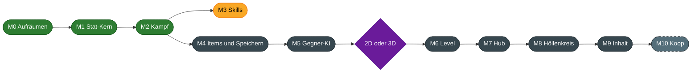

<div align="center">

# 🔥 Höllenspiralenspiel

**Ein isometrisches Action-RPG durch die neun Kreise der Hölle**

*Düster, blutig, dämonisch. Und der Held hat es sich selbst eingebrockt.*


[Feature-Umfang](#-feature-umfang) · [Steuerung](#-steuerung) · [Meilensteine](#-meilensteine) · [Loslegen](#-loslegen) · [Aufbau](#-aufbau-des-projekts)

</div>

---

## 📖 Worum geht es

Der Protagonist begeht alle Sünden gleichzeitig und landet dort, wo er hingehört.
Von einer Stadt als Ausgangspunkt steigt er Kreis für Kreis tiefer hinab.
Jeder Höllenkreis steht für eine Sünde, und ihre Strafe bestimmt das Leveldesign.

Vorbild ist Dantes Inferno, gespielt wird wie ein klassisches Action-RPG:
Gegner erschlagen, Beute sammeln, Charakter ausbauen.

| Eckpunkt | Entscheidung |
|---|---|
| Perspektive | Klassisch isometrisch |
| Spielstruktur | Stadt als Hub, von dort Abstieg in einen Höllenkreis mit mehreren Ebenen |
| Level | Überwiegend prozedural, dazu handgebaute Räume und Event-Orte |
| Mehrspieler | Erst allein, Koop soll später nachrüstbar bleiben |
| 2D oder 3D | Noch offen, die Spiellogik ist davon unabhängig gebaut |

---

## ✨ Feature-Umfang

Das ist der Stand, der heute im Spiel steckt. Gespielt wird in einem Testlevel.

### 🧙 Charakter

| Feature | Beschreibung |
|---|---|
| Fünf Attribute | Strength, Dexterity, Intelligence, Constitution, Awareness |
| Abgeleitete Werte | Jedes Attribut verbessert weitere Werte über eine Wachstumskurve mit Obergrenze |
| Leben und Mana | Leben: `5 + S + 3*C`, Mana: `3 + A + 5*I`, beide mit Regeneration |
| Leveling | Level 1 bis 100, pro Level ein Attributpunkt, mit Dialog und Effekt |
| Lichtradius | Wächst mit Awareness und vergrößert das Licht um den Spieler |
| Charakterbogen | Alle Werte auf einen Blick, aktualisiert sich sofort |

<details>
<summary>Was jedes Attribut bewirkt</summary>

| Attribut | Wirkung | Obergrenze |
|---|---|---|
| Strength | Physischer Schaden | 100 % more |
| Strength | Rüstung | 300 % more |
| Dexterity | Angriffstempo | 100 % more |
| Dexterity | Ausweichen | 100 % more |
| Intelligence | Zauberschaden | 200 % more |
| Intelligence | Mana | 300 % more |
| Constitution | Leben | 100 % more |
| Constitution | Rüstung | 1000 flach |
| Awareness | Parieren | 200 % more |
| Awareness | Blocken | 200 % more |
| Awareness | Kritische Trefferchance | 200 % more |
| Awareness | Lichtradius | 400 % more |

</details>

<details>
<summary>So werden Werte verrechnet</summary>

Jeder Wert entsteht aus drei Töpfen:

```
Endwert = (Grundwert + Flat) × (1 + Summe Increased) × Produkt More
```

- **Flat** wird addiert.
- **Increased** wird untereinander addiert.
- **More** wird multipliziert.

Beispiel: 14 % und 22 % increased von der Ausrüstung, dazu 2,97 % more aus Intelligenz 4.

```
1,36 × 1,0297 = 1,4004  →  +40,04 % Zauberschaden
```

</details>

### ⚔️ Kampf

| Feature | Beschreibung |
|---|---|
| Trefferauflösung | Jeder Treffer läuft durch dieselbe Kette: Treffen, Ausweichen, Parry, Block, Krit, Minderung |
| Nahkampf | Klick auf einen Gegner, der Held läuft hin und schlägt im Takt der Waffe zu |
| ATTACK und SPELL | Attacks skalieren mit dem Waffenschaden, Spells bringen eigenen Grundschaden mit |
| Sechs Schadensarten | Crush, Pierce, Slash, Fire, Frost, Lightning, jede mit eigenem Effekt |
| Statuseffekte | Bleed, stapelnder Burn, Shock mit Fehlschlägen, Chill mit Verlangsamung |
| Schadensminderung | Rüstung gegen physischen Schaden, Resistenzen gegen Feuer, Frost und Blitz |
| Parry und Block | Parry wehrt ganz ab, Block fängt 50 % ab. Der Anteil ist ein eigener Wert für Items und Skills |
| Kritische Treffer | Chance von Waffe oder Zauber, verstärkt durch Awareness |
| Tod und Respawn | Todesanzeige, Verlust von 10 % der XP des Levels, Rückkehr zum Startpunkt |
| Drei Testzauber | Fireball mit Fork, Frost Nova als Flächenzauber, Lightning Strike mit Zielkreis |
| Skillbar | Cooldowns, Manakosten, Ton bei leerem Mana |
| Schadenszahlen | Schweben über dem Ziel, mit eigenen Farben für Krit, Heilung und jeden Statuseffekt |

<details>
<summary>Was jede Schadensart bewirkt</summary>

| Schadensart | Gruppe | Wirkung |
|---|---|---|
| Crush | Physisch | 20 % mehr Schaden |
| Pierce | Physisch | Trifft nur halb so oft, ignoriert dafür die Rüstung |
| Slash | Physisch | Bleed: 50 % des ungeminderten Treffers über 4 Sekunden, nur der stärkste wirkt |
| Fire | Elementar | Burn: 25 % des erlittenen Schadens über 4 Sekunden, stapelt bis 10 Mal |
| Frost | Elementar | Chill: Bewegung und Angriffe 30 % langsamer für 3 Sekunden |
| Lightning | Elementar | Shock: Aktionen schlagen 4 Sekunden lang mit 25 % Chance fehl |

Alle Zahlen stehen an einer Stelle in `Scripts/Core/Combat/CombatRules.cs`.

</details>

### 👹 Gegner

| Feature | Beschreibung |
|---|---|
| Drei Gegnertypen | Blue Blob mit Frost, Yellow Blob mit Blitz und ein Testgegner, der Feuerbälle wirft |
| Spawn-Marker | Gegner erscheinen in Gruppen an festgelegten Orten |
| Aggro | Reichweite pro Gegner, die ganze Gruppe reagiert auf einen Treffer |
| Rare und Elite | Stärkere Varianten mit mehr Leben, Tempo und Erfahrung |
| Angriffe | Ausholen, Treffer, Erholen. Beim Ausholen färbt sich der Gegner |
| Tod | Erfahrung und Beute sofort, danach läuft die Todesanimation |

### 🎒 Items und Beute

| Feature | Beschreibung |
|---|---|
| Item-Basen | Schwert, Stab, Helm, Torso, Handschuhe, Heil- und Manatrank |
| Affixe | 16 Affixe mit Stufen, Gewichten und Mindest-Itemlevel |
| Prefix und Suffix | Bis zu 8 Affixe pro Item, keiner doppelt |
| Lokal und global | Manche Affixe verbessern das Item selbst, andere den Charakter |
| Seltenheit | Normal, Magic in Blau, Rare in Gelb mit erzeugtem Namen |
| Loot-Tabellen | Gewichtete Einträge, Mengen, verschachtelte Tabellen |
| Anforderungen | Level und Attribute, unerfüllte Anforderungen erscheinen rot |

### 🧰 Inventar und Ausrüstung

<div align="center">

</div>

| Feature | Beschreibung |
|---|---|
| Raster-Inventar | 70 Felder, Items belegen je nach Größe mehrere Felder |
| Drag-and-drop | Aufnehmen, ablegen, tauschen, auf den Boden werfen |
| Stapel | Tränke stapeln sich bis 5 |
| 16 Ausrüstungsplätze | Inklusive vier Ringe |
| Tooltips | Werte, Affixe und Anforderungen, farbig nach Seltenheit |

### 🖥️ Oberfläche und Welt

| Feature | Beschreibung |
|---|---|
| Isometrisches Testlevel | Boden, Wände und Objekte auf getrennten Ebenen |
| Licht und Schatten | Punktlichter mit Schattenwurf in abgedunkelter Umgebung |
| Lebens- und Mana-Orb | Mit Flüssigkeits-Shader |
| Erfahrungsbalken | Unterteilt, mit Anzeige beim Überfahren |
| Overlay-Karte | Lässt sich ein- und ausblenden |

### 🚧 Noch nicht enthalten

- Speichern und Laden
- Hub, Levelwechsel und Menüs
- Prozedurale Level und Wegfindung
- Schilde und Waffen, die Parry oder Block mitbringen
- Fernkampf mit Waffen und weitere Attacks neben dem Standardangriff
- Frei belegbare Tasten für Attacks und Zauber
- Klassen und Erwerb von Skills

---

## 🎮 Steuerung

| Taste | Aktion |
|---|---|
| `W` `A` `S` `D` | Bewegen, bricht Hinlaufen und Ausholen ab |
| Linke Maustaste auf Gegner | Hinlaufen und angreifen, gedrückt halten greift weiter an |
| `F` | Fireball in Richtung der Maus |
| `E` | Frost Nova um den Spieler |
| `R`, dann linke Maustaste | Lightning Strike platzieren und auslösen |
| `B` | Charakterbogen und Inventar |
| `Tab` | Overlay-Karte |
| Linke Maustaste | Item aufheben, im Inventar greifen und ablegen |
| Rechte Maustaste | Item anlegen oder Trank trinken |

---

## 🗺️ Meilensteine



| | Meilenstein | Inhalt | Größe |
|---|---|---|---|
| ✅ | **M0** Aufräumen | Alle bekannten Fehler behoben, Repo aufgeräumt | klein |
| ✅ | **M1** Stat-Kern | Stats als reines C#, Tests, Lichtradius | mittel |
| ✅ | **M2** Kampf | Trefferauflösung, Tod des Spielers, Nahkampf, Statuseffekte | mittel |
| ⏭️ | **M3** Skills | Attacks und Spells als Daten, freie Tastenbelegung, Zauber unabhängig vom Wirkenden | mittel |
| ⬜ | **M4** Items und Speichern | Items als Daten, Inventar-Modell, Speichern und Laden | mittel |
| ⬜ | **M5** Gegner-KI | Zustandsmaschine, Wegfindung, Skalierung nach Level | mittel |
| 🔀 | **Entscheidung** | 2D oder 3D, per kurzem Vergleichsprototyp | klein |
| ⬜ | **M6** Level | Prozedurale Level mit handgebauten Räumen, gesteuert über Seeds | groß |
| ⬜ | **M7** Hub | Stadt, Abstieg, Menüs, Truhe, Händler, Einstellungen | mittel |
| ⬜ | **M8** Höllenkreis | Ein kompletter Kreis in Endqualität | groß |
| ⬜ | **M9** Inhalt | Die übrigen Kreise, Intro, Politur | groß |
| 💤 | **M10** Koop | Optional, baut auf Kern und Seeds auf | groß |

✅ fertig · ⏭️ als Nächstes · ⬜ offen · 🔀 Entscheidung · 💤 optional

Aufgaben, Fertig-Kriterien und alle Befunde stehen in der [Roadmap](docs/ROADMAP.md).

### Die neun Kreise

| Kreis | Sünde | Stand |
|---|---|---|
| 1 | Limbus | geplant |
| 2 | Wollust | geplant, erster Kandidat für M8: ewiger Sturm als Levelmechanik |
| 3 | Völlerei | geplant |
| 4 | Habgier | geplant |
| 5 | Zorn | geplant |
| 6 | Ketzerei | geplant |
| 7 | Gewalt | geplant |
| 8 | Betrug | geplant |
| 9 | Verrat | geplant |

---

## 🚀 Loslegen

**Voraussetzungen**

| Werkzeug | Version |
|---|---|
| Godot | 4.6, die .NET-Ausgabe |
| .NET SDK | 10 |

**Starten**

```bash
git clone https://github.com/sharedboidev/Hoellenspiralenspiel.git
```

Danach den Ordner in Godot als Projekt importieren und mit `F5` starten.
Die Hauptszene ist `Scenes/test_plane.tscn`.

**Tests ausführen**

```bash
dotnet test Hoellenspiralenspiel.Tests
```

---

## 🧱 Aufbau des Projekts

```
Hoellenspiralenspiel
├── Scripts
│   ├── Core            Spiellogik ohne Godot, vollständig getestet
│   │   ├── Stats       Stat-Blatt, Rechenregeln, abgeleitete Werte
│   │   ├── Combat      Trefferauflösung, Schadensarten, Statuseffekte, Angriffstakt
│   │   ├── Rng         Zufallsquelle mit Seed
│   │   └── Progression XP-Verlust beim Tod
│   ├── Units           Spieler und Gegner
│   ├── Abilities       Skills und Zauber
│   ├── Items           Waffen, Rüstung, Verbrauchsgüter
│   ├── Controllers     Gegnersteuerung, Beute, Spielablauf
│   └── UI              Charakterbogen, Inventar, Orbs, Tooltips
├── Scenes              Szenen für Level, Einheiten, Items, Zauber, Oberfläche
├── Resources           Affixe, Loot-Tabellen, Themes
├── Enums               Gemeinsame Aufzählungen
├── Hoellenspiralenspiel.Tests   Unit-Tests mit NUnit
└── docs                Roadmap und Analyse
```

### Leitlinien

| Leitlinie | Warum |
|---|---|
| Logik getrennt von Darstellung | Hält die Entscheidung für 2D oder 3D offen und macht Logik testbar |
| Inhalte als Daten | Neue Gegner, Skills und Items ohne Änderung am Code |
| Ein Zufallsgenerator mit Seed | Gleicher Seed ergibt gleiches Level, Voraussetzung für Koop |

Alles unter `Scripts/Core` kommt ohne Godot aus.
Das Testprojekt bindet diesen Ordner als Quelltext ein.
Hängt dort eine Datei von Godot ab, schlägt der Test-Build fehl.

---

## 🙏 Verwendete Fremdinhalte

| Inhalt | Verwendung |
|---|---|
| Kenney Dungeon Tiles | Tiles und Figuren für das Testlevel |
| DropShadowCaster2D von csocraman | Addon für Schlagschatten |
| TexturePacker Importer von CodeAndWeb | Addon für Sprite-Sheets |

Die Datei `LICENSE` im Wurzelordner gehört zum TexturePacker Importer.
Für das Spiel selbst ist noch keine Lizenz festgelegt.
