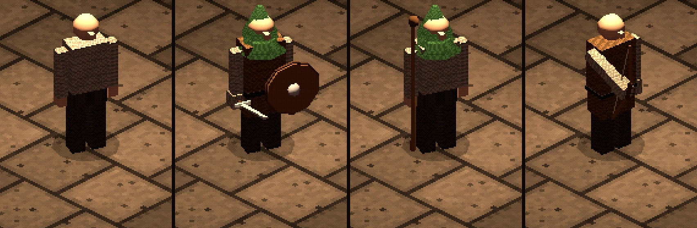
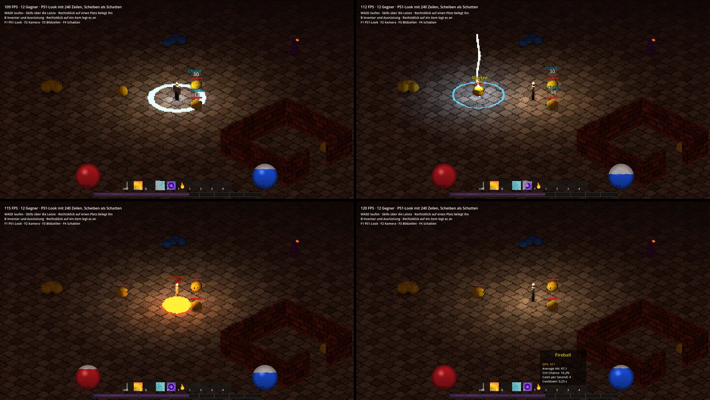
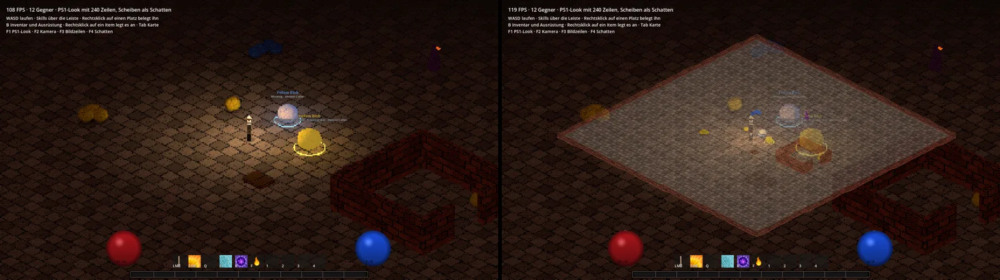
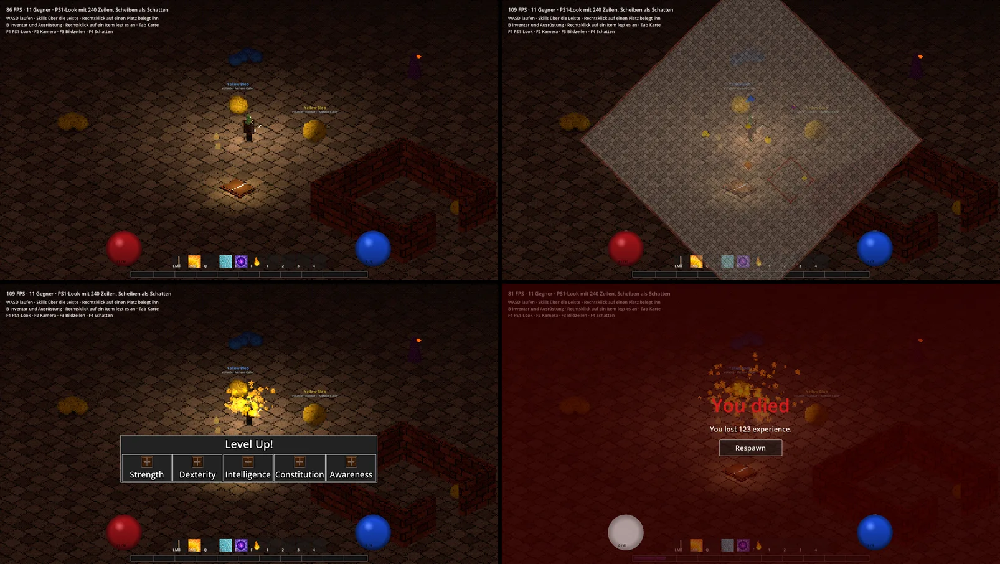
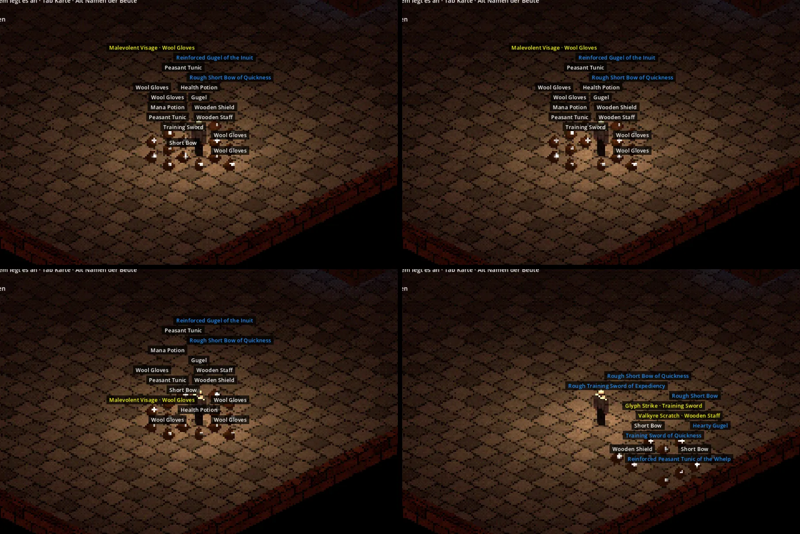
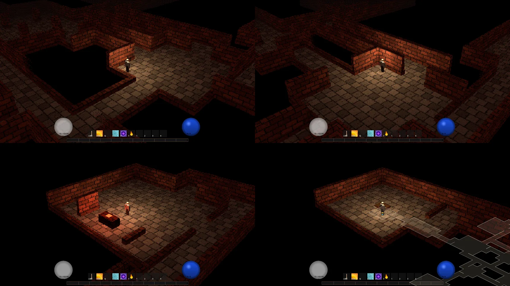
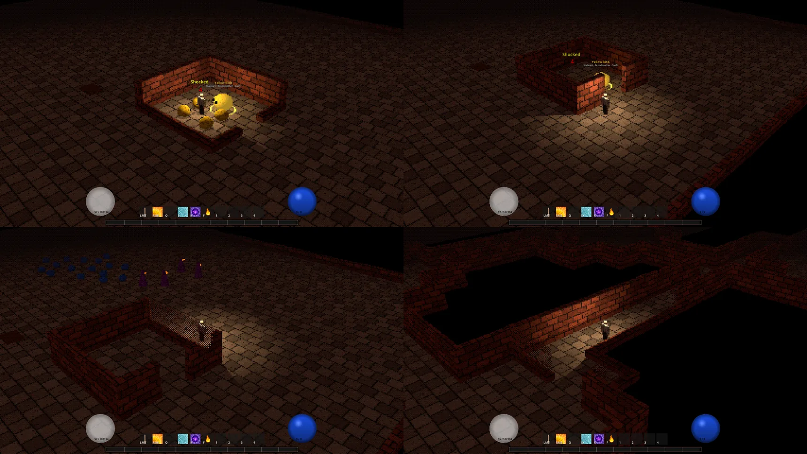
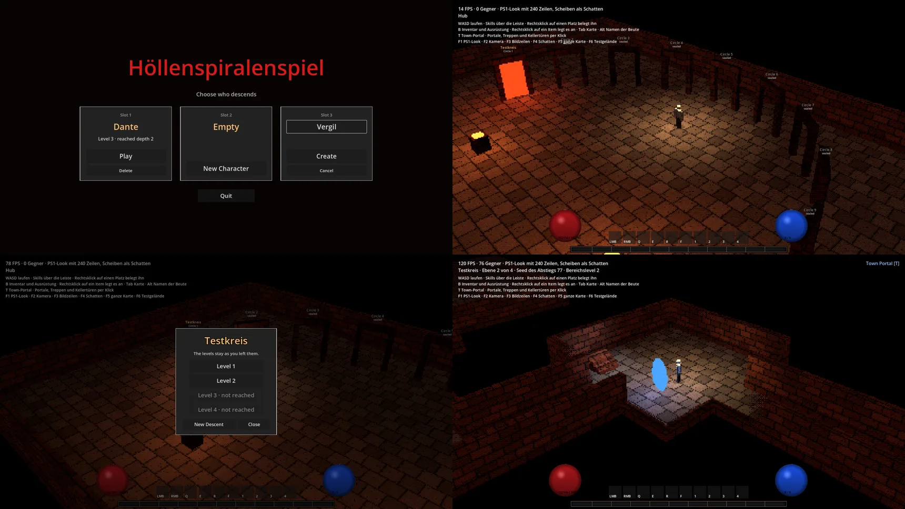
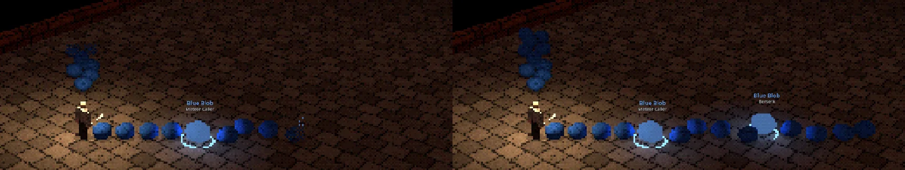

# Höllenspiralenspiel: Analyse und Roadmap

Stand: 01.10.2026. M0 bis M6 liegen auf `master`, dazu die Nachträge zu M2, M3, M5.5 und M6: Bleed stapelt, Schadenswerte im Tooltip, ausgedünnte Kommentare, die Rückmeldungen aus dem ersten Spielen und die Rückmeldungen zu Mauern und Räumen.
Alle vier Etappen von M7 sind gebaut. Etappe 1 bis 3 liegen auf `master`, Etappe 1 und 2 samt den Rückmeldungen aus dem Spielen. Etappe 2 ist seit dem 30.09.2026 vollständig: Pausenmenü, Ladebildschirm, Hud an Ankern und Einstellungen für Anzeige, Ton und Tasten, gebaut auf `master_PauseMenu` und `master_SettingsAndLoading`.
Etappe 3 liegt seit dem 30.09.2026 auf `master`: Gold, Münzhaufen, eine Truhe je Charakter und ein Händler im Hub. Der User hat sie selbst über Pull Request #15 zusammengeführt, Merge-Commit `67e855b`.
Die Rückmeldungen aus dem Spielen von Etappe 3 sind am selben Tag auf `master_PlaytestFeedback2` gebaut und liegen ebenfalls auf `master`.
Eine zweite Runde Rückmeldungen zu Etappe 3 ist am selben Tag auf `master_PlaytestFeedback3` gebaut: Umriss für alles Benutzbare, Blick zur Maus, Schlag und Zauber binden den Helden, Kaufen per Rechtsklick und der Vergleich oben bündig.
Etappe 4 ist am 01.10.2026 auf `master_BossAndUnlock` gebaut und liegt noch nicht auf `master`: der Skeleton King als Platzhalter-Boss mit Krone und Boss-Raum, die Freischaltung des nächsten Kreises und das Schlachthaus als Platzhalter für Kreis 2 mit neuen Texturen und Blutspuren.
Neben den Meilensteinen liegen auf `master`: das Skelett als erster Gegner mit Knochen und Animationen, der Umriss um Held und Gegner und das Mausrad für den Abstand der Kamera.
Das Spiel läuft seit M5.5 in 3D im Look der PlayStation 1.
Die 2D-Fassung ist abgelöst: Ihr Code und ihre Szenen sind entfallen. Die Hauptszene ist seit M7 das Hauptmenü.
Der Feature-Umfang für Leser steht in der [README](../README.md), dieses Dokument enthält Analyse, Befunde und Plan.
Grundlage: Designdokument "Wyldes Gehirnsturmscribble" und der komplette C#-Code samt Szenen. Die Zeilenzahl aus der ersten Analyse, rund 5.500, galt für die 2D-Fassung.
Die Befunde stammen aus Code-Lektüre. Die als behoben markierten Fehler, F19, die Meilensteine M2 bis M6 und die Etappen 1 bis 4 von M7 wurden zusätzlich im laufenden Spiel geprüft, headless mit Godot 4.6, Etappe 2 bis 4 auch mit Fenster.

## Getroffene Richtungsentscheidungen

| Frage | Entscheidung |
|---|---|
| 2D oder 3D | 3D im Look der PlayStation 1, Vorbild Silent Hill. Entschieden am 29.09.2026 nach dem Vergleich. |
| Sichtbare Ausrüstung | Ja, man soll Ausrüstung am Helden sehen, auch das Amulett. Nur die Ringe bleiben unsichtbar. Gegner zeigen ihre Ausrüstung, sobald es Gegner mit Armen gibt. Entschieden am 29.09.2026. |
| Modelle | Held und humanoide Gegner bekommen ein Skelett mit starrer Gewichtung, in Godot `Skeleton3D`. Blobs und einfache Gegner bleiben bei Knoten und Tweens. Entschieden am 29.09.2026, löst "Starre Teile ohne Skelett" vom selben Tag ab. |
| Kontrast der Figuren | Held und Gegner tragen einen dunklen Umriss, der Gegner unter der Maus einen roten. Randlicht und Helligkeitskontrast sind verworfen. Entschieden am 29.09.2026 nach einem Vergleich im Spiel. Seit dem 30.09.2026 trägt auch alles, was der Held benutzen kann, einen Umriss: dunkel, oder wenn es leuchtet, in einer hellen Fassung seiner Farbe an der leuchtenden Fläche. |
| Blick und Skills | Der Held schaut immer zur Maus, auch beim Laufen. Schlag und Zauber binden ihn bis zu ihrem Ende, so lange läuft und dreht er sich nicht. Zauber haben dafür eine Wirkzeit je Zauber, Standard 0,4 s, und lösen nach der Hälfte aus. Entschieden am 30.09.2026. |
| Spielstruktur | Hub (Stadt) plus Abstieg in einen Höllenkreis mit mehreren Ebenen |
| Leveldesign | Etwa 90 % prozedural, dazu handgebaute Räume und Event-Locations, die gezielt eingestreut werden |
| Multiplayer | Singleplayer zuerst, Koop soll später nachrüstbar bleiben |
| Kamera | Perspektivisch. Entschieden am 29.09.2026 vor M6. |
| Grundriss | Handgebaute Räume auf einem Raster, der Generator zieht Gänge dazwischen. Entschieden am 29.09.2026. |
| Wegführung | Verzweigt mit Schleifen: mehrere Wege und Rundläufe, der Ausgang muss gesucht werden. Entschieden am 29.09.2026. |
| Mauern | Jede Mauer hat einen Sockel und Mauerwerk darüber. Steht sie zwischen Held und Kamera, wird das Mauerwerk im Lichtradius durchsichtig. Entschieden am 29.09.2026. |
| Räume | Ein Raum, in dem der Held nicht steht, bleibt verschlossen und dunkel. Licht scheint nicht durch Mauern, Bewegung im Raum zeigt sich erst mit Sichtkontakt. Entschieden am 29.09.2026. |
| Sicht auf Gegner | Reicht 120 % des Lichtradius, am Rand blenden Gegner wie die Mauern mit einem Punktmuster ein. Entschieden am 29.09.2026. |
| Weg durch einen Kreis | Treppen in beide Richtungen, ein Checkpoint je betretener Ebene, Town-Portal per Taste mit Abklingzeit. Entschieden am 29.09.2026 vor M7. |
| Bestand | Ebenen, Karten und gefallene Gegner bleiben bis zum neuen Abstieg. Das Spiel beginnt nach dem Laden im Hub. Entschieden am 29.09.2026. |
| Hub und Charaktere | Ein Portal je Kreis, drei feste Plätze für Charaktere. Entschieden am 29.09.2026. |
| Pausenmenü | Hält das Spiel an. Escape schließt zuerst offene Fenster, die Leertaste auch. Inventar und Charakterbogen halten das Spiel nicht an. Entschieden am 29.09.2026. |
| Schatten | Lichter werfen echte Schatten, das ist der Standard. Das Licht des Helden wirft keinen Schatten von Held und Ausrüstung, er steht dafür auf einem blassen Kreis. Entschieden am 29.09.2026 nach dem Spielen des Pausenmenüs. |
| Ortswechsel | Ein Ladebildschirm zeigt auf Schwarz das Ziel und einen Tipp mit der aktuellen Taste und steht eine Mindestdauer. Alle Werte sind Felder im Inspector. Entschieden am 30.09.2026. |
| Hud | Orbs, Skill-Leiste und XP-Balken sind eine feste Gruppe unten mittig. Fenster liegen über den Orbs. Eine Größe der Oberfläche gibt es nicht. Entschieden am 30.09.2026. |
| Einstellungen | Eine Datei für alle Charaktere, erreichbar aus Haupt- und Pausenmenü. Randloses Vollbild ist Standard. Alle Tasten außer Escape lassen sich umbelegen, Tasten zum Testen gibt es nur im Debug-Build. Entschieden am 30.09.2026. |
| Währung | Gold als Zahl am Charakter. Gegner lassen Münzhaufen fallen, der Held hebt sie beim Darüberlaufen auf. Der Haufen wächst sichtbar mit dem Betrag. Entschieden am 30.09.2026 vor Etappe 3 von M7. |
| Tod und Gold | Beim Tod fällt das Gold, das der Held bei sich trägt, und bleibt am Ort des Todes liegen. Gold in der Truhe ist sicher. Entschieden am 30.09.2026. |
| Truhe | Je Charakter, im Hub, für Items und Gold. Entschieden am 30.09.2026. |
| Händler | Ein Reiter mit Verbrauchsgütern, einer mit zwanzig gewürfelten Basen, davon jedes zwanzigste Magic und jedes dreißigste Rare. Er würfelt neu, wenn der Held eine neue Ebene erreicht oder aufsteigt. Er kauft alles an und verkauft es zum selben Preis zurück, bis der Held den Hub verlässt. Entschieden am 30.09.2026. Gekauft wird per Rechtsklick, verkauft per Strg + Linksklick, entschieden am selben Tag. |

## 1. Was schon umgesetzt ist

| Bereich | Stand | Abgleich mit dem PDF |
|---|---|---|
| Isometrische Perspektive | Hub, Testgelände und erzeugte Ebenen in 3D, gesehen von schräg oben | Entspricht dem PDF |
| Attribute | Alle fünf Attribute mit abgeleiteten Werten und Obergrenzen | Obergrenzen stimmen exakt. Wachstum ist logistisch statt beschränkt. Lichtradius fehlt. |
| Leben und Mana | Basisformeln, Regeneration, Orbs mit Shader | Formeln stimmen exakt |
| Modifier-System | Flat, Percentage (increased) und More, sauber getrennt | Trägt das ganze Stat-Konzept |
| Waffen | Schadensspanne, Angriffe pro Sekunde, Swingtimer, Typ, Schadensart, Krit, Anforderungen | Seit M2 bestimmen die Werte den Nahkampf, seit M3 gibt es Fernkampfwaffen mit Projektil. Seit M4 sind Waffen Resources und bringen Parry oder Block mit. Klassen-Anforderung fehlt. |
| Rüstung | Helm, Torso, Handschuhe und Schild mit Rüstungswert | 4 von 16 Slots haben Item-Basen |
| Affixe | 17 Affixe mit Tiers, Gewichten, Itemlevel-Grenze, Prefix/Suffix, lokale und globale Mods | Slot-Tabelle aus dem PDF nur teilweise abgedeckt |
| Loot | Gewichtete Loot-Tabellen, Lootbags, Magic/Rare-Namen. Seit dem Nachtrag zu M5.5 liegt Beute in einem Gitter und trägt Schilder mit dem Namen des Items. Seit Etappe 3 von M7 lassen Gegner auch Gold fallen. | Seit M4 würfelt der Kern mit der gemeinsamen Zufallsquelle. Seit M5 bestimmt das Monsterlevel das Itemlevel. |
| Inventar | Tetris-Inventar, Drag-and-drop, Tauschen, Stapeln, Tooltips | Nicht im PDF. Seit M4 ein Modell im Kern, die Oberfläche zeigt nur an. Seit M5.5 hängt sie an der Schnittstelle `IHero` und läuft auch in 3D. Seit Etappe 3 von M7 kennt das Modell eine Truhe, und eine Gitteransicht zeigt Inventar, Truhe und Händler. |
| Ausrüstung | 16 Slots inklusive 4 Ringe, Anforderungsprüfung | Entspricht dem PDF. Seit M4 sperrt eine Zweihandwaffe den Schildplatz. Seit M5.5 ist sie in 3D am Helden zu sehen. |
| Speichern | Seit M4: Charakter, Inventar, Ausrüstung und Skill-Leiste, automatisch. Seit M6 auch der Abstieg mit Seed, Tiefe und erkundeter Karte. Seit M7 drei Plätze für Charaktere, dazu je Kreis Checkpoints und gefallene Gegner und das Town-Portal. Seit Etappe 3 auch Gold, Truhe und der Bestand des Händlers, das Format hatte damit Version 3. Seit den Rückmeldungen zu Etappe 3 stehen auch Tränke auf der Skill-Leiste darin, das Format hat Version 4. | Nicht im PDF |
| Leveling | XP-Tabelle bis Level 100, Level-up-Effekt, Attributspunkte, XP-Balken. Seit M5.5 liegt die Regel für XP, Level und Punkte im Kern und treibt den 3D-Helden. | Nicht im PDF, funktioniert |
| Skills | Seit M3 als Daten: Attack, Lightning Strike, Fireball mit Fork, Frost Nova, Thunderbolt. Leiste mit zehn frei belegbaren Plätzen, Tooltip mit DPS. Seit den Rückmeldungen zu Etappe 3 von M7 nehmen die Plätze auch Tränke. | Das PDF kennt keine Skill-Arten. Klassen und Skill-Erwerb sind offen. |
| Kampf | Zentrale Trefferauflösung, Nahkampf, Schadensarten mit Effekten, Statuseffekte, Tod und Respawn | Seit M2. Frost-Effekt war im PDF leer und ist jetzt Verlangsamung. |
| Schadensminderung | Rüstungsformel, Resistenzen, Dodge, Parry und Block für alle Einheiten | Seit M4 bringen Schild, Stab und Schwert Block und Parry mit |
| Gegner | 3 Typen, Spawn-Marker, Gruppen-Aggro, Lebensbalken, Schadenszahlen, eigene Angriffe. Seit M3 setzen sie Skills auf demselben Weg ein wie der Spieler. Seit M5 sind sie Resources mit Level, Ausrüstung und Verhalten, dazu Elite und Rare Elite mit Mods aus Bausteinen. Seit dem Nachtrag zu M5.5 kollidieren sie miteinander und spawnen verstreut. Seit dem 29.09.2026 gibt es als vierten Typ das Skelett mit Knochen und Animationen. | Blobs, ein Testgegner und das Skelett |
| Wegfindung | Seit M5: Navigationsnetz pro Level, zur Laufzeit gebacken. Gegner und Held laufen um Wände herum | Nicht im PDF |
| Atmosphäre | Der Held trägt sein Licht, die Umgebung ist dunkel und neblig, dazu der PS1-Look und die Overlay-Karte. Seit M6 zeigt unter der Erde eine gezeichnete Karte, was der Held erkundet hat. Seit M7 werfen Lichter echte Schatten, der Held steht auf einem blassen Kreis. | Passt zum düsteren Vibe |
| 3D | Seit dem 29.09.2026 läuft das ganze Spiel in 3D auf dem unveränderten Kern. Bis auf das Skelett sind alle Modelle Platzhalter aus Grundkörpern. | Offene Frage aus dem PDF, entschieden für 3D |
| Level | Seit M6: Ebenen aus handgebauten Räumen und erzeugten Gängen, gesteuert über einen Seed. Ein Thema legt Räume, Aussehen und Gegnerpool fest. | Das PDF nennt nur die Kreise. Es gibt ein Testthema, noch keinen Höllenkreis. |
| Spielstruktur | Seit M7, Etappe 1: Hauptmenü, Hub mit einem Portal je Kreis, mehrere Ebenen pro Kreis, Treppen, Checkpoints und Town-Portal. Seit Etappe 2 ein Pausenmenü, ein Ladebildschirm bei jedem Ortswechsel und Einstellungen für Anzeige, Ton und Tasten. Seit Etappe 3 Gold, eine Truhe und ein Händler im Hub | Das PDF fragt nach "Town-Portal mechanic mit zwischenversorgen" und lässt die Struktur offen |

## 2. Was an kritischen Systemen fehlt

Ohne diese Systeme gibt es kein spielbares Spiel, nur eine Testszene.

1. **Spielertod.** Erledigt in M2. Vorher konnte das Leben unter null fallen, ohne dass etwas passierte.
2. **Nahkampf.** Erledigt in M2. Vorher existierten Waffenwerte nur im Tooltip.
3. **Gegnerangriffe.** Erledigt in M2. Vorher schadeten die Blobs nur durch Berührung.
4. **Speichern und Laden.** Erledigt in M4. Vorher gab es keine Persistenz für Charakter, Inventar oder Fortschritt.
5. **Spielstruktur.** Seit der ersten Etappe von M7 gibt es Hauptmenü, Hub, Treppen in beide Richtungen, Checkpoints und Town-Portal, seit der zweiten ein Pausenmenü und einen Ladebildschirm, seit der dritten Gold, Truhe und Händler. Die Freischaltung des nächsten Kreises fehlt.
6. **Levelgenerierung.** Erledigt in M6. Vorher gab es nur das handgebaute Testlevel.
7. **Wegfindung.** Erledigt in M5. Vorher liefen Gegner in gerader Linie und blieben an Wänden hängen.
8. **Statuseffekte.** Erledigt in M2: Bleed, Burn, Shock und Chill. Bleed und Burn stapeln. Die leeren Schadensart-Klassen sind durch eine Aufzählung im Kern ersetzt.
9. **Parry, Block, Krit aus Stats.** Erledigt in M2. Die Trefferauflösung wertet alle drei aus.
10. **Skill-Erwerb.** Seit M3 sind Skills Daten und die Leiste ist frei belegbar. Der Held kennt vorerst alle Skills. Klassen und Skill-Fortschritt fehlen.
11. **Skalierung.** Seit M5 hat jede Karte ein Bereichslevel, jedes Monster ein Level, und das Monsterlevel bestimmt das Itemlevel. Das Testlevel hat Bereichslevel 1. Seit M6 steigt das Bereichslevel mit jeder Ebene um 1.
12. **Inhalt.** Kein einziger Höllenkreis, kein Boss, kein Intro.
13. **Einstellungen.** Erledigt in M7, Etappe 2. Vorher waren Auflösung, Tastenbelegung und Lautstärke nicht einstellbar.
14. **Tests.** Vom Testprojekt existiert nur ein `obj`-Ordner ohne Quellcode.

## 3. Was schlecht oder imperformant umgesetzt ist

### 3.1 Fehler

Status vom 28.09.2026. Die Zeilennummern beziehen sich auf den Stand vor den Korrekturen.

| Nr. | Status | Problem | Stelle |
|---|---|---|---|
| F1 | Behoben | Stärke und Konstitution überschreiben gegenseitig ihren Rüstungsbonus, weil beide dieselbe Herkunfts-ID benutzen | [DerivedStatProvider.cs:65](../Scripts/Core/Stats/DerivedStatProvider.cs), [DerivedStatProvider.cs:98](../Scripts/Core/Stats/DerivedStatProvider.cs) |
| F2 | Behoben | Attribute von Ausrüstung aktualisieren die abgeleiteten Werte nicht. Nur Änderungen am Basiswert lösen die Neuberechnung aus. | [BaseUnit.cs:155](../Scripts/Units/BaseUnit.cs) |
| F3 | Behoben | Zauberschaden ignoriert den More-Multiplikator. Intelligenz erhöht den Schaden dadurch nicht. | [BaseSkill.cs:42](../Scripts/Abilities/BaseSkill.cs) |
| F4 | Behoben | Treffer auf Gegner zeigen manchmal "Dodge" an, ziehen aber trotzdem Leben ab. Heilung konnte ebenfalls "Dodge" anzeigen. | [BaseUnit.cs:48](../Scripts/Units/BaseUnit.cs), [FCTExtensions.cs:17](../Scripts/UI/CombatText.cs) |
| F5 | Behoben | Kontaktschaden trifft in jedem Physik-Frame ohne Abklingzeit | [Player2D.cs:199](../Scripts/Units/Hero.cs) |
| F6 | Behoben | Gegner greifen ohne Cooldown an. Der Testgegner erzeugt pro Frame einen Feuerball. Windup und Recovery werden nicht benutzt. | BaseEnemy.cs:145, heute [Enemy.cs](../Scripts/Units/Enemies/Enemy.cs). TestEnemy.cs:21, seit M5 entfallen |
| F7 | Behoben | Ein Gegner kann mehrere Lootbags fallen lassen, wenn er nach dem Tod noch getroffen wird. Von mehreren gewürfelten Items fällt nur das erste. | [EnemyController.cs:116](../Scripts/Controllers/EnemyController.cs) |
| F8 | Behoben | Einen Trank zu trinken gibt den Slot frei, obwohl der Stapel noch Tränke enthält. Das nächste Item landet darüber. | [Inventory.cs:192](../Scripts/UI/Character/Inventory.cs) |
| F9 | Behoben | Ein fallengelassenes Item geht verloren, wenn man es bei vollem Inventar wieder aufhebt | [MouseObject.cs:72](../Scripts/UI/MouseObject.cs) |
| F10 | Behoben | Ausrüsten per Drag-and-drop umgeht die Anforderungsprüfung | [EquipmentSlot.cs:129](../Scripts/UI/Character/EquipmentSlot.cs) |
| F11 | Behoben | Das Entfernen von Modifikatoren fasst nebenbei wertgleiche Einträge zusammen. Zwei identische Affixe auf einem Item zählen danach nur noch einmal. | [BaseUnit.cs:123](../Scripts/Units/BaseUnit.cs) |
| F12 | Behoben | Der Affix-Wurf kann `null` liefern, wenn ein Slot keine passenden Affixe hat. Das führt zum Absturz. | [Lootsystem.cs:181](../Scripts/Controllers/Lootsystem.cs) |
| F13 | Behoben | Verschachtelte Loot-Tabellen sind als Typ angelegt, aber nicht umgesetzt | [LootTable.cs:42](../Resources/LootTable.cs) |
| F14 | Behoben | Derselbe Affix kann mehrfach auf einem Item landen | [Lootsystem.cs:57](../Scripts/Controllers/Lootsystem.cs) |
| F15 | Behoben | Die Todesanimation ist nie zu sehen, weil der Gegner beim Start der Animation entfernt wird | BaseEnemy.cs:60, heute [Enemy.cs](../Scripts/Units/Enemies/Enemy.cs) |
| F16 | Behoben | Auf Level 100 ist die nächste XP-Schwelle 0. Jeder XP-Gewinn löst dann ein Level-up aus und das Level danach wirft eine Ausnahme. | [XpTable.cs:109](../Scripts/Core/Progression/XpTable.cs) |
| F17 | Behoben | `LifeBase = 75` in den Gegner-Szenen wird ignoriert. Alle Gegner haben 9 Leben, der Feuerball macht 50 bis 75 Schaden. | [yellow_blob.tscn](../Scenes/Units/Enemies/yellow_blob.tscn) |
| F18 | Behoben | Schadenszahlen driften pro Frame statt pro Sekunde und sind damit abhängig von der Bildrate | [FloatingCombatText.cs:58](../Scripts/UI/FloatingCombatText.cs) |
| F19 | Behoben | Ein Slot meldet sich nie vom Stapel-Ereignis eines Tranks ab. Wird ein verschobener Trankstapel leer getrunken, löscht der alte Slot den fremden Trankstapel, der inzwischen dort liegt. | [InventorySlot.cs:62](../Scripts/UI/Character/InventorySlot.cs) |
| F20 | Behoben | Einheiten füllen Leben und Mana, bevor die abgeleiteten Modifier berechnet sind. Sie starten dadurch knapp unter ihrem Maximum. | [BaseUnit.cs:84](../Scripts/Units/BaseUnit.cs), [Player2D.cs:76](../Scripts/Units/Hero.cs) |
| F21 | Behoben | Das Inventar hat einen höheren Z-Index als der Level-up-Dialog und verdeckt ihn | [level_up_dialog.tscn](../Scenes/UI/level_up_dialog.tscn) |
| F22 | Behoben | Das Statdisplay zeichnet sich nach dem Verteilen eines Attributpunkts nicht neu | [CharacterSheet.cs](../Scripts/UI/Character/CharacterSheet.cs), [BaseUnit.cs](../Scripts/Units/BaseUnit.cs) |

Hinweise zu den Korrekturen:

- F2 war pragmatisch behoben und ist seit M1 durch den Stat-Kern ersetzt.
- F4, F5 und F6 waren pragmatisch behoben und sind seit M2 durch die Kampf-Pipeline ersetzt. Der Kontaktschaden aus F5 ist entfallen, Gegner greifen jetzt selbst an.
- F17 führt den exportierten Wert `LifeBaseBonus` ein. Er wird auf das Basisleben aus den Attributen addiert. Seit M5 steht er als `LifeBonus` in der Gegner-Resource.
- F18 ändert die Einheit von `DriftVelocity` auf Pixel pro Sekunde.

### 3.2 Performance

| Nr. | Problem | Stelle |
|---|---|---|
| P1 | Behoben in M1. Jeder Stat-Zugriff durchsuchte die Modifikator-Liste mehrfach mit LINQ. Das passierte pro Einheit und pro Frame mehrfach und erzeugte laufend Müll für den Garbage Collector. | [StatSheet.cs](../Scripts/Core/Stats/StatSheet.cs) |
| P2 | Behoben in M1. Die Orbs bauten jeden Frame Text neu und setzten Shader-Parameter, auch wenn sich nichts änderte. | [ResourceOrb.cs](../Scripts/UI/Character/ResourceOrb.cs) |
| P3 | Behoben in M5. Alle Gegner der Karte wurden jeden Frame simuliert, egal wie weit sie entfernt waren. Jetzt ruhen Denken, Bewegung und Animation fern vom Helden. Die Messung unter M5 zeigt: Bei 200 Gegnern war das kein Engpass. | [EnemyController.cs](../Scripts/Controllers/EnemyController.cs) |
| P4 | Behoben in M3. Ein Feuerball konnte sich auf bis zu 63 Projektile aufspalten, und jeder Treffer sortierte alle Gegner der Karte nach Entfernung. Jetzt sind es höchstens 7, die Zielsuche läuft in einem Durchlauf ohne Sortieren. | [SkillProjectile.cs](../Scripts/Skills/Effects/SkillProjectile.cs), [NearestPicker.cs](../Scripts/Core/Skills/NearestPicker.cs) |
| P5 | Behoben in M4. Das Inventar nutzte Godot-Dictionaries mit Float-Vektoren als Schlüssel. Jeder Zugriff wurde zwischen C# und Engine konvertiert. Jetzt rechnet ein Raster im Kern mit ganzen Feldern. | [InventoryGrid.cs](../Scripts/Core/Items/InventoryGrid.cs) |
| P6 | Behoben in M4. Knoten wurden in Property-Gettern bei jedem Zugriff neu gesucht. Inventar und Ausrüstung holen ihre Knoten jetzt einmal. | [Inventory.cs](../Scripts/UI/Character/Inventory.cs), [EquipmentPanel.cs](../Scripts/UI/Character/EquipmentPanel.cs) |
| P7 | Behoben: für den Kampf in M2, für Loot in M4, für Spawns und Seltenheit in M5. Alle Würfe laufen über eine Zufallsquelle mit Seed. | [GameRandom.cs](../Scripts/Core/Rng/GameRandom.cs), [LootRoller.cs](../Scripts/Core/Items/LootRoller.cs), [EnemyController.cs](../Scripts/Controllers/EnemyController.cs) |
| P8 | Neu seit M2: Jede Schadenszahl ist ein eigener Knoten. Brennen viele Gegner gleichzeitig, entstehen pro Sekunde zwei Zahlen je Gegner. Bisher ohne messbare Folgen, Pooling steht in M9. | [FCTExtensions.cs](../Scripts/UI/CombatText.cs) |
| P9 | Behoben in M5. Flächen, Forks und die Suche nach dem Gegner unter dem Mauszeiger gingen alle Einheiten der Karte durch. Jetzt fragen sie ein Raster und sehen nur die Einheiten in der Nähe. | [SpatialHash.cs](../Scripts/Core/Spatial/SpatialHash.cs), [UnitRegistry.cs](../Scripts/Units/UnitRegistry.cs) |

### 3.3 Architektur

| Nr. | Problem | Folge |
|---|---|---|
| A1 | Behoben in M5.5 und M6. Vorher suchten rund 15 Stellen Spieler, Controller oder Tooltip über feste Namen in der aktuellen Szene. Seit M5.5 kommen Held, Controller und Gegner-Container als Felder aus dem Inspector. Seit M6 ist eine Ebene nur noch Inhalt, der unter den Knoten `Environment` gebaut wird. Held, Oberfläche und Controller bleiben dieselben. Tooltip, Dialoge und Todesbildschirm finden sich weiter über ihren Namen, das schränkt Level nicht mehr ein. | Jedes neue Level musste exakt wie das Testlevel aufgebaut sein |
| A2 | Behoben in M1. Alle Stats steckten in einer 2D-Physik-Klasse. Die Rechnung liegt jetzt in `Scripts/Core/Stats` ohne Godot. | Blockierte die 2D/3D-Entscheidung, Tests und Koop |
| A3 | Für Skills behoben in M3, für das Inventar in M4. Der Skillbar-Button zauberte und zog Mana ab, das Inventar rechnete in seinen Knoten. Jetzt zeigen Leiste und Inventar nur noch an. | Logik ist ohne UI nicht nutzbar und nicht testbar |
| A4 | Behoben in M4. Items waren Szenen-Knoten, die nie im Baum hingen. Jetzt sind sie reine Daten. | Speicherleck und nicht serialisierbar |
| A5 | Behoben in M3. Es gab zwei parallele Skill-Hierarchien, Skills und Manakosten standen fest im Code. Beide Hierarchien sind durch Skill-Resources ersetzt. | Neue Skills brauchen Codeänderungen an mehreren Stellen |
| A6 | Behoben in M7, Etappe 2. Die Beschreibung lautete: UI wird per Code anhand der Fenstergröße platziert, das Fenster ist fest 2560x1440 im exklusiven Vollbild. Das traf so nicht zu. 2560x1440 ist nur die Leinwand, Stretch `canvas_items` mit `expand` passt sie an jede Auflösung an, beim Start lag alles richtig. Fünf Teile rechneten ihre Lage nur in `_Ready` und standen nach einem Wechsel des Seitenverhältnisses zur Laufzeit falsch: die Orbs, der XP-Balken, der Charakterbogen, der Level-up-Dialog und sein Knopf. Die Skill-Leiste hing schon an Ankern. Jetzt hängt alles an Ankern, Standard ist das randlose Vollbild. | Bricht bei anderen Auflösungen |
| A7 | Behoben in M4. Lootbag-Code existierte dreimal mit unterschiedlichem Verhalten. Jetzt gibt es einen Aufruf für alle. | Quelle von F9 |
| A8 | Behoben am 28.09.2026. `.idea`, `*.user` und `obj` waren eingecheckt. Shader und Testszenen lagen im Projektwurzelordner. Leere Klassen wie `SceneDispenser` und `StaticMemory` existierten. | Unübersichtlich |
| A9 | Behoben am 28.09.2026. Eingabeaktionen hießen wie Tasten (`F`, `B`, `Tab`) statt nach ihrer Funktion. Die Namen stehen jetzt zentral in `InputActions`. Seit M3 hat jeder Platz der Skill-Leiste eine eigene Aktion. | Tastenbelegung lässt sich nicht sauber ändern |
| A10 | Behoben in M3. Zauber unterschieden Freund und Feind über Typprüfungen auf `Player2D` und `BaseEnemy`, die Gruppe `monsters`, feste Kollisionsebenen und den `EnemyController`. Jetzt entscheidet allein die Fraktion. | Ein Zauber verhält sich nicht gleich für jeden, der ihn wirkt. Begleiter und Koop-Spieler sind nicht abgedeckt. |

Hinweis zu A10: Die alten Testzauber Fireball, Frost Nova und Lightning Strike sind in M3 entfallen und neu gebaut worden. Die Vorarbeit aus M2 trägt das: Jede Einheit hat eine Fraktion, und `UnitRegistry` kennt alle Einheiten im Szenenbaum.

### 3.4 Balance

Beobachtungen aus den Laufzeitprüfungen von M2 bis M5. Der Balance-Durchgang steht in M8.

| Nr. | Beobachtung | Stelle |
|---|---|---|
| B1 | Erledigt in M5. Rare und Elite bekamen 25 Stärke und regenerierten dadurch 5 Leben pro Sekunde. Seit M5 kommt die Stärke von Elite und Rare Elite allein aus ihren Mods. | [Resources/MonsterMods/Pool](../Resources/MonsterMods/Pool) |
| B2 | Der Spieler startet mit 9 Leben. Im Testlevel hat er 50 Bonusleben bekommen, damit ein Kampf länger als zwei Treffer dauert. | [test_level.tscn](../Scenes/test_level.tscn) |
| B3 | Jeder Treffer mit Fire, Frost, Lightning oder Slash löst seinen Effekt sicher aus. Eine Chance statt Gewissheit wäre eine Stellschraube. | [StatusEffectRules.cs](../Scripts/Core/Combat/StatusEffects/StatusEffectRules.cs) |
| B4 | Der Held startet mit 9 Mana und regeneriert 0,5 pro Sekunde. Das reicht für vier Feuerbälle oder zwei Thunderbolts. | [Resources/Skills/Player](../Resources/Skills/Player) |
| B5 | Die Schadenswerte der Zauber stammen von den alten Testzaubern. Ein Thunderbolt mit 50 bis 350 tötet jeden Gegner des Testlevels mit einem Treffer. | [thunderbolt.tres](../Resources/Skills/Player/thunderbolt.tres) |
| B6 | Pierce trifft nur halb so oft. Mit dem Bogen geht deshalb jeder zweite Pfeil daneben, obwohl er sichtbar durch den Gegner fliegt. | [CombatRules.cs](../Scripts/Core/Combat/CombatRules.cs) |
| B7 | Neu seit M4: Die Werte für Parry und Block der ersten Items sind geschätzt. Awareness verstärkt Block und Parry gegen Attacks, nicht gegen Spells. | [Resources/Items](../Resources/Items), [DerivedStatProvider.cs](../Scripts/Core/Stats/DerivedStatProvider.cs) |
| B8 | Neu seit dem 28.09.2026: Bleed stapelt ohne Obergrenze und legt auf Dauer 50 % des Trefferschadens obendrauf. Burn bringt 25 % und endet bei 10 Stapeln. Eine Obergrenze für Bleed ist die Stellschraube. | [StatusEffectRules.cs](../Scripts/Core/Combat/StatusEffects/StatusEffectRules.cs) |
| B9 | Neu seit M5: Attribute wirken bei kleinen Werten kaum. Ein Blob auf Level 10 hat Stärke 10 statt 1 und schlägt damit nur 2,5 % härter zu. Sein Leben steigt dagegen von 9 auf rund 45, und er regeneriert 5 Leben pro Sekunde. Den Schaden hoher Level müssen Ausrüstung und Mods tragen. | [DerivedStatProvider.cs](../Scripts/Core/Stats/DerivedStatProvider.cs), [Resources/Enemies](../Resources/Enemies) |
| B10 | Neu seit M5: Natürliche Waffen mit Frost, Fire oder Lightning wachsen mit keinem Attribut. Stärke verstärkt nur physischen Schaden, Intelligenz nur Spells. | [HitRequests.cs](../Scripts/Core/Combat/HitRequests.cs) |
| B11 | Neu seit M5: Chancen für Elite und Rare Elite, alle Werte der Mods und der Schaden von Meteor, Death Blast und Frost Pulse sind geschätzt. Der Schaden der drei Skills wächst nicht mit dem Level. | [EnemyController.cs](../Scripts/Controllers/EnemyController.cs), [Resources/MonsterMods/Pool](../Resources/MonsterMods/Pool) |
| B13 | Erledigt am 29.09.2026. Reichweiten zählen seit dem Nachtrag zu M5.5 ab dem Rand des Körpers, die Werte stammten aus der Zeit der Körpermitten. Der Held traf unbewaffnet mit 0,95 m Luft zum Gegner, ein Blob mit 0,79 m. Jetzt reicht der unbewaffnete Held 40 Pixel weit und ein Blob 30. Waffen behalten ihre Werte, das Übungsschwert reicht weiter 100 Pixel. | [WeaponProfile.cs](../Scripts/Core/Combat/WeaponProfile.cs), [Resources/Enemies](../Resources/Enemies) |
| B12 | Neu seit M5: Ein Blue Blob läuft 25 Pixel pro Sekunde und gibt auf, sobald der Held 6 Sekunden lang außerhalb des Aggroradius bleibt. Aus der Ferne getroffen, kommt er deshalb nur 150 Pixel weit. | [blue_blob.tres](../Resources/Enemies/blue_blob.tres) |

## 4. Meilensteinplan

Leitlinien, die aus den Richtungsentscheidungen folgen:

- **Logik getrennt von Darstellung.** Stats, Kampf, Items und Levelaufbau werden reines C# ohne Godot-Knoten. Die 2D- oder 3D-Schicht zeigt nur an.
- **Inhalte als Daten.** Gegner, Skills, Items und Räume sind Resources, keine Klassen.
- **Ein Zufallsgenerator mit Seed.** Gleicher Seed ergibt gleiches Level und gleichen Loot. Das ist die Voraussetzung für Koop.
- **Sparsame Kommentare.** Namen sollen für sich sprechen. Ein Kommentar steht nur dort, wo der Code etwas nicht zeigt: eine Falle, ein Warum, eine Eigenheit der Engine. Aufbau und Regeln erklärt dieses Dokument.

Größen: S bedeutet wenige Abende, M ein bis zwei Wochen Hobbyzeit, L mehrere Wochen.

### M0: Aufräumen und Fehler beheben (S, abgeschlossen)

Ziel: stabile Basis, bevor umgebaut wird.

- Erledigt am 28.09.2026: alle bekannten Fehler F1 bis F22.
- Erledigt am 28.09.2026: `.gitignore` erweitert, eingecheckte IDE- und Build-Dateien aus dem Repo entfernt, Wurzelordner aufgeräumt, tote Klassen gelöscht.
- Erledigt am 28.09.2026: Eingabeaktionen nach Funktion benannt, ungenutzte Aktionen `F` und `+` entfernt.
- Erledigt am 28.09.2026: Branch `master_MeleeCombat` per Fast-Forward nach `master` zusammengeführt.

Bewusst nicht angefasst:

- `Scripts/Skills` ist der begonnene Umbau der Skills und bleibt für M3.
- `Player.cs` und `test_plane_3d.tscn` sind der 3D-Prototyp und bleiben bis zur Entscheidung 2D oder 3D. Mit M5.5 sind beide entfallen.
- `thunder_shader.tres` wird von keiner Szene benutzt und liegt seit M5.5 unter `Shaders/Archive2D`. Dasselbe gilt für ungenutzten Code im `EnemyController` rund um den Spawn-Timer.

Fertig, wenn das Testlevel ohne die genannten Fehler läuft und der Wurzelordner nur noch Projektdateien enthält.

### M1: Stat-Kern in reinem C# (M, umgesetzt am 28.09.2026 auf `master_StatCore`)

Ziel: ein Stat-System, das schnell, testbar und unabhängig von 2D oder 3D ist.

- Erledigt: Klasse für Stat-Blätter mit Basiswerten, Modifikatoren und zwischengespeicherten Endwerten. Neuberechnung nur bei Änderung. Behebt P1, F2, F11.
- Erledigt: Abgeleitete Werte reagieren auf den Endwert eines Attributs, also auch auf Ausrüstung.
- Erledigt: Einheiten halten ein Stat-Blatt und rechnen nicht mehr selbst. Behebt A2.
- Erledigt: Testprojekt `Hoellenspiralenspiel.Tests` mit NUnit für Stat-Berechnung und Wachstumskurven.
- Erledigt: Lichtradius als Stat, gekoppelt an die Lichter des Spielers, mit eigener Zeile im Charakterbogen.
- Erledigt: Orbs aktualisieren sich nur bei Wertänderung. Behebt P2.
- Zusätzlich: Bewegungsgeschwindigkeit, Manaregeneration und Fläche laufen ebenfalls über den Kern.

Fertig, wenn alle Werte im Charakterbogen aus dem neuen Kern kommen und die Tests grün sind.

Stand des Fertig-Kriteriums: Die Tests sind grün. Krit-Chance, Krit-Schaden und Angriffstempo kamen nach M1 noch aus der Ausrüstung. Seit M2 kommen auch sie aus dem Kern, das Kriterium ist damit erfüllt.

So funktioniert der Kern:

- `StatSheet` rechnet bei jeder Änderung einmal alles neu und speichert die Endwerte. Lesen ist nur ein Zugriff auf ein Feld.
- Reihenfolge der Rechnung: erst Attribute, dann die daraus abgeleiteten Modifier, dann alle übrigen Stats.
- Bei Leben, Mana und Lebensregeneration ist der gesetzte Grundwert ein Zuschlag auf die Formel aus den Attributen.
- Mehrere Änderungen lassen sich mit `Update` zusammenfassen, zum Beispiel beim Anlegen eines Items.
- Neue Werte im Enum `CombatStat` nur am Ende anhängen, weil Affixe den Stat als Zahl speichern.

Messung mit 200.000 Lesezugriffen auf drei Stats:

| Stand | Dauer | Angeforderter Speicher |
|---|---|---|
| Vorher | rund 480 ms | rund 640 MB |
| Nachher | rund 2,5 ms | 0 |

Tests ausführen:

```bash
dotnet test Hoellenspiralenspiel.Tests
```

Das Testprojekt bindet `Scripts/Core` als Quelltext ein. Hängt eine Datei dort von Godot ab, schlägt der Test-Build fehl.

### M2: Kampf-Pipeline, Tod und Nahkampf (M, umgesetzt am 28.09.2026 auf `master_CombatPipeline`)

Ziel: eine vollständige Kampfschleife. Das ist der erste Meilenstein, der sich wie ein Spiel anfühlt.

- Erledigt: Eine zentrale Trefferauflösung: Treffen, Ausweichen, Parry, Block, Krit, Minderung. Einmal würfeln, Ergebnis unveränderlich. Behebt F4, F5 und den Kampf-Anteil von P7.
- Erledigt: Nahkampfangriff des Spielers mit Waffenwerten: Swingtimer, Schadensspanne, Krit-Chance.
- Erledigt: Gegnerangriffe mit Windup und Recovery. Gegnerprojektile treffen den Spieler. Behebt F6.
- Erledigt: Spielertod mit XP-Verlust und Respawn.
- Erledigt: Schadensarten aus dem PDF mit ihren Effekten, physisch und elementar.
- Erledigt: Statuseffekt-System mit Bleed, stapelndem Burn, Shock und Chill. Seit dem Nachtrag unten stapelt auch Bleed.
- Zusätzlich: Krit-Chance, Krit-Schaden und Angriffstempo im Charakterbogen kommen aus dem Kern.
- Zusätzlich: Fraktionen und `UnitRegistry` als Vorarbeit für A10.

Fertig, wenn Spieler und Gegner sich gegenseitig töten können und jede Schadensart ihren Effekt auslöst.

Stand des Fertig-Kriteriums: erfüllt. 89 neue Unit-Tests decken den Kern ab. Eine Laufzeitprüfung mit 72 Schritten im Testlevel lief fünfmal hintereinander fehlerfrei, zusätzlich gab es eine Sichtprüfung mit Bildschirmfotos. Crush, Slash, Fire, Frost und Lightning sind im Testlevel erreichbar. Pierce hat noch keine Waffe und keinen Gegner und wurde mit einem umgestellten Gegner geprüft.

Getroffene Designentscheidungen vom 28.09.2026:

| Frage | Entscheidung |
|---|---|
| Frost-Effekt | Chill: Bewegung und Angriffe 30 % langsamer für 3 Sekunden, jeder Frosttreffer erneuert die Dauer |
| Parry und Block | Parry wehrt den Treffer ganz ab. Block fängt einen Anteil ab, Standard 50 %. Der Anteil ist der Stat `BlockReduction` und durch Items und Skills veränderbar. |
| Skills | Trennung in ATTACK und SPELL. Attacks sind Nah- und Fernkampfskills mit Waffen und skalieren mit dem Waffenschaden. Spells haben eigenen Grundschaden, den Affixe und Skills verändern. |
| Standardangriff | Eine ATTACK mit 100 % Waffenschaden. Vorerst fest auf der linken Maustaste. |
| Auslösen des Angriffs | Nur bei Klick auf einen Gegner. Außer Reichweite läuft der Held zuerst hin. WASD oder ein Klick auf einen anderen Gegner übersteuert das. |
| Tod | Verlust von 10 % der XP-Spanne des aktuellen Levels, kein Levelverlust. Respawn am Startpunkt mit vollem Leben und Mana. Gegner bleiben, wie sie sind. |

So funktioniert die Pipeline:

- `HitRequests` baut aus den Stats des Angreifers einen `HitRequest`. `ForAttack` nimmt Waffe und Attack, `ForSpell` nimmt den Zauber.
- `HitResolver.Resolve` würfelt sechs Werte vorab und in fester Reihenfolge: Treffen, Ausweichen, Parry, Block, Krit, Schaden. Jeder Treffer verbraucht dadurch gleich viele Würfe, und derselbe Seed ergibt denselben Kampf.
- Das Ergebnis ist ein unveränderliches `HitResult`. Es enthält auch den Statuseffekt, den der Treffer auslöst.
- `BaseUnit.ReceiveDamage` wendet das Ergebnis an: Leben abziehen, Effekt auflegen, Zahl anzeigen.
- `StatusEffectTracker` lässt die Effekte ablaufen. Chill legt seine Modifier selbst auf das Stat-Blatt und nimmt sie wieder herunter.
- `AttackCycle` ist der Takt aus Ausholen, Treffer und Erholen. Spieler und Gegner benutzen denselben.
- Die Waffe legt Angriffstempo und Krit-Chance als Grundwerte ins Stat-Blatt. Ohne Waffe gilt `WeaponProfile.Unarmed`.
- Abstände im Kampf wurden zwischen den Körpermitten gemessen. Seit dem Nachtrag zu M5.5 zählen sie vom Rand des Körpers bis zum Rand des Ziels.
- `HitResult` kennt drei Stufen des Schadens. `RolledDamage` ist der gewürfelte Wert. `UnmitigatedDamage` ist der Wert nach Krit, Faktor der Schadensart und Block. `FinalDamage` ist der Wert nach Rüstung oder Resistenz und wird vom Leben abgezogen.
- Einheiten: Chancen, Krit-Schaden und Resistenzen sind Prozent. Die Anteile in `CombatRules` sind Brüche, 0,5 bedeutet 50 %. Nur die drei Werte mit `Base` im Namen sind dort Prozent.
- Die Stärke eines Statuseffekts ist bei Bleed und Burn der Schaden pro Sekunde, bei Shock und Chill ein Anteil von 0 bis 1.
- Ab 100 % Resistenz ist ein Ziel immun. Negative Resistenz erhöht den Schaden.
- Pierce ignoriert die Rüstung. Auch ein abgewehrter Treffer macht einen Gegner aggressiv.

Stellschrauben, alle in [CombatRules.cs](../Scripts/Core/Combat/CombatRules.cs):

| Wert | Standard |
|---|---|
| Crush, mehr Schaden | 20 % |
| Pierce, weniger Trefferchance | 50 % |
| Bleed | 50 % des ungeminderten Treffers über 4 s, stapelt ohne Obergrenze |
| Burn | 25 % des erlittenen Schadens über 4 s, höchstens 10 Stapel |
| Shock | 25 % Fehlschlag für 4 s |
| Chill | 30 % langsamer für 3 s |
| Krit-Schaden | +50 % |
| Trefferchance | 100 % |
| Abgefangener Anteil beim Block | 50 % |
| Takt der Schadenszahlen | 0,5 s |
| Langsamster Angriff | 0,1 Angriffe pro Sekunde, egal wie stark das Angriffstempo gesenkt ist |
| Kürzeste Abklingzeit eines Zaubers | 0,1 s, auch wenn der Zauber selbst keine hat |
| Unbewaffnet | 1 bis 3 Crush, 1,2 Angriffe pro Sekunde, 5 % Krit, Reichweite 100 |
| XP-Verlust beim Tod | 10 %, in [DeathPenalty.cs](../Scripts/Core/Progression/DeathPenalty.cs) |

Bewusst offen gelassen:

- Parry und Block haben die Grundchance 0. Seit M4 bringen Schild, Stab und Schwert die ersten Werte mit, weitere folgen in M8.
- Parry und Block unterscheiden nur ATTACK und SPELL. Fernkampf-Attacks benutzen die Werte des Nahkampfs. Das gilt auch nach M3.
- Der Held lief in gerader Linie zum Ziel. Seit M5 folgt er dem Pfad um Wände herum. Bleibt er trotzdem hängen, gibt er das Ziel nach 0,4 Sekunden auf.
- Die Angriffsanimation des Spielers benutzt das vorhandene graue Platzhalter-Sprite und spielt für alle Waffen die Einhand-Animation.
- Ein fehlgeschlagener Zauber wurde im Skillbar-Button behandelt. Seit M3 regelt das der Spieler.
- Gegner fanden den Spieler über den festen Namen in der Szene. Seit M5 bekommen sie ihr Ziel vom `EnemyController`.

#### Nachtrag vom 28.09.2026: Bleed stapelt

Entscheidung vom 28.09.2026: Bleed stapelt wie Burn, aber ohne Obergrenze. Vorher wirkte nur die stärkste Blutung.

| Punkt | Vorher | Jetzt |
|---|---|---|
| Mehrere Blutungen | Nur die stärkste wirkt | Alle wirken, ihr Schaden addiert sich |
| Obergrenze | Nicht nötig | Keine |
| Ende | Eine stärkere Blutung ersetzt die schwächere | Jede Blutung läuft ihre 4 Sekunden und endet für sich |
| Schaden auf Dauer | Höchstens 12,5 % eines Treffers pro Sekunde | 50 % des Schadens aller Treffer |

- Die Regel ist eine Zeile in [StatusEffectRules.cs](../Scripts/Core/Combat/StatusEffects/StatusEffectRules.cs).
- Der Tooltip folgt der Regel von selbst. `SkillDamageEstimator` liest Stapelregel und Obergrenze aus `StatusEffectRules`. Eine spätere Obergrenze für Bleed braucht dort keine Änderung.
- Slash legt damit auf Dauer die Hälfte des Trefferschadens obendrauf. Zum Vergleich: Crush bringt 20 %, Burn 25 %.
- Shock und Chill bleiben bei der Regel, dass nur der stärkste Effekt wirkt.

Geprüft: 11 neue Unit-Tests, insgesamt 425. Sechs davon lassen die Effekte 60 Sekunden lang ablaufen und vergleichen ihren Schaden mit der Schätzung, für Bleed und Burn bei langsamem, mittlerem und schnellem Angriffstempo. Im laufenden Spiel ergaben zwei Minuten Nahkampf mit dem Schwert 14,75 DPS, der Tooltip zeigte 14,6. Auf dem Ziel lagen im Mittel 5,7 Blutungen.

### M3: Skills als Daten (M, umgesetzt am 28.09.2026 auf `master_SkillsAsData`)

Ziel: neue Skills ohne Codeänderung am Spieler.

- Erledigt: Skill-Definition als Resource mit Kosten, Cooldown, Schaden, Schadensart, Szene und Icon.
- Erledigt: Zwei Arten von Skills als Resource, `AttackSkillResource` und `SpellSkillResource`. Der Kern kennt beide als `SkillDefinition`.
- Erledigt: Der Standardangriff ist eine ATTACK wie jede andere und liegt auf einem Platz der Leiste. Die feste Bindung an die linke Maustaste ist entfallen.
- Erledigt: Fernkampf-Attacks mit Projektilen. Ein Bogen als Platzhalter macht Pierce spielbar.
- Erledigt: Eine Skill-Hierarchie statt zwei. Die Leiste zeigt nur noch an. Behebt A3 für Skills und A5.
- Erledigt: Skillbar frei belegbar, mit zehn Plätzen.
- Erledigt: Die drei Testzauber sind neu gebaut. Behebt P4.
- Erledigt: Skills sind unabhängig davon, wer sie einsetzt. Behebt A10.
  - Ein Skill trifft Einheiten, deren Fraktion sich von der des Wirkenden unterscheidet.
  - Die Trefferlogik arbeitet nur mit `BaseUnit`, ohne Typprüfung auf Spieler oder Gegner.
  - Die Zielsuche für Forks und Flächen fragt `UnitRegistry`, nicht den `EnemyController`.
  - Die Kollisionsmaske eines Projektils ergibt sich aus der Fraktion. Alles andere auf der Maske ist eine Wand.
  - Geschwindigkeit, Lebenszeit und Anzahl der Forks kommen aus der Skill-Resource.
  - Projektile und Flächen hängen am Elternknoten des Wirkenden, ohne festen Pfad durch die Szene.
- Zusätzlich: Flächen als zweite allgemeine Wirkung neben dem Projektil, um den Wirkenden oder am gezielten Punkt.
- Zusätzlich: Gegner bekommen ihren Skill in der Szene zugewiesen. Der Testgegner hat keinen eigenen Angriffscode mehr.

Fertig, wenn ein neuer Zauber nur aus einer Resource und einer Szene besteht und derselbe Zauber von Spieler und Gegner gewirkt werden kann.

Stand des Fertig-Kriteriums: erfüllt. 55 neue Unit-Tests decken den Kern ab, insgesamt waren es damit 235. Eine Laufzeitprüfung mit 109 Schritten im Testlevel lief achtmal hintereinander fehlerfrei, zusätzlich gab es eine Sichtprüfung mit Bildschirmfotos. In der Prüfung wirkt der Testgegner den Feuerball des Helden und trifft damit den Helden, aber kein Monster.

Getroffene Designentscheidungen vom 28.09.2026:

| Frage | Entscheidung |
|---|---|
| Klassen und Skill-Erwerb | Vertagt. Der Held kennt alle Skills im Ordner `Resources/Skills/Player`. Die Skill-Resource hat ein Feld für Anforderungen, das leer bleibt. |
| Plätze der Leiste | Zehn: linke und rechte Maustaste, Q, E, R, F, 1, 2, 3, 4 |
| Zuweisen | Rechtsklick auf einen Platz öffnet die Liste aller bekannten Skills, ein Klick legt den Skill dort ab |
| Fernkampf | Klick auf einen Gegner: Der Held läuft in Reichweite und schießt. Ohne Gegner unter dem Mauszeiger schießt er aus dem Stand in Richtung Maus. |

Von mir festgelegt, weil es sich aus dem Umbau ergab. Alles lässt sich in den Resources ändern:

| Punkt | Festlegung |
|---|---|
| Name des Zaubers mit Zielkreis | Thunderbolt. Lightning Strike heißt jetzt die ATTACK aus dem Beispiel vom 28.09.2026. |
| Auslösen des Thunderbolt | Sofort am Mauszeiger, der Blitz schlägt nach 0,5 Sekunden ein. Der zweite Klick zum Platzieren ist entfallen, weil die linke Maustaste jetzt selbst ein Platz der Leiste ist. |
| Forks | Jeder Wurf trifft jede Einheit höchstens einmal. Zwei Forks pro Treffer über zwei Generationen ergeben höchstens 7 Projektile. |
| Reichweite des Feuerballs | 2000 statt vorher 12000 |
| Gehaltene Taste | Wiederholt den Skill, sobald er wieder bereit ist. Ein Zauber ohne Abklingzeit ist nach 0,1 Sekunden wieder bereit. |
| Startbelegung | Attack, Lightning Strike, leer, Frost Nova, Thunderbolt, Fireball, danach vier leere Plätze |

So funktionieren Skills:

- Eine Skill-Resource liegt unter `Resources/Skills`. `SkillLibrary` lädt alle Resources aus `Resources/Skills/Player`, ein neuer Skill braucht dort keinen Eintrag.
- `Delivery` bestimmt, wie der Skill ins Ziel kommt: `Weapon`, `Projectile`, `AreaAroundCaster` oder `AreaAtPoint`.
- Bei `Weapon` entscheidet die Waffe. Nahkampfwaffen treffen direkt, Fernkampfwaffen schießen die Szene, die an der Waffe hängt.
- `SkillExecutor.Execute` bringt die Wirkung in die Welt. Spieler und Gegner rufen dieselbe Methode auf.
- `SkillCast` hält Fraktion und Treffer fest. Beides steht beim Auslösen fest, ein Projektil wirkt also weiter, wenn sein Wirkender inzwischen tot ist.
- Für die Wirkung gibt es zwei allgemeine Skripte: `SkillProjectile` und `SkillArea`. Eine neue Szene hängt eines davon an ihren Wurzelknoten und bringt nur Aussehen und Kollisionsform mit.
- Flächen suchen ihre Ziele über den Abstand, nicht über die Physik. Der Boden ist isometrisch gestaucht, der Abstand nach oben und unten zählt deshalb doppelt.
- Kosten und Abklingzeit regelt, wer den Skill einsetzt. `BaseUnit.TryPayFor` prüft beides über `SkillGate` und zahlt.
- Eine ATTACK läuft über den Takt der Waffe und zahlt beim Ausholen. Ein SPELL wirkt sofort.
- Die Belegung der Leiste ist ein `SkillLoadout` im Kern und speichert nur Ids. Die Startbelegung steht in `Resources/Skills/starting_loadout.tres`. Bis zu den Rückmeldungen zu Etappe 3 von M7 waren das nur Ids von Skills. Seitdem hält ein Platz die Id eines Skills oder die Id einer Trankbasis, nie einen bestimmten Stapel.
- Jeder Platz hat eine Eingabeaktion `skill_slot_1` bis `skill_slot_10` in den Projekteinstellungen.
- Die Abklingzeit gehört zum Skill, nicht zum Platz. Liegt derselbe Skill auf mehreren Plätzen, zeigen alle dieselbe Abklingzeit.
- Eine Skill-Resource baut ihre Definition beim ersten Zugriff und behält sie. Wer Werte der Resource im laufenden Spiel ändert, sieht davon nichts.
- `CollisionLayers` spiegelt die Kollisionsebenen aus den Projekteinstellungen. Ändert sich dort eine Ebene, muss die Klasse folgen.
- Gegner zahlen für Skills kein Mana, ihr `AvailableMana` ist unbegrenzt. Seit M5 gilt für sie die Abklingzeit des Skills.

Ein neuer Skill in drei Schritten:

1. Szene anlegen, Wurzelknoten `Area2D` mit `SkillProjectile` oder `Node2D` mit `SkillArea`. Projektile zeigen nach rechts.
2. Resource vom Typ `AttackSkillResource` oder `SpellSkillResource` unter `Resources/Skills/Player` anlegen, Id vergeben und die Szene eintragen.
3. Im Spiel per Rechtsklick auf einen Platz legen.

Vorläufige Werte der Skills, alle in [Resources/Skills](../Resources/Skills):

| Skill | Art | Schaden | Mana | Abklingzeit | Wirkung |
|---|---|---|---|---|---|
| Attack | ATTACK | 100 % Waffenschaden | 0 | keine | Treffer der Waffe |
| Lightning Strike | ATTACK | 180 % Waffenschaden als Lightning | 3 | keine | Projektil, Reichweite 770 |
| Fireball | SPELL | 50 bis 75 Fire | 2 | 0,25 s | Projektil, Reichweite 2000, Forks bis 600 |
| Frost Nova | SPELL | 10 bis 50 Frost | 2 | 0,5 s | Fläche um den Helden, Radius 355, wächst in 0,2 s |
| Thunderbolt | SPELL | 50 bis 350 Lightning | 4 | 1 s | Fläche am Mauszeiger, Radius 243, nach 0,5 s |
| Fire Spit | SPELL | 3 bis 6 Fire | 0 | keine | Skill des Testgegners, dieselbe Szene wie Fireball |
| Short Bow | Waffe | 5 bis 11 Pierce | | | 1,2 Angriffe pro Sekunde, Reichweite 700 |

Bewusst offen gelassen:

- Klassen und Skill-Erwerb. Die Frage muss vor dem Meilenstein beantwortet sein, der Skills freischaltet.
- Die Tasten ließen sich nur in den Projekteinstellungen ändern. Seit Etappe 2 von M7 lassen sie sich im Spiel umbelegen.
- Die Belegung der Leiste wurde nicht gespeichert. Seit M4 steht sie im Spielstand.
- Gegner zahlten für Skills weder Mana noch Abklingzeit. Seit M5 gilt die Abklingzeit, Mana bleibt frei. Ihr Takt kommt weiter aus Windup und Recovery.
- Gegner fanden den Spieler über den festen Namen in der Szene. Seit M5 bekommen sie ihr Ziel vom `EnemyController`.
- Zauber haben keine Zauberzeit und keine Animation am Helden.
- Der Bogen ist ein Platzhalter mit gezeichnetem Icon und fällt bei Blue Blobs. Die Angriffsanimation bleibt die Einhand-Animation.
- Die Leiste wird weiter per Code platziert. Das gehört zu A6. Berichtigt am 30.09.2026: In 2D setzte `Player2D` ihre Anker per Code auf unten mittig, seit M5.5 stehen die Anker in der Szene. Mit A6 hatte die Leiste nichts zu tun. Seit Etappe 2 von M7 gehört sie zur Gruppe `BottomHud`.
- Icons der Skills stammen aus dem vorhandenen Archiv unter `Textures/Spells/Archive/icons`.

#### Nachtrag vom 28.09.2026: Schadenswerte im Tooltip

Umgesetzt auf dem Branch `master_SkillTooltipDps`. Der Tooltip eines Skills zeigt fünf Werte:

| Zeile | Inhalt |
|---|---|
| DPS | Schaden pro Sekunde gegen ein Ziel |
| Average Hit | Mittlerer Treffer, Krit eingerechnet |
| Crit Chance | Krit-Chance des Skills in der Hand des Helden |
| Attacks oder Casts per Second | Einsätze pro Sekunde. Bei einer ATTACK ist das Angriffstempo die indirekte Abklingzeit, eine längere Abklingzeit des Skills bremst zusätzlich. |
| Cooldown | Nur, wenn der Skill eine Abklingzeit hat |

Die erste Fassung zeigte mehr, unter anderem kleinsten und größten Treffer, Trefferchance, Mana und DPS auf Dauer. Das war zu voll. Der Kern rechnet diese Werte weiter aus, angezeigt werden sie nicht.

- `SkillDamageEstimator` im Kern rechnet mit Erwartungswerten statt zu würfeln und benutzt dieselben Regeln wie die Trefferauflösung.
- Die gemeinsamen Regeln stehen jetzt an einer Stelle: `GetDamageFactor` und `GetHitChanceFactor` an der Schadensart, `GetCriticalFactor` und `GetHitChance` in `CombatFormulas`.
- Der Tooltip entsteht erst beim Anzeigen. Er zeigt deshalb immer die Werte der aktuellen Ausrüstung und der laufenden Statuseffekte.
- Alle Zahlen gelten für ein einzelnes Ziel ohne Verteidigung. Die Anzeige beschreibt den Helden, nicht einen bestimmten Gegner.

Die Formel:

```
Mittlerer Treffer    = (Min + Max) / 2 × (1 + Krit-Chance × Krit-Schaden)
Einsätze pro Sekunde = ATTACK: 1 / max(1 / Angriffstempo, Abklingzeit)
                       SPELL:  1 / max(Abklingzeit, 0,1 s)
Treffer pro Sekunde  = Einsätze pro Sekunde × (1 − Fehlschläge) × Trefferchance
DPS                  = Mittlerer Treffer × Treffer pro Sekunde + Schaden des Statuseffekts
```

Was außer den verlangten Werten in die DPS eingerechnet ist:

| Wert | Wirkung |
|---|---|
| Trefferchance | Stat des Helden, bei Pierce halbiert |
| Faktor der Schadensart | Crush verursacht 20 % mehr Schaden |
| Bleed | 50 % des mittleren Treffers über 4 Sekunden pro Treffer, ohne Obergrenze. Bis zum Nachtrag zu M2 wirkte nur die stärkste Blutung. |
| Burn | 25 % des mittleren Treffers über 4 Sekunden pro Treffer, höchstens 10 Brände gleichzeitig |
| Fehlschläge | Steht der Held unter Shock, schlagen 25 % der Einsätze fehl |
| Chill auf dem Helden | Senkt das Angriffstempo und damit die Einsätze pro Sekunde |

Mana zählt nicht zur DPS. Die Zahl gilt, solange das Mana reicht.

Geprüft: 36 neue Unit-Tests, insgesamt 271. Ein Test würfelt je Schadensart 200.000 Treffer und vergleicht den Mittelwert mit der Schätzung. Im laufenden Spiel ergab eine Minute Nahkampf mit dem Schwert 10,73 DPS, der Tooltip zeigte 10,6. Beide Zahlen stammen aus der Zeit, als nur die stärkste Blutung wirkte. Die Messung mit stapelndem Bleed steht im Nachtrag zu M2.

Bewusst vereinfacht:

- Treffer werden im Spiel auf ganze Zahlen gerundet, die Schätzung rechnet ohne Rundung.
- Forks und mehrere Ziele in einer Fläche zählen nicht, gerechnet wird ein Ziel.
- Die Zeit fürs Hinlaufen und die Flugzeit von Projektilen zählen nicht.

#### Nachtrag vom 28.09.2026: Kommentare im Code

Der Code aus M1 bis M3 war zu dicht kommentiert, oft stand über einer Methode nur ihr Name in anderen Worten.

- Von 311 Kommentarzeilen, die seit M1 dazugekommen waren, sind 47 geblieben.
- Geblieben sind Fallen ("Neue Werte nur am Ende anhängen"), Begründungen, Eigenheiten von Godot und Reihenfolgen, die eingehalten werden müssen.
- Erklärungen zu Aufbau, Einheiten und Regeln stehen jetzt hier: unter M1 "So funktioniert der Kern", unter M2 "So funktioniert die Pipeline" und unter M3 "So funktionieren Skills".
- Kommentare aus der Zeit vor M1 sind unverändert.

### M4: Items als Daten und Speichern (M, umgesetzt am 28.09.2026 auf `master_ItemsAndSaving`)

Ziel: Charakter und Fortschritt überleben einen Neustart.

- Erledigt: Item-Basen als Resource, Item-Instanzen als reine Daten. Die Klassen und Szenen pro Item sind entfallen. Behebt A4.
- Erledigt: Inventar-Modell getrennt von der Inventar-Oberfläche, mit Ganzzahl-Koordinaten. Behebt P5, P6 und A3 für das Inventar. F8 bleibt behoben.
- Erledigt: Aufgehobene Tränke landen automatisch auf vorhandenen Stapeln.
- Erledigt: Eine einzige Lootbag-Logik. Alle gewürfelten Items fallen. Behebt A7, F7 und F9 bleiben behoben.
- Erledigt: Keine doppelten Affixe, verschachtelte Loot-Tabellen. Beides liegt jetzt im Kern und ist getestet, F13 und F14 bleiben behoben.
- Erledigt: Schilde und Waffen als Quelle für Parry und Block. Affix für den abgefangenen Anteil beim Block (`BlockReduction`).
- Erledigt: Loot würfelt über die gemeinsame Zufallsquelle mit Seed. Behebt den Loot-Anteil von P7.
- Erledigt: Speichern und Laden von Charakter, Inventar, Ausrüstung und Fortschritt, dazu die Belegung der Skill-Leiste.
- Zusätzlich: Regel für Zweihandwaffen und Schild, mit Schalter für ein späteres Talent.
- Zusätzlich: Holzschild als erste Item-Basis für den Schildplatz, mit gezeichnetem Platzhalter-Icon.
- Zusätzlich: Der Charakterbogen zeigt Block und Parry, je gegen Attacks und gegen Spells.

Fertig, wenn ein Charakter mit Ausrüstung nach Neustart identisch geladen wird.

Stand des Fertig-Kriteriums: erfüllt. 143 neue Unit-Tests decken den Kern ab, insgesamt sind es 414. Eine Laufzeitprüfung mit 187 Schritten im Testlevel lief fünfmal hintereinander fehlerfrei. Sie spielt, speichert, beendet das Spiel, startet neu und vergleicht den geladenen Charakter mit dem gespeicherten, Wert für Wert. Eine zweite Prüfung mit 17 Schritten deckt die neuen Zeilen im Charakterbogen ab. Zusätzlich gab es eine Sichtprüfung mit Bildschirmfotos.

Getroffene Designentscheidungen vom 28.09.2026:

| Frage | Entscheidung |
|---|---|
| Wann wird gespeichert | Automatisch: beim Beenden und nach jeder Änderung an Items, Ausrüstung, Skill-Leiste, Attributen und XP, außerdem nach Level-up und Tod. Beim Start lädt der Charakter von selbst. |
| Block | Jeder Schild blockt. Zweihand-Stäbe blocken ebenfalls. |
| Parry | Einige Nahkampfwaffen parieren, unter anderem Schwerter und Dolche. Später kommen Schilde dazu, die auch parieren, zum Beispiel Buckler. |
| Konfiguration | Parry und Block sind Felder jeder Item-Basis und im Inspector einstellbar. Kein Item-Typ blockt oder pariert per Code. |
| Zweihandwaffen | Sperren den Schildplatz. Beim Anlegen wandert der Schild ins Inventar, ohne Platz dafür schlägt das Anlegen fehl. |
| Späteres Talent | Soll erlauben, Zweihandwaffen einhändig zu führen und dazu einen Schild zu tragen. Der Schalter dafür ist `CharacterItems.AllowsOffhandWithTwoHander`. |
| Anzeige | Der Charakterbogen zeigt Parry und Block. |

Von mir festgelegt, weil es sich aus dem Umbau ergab. Die Werte lassen sich in den Resources ändern:

| Punkt | Festlegung |
|---|---|
| Speicherort | Eine Datei `user://saves/character.json`, unter Windows `%APPDATA%\Godot\app_userdata\Hoellenspiralenspiel\saves`. Die Auswahl zwischen mehreren Charakteren kommt mit dem Hauptmenü in M7. |
| Was gespeichert wird | Level, XP, offene Attributpunkte, die fünf Attribute, Belegung der Leiste, Inventar mit Positionen, Ausrüstung. |
| Was nicht gespeichert wird | Leben, Mana, Position, Gegner und Beutel am Boden. Der Held startet am Startpunkt mit vollem Leben und Mana. |
| Item in der Hand | Steht als Item ohne Platz im Spielstand und landet beim Laden im Inventar. Passt es nicht, fällt es zu Boden. |
| Takt des Speicherns | Eine Sekunde nach der ersten Änderung. Mehrere Änderungen in dieser Zeit ergeben einen Schreibvorgang. |
| Kaputter Spielstand | Wird als `character.json.broken` zur Seite gelegt, das Spiel beginnt mit einem neuen Charakter. |
| Ablegen auf belegte Felder | Das Item in der Hand landet mit seiner linken oberen Ecke auf dem angeklickten Feld. Liegt dort genau ein Item, tauschen beide. Am Rand rückt das Item ins Raster. |
| Tauschen beim Anlegen | Das alte Item nimmt den Platz des neuen im Inventar ein, wenn es dort passt. |
| Trank bei vollem Inventar | Vorhandene Stapel füllen sich, der Rest bleibt im Beutel. |
| Werte für Parry und Block | Siehe Tabelle unten, alle geschätzt. |
| Affixe für Schilde | Der neue Affix für `BlockReduction`, dazu die beiden vorhandenen Rüstungs-Affixe. |
| Dolch | Neuer Waffentyp `Dagger` mit Schadensart Pierce. Eine Item-Basis dazu gibt es noch nicht. |
| Zeilen im Charakterbogen | Vier Zeilen unter Dodge: Block, Spell Block, Parry, Spell Parry. Die Werte sind wie in der Trefferauflösung auf 0 bis 100 % begrenzt. |
| Abstand im Charakterbogen | Der Abstand zwischen den Gruppen ist von 12 auf 7 Pixel gesunken. So passen die vier Zeilen ohne Rollbalken, und die Werteliste schließt weiter bündig mit dem Inventar ab. |

So funktionieren Items:

- Eine Item-Basis ist eine Resource unter `Resources/Items`. `ItemLibrary` lädt alle Resources aus diesem Ordner samt Unterordnern, eine neue Basis braucht dort keinen Eintrag.
- Es gibt drei Arten: `WeaponBaseResource`, `ArmorBaseResource` und `ConsumableBaseResource`. Ein Schild ist eine Rüstung im Platz `Offhand`.
- Der Kern kennt eine Basis als `ItemDefinition` und ein einzelnes Item als `ItemInstance`. Die Instanz hält Basis, Itemlevel, Affixe, Namen und Stapelgröße.
- Ein lokaler Affix verändert die Werte des Items selbst, zum Beispiel Schaden oder Rüstung. Ein globaler Affix geht beim Anlegen ins Stat-Blatt. Im Inspector heißt das Feld weiter `IsInherentMod`.
- `ItemInstance.GetEquipModifiers` liefert alles, was ein angelegtes Item dem Helden gibt: Rüstung, Parry, Block und die globalen Affixe.
- `CharacterItems` ist das Modell für alles, was der Held bei sich trägt: Inventar, Ausrüstung und das Item in der Hand. Jeder Klick in der Oberfläche ruft dort genau eine Methode auf.
- `InventoryGrid` rechnet mit ganzen Feldern. Gesucht wird Zeile für Zeile von links oben.
- Die Oberfläche hört auf `CharacterItems.Changed` und gleicht ihre Ansichten mit dem Modell ab. Sie enthält keine Regeln mehr.
- Der Held hört auf `Equipment.Equipped` und `Unequipped` und legt die Modifier ins Stat-Blatt oder nimmt sie heraus.
- `Lootbag.Drop` legt einen Beutel in die Welt. Gegner, Held und das Laden benutzen denselben Aufruf. Der Beutel hängt am Elternknoten des Helden.
- `LootRoller` und `AffixRoller` würfeln im Kern mit `GameRandom.Shared`. Derselbe Seed ergibt dieselbe Beute.
- Eine Item-Resource baut ihre Definition beim ersten Zugriff und behält sie. Wer Werte der Resource im laufenden Spiel ändert, sieht davon nichts.
- Die Herkunft der Modifier im Stat-Blatt ist die `InstanceId` des Items. Sie gilt nur für die laufende Sitzung und steht nicht im Spielstand.
- Neue Werte in den Enums `Requirement`, `WeaponType`, `ConsumableEffectKind` und `ItemSlot` nur am Ende anhängen, weil Resources sie als Zahl speichern.

So funktioniert das Speichern:

- `SaveGame` ist das Format, `SaveGameSerializer` schreibt und liest es als JSON, `SaveGameMapper` übersetzt zwischen Spiel und Format. Alle drei liegen im Kern und sind getestet.
- Enums stehen als Namen in der Datei. Ein Spielstand übersteht deshalb neue Enum-Werte.
- Items stehen mit der Id ihrer Basis im Spielstand. Gibt es die Basis nicht mehr, fehlt das Item nach dem Laden, und das Spiel meldet eine Warnung.
- `SaveGameStore` schreibt erst in eine zweite Datei und benennt sie dann um. Ein Absturz mitten im Schreiben zerstört den alten Spielstand nicht.
- `GameController` lädt nach dem Aufbau der Szene und beobachtet danach den Helden. Der Schalter `SavingEnabled` im Inspector schaltet Laden und Speichern ab.
- Ein Spielstand kann mehr XP enthalten, als das Level verlangt. Der Aufstieg folgt wie im Spiel erst mit dem nächsten XP-Gewinn.
- Die Datei trägt eine Versionsnummer. Spielstände einer neueren Version lehnt das Spiel ab.
- Mit einem anderen Spielstand starten: Godot mit `-- --save-file=user://saves/test.json` aufrufen.
- Neu anfangen: die Datei `character.json` löschen.

Eine neue Item-Basis in zwei Schritten:

1. Resource vom Typ `WeaponBaseResource`, `ArmorBaseResource` oder `ConsumableBaseResource` unter `Resources/Items` anlegen. Id, Name, Icon, Größe und Anforderungen eintragen, bei Bedarf Parry und Block.
2. Die Resource in eine Loot-Tabelle unter `Resources/LootTables` eintragen.

Nachtrag vom 30.09.2026: Seit Etappe 3 von M7 hat jede Basis das Feld `Price`, den Grundpreis beim Händler. Eine Basis mit Preis steht von selbst in seinem Angebot, siehe "Etappe 3: Gold, Truhe und Händler".

Vorläufige Werte der Item-Basen, alle in [Resources/Items](../Resources/Items):

| Item | Art | Größe | Werte | Parry und Block | Anforderung |
|---|---|---|---|---|---|
| Training Sword | Einhand, Slash | 1x3 | 4 bis 9, 1,4 Angriffe pro Sekunde, 5 % Krit | 5 % Parry | Stärke 1, bis M7 Stärke 2 |
| Wooden Staff | Zweihand, Crush | 1x4 | 10 bis 14, 0,33 Angriffe pro Sekunde, 3 % Krit | 10 % Block, 5 % Block gegen Spells | Intelligenz 1 |
| Short Bow | Zweihand, Pierce | 1x3 | 5 bis 11, 1,2 Angriffe pro Sekunde, 6 % Krit, Reichweite 700 | keine | Geschick 2 |
| Wooden Shield | Schild | 2x2 | 8 Rüstung | 15 % Block, 8 % Block gegen Spells | Stärke 2 |
| Gugel | Helm | 2x2 | 10 Rüstung | keine | Stärke 1 |
| Peasant Tunic | Torso | 2x3 | 25 Rüstung | keine | keine |
| Wool Gloves | Handschuhe | 2x2 | 10 Rüstung | keine | keine |
| Health Potion | Trank | 1x1 | 20 % Leben, Stapel bis 5 | | |
| Mana Potion | Trank | 1x1 | 20 % Mana, Stapel bis 5 | | |

Der neue Affix für Schilde:

| Stufe | Ab Itemlevel | Wert | Name |
|---|---|---|---|
| 4 | 1 | 3 bis 5 | of Bracing |
| 3 | 20 | 6 bis 9 | of Deflection |
| 2 | 45 | 10 bis 13 | of the Bulwark |
| 1 | 70 | 14 bis 18 | of the Bastion |

Der Wert erhöht den abgefangenen Anteil beim Block, der Grundwert ist 50 %.

Bewusst offen gelassen:

- Der abgefangene Anteil beim Block steht nicht im Charakterbogen. Den Grundwert von 50 % nennt die Roadmap, den Affix der Tooltip des Schilds.
- Die Werteliste im Charakterbogen ist voll. Eine weitere Zeile braucht mehr Höhe oder eine kleinere Schrift.
- Itemlevel war immer 1. Seit M5 bestimmt es das Monsterlevel, `Lootsystem.ItemLevel` ist entfallen.
- Rare und Elite würfelten mit eigenen Zufallsquellen. Seit M5 laufen Spawns und Seltenheit über die gemeinsame Zufallsquelle.
- Ringe haben vier einzelne Plätze, aber noch keine Item-Basen. Welcher Ring in welchen Platz geht, ist offen.
- Waffen für die Nebenhand gibt es nicht. Die Wield-Strategien `OffHand` und `OneHand` stehen nur im Tooltip.
- Es gibt einen Charakter. Mehrere Charaktere und ein neues Spiel kommen mit dem Hauptmenü in M7.
- Der Tooltip sucht weiter über einen festen Namen in der Szene. Das gehört zu A1.
- Das Item in der Hand ist wie bisher nur blass zu sehen.

### M5: Gegner-KI und Skalierung (M, umgesetzt am 28.09.2026 auf `master_EnemyAiAndScaling`)

Ziel: Gegner, die sich durch Level bewegen und mit der Tiefe stärker werden.

- Erledigt: Gegner-Definition als Resource mit Attributen, Wachstum pro Level, Ausrüstung, natürlicher Waffe, Skills, Beute, XP und Verhalten. Die Klassen pro Gegner sind entfallen, die Szene bringt nur noch Aussehen und Kollisionsform mit. F17 bleibt behoben.
- Erledigt: Zustandsmaschine im Kern: Ruhe, Verfolgen, Ausholen, Erholen, Rückweg, Tod. F15 bleibt behoben.
- Erledigt: Wegfindung über Godots Navigation. Auch der Held benutzt sie, wenn er zu einem angeklickten Gegner läuft.
- Erledigt: Gegner geben die Verfolgung auf und gehen langsam in die Nähe ihres Startorts zurück.
- Erledigt: Bereichslevel pro Karte, Anpassung pro Gegner und pro Spawn-Marker. Das Monsterlevel bestimmt das Itemlevel.
- Erledigt: Elite und Rare Elite mit 1 bis 5 Mods. Ein Mod besteht aus Werten, Auslösern und Aktionen, die sich im Inspector frei kombinieren lassen.
- Erledigt: Skills von Gegnern haben Abklingzeiten. Ein Gegner kann mehrere Skills haben.
- Erledigt: Spawns und Seltenheit würfeln über die gemeinsame Zufallsquelle mit Seed. Behebt den Rest von P7.
- Erledigt: Ruhende Gegner fern vom Helden denken und bewegen sich nicht. Behebt P3.
- Erledigt: Flächen, Forks und die Suche unter dem Mauszeiger fragen ein Raster statt alle Einheiten der Karte. Behebt P9.
- Zusätzlich: Stat `ProjectileCount`. Wer ihn erhöht, schießt mehrere Projektile als Fächer. Er gilt für jede Einheit, auch für den Helden.
- Zusätzlich: Jede Einheit meldet erlittene und ausgeteilte Treffer über `DamageTaken` und `HitDealt`, mit Angreifer und Opfer.
- Zusätzlich: Schützen greifen nur an, wenn keine Wand zwischen ihnen und dem Ziel steht.
- Zusätzlich: Namensschild über Elite und Rare Elite mit Namen und Mods.
- Zusätzlich: Der Lebensbalken eines Gegners verschwindet wieder, wenn sein Leben voll ist.

Fertig, wenn Gegner um Wände herum laufen und 200 Gegner auf der Karte die Bildrate nicht senken.

Stand des Fertig-Kriteriums: erfüllt. 122 neue Unit-Tests decken den Kern ab, insgesamt sind es 547. Eine Laufzeitprüfung mit 105 Schritten im Testlevel lief sechsmal hintereinander fehlerfrei. In ihr läuft ein Gegner aus dem ummauerten Hof um die Wand herum zum Helden, und der Held findet denselben Weg zu einem Gegner im Hof. Eine zweite Prüfung mit 5 Schritten deckt die Sichtlinie der Schützen ab. Zusätzlich gab es eine Sichtprüfung mit Bildschirmfotos und eine Messung mit 200 Gegnern, siehe unten.

Getroffene Designentscheidungen vom 28.09.2026:

| Frage | Entscheidung |
|---|---|
| Monsterlevel | Bereichslevel pro Karte. Monster bekommen eine Property für individuelle Anpassungen. |
| Skalierung | Alles über Attribute, Ausrüstung und Monster-Mods. Keine eigene Kurve für Leben oder Schaden. |
| Mods | Sollen einfach und verrückt sein können. Beispiele: 33 % increased Attack Speed, doppelte Projektile, Meteore im Umkreis des Monsters. |
| Anzahl der Mods | 1 bis 5. Mit 1 bis 2 Mods heißt das Monster Elite, mit 3 bis 5 Mods Rare Elite. |
| Kosten für Gegner | Skills haben Abklingzeiten, kosten aber vorerst kein Mana. |
| Verfolgen | Gegner geben nach einer Zeit auf und gehen langsam zurück, nicht genau zum Startort, nur in die Nähe. Verfolgungszeit und Aggroradius sind im Inspector einstellbar. |
| Entfernte Gegner | Statuseffekte und Regeneration laufen normal weiter. |
| Wegfindung | Über Godots Navigation statt über ein eigenes Gitter im Kern. |

Von mir festgelegt, weil es sich aus dem Umbau ergab. Alles lässt sich in den Resources oder im Inspector ändern:

| Punkt | Festlegung |
|---|---|
| Chancen | Elite 10 %, Rare Elite 4 %. Innerhalb der Stufe ist jede Anzahl von Mods gleich wahrscheinlich. |
| Größe, XP und Beute | Elite: 1,25-fache Größe, 1,5-fache XP, Beute zweimal gewürfelt. Rare Elite: 1,5-fache Größe, 3-fache XP, Beute dreimal gewürfelt. |
| Namensschild | Name in Blau für Elite und in Gold für Rare Elite, darunter die Mods. |
| Verfolgungszeit | 6 Sekunden. Sie läuft nur, solange das Ziel außerhalb des Aggroradius ist. Jeder Treffer auf den Gegner setzt sie zurück. |
| Rückweg | Halbes Tempo, Ziel ist ein zufälliger Punkt bis 150 Pixel um den Startort. Der Gegner heilt dabei nicht von selbst. |
| Wecken auf dem Rückweg | Ein Treffer oder ein Ziel im Aggroradius lässt ihn wieder angreifen. |
| Tod des Helden | Gegner geben auf und gehen zurück. |
| Gruppe | Treffer und Tod rufen die Gruppe, bloße Nähe nicht. So war es vor M5 auch. |
| Wachstum der Attribute | Steht pro Attribut in der Gegner-Resource. Die Blobs bekommen pro Level 1 Stärke und 1 Konstitution, der Testgegner 1 Intelligenz und 1 Konstitution. |
| Ausrüstung | Item-Basen ohne Affixe. Die erste Waffe der Liste ersetzt die natürliche Waffe. Den Takt bestimmen weiter Windup und Recovery, nicht das Angriffstempo der Waffe. |
| Wahl des Skills | Der erste Skill der Liste, der nicht abklingt. Die Abklingzeit beginnt beim Ausholen. |
| Reichweite | Der Gegner greift an, sobald das Ziel in `AttackRange` und in der Reichweite des Skills steht. |
| Mehrere Projektile | Teilen sich den Treffer, jede Einheit wird pro Wurf höchstens einmal getroffen. Der Fächer öffnet sich um 12 Grad pro Projektil, höchstens 60 Grad. |
| Passende Mods | Twin Shot bekommen nur Schützen, Blinking nur Nahkämpfer. Die Auswahl steht als `Fit` am Mod. |
| Beschworene Monster | Sind Normal, haben das Level und die Gruppe des Beschwörers und greifen sofort mit an. |
| Simulation | Ruhende Gegner schlafen ab 2500 Pixel Abstand zum Helden. |
| Begehbare Fläche | Das Rechteck um den Boden des Levels, abzüglich aller Wände. |
| Abstand zu Wänden | 40 Pixel für die Mitte jeder Einheit. |

So funktionieren Gegner:

- Eine Gegner-Resource liegt unter `Resources/Enemies`. Ein Spawn-Marker verweist auf die Resource, nicht mehr auf eine Szene.
- Alle Gegner benutzen dasselbe Skript `Enemy`. Die Szene eines Gegners enthält Sprites, Animationen, Kollisionsform und Lebensbalken.
- `EnemyController.Spawn` baut einen Gegner: Szene instanziieren, Definition, Level und Mods übergeben, Ziel setzen, in den Baum hängen.
- Das Level ist `AreaLevel` am `EnemyController` plus `LevelOffset` am Gegner plus `LevelOffset` am Spawn-Marker, begrenzt auf 1 bis 100.
- Ein Attribut ist der Wert aus der Resource plus Wachstum mal gewonnene Level, abgerundet.
- Ausrüstung und Mods legen ihre Modifier ins Stat-Blatt, genau wie beim Helden.
- `EnemyBrain` im Kern entscheidet. Es bekommt pro Schritt eine Wahrnehmung (Abstand zum Ziel, Reichweite, Skill bereit, zu Hause angekommen) und liefert eine Entscheidung (Bewegung, Angriff beginnt, Treffer fällt, aufgeben).
- `Enemy` führt die Entscheidung aus: bewegen, Skill bezahlen, Animation spielen, Skill über `SkillExecutor` auslösen.
- Der `EnemyController` lässt nur wache Gegner denken. Wach ist, wer nicht ruht oder näher als `SimulationRadius` am Helden steht.
- Ein schlafender Gegner hält Animation und Bewegung an. Leben, Statuseffekte, Abklingzeiten und die Auslöser seiner Mods laufen weiter.
- Ein Treffer weckt auch einen schlafenden Gegner, egal wie weit der Angreifer entfernt ist.
- Neue Werte in den Enums `MonsterModFit` und `ModAim` nur am Ende anhängen, weil Resources sie als Zahl speichern.

So funktioniert die Wegfindung:

- Jedes Level bekommt einen Knoten `LevelNavigation`. Er hängt neben den Tile-Ebenen und bekommt die Boden-Ebene zugewiesen.
- Beim Start des Levels liest er alle Kollisionsformen der Ebene "Walls" unterhalb seines Elternknotens und backt daraus das Netz, auf einem eigenen Thread. Im Testlevel dauert das rund 30 Millisekunden und ergibt 48 Polygone.
- Nach dem Erzeugen eines Levels zur Laufzeit genügt ein Aufruf von `Rebuild`.
- `PathFollower` kapselt den `NavigationAgent2D`. Gegner und Held fragen ihn nur nach der Richtung zum Ziel.
- Der Agent hängt an der Kollisionsform. Der Pfad gilt damit für die Mitte des Körpers, nicht für die Füße.
- Einen neuen Pfad gibt es höchstens alle 0,4 Sekunden und nur, wenn sich das Ziel um mehr als 48 Pixel bewegt hat. Der Takt ist pro Einheit versetzt. Die Regel steht als `RepathTimer` im Kern.
- Das Ausweichen der Agents untereinander ist aus. Es ist teuer und kennt keine Wände.
- Ohne `LevelNavigation` im Level läuft jede Einheit wie früher in gerader Linie.
- Die Navigation in den Tiles des TileSets bleibt ungenutzt. Die Godot-Doku rät davon ab, weil Einheiten damit an Ecken hängen bleiben.

So funktionieren Monster-Mods:

- Ein Mod ist eine Resource unter `Resources/MonsterMods/Pool`. `MonsterModLibrary` lädt alle Resources aus diesem Ordner, ein neuer Mod braucht dort keinen Eintrag.
- Ein Mod hat Werte und Effekte. Werte sind Modifier fürs Stat-Blatt. Ein Effekt verbindet einen Auslöser mit beliebig vielen Aktionen, dazu Chance, Abklingzeit und eine Schrift über dem Monster.
- `MonsterModRoller` im Kern wählt die Mods: nach Gewicht, keinen doppelt, aus jeder `ExclusiveGroup` höchstens einen, nur passende für Level und Art des Monsters.
- Die Seltenheit folgt aus der Zahl der Mods, die das Monster wirklich bekommen hat. Reicht der Vorrat nicht, sinkt sie.
- Eine Resource gehört allen Monstern mit diesem Mod gemeinsam. Was pro Monster läuft, etwa ein Takt, steht in der Bindung, die der Auslöser pro Monster anlegt.
- Aktionen laufen erst nach dem laufenden Physikschritt. Ein Treffer durch ein Projektil darf so ein Monster beschwören oder ein Projektil zurückschießen.
- "Skill wirken" nimmt jede Skill-Resource. Der Skill kostet dabei weder Mana noch Abklingzeit, den Takt bestimmt der Auslöser.

| Auslöser | Löst aus |
|---|---|
| `OnDeathTrigger` | Beim Tod |
| `OnDamageTakenTrigger` | Bei erlittenem Treffer, wahlweise auch bei abgewehrtem |
| `OnHitDealtTrigger` | Bei eigenem Treffer |
| `IntervalTrigger` | Alle X Sekunden, wahlweise nur im Kampf |
| `LifeBelowTrigger` | Sobald das Leben unter X % fällt, einmal oder bei jedem Unterschreiten |
| `OnEngageTrigger` | Wenn der Kampf beginnt |

| Aktion | Wirkung |
|---|---|
| `CastSkillAction` | Wirkt einen Skill: auf sich, auf das Ziel, auf den Angreifer oder auf einen zufälligen Punkt im Umkreis |
| `SummonAction` | Beschwört Monster neben sich |
| `HealAction` | Heilt einen Anteil des Lebens |
| `TeleportAction` | Springt neben das Ziel |
| `AddModifiersAction` | Legt Modifier ins Stat-Blatt, befristet oder bis zum Tod |

Die ersten zehn Mods, alle in [Resources/MonsterMods/Pool](../Resources/MonsterMods/Pool):

| Mod | Wirkung | Passt zu |
|---|---|---|
| Hasted | 33 % increased Angriffstempo | allen |
| Swift | 40 % increased Bewegungstempo | allen |
| Stalwart | 60 % more Leben | allen |
| Twin Shot | 100 % more Projektile, also doppelte | Schützen |
| Meteor Caller | Im Kampf alle 1,5 Sekunden ein Meteor auf einen zufälligen Punkt bis 400 Pixel um das Monster | allen |
| Volatile | Beim Tod eine Explosion um die Leiche, angekündigt durch einen Kreis | allen |
| Freezing Skin | Bei erlittenem Treffer 35 % Chance auf einen Frost Pulse, höchstens alle 2 Sekunden | allen |
| Broodmother | Unter 50 % Leben einmal drei Blue Blobs | allen |
| Blinking | Im Kampf alle 4 Sekunden ein Sprung neben das Ziel | Nahkämpfern |
| Berserk | Unter 35 % Leben 50 % more Angriffs- und Bewegungstempo bis zum Tod | allen |

Die Skills dazu, alle in [Resources/Skills/Monsters](../Resources/Skills/Monsters):

| Skill | Schaden | Wirkung |
|---|---|---|
| Meteor | 6 bis 12 Fire | Fläche am Zielpunkt, Radius 150, schlägt nach 1,2 Sekunden ein |
| Death Blast | 10 bis 16 Fire | Fläche um den Wirkenden, Radius 200, zündet nach 1 Sekunde |
| Frost Pulse | 3 bis 6 Frost | Fläche um den Wirkenden, Radius 220, wächst in 0,2 Sekunden. Dieselbe Szene wie Frost Nova |

Ein neuer Gegner in drei Schritten:

1. Szene anlegen, Wurzelknoten `CharacterBody2D` mit dem Skript `Enemy`. Sie braucht `CollisionShape2D`, `AnimationPlayer`, `AnimationTree` und einen Lebensbalken mit dem eindeutigen Namen `Healthbar`. Am einfachsten erbt sie von `base_enemy.tscn`.
2. Resource vom Typ `EnemyResource` unter `Resources/Enemies` anlegen und die Szene eintragen.
3. Die Resource an einem Spawn-Marker eintragen.

Ein neuer Mod in zwei Schritten:

1. Resource vom Typ `MonsterModResource` unter `Resources/MonsterMods/Pool` anlegen, Id und Namen vergeben.
2. Werte und Effekte im Inspector zusammenstecken.

Fehlt ein Baustein, ist er eine kleine Klasse: ein Auslöser erbt von `ModTrigger`, eine Aktion von `ModAction`. Danach steht er in jedem Mod zur Auswahl.

Die Werte der Gegner, alle in [Resources/Enemies](../Resources/Enemies):

| Gegner | Leben auf Level 1 | Tempo | Natürliche Waffe | Reichweite | Ausholen und Erholen | Besonderes |
|---|---|---|---|---|---|---|
| Blue Blob | 9 | 25 | 1 bis 3 Frost | 80 | 0,5 s und 0,7 s | 75 % Frostresistenz |
| Yellow Blob | 76 | 100 | 2 bis 4 Lightning | 80 | 0,5 s und 0,7 s | 75 % Blitzresistenz |
| Test Enemy | 263 | 50 | 3 bis 6 Fire | 350 | 0,6 s und 1,0 s | Skill Fire Spit |

Alle drei haben Aggroradius 500, Verfolgungszeit 6 Sekunden und 100 XP. Die Werte sind dieselben wie vor M5.

Messung mit 200 Gegnern im Testlevel, headless und damit ohne Zeichnen. Bei 60 Bildern pro Sekunde hat ein Physik-Frame 16,7 Millisekunden Zeit:

| Lage | Vor M5 | Nach M5 |
|---|---|---|
| Alle ruhen, der Held ist weit weg | 0,7 bis 0,8 ms | 0,8 bis 0,9 ms |
| Alle ruhen, der Held steht im Level, 114 Gegner sind wach | 0,6 bis 0,8 ms | 0,8 bis 0,9 ms |
| Alle 200 verfolgen den Helden und kämpfen | 2,3 ms | 2,0 bis 2,5 ms |

- 200 kämpfende Gegner brauchen ein Siebtel der verfügbaren Zeit. Wegfindung, Zustandsmaschine und Mods kosten gegenüber dem alten Stand nichts Messbares.
- Das Schlafen spart bei 200 Gegnern kaum etwas. P3 war in dieser Größe kein Engpass, der Befund stammte aus der Code-Lektüre.
- Der Code der Gegner macht rund die Hälfte der Zeit aus. Der Rest ist Arbeit der Engine.
- Gemessen wird unter Volllast: Die Engine soll 6000 Physik-Frames pro Sekunde rechnen und schafft nur einen Teil. Aus der Uhr ergibt sich die Dauer pro Frame.
- Der Monitor `TimePhysicsProcess` der Engine taugt dafür nicht. Er meldet den langsamsten Frame der letzten Sekunde, nicht den Mittelwert.

Bewusst offen gelassen:

- Das Bereichslevel ist ein Wert am `EnemyController`. Seit M6 setzt ihn der Abstieg: Bereichslevel der Oberfläche plus Tiefe.
- Ausrüstung von Gegnern bekommt keine Affixe. Gewürfelte Affixe nach Monsterlevel wären ein Weg, den Schaden mit dem Level wachsen zu lassen, siehe B9.
- XP und der Schaden der Mod-Skills wachsen nicht mit dem Level.
- Gegner weichen einander nicht aus und stehen beim Helden übereinander. Das war vor M5 auch so.
- Ein Radius gilt für alle Einheiten. Rare Elite sind größer und streifen an Ecken entlang.
- Begehbar ist das ganze Rechteck um den Boden. Löcher im Boden ohne Kollisionsform gelten als begehbar, so wie für die Physik auch. Räume mit eigenen Umrissen kommen mit M6.
- Der Wechsel auf 3D tauscht `NavigationAgent2D` und `NavigationRegion2D` gegen ihre 3D-Geschwister. Betroffen sind `PathFollower` und `LevelNavigation`, der Kern nicht.
- Die Mods stehen nur auf dem Namensschild. Eine Beschreibung beim Überfahren mit der Maus fehlt.
- Das Namensschild ist nur zu sehen, solange der Gegner wach ist.
- Der `EnemyController` sucht Held und Gegner-Container weiter über feste Namen in der Szene. Das gehört zu A1.
- Die Szenen `lightning_strike.tscn` und `thunderbolt.tscn` verweisen auf veraltete UIDs und melden beim Laden je eine Warnung. Das war vor M5 auch so.

### Entscheidungspunkt: 2D oder 3D (entschieden am 29.09.2026)

Die Entscheidung musste spätestens hier fallen, weil M6 Levelgrafik erzeugt.

Der Vergleich ist am 29.09.2026 auf dem Branch `master_Compare3D` gebaut. Held, drei Gegner und der Feuerball laufen in 3D auf demselben Logik-Kern, mit Grundkörpern als Platzhalter. Messwerte, Aufwand und Empfehlung stehen in [VERGLEICH_2D_3D.md](VERGLEICH_2D_3D.md).

| Frage | Befund |
|---|---|
| Kern und Daten | Laufen in 3D unverändert |
| Neu geschrieben | 2.204 Zeilen Hüllen unter `Scripts/Spike3D` |
| Rechenzeit | Kein Unterschied von Belang |
| Bildrate mit 200 Gegnern | 3D 63, 2D 107. Ohne Schatten liegt 3D gleichauf. |
| Aufwand pro Gegner | In 3D kleiner, sobald ein Modell da ist |

Entscheidung vom 29.09.2026: 3D im Look der PlayStation 1, Vorbild Silent Hill.

| Punkt | Festlegung |
|---|---|
| Grund | Der 2D-Stil gefällt, die Sprites machen aber zu viel Arbeit. Low-Poly-Modelle lassen sich selbst bauen. |
| Look | Wackelnde Eckpunkte, verzogene Texturen, 240 Bildzeilen, 15 Bit Farbtiefe mit Punktmuster, kleine ungefilterte Texturen, Dunkelheit |
| Vorlage | `Scripts/Spike3D`, `Scenes/Spike3D` und `Shaders/Spike3D`, mit dem Abschluss von M5.5 aufgelöst |

Die Kamera ist seit dem 29.09.2026 perspektivisch. F2 schaltet zum Vergleich weiter auf orthogonal um.

### M5.5: Umstellung auf 3D (M, abgeschlossen am 29.09.2026 auf `master_Compare3D`)

Ziel: Die 3D-Fassung kann alles, was die 2D-Fassung kann. Danach entfällt die 2D-Schicht.

- Erledigt mit dem Vergleich: Einheit, Held, Gegner, Projektil, Wegfindung, Schadenszahlen, Kamera.
- Erledigt: PS1-Look mit zwei Shadern, im Level umschaltbar.
- Erledigt: Der Held trägt Items, und angelegte Ausrüstung ist an ihm zu sehen. Auch das Amulett hat einen Befestigungspunkt.
- Erledigt: Inventar, Charakterbogen, Skill-Leiste, Orbs und XP-Balken hängen an der Schnittstelle `IHero`.
- Erledigt: Alle Skills wirken, als Projektil oder als Fläche auf dem Boden.
- Erledigt: XP von Gegnern, Level-up mit Attributspunkt und Effekt, XP-Verlust beim Tod. Die Regel liegt als `HeroProgress` im Kern.
- Erledigt: Level-up-Dialog und Todesbildschirm. Der Held steht erst auf, wenn der Spieler es verlangt.
- Erledigt: Monster-Mods, Elite und Rare Elite, Namensschild.
- Erledigt: Beutel am Boden und Beute von Gegnern.
- Erledigt: Speichern und Laden. Der Spielstand der 2D-Fassung bleibt gültig.
- Erledigt: Overlay-Karte und Kellertür.
- Erledigt: Aufräumen. Code und Szenen der 2D-Fassung und der alte 3D-Prototyp sind entfallen, die 3D-Klassen tragen die endgültigen Namen, die Hauptszene ist `Scenes/test_level.tscn`.
- Herausgenommen: eigene Modelle für Held, Gegner und Items. Sie entstehen in Blender und sind ein eigener Punkt, siehe unten.

Fertig, wenn die Hauptszene in 3D läuft und die Laufzeitprüfungen aus M2 bis M5 dort bestehen.

Stand des Fertig-Kriteriums: erfüllt. Eine Laufzeitprüfung mit 70 Schritten lief dreimal hintereinander fehlerfrei in der Hauptszene. Sie deckt Ausrüstung, Zweihandregel, Bogen und Trank, Nahkampf, Gegnerangriffe, Feuerball mit Fork, Frost Nova, Fraktionen, Verfolgen, Aufgeben und Heimkehr, den Weg um die Mauer des Hofs, Level 10, Elite, Rare Elite, Namensschild, die Mods Stalwart, Volatile, Broodmother und Meteor Caller, Beute, Beutel, Level-up-Dialog, Karte, Kellertür und Todesbildschirm ab. Ein zweiter Lauf startet das Spiel neu und vergleicht den geladenen Charakter mit dem gespeicherten, in 4 Schritten. Die 560 Unit-Tests sind grün, dazu kam eine Sichtprüfung mit Bildschirmfotos. Eine Nachprüfung mit 22 Schritten lief dreimal fehlerfrei und deckt den Radius der Beutel, das Hinlaufen, das Abbrechen, Aura und Größe von Elite und den Winkel der Karte ab.

Getroffene Designentscheidungen vom 29.09.2026:

| Frage | Entscheidung |
|---|---|
| 2D oder 3D | 3D im Look der PlayStation 1 |
| Sichtbare Ausrüstung | Ja, man soll Ausrüstung am Helden sehen |
| Modelle | In M5.5: starre Teile, also Kopf, Torso, Arme und Beine als einzelne Netze ohne Gewichte und ohne Skelett. Danach abgelöst: Held und humanoide Gegner bekommen ein Skelett, siehe "Eigene Modelle". |
| Sichtbare Plätze | 12 von 16: Waffe, Nebenhand, Helm, Amulett, Schultern, Torso, Rücken, Gürtel, Handgelenke, Hände, Beine, Füße. Nur die vier Ringe bleiben unsichtbar. |
| Ausrüstung an Gegnern | Ja, sobald es Gegner mit Armen gibt |
| Kamera | In M5.5 vertagt, vor M6 entschieden: perspektivisch. F2 schaltet zum Vergleich weiter um. |
| Level-up | Derselbe Effekt wie in 2D, als Partikel in 3D |
| Eigene Modelle | Kein Teil von M5.5. M5.5 schließt mit Platzhaltern aus Grundkörpern ab. |
| Aufräumen | Code und Szenen der 2D-Fassung entfallen. Sprites, Tilesets und Texturen der 2D-Effekte bleiben im Repo. |
| Overlay-Karte | Darf die echte Welt zeigen, aber aus dem Winkel der Spielkamera |
| Beutel | Haben einen `PickupRadius`. Steht der Held außerhalb, läuft er erst hin. |
| Elite | Sind größer und haben eine Aura, die leuchtet und glimmt |

Von mir festgelegt, weil es sich aus dem Umbau ergab:

| Punkt | Festlegung |
|---|---|
| Namen der Klassen | Die 3D-Klassen heißen wie ihre Vorgänger in 2D: `BaseUnit`, `Enemy`, `SkillCast`, `SkillAim`, `SkillExecutor`, `SkillProjectile`, `SkillArea`, `UnitRegistry`, `PathFollower`, `LevelNavigation`, `SpawnMarker`. Der Held heißt `Hero`. |
| Ordner | `Scripts/Spike3D` ist aufgelöst in `Scripts/Units`, `Scripts/Skills`, `Scripts/World` und `Scripts/UI`. Szenen liegen unter `Scenes/Units`, `Scenes/Items`, `Scenes/Skills` und `Scenes/Objects`. |
| Shader und Texturen | `Shaders/Ps1` und `Textures/World`. Die Shader der 2D-Effekte liegen unter `Shaders/Archive2D`. |
| Pfade der Szenen | Die 3D-Szenen von Gegnern und Skills liegen auf den Pfaden der 2D-Szenen. Gegner-, Skill- und Waffen-Resources zeigen dadurch ohne Änderung auf 3D. |
| Paarige Plätze | Hände und Handgelenke haben links und rechts je einen Befestigungspunkt und bekommen das Modell an beiden |
| Punkt fürs Amulett | `AttachNeck` sitzt am Halsansatz. Ein Amulett hängt von dort nach vorn auf die Brust. |
| Hieb und Schuss | Beim Hieb hebt sich der rechte Arm um 40 Grad und schwingt 140 Grad quer. Beim Schuss hebt er sich um 80 Grad. |
| Start-Items | Ein Charakter ohne Spielstand startet im Testlevel mit je einem Stück aller neun Item-Basen, Stärke 2 und Geschick 2. Ein geladener Charakter bringt seine eigenen Items und Attribute mit. Seit M7 beginnt ein neuer Charakter mit allen Attributen auf 1 und einem weißen Training Sword in der Haupthand, das Inventar ist leer. |
| Größe von Elite | Darstellung und Kollisionsform wachsen um denselben Faktor, 1,25 für Elite und 1,5 für Rare Elite. Klickfläche, Lebensbalken und Namensschild wachsen mit. Die Werte stehen am `EnemyController`. |
| Aura von Elite | Ein Ring am Boden, ein pulsierendes Licht und ein glimmender Körper, alles in der Farbe des Namens: blau für Elite, golden für Rare Elite |
| Radius der Beutel | 150 Pixel, also 1,5 m. Der Wert steht am Beutel im Feld `PickupRadius`. |
| Namensschild | Liegt wie die Schadenszahlen auf der 2D-Ebene und folgt dem Monster. Schrift in der 3D-Welt ginge in den 240 Bildzeilen unter. |
| Klick auf einen Beutel | Der Klick gehört zuerst dem Beutel, dann dem Skill auf der linken Maustaste. Eine Lauftaste oder ein Angriff bricht den Weg zum Beutel ab. |
| Overlay-Karte | Halb durchsichtig über dem Spiel, der Held steht in der Mitte. Sie zeigt 60 m von oben nach unten, gut dreimal so viel wie das Spiel. Seit den Rückmeldungen zu Etappe 3 von M7 füllt sie nur die freie Fläche neben offenen Fenstern, und der Held steht in deren Mitte. |
| Kellertür | Eine Falltür im Boden bei (4, 0, 5). Sie leuchtet unter der Maus und schreibt beim Klick weiter nur eine Logzeile. |
| Form der Flächen | Ein Kreis auf dem Boden. Die Stauchung aus 2D ist entfallen, `AreaSettings.Contains` rechnet mit einem Kreis. |
| Aussehen der Effekte | Leuchtende Ringe und Körper aus Grundformen |
| Kollisionsebenen | Ebene 5 ist der Boden, Ebene 6 heißt `Interactive` und trägt Beutel und Kellertür |

So ist die 3D-Fassung aufgebaut:

- `BaseUnit` ist ein `CharacterBody3D` mit Stat-Blatt, Statuseffekten und Abklingzeiten. `Hero` und `Enemy` erben davon.
- Kern und Resources rechnen in Pixeln, die Welt in Metern. `WorldScale` rechnet mit 100 Pixeln pro Meter um.
- Das Testlevel hat drei Steuerknoten: `EnemyController` spawnt und lenkt Gegner, vergibt XP und Beute. `GameController` lädt und speichert und verbindet Held, Dialoge und Todesbildschirm. `Lootsystem` würfelt die Beute.
- Beide Controller bekommen Held und Knoten als Felder im Inspector. Feste Namen in der Szene brauchen nur noch `%ItemTooltip`, `%DeathScreen`, `%LevelUpDialog` und `%OpenLevelUpDialogButton`.
- Schadenszahlen und Namensschilder liegen auf der Ebene `CombatTextLayer` des Levels.

So funktioniert sichtbare Ausrüstung:

- Jede anlegbare Item-Basis hat das Feld `WornModel`. Es zeigt auf eine Szene mit dem Modell. Ohne Modell bleibt das Item unsichtbar.
- Das Modell des Helden hat Befestigungspunkte. Ein Punkt heißt `Attach` plus Platz, etwa `AttachHelmet` oder `AttachPhysicalWeapon`.
- Ein Platz ist sichtbar, wenn es einen solchen Punkt gibt. Es gibt dafür keine Liste im Code.
- `WornItems` hört auf das Anlegen und Ablegen im Kern. Beim Anlegen hängt es das Modell an jeden passenden Punkt, beim Ablegen entfernt es das Modell.
- Der Ursprung eines Modells ist der Befestigungspunkt. Ein Schwert hat seinen Griff im Ursprung, ein Helm die Mitte des Kopfes, ein Amulett den Halsansatz.
- Gezeichnet werden die Modelle mit dem Material des PS1-Looks. `Ps1Look` stellt neue Modelle von selbst ein.

Ein Item sichtbar machen in zwei Schritten:

1. Szene mit dem Modell unter `Scenes/Items` anlegen, Wurzelknoten `Node3D`.
2. Die Szene im Feld `WornModel` der Item-Basis eintragen.

Einen Platz sichtbar machen: im Modell des Helden einen `Marker3D` mit dem Namen `Attach` plus Platz anlegen.



So hängt die Oberfläche am Helden:

- `IHero` nennt alles, was die Oberfläche vom Helden braucht: Werte, Statuseffekte, Items, Waffe, Belegung der Leiste, Abklingzeiten, bekannte Skills, Leben, Mana, Level, XP und Attributspunkte.
- Drei Ereignisse melden Änderungen: `SheetChanged` für Werte und Level, `ResourcesChanged` für Leben und Mana, `XpChanged` für XP und Punkte.
- Orbs, Skill-Leiste, XP-Balken, Charakterbogen und Level-up-Dialog haben das Feld `player`. Steht dort ein Held, binden sie sich beim Start selbst an ihn.
- Beim Aufstieg sprüht `LevelUpEffect` Sterne. Die Szene hat die Werte des 2D-Effekts: 128 Sterne, 2 Sekunden, dieselbe Farbkurve.
- Godot stellt eine Textur auf Kompression und Mipmaps um, sobald sie zum ersten Mal in 3D erscheint. In der `.import`-Datei des Sterns steht deshalb `detect_3d/compress_to=0`, wie bei den Texturen unter `Textures/World`.

So funktionieren Skills in 3D:

- Das Feld `EffectScene` der Skill-Resource zeigt auf die Szene der Wirkung. Eine Fernkampfwaffe bringt ihr Projektil im Feld `ProjectileScene` mit.
- Ein Projektil hat den Wurzelknoten `Area3D` mit `SkillProjectile` und zeigt nach -Z. Seine Kollisionsform ist ein hoher Zylinder.
- Eine Fläche hat den Wurzelknoten `Node3D` mit `SkillArea`. `Visual` zeigt den Radius und wächst in Breite und Tiefe, `VisualRadius` nennt den Radius in Metern ohne Skalierung.
- `Impact` bleibt bis zum Einschlag unsichtbar. Ein Ton unter `Impact` spielt beim Einschlag und überlebt die Fläche.
- Diese Schritte ersetzen die Anleitung unter M3, die für 2D geschrieben ist.

Die Platzhalter, alle in [Scenes/Skills](../Scenes/Skills):

| Skill | Szene | Aussehen |
|---|---|---|
| Fireball, Fire Spit | `fireball.tscn` | Glühende Kugel mit Schweif |
| Short Bow | `arrow.tscn` | Pfeil mit Spitze und Federn |
| Lightning Strike | `lightning_bolt.tscn` | Gezackter Blitz |
| Frost Nova, Frost Pulse | `frost_nova.tscn` | Hellblauer Ring, der nach außen wächst |
| Thunderbolt | `thunderbolt.tscn` | Blauer Kreis, dann ein Blitz von oben mit Licht und Ton |
| Meteor | `meteor.tscn` | Roter Kreis, dann eine flache Kuppel aus Feuer |
| Death Blast | `death_blast.tscn` | Dunkelroter Kreis um den Wirkenden, dann eine flache Kuppel aus Feuer |



So funktionieren Beute, Karte und Kellertür:

- `Lootbag` ist ein `Area3D` auf der Ebene `Interactive`. `Lootbag.Drop` legt einen Beutel in die Welt, `Collect` hebt ihn auf. Ist das Inventar voll, hüpft der Beutel und bleibt liegen.
- Der Held prüft bei einem Linksklick zuerst mit einem Strahl, ob ein Beutel unter der Maus liegt. In Reichweite hebt er ihn sofort auf, sonst läuft er über das Navigationsnetz hin. Seit dem Nachtrag unten gilt das nur, solange die Schilder der Beute aus sind.
- Die Karte ist ein `SubViewport` mit eigener Kamera und eigener Umgebung ohne Nebel. Die Kamera übernimmt die Ausrichtung der Spielkamera. Gerechnet wird die Karte nur, solange sie zu sehen ist.
- `EliteAura` baut Ring und Licht eines Elite aus Farbe und Radius. Der Körper glimmt in der Farbe des Namens. Das Aufleuchten unter der Maus ist mit dem Nachtrag unten entfallen.
- Die Kellertür ist ein `Area3D`. Ihr Knoten `Glow` ist das Gegenstück zu den Lichtstrahlen der 2D-Tür.



Das folgende Bild zeigt den Stand vor den Änderungswünschen, mit der Karte von oben und Elite ohne Aura.



Frühere Prüfungen aus M5.5, alle vom 29.09.2026: 70 Schritte für Ausrüstung und Kampf, 78 Schritte für Oberfläche, XP und Flächen, 8 Schritte für den Level-up-Effekt, dazu zwei Gegenproben im 2D-Testlevel mit 14 und 24 Schritten, solange es die 2D-Fassung gab.

Die offene Frage aus M5.5 ist entschieden:

| Frage | Stand |
|---|---|
| Kamera orthogonal oder perspektivisch? | Perspektivisch, entschieden am 29.09.2026 vor M6. Verzogene Texturen gibt es nur perspektivisch. |

Bewusst offen gelassen:

- Gegner zeigen ihre Ausrüstung noch nicht.
- Es gibt noch keine Item-Basis für Amulette. Der Platz wird mit dem ersten Amulett sichtbar, das ein Modell hat.
- Die Karte der Oberfläche zeigt die Welt, wie sie ist, mit Boden, Mauern und Nebel der Ferne. Die gezeichnete Karte aus M6 liest den Grundriss einer erzeugten Ebene.
- Beutel hatten keinen Tooltip und kein Schimmern wie in 2D. Seit dem Nachtrag unten tragen sie einen Stern und ein Schild mit dem Namen des Items.
- Tunika und Gugel decken den Körper nur zu. Ein Modell, das Körperteile ersetzt, gibt es noch nicht.
- Die Sterne des Level-up-Effekts benutzen ein Standardmaterial, weil der Shader des PS1-Looks weder Partikelfarben noch additives Mischen kennt. Ihre Eckpunkte rasten deshalb nicht ein.
- Die Beschreibungen unter M2 bis M5 sind für 2D geschrieben. Regeln und Kern gelten unverändert, Szenen und Knoten sind jetzt die aus diesem Abschnitt.
- Sprites, Tilesets, die Texturen der 2D-Effekte und die Addons für 2D liegen ungenutzt im Repo.

Nachtrag vom 30.09.2026: Seit Etappe 2 von M7 schalten F1 den PS1-Look und F2 die Kamera nur noch im Debug-Build um. Pixelgröße, Dithering, wackelnde Eckpunkte und Schatten stehen in den Einstellungen. Die 240 Bildzeilen sind dort die Stufe Coarse. Das Raster rechnet in ganzen Pixeln des Fensters und trifft 240 Zeilen nur ungefähr, siehe M7, Etappe 2: Einstellungen.

#### Nachtrag vom 29.09.2026: Rückmeldung aus dem ersten Spielen

Umgesetzt auf dem Branch `master_PlaytestFeedback`. Der User hat die 3D-Fassung zum ersten Mal selbst gespielt. Aura und Karte bleiben, wie sie sind.

Vorher lief die Nachprüfung, die nach M5.5 offen war. Beim Umbenennen hatten die Knoten `CollisionShape3D` ihr "3D" verloren, die große Prüfung lief vor der Korrektur. Auf dem Stand von M5.5 bestanden 56 Schritte für Kampf, Schützen hinter Mauern und Tod ohne Fehler.

Getroffene Designentscheidungen vom 29.09.2026:

| Frage | Entscheidung |
|---|---|
| Gegner untereinander | Gegner dürfen sich nie überlappen |
| Spawn | Locker verstreut um den Marker, mindestens 1 m Luft zwischen den Körpern. Umkreis und Mindestabstand sind Felder am Marker. |
| Reichweiten | Zählen ab dem Rand des Körpers, nicht ab der Mitte. Die Werte bleiben bis zum Balance-Durchgang in M8, siehe B13. |
| Beutel | Dunkles Braun wie altes Leder. Ein kleiner weißer Stern glimmt rechts oben am Beutel und wird langsam größer und wieder kleiner. |
| Maus über Gegnern | Kein Aufleuchten mehr |
| Maus über Beuteln | Der Beutel wird etwas heller |
| Abwerfen | Items landen in einem Gitter im Kreis um den Helden. Liegt in der Nähe eines Punkts schon ein Beutel, kommt der nächste Punkt dran. Beute von Gegnern benutzt dasselbe Gitter. |
| Schilder der Beute | Name des Items in der Farbe der Seltenheit auf dunklem Kasten, wie in den großen ARPGs. `Alt` schaltet sie an und aus, beim Start sind sie an. |
| Aufheben | Sind die Schilder an, hebt man nur über das Schild auf. Sind sie aus, über den Beutel, und der Beutel unter der Maus zeigt sein Schild. |
| Ordnung der Schilder | Schilder überlappen nie und stapeln sich nach oben. Beim Aufheben verschiebt sich kein anderes Schild. Nach Aus und An dürfen sie sich neu ausrichten. |

Von mir festgelegt, weil es sich aus dem Umbau ergab:

| Punkt | Festlegung |
|---|---|
| Kollisionsformen | Kapseln mit dem Radius des Modells plus 3 cm: Blue Blob 0,48 m, Yellow Blob 0,58 m, Testgegner 0,53 m. Der Held hat 0,3 m statt 0,2 m. Gegner tragen die Maske 11 und stoßen damit auch aneinander. |
| Abstand zum Helden | Eine Marker-Gruppe spawnt nicht näher am Helden als ihre Aggro-Reichweite plus 100 Pixel. Mit 16 und 12 Blobs griff die Gruppe sonst schon beim Laden an. |
| Marker im Hof | Liegt in der Hofmitte bei (14, 0, 0). In der Ecke war für fünf Gegner mit Abstand kein Platz, einer landete vor dem Tor. |
| Navigationsnetz | Wege halten 0,75 m Abstand zu Mauern statt 0,5 m |
| Flächen | Treffen ein Ziel ab seinem Rand. Eine Fläche um den Wirkenden beginnt an dessen Rand. |
| Gitter der Beutel | Punkte im Abstand von 100 Pixeln, fest in der Welt. Die nächsten Punkte zuerst, bis 800 Pixel weit. Das Abwerfen in Richtung Maus ist entfallen. |
| Stern | Vier Zacken, vom Shader gezeichnet, 0,3 m groß. Ein Atemzug dauert 2,6 Sekunden, die Größe schwankt um 15 %, die Helligkeit sinkt um bis zu 35 %. Der Stern mit fünf Zacken aus dem Level-up war bei 240 Bildzeilen nur ein Fleck. |
| Aufhellen | Die Farbe des Leders mal 1,5 und das Eigenleuchten mal 3. Die Farbe allein reichte nicht, weil die dunkle Seite des Beutels kaum Licht bekommt. |
| Text der Schilder | Magic zeigt den Namen mit Affixen, Rare den erzeugten Namen und die Basis, Stapel die Anzahl in Klammern |
| Schild ohne Schilder | Das Schild des Beutels unter der Maus steht direkt über ihm und fängt die Maus nicht ab, sonst flackerte es |
| Kollisionsformen im Editor | Boden und Mauern des Testlevels haben `debug_fill = false`. Die Füllung lag genau auf den Flächen und flimmerte als welliges Muster, im Editor immer und im Spiel mit "Visible Collision Shapes". |

So funktionieren Körper und Plätze:

- `BaseUnit.BodyRadius` kommt aus der Kollisionsform. `DistancePxTo` misst von Rand zu Rand, für eine Einheit und für einen Punkt.
- `UnitRegistry` merkt sich den größten Körper und sucht um so viel weiter, sonst entginge der Suche ein großer Gegner am Rand.
- `SpotSearch` im Kern würfelt Punkte in einem Kreis, bis einer frei ist. Nach jeder erfolglosen Runde wächst der Kreis.
- `EnemyController.FindFreeSpot` entscheidet, was frei heißt: kein anderer Körper im Abstand, keine Mauer, und von der Mitte aus zu sehen. Jeder Spawn läuft darüber, auch Beschwören und Teleport.
- `SpawnArea` beschreibt den Wunsch: Mitte, Umkreis, Mindestabstand und Abstand zum Helden. Ohne Umkreis ist die Mitte der Wunschplatz.
- Am `SpawnMarker` stehen `ScatterRadius` mit 400 und `MinGap` mit 100, beide in Pixeln.
- `WallMinSlideAngle` ist 0. Godot hält einen Körper sonst an, der steiler als 15 Grad auf eine Mauer läuft, und große Körper blieben an jeder Ecke hängen.
- Auf dem Rückweg gilt als angekommen, wer 0,6 Sekunden lang nicht vorankommt oder näher als 300 Pixel am Ziel nur noch um einen anderen herumrutscht.

So funktionieren Beutel und Schilder:

- `GridSearch` im Kern geht die Punkte eines festen Gitters im Kreis um eine Mitte durch. `Lootbag.DropAround` sperrt Punkte, an denen ein Beutel näher als 75 Pixel liegt oder eine Mauer die Sicht zur Mitte versperrt.
- Wer abwirft, steht noch da. Der Beutel hält deshalb Abstand zu seinem Körper. Bei der Beute eines Gegners ist der tote Gegner die Mitte, ohne Abstand.
- `Lootbag` meldet `Appeared` und `Vanished` und kennt die Oberfläche nicht.
- `LabelStacker` im Kern hebt ein Schild über alle, die es berührt. Die liegenden Schilder bleiben, wo sie sind. `PlaceAll` ordnet alle auf einmal, von unten nach oben.
- `LootLabels` liegt im Level unter `CombatTextLayer` und braucht den Helden im Feld `Hero`. Jedes Schild merkt sich seinen Abstand zum Beutel auf dem Bildschirm und folgt damit der Kamera.
- Der Stern ist der Shader `Shaders/Ps1/glimmer.gdshader`. Er dreht sich zur Kamera, rückt 0,4 m auf sie zu und lässt sich über `view_offset` auf dem Bildschirm verschieben.
- Die Taste ist die Aktion `toggle_loot_labels` in den Projekteinstellungen.



Geprüft, alles im laufenden Spiel und fehlerfrei:

| Prüfung | Schritte |
|---|---|
| Kampf, Schützen, Tod, Spawn, Gedränge, Rückweg, Elite durch das Tor, Tod des Helden | 80, mit sechs verschiedenen Seeds |
| Aufhellen der Beutel und Gegner ohne Aufleuchten | 13 |
| Abwerfen im Gitter, auch von zwei Orten und an einer Mauer | 15 |
| Beute von Gegnern im Gitter und Schilder | 36 |

Im Gedränge von 18 Gegnern blieben zwischen den sichtbaren Körpern mindestens 3,5 cm Luft. 39 neue Unit-Tests decken die Platzsuche, das Gitter und das Stapeln ab, insgesamt sind es 599.

Bewusst offen gelassen:

- Nahkampf sah nach einem Schlag in die Luft aus. Erledigt mit B13.
- Bei der perspektivischen Kamera ändern sich die Abstände der Beutel auf dem Bildschirm beim Laufen. Das gilt weiter: Ein Neuausrichten bei jeder Bewegung der Kamera ließ die Schilder zappeln und ist wieder entfallen, siehe Nachtrag zu M6.
- Die Taste schaltet beim Drücken. Wer mit Alt+Tab das Fenster wechselt, schaltet die Schilder dabei um.
- Ob die Schilder an oder aus sind, steht nicht im Spielstand.
- Der Text eines Schilds ändert sich nicht, wenn ein Stapel Tränke nur zum Teil ins Inventar passt.
- Der Todeseffekt zieht den Körper flach und 1,4-mal breiter. Er ragt dabei kurz unter die Nachbarn.
- Ein Gegner mit Blinking springt dem Helden alle vier Sekunden hinterher, auch außer Reichweite. Das Verhalten stammt aus M5.
- Bei 0,3 m Größe ist der Stern bei 240 Bildzeilen zwei bis drei Pixel groß. Auf dem dunklen Leder ist er als Kreuz zu erkennen.

Nachtrag vom 30.09.2026: Seit Etappe 2 von M7 ist `Alt` nur der Standard der Aktion `toggle_loot_labels`. Sie heißt in den Einstellungen Item Names und lässt sich dort umbelegen.

### Eigene Modelle (läuft neben den Meilensteinen)

Ziel: Held, Gegner und Items bekommen eigene Low-Poly-Modelle aus Blender statt der Grundkörper. Held und Gegner sollen sich richtig bewegen, also laufen, ausholen und zuschlagen.

Stand 29.09.2026: Das Skelett ist als erster Gegner mit Skelett und Animationen umgesetzt, auf `master_Skeleton3D`. Held, Blobs und Testgegner sind weiter Platzhalter aus Grundkörpern.

#### Entscheidung vom 29.09.2026: Skelett für Held und humanoide Gegner

| Frage | Entscheidung |
|---|---|
| Held und humanoide Gegner | Ein Netz mit Skelett, in Godot `Skeleton3D` mit `AnimationPlayer` |
| Gewichtung | Starr: Jeder Punkt hängt an genau einem Knochen. Das Modell bewegt sich dadurch wie starre Teile. |
| Blobs und einfache Gegner | Bleiben bei Knoten und Tweens. Beides läuft im selben Spiel nebeneinander. |
| Ausrüstung | Hängt an einem `BoneAttachment3D` mit dem Namen `Attach` plus Platz |
| Platzhalter aus Grundkörpern | Bleiben, bis ein Modell aus Blender sie ersetzt |

Die Entscheidung löst "Starre Teile ohne Skelett" aus M5.5 ab. Einen Grund für die alte Entscheidung hält die Roadmap nicht fest. Anlass für die neue war das erste fremde Modell, ein Skelett-Gegner mit fertigem Rig.

Starre Teile lassen sich auch ohne Skelett animieren. In Godot dreht der `AnimationPlayer` dann Knoten, und jedes Gelenk braucht einen eigenen Drehpunkt wie `WeaponPivot`. In Blender hängen die Teile als Objekte aneinander. Das ist ein Skelett von Hand, nur aus Knoten statt Knochen. Dem Helden aus Grundkörpern fehlen dafür die Drehpunkte der Beine, Knie hat er keine.

| Punkt | Starre Teile als Knoten | `Skeleton3D` |
|---|---|---|
| Fertige Animationen aus Mixamo oder freien Paketen | Nicht nutzbar, das sind Knochenanimationen | Nutzbar |
| Animation zwischen Figuren teilen | Nur bei gleichen Knotennamen und gleichem Aufbau | Per Retargeting |
| Netze pro Figur | Eines pro Körperteil, bei einem Humanoiden rund 15 | Eines |
| Arbeit in Blender | Teile anordnen und verketten | Zusätzlich Knochen anlegen und jedes Teil einem Knochen zuweisen |
| PS1-Look | Ja | Ja, bei starrer Gewichtung |

Nach dem [Vergleich](VERGLEICH_2D_3D.md) zählt für die Bildrate nach den Schatten die Zahl der Netze. Was das Skinning kostet, ist nicht gemessen.

#### Vorgaben für ein Modell

Für alle Modelle:

- Material ist ein Shader aus `Shaders/Ps1`, Texturen sind klein und ungefiltert. Die Umgebung nimmt `ps1_surface`, Held, Gegner und getragene Items nehmen `ps1_unit`. Nur so bekommen sie den Umriss, siehe "Kontrast der Figuren". Hat die Textur einer Figur durchsichtige Stellen, nimmt man `ps1_unit_cutout`. Dort schneidet der Alphakanal Löcher ins Netz, etwa zwischen die Rippen.
- Beim Import einer Textur steht `detect_3d/compress_to` auf 0, sonst komprimiert Godot sie beim ersten Einsatz in 3D verlustbehaftet.
- Die Kollisionsform eines Gegners ist eine Kapsel mit dem Radius des Modells plus 3 cm, Maske 11. Sie ist so hoch, dass ein gerader Teil bleibt, sonst schieben sich Körper verschiedener Größe nach oben und unten weg.
- Jede Einheit braucht den Knoten `Visual`. Er dreht sich in Blickrichtung.

Für Modelle mit Skelett:

- Ein Netz und eine Armature. Jeder Punkt hängt mit Gewicht 1 an genau einem Knochen. Übergänge wie der Hals dürfen sich zwei Knochen teilen, damit keine Lücke aufreißt.
- Das Netz heißt `Body`. Daran hängen Klickfläche und das Färben beim Ausholen, der Code findet es auch tief im importierten Modell.
- Ein einziger Wurzelknochen an der Hüfte. Oberkörper und beide Beine hängen daran.
- Knochen einer Seite enden auf `.L` und `.R`. Nur dann spiegelt Blender eine Pose auf die andere Seite.
- Das Modell schaut in Blender nach -Y. In Godot schaut es danach nach +Z, die Szene dreht es deshalb um 180 Grad.
- Die Animationen heißen `Idle-loop`, `Walk-loop`, `AttackWindup`, `AttackRecover` und `Death`. Fehlt eine davon, bleibt die Einheit beim Tween für Angriff oder Tod.
- Die Laufanimation spielt auf der Stelle, den Körper bewegt der Code. Die Endung `-loop` stellt Godot beim Import auf Schleife und schneidet sie vom Namen ab.
- Der Angriff sind zwei Animationen. `AttackWindup` endet im Moment des Treffers, `AttackRecover` beginnt dort. So braucht der Code keine Angabe, wann der Treffer fällt.
- Jede Action bekommt in Blender einen "Fake User". Sonst verwirft Blender beim Speichern die Actions, die gerade nicht zugewiesen sind.
- Ins Repo kommt die exportierte `.glb` mit Animationen unter `Models`. Die `.blend` liegt unter `Models/Source`, dort übergeht Godot sie wegen einer `.gdignore`. Sonst verlangte Godot Blender bei jedem, der das Projekt öffnet.
- Export aus Blender als glTF-Binärdatei: Modifier anwenden, keine Materialien, Animationen im Modus "Actions", Beginn jeder Animation auf 0 schieben. Das Material setzt die Szene in Godot.
- Beim Import stehen die LODs aus. Godot vereinfacht das Netz sonst mit dem Abstand und zerreißt dabei die Alpha-Maske.
- Die Szene setzt `WalkCycleSpeed` am Wurzelknoten: So viele Meter pro Sekunde legt die Laufanimation bei normalem Tempo zurück.
- Befestigungspunkte sind `BoneAttachment3D` mit dem Namen `Attach` plus Platz, etwa `AttachHelmet` am Kopf. Paarige Plätze enden wie bisher auf `Left` und `Right`.

Für Modelle ohne Skelett, also Blobs und einfache Gegner:

- Ein Gegner braucht `Visual` und `Visual/Body`. An `Body` hängen Klickfläche und das Färben beim Ausholen.

#### Umbau im Code

Die Animationen spielt [UnitAnimations.cs](../Scripts/Units/UnitAnimations.cs). `BaseUnit` sucht beim Start einen `AnimationPlayer` unter `Visual`. Findet es keinen, bleibt alles beim Alten.

| Stelle | Vorher | Jetzt |
|---|---|---|
| `MeasurePickVolume` in [BaseUnit.cs](../Scripts/Units/BaseUnit.cs) | Suchte `Visual/Body` und misst daran die Klickfläche | Sucht `Body` in allen Ebenen unter `Visual`. Die Lage rechnet es über die Transformationen bis `Visual` aus. |
| `OwnBodyMaterial` in [Enemy.cs](../Scripts/Units/Enemies/Enemy.cs) | Suchte `Visual/Body` | Nimmt dieselbe Suche |
| `MoveOnGround` in [BaseUnit.cs](../Scripts/Units/BaseUnit.cs) | Nur Bewegung | Spielt `Walk` mit einem Tempo aus tatsächlicher Geschwindigkeit, `WalkCycleSpeed` und Größe des Körpers. Unter 10 % davon spielt `Idle`. |
| `StandStill` in [BaseUnit.cs](../Scripts/Units/BaseUnit.cs) | Neu | Hält an und spielt `Idle`. Ein Gegner ohne Bewegungsziel ruft es auf. |
| `BeginAttackLook` in [Enemy.cs](../Scripts/Units/Enemies/Enemy.cs) | Vorstoß um 0,3 m per Tween | Mit Animationen `AttackWindup` statt Tween. Die Färbung beim Ausholen bleibt. |
| `Strike` in [Enemy.cs](../Scripts/Units/Enemies/Enemy.cs) | Treffer | Startet vor dem Treffer `AttackRecover` |
| `EndAttackLook` in [Enemy.cs](../Scripts/Units/Enemies/Enemy.cs) | Setzte den Vorstoß zurück | Kehrt zusätzlich zu `Idle` zurück |
| `BeginDeath` in [Enemy.cs](../Scripts/Units/Enemies/Enemy.cs) | Zusammensacken per Tween | Mit Animationen `Death`, danach bleibt der Körper 0,5 s liegen |
| `SetAwake` und `SetSeen` in [Enemy.cs](../Scripts/Units/Enemies/Enemy.cs) | Hielten nur Denken und Anzeige an | Halten auch die Animation an. Sie läuft nur, wenn der Gegner wach und zu sehen ist. |
| `PlaySwingLook` in [Hero.cs](../Scripts/Units/Hero.cs) | Dreht `WeaponPivot` per Tween, getrennt nach Hieb und Schuss | Unverändert, bis der Held ein Modell hat. Dann je eine Animation für Hieb und Schuss. |
| `Die` in [Hero.cs](../Scripts/Units/Hero.cs) | Legt `Visual` um 90 Grad um | Unverändert, bis der Held ein Modell hat |
| [WornItems.cs](../Scripts/Units/WornItems.cs) | Sucht unter `Visual` alle `Node3D`, deren Name mit `Attach` plus Platz beginnt | Bleibt. Ein `BoneAttachment3D` ist ein `Node3D`. |

Zum Zeitpunkt des Treffers:

- Beim Gegner fällt der Treffer ans Ende des Ausholens. Die Dauer steht als `AttackWindupSec` und `AttackRecoverySec` an der `EnemyResource` und schrumpft mit dem Angriffstempo.
- `AttackWindup` spielt mit dem Tempo Länge der Animation durch Dauer des Ausholens. Mit dem Treffer wechselt es zu `AttackRecover`, dessen Tempo sich genauso aus der Dauer des Erholens ergibt. Der Treffer fällt damit auf das Ende von `AttackWindup`, egal wie schnell der Gegner angreift.
- Beim Helden fällt der Treffer nach dem Anteil `ImpactFraction` der Schwungzeit, heute nach der Hälfte. Er braucht dieselbe Teilung, sobald er ein Modell hat.

#### Skelett-Gegner (umgesetzt am 29.09.2026 auf `master_Skeleton3D`)

Das Modell ist "Retro Lowpoly PSX Skeleton" von LonesomeDucky von Blendswap, Lizenz CC-BY. Die Namensnennung steht in der [README](../README.md). Das Modell ist nach dem "Anatomically Correct Skeleton" von xandizandi auf Sketchfab entstanden. Dieses lässt sich nicht mehr herunterladen und zeigt keine Lizenz. Der Autor erlaubt in den Kommentaren Änderungen mit Namensnennung, deshalb nennt die README auch ihn.

| Punkt | Befund |
|---|---|
| Version | Gespeichert mit Blender 4.3. Blender 3.1 stürzt beim Öffnen ab, bearbeitet ist es mit Blender 4.5.14 LTS. |
| Netz | 585 Punkte, 882 Flächen, 1,73 m hoch, Arme hängen seitlich herab |
| Rig | Armature mit 19 Knochen, dazu 19 Vertex-Gruppen mit denselben Namen |
| Gewichte | 570 Punkte hängen an genau einem Knochen. 15 Punkte am Hals teilen sich `Torso` und `Neck` und bleiben so, sie schließen den Übergang. |
| Textur | 256 × 256 Pixel, 118 Farben, ungefiltert. 68 % der Textur sind durchsichtig, das sind die Lücken zwischen den Knochen. |
| Material in Blender | Die Textur mit einer harten Alpha-Maske bei 0,5, die Rückseiten ausgeblendet. `ps1_unit_cutout` bildet das nach, bis zum Kontrast der Figuren hieß der Shader `ps1_cutout`. |

Geändert habe ich:

- Ein neuer Knochen `Root` an der Hüfte trägt `Torso`, `Hip.L` und `Hip.R`. Er verformt nichts.
- Das Netz heißt `Body`.
- Fünf Actions mit "Fake User", die Posen hat ein Skript in Blender gesetzt. Nachbessern lassen sie sich von Hand in `Models/Source/skeleton.blend`.

Aufbau der Knochen:

```
Root
  Torso
    Neck -> Head
    Shoulder.L -> UpperArm.L -> LowerArm.L -> Hand.L
    Shoulder.R -> UpperArm.R -> LowerArm.R -> Hand.R
  Hip.L -> UpperLeg.L -> LowerLeg.L -> Foot.L
  Hip.R -> UpperLeg.R -> LowerLeg.R -> Foot.R
```

Die Animationen, bei 24 Bildern pro Sekunde:

| Animation | Länge | Inhalt |
|---|---|---|
| `Idle` | 2 s, Schleife | Leicht gebeugt, atmet und neigt den Kopf |
| `Walk` | 1 s, Schleife | Ein schlurfender Gang mit Posen für Aufsetzen und Durchgang, die zweite Hälfte gespiegelt. Bei normalem Tempo legt er 1,1 m/s zurück. |
| `AttackWindup` | 0,5 s | Holt den rechten Arm über den Kopf, dreht den Oberkörper zurück und schlägt bis zum Treffer nach vorn unten |
| `AttackRecover` | 0,75 s | Schwingt nach und kehrt in die Ruhe zurück |
| `Death` | 1 s | Knie knicken ein, der Körper fällt nach hinten und bleibt mit ausgebreiteten Armen liegen |

Werte des Gegners in `Resources/Enemies/skeleton.tres`:

| Wert | Stand |
|---|---|
| Waffe | Klauen, 3 bis 5 Schaden Slash, Reichweite 40 Pixel |
| Ausholen und Erholen | 0,5 s und 0,75 s, gleich lang wie die Animationen. Bei normalem Angriffstempo spielen beide in normalem Tempo. |
| Bewegung | 90 Pixel pro Sekunde, die Laufanimation spielt damit mit 0,82-fachem Tempo |
| Leben und Attribute | 40 Leben zusätzlich. Stärke, Geschick und Konstitution wachsen pro Level wie beim Yellow Blob. |
| Beute | Tabelle der Blobs |
| Körper | Kapsel mit 0,35 m Radius und 1,75 m Höhe, Lebensbalken auf 2 m |

Das Skelett erscheint an einem neuen Spawn-Marker mit drei Stück und im Gegnerpool des Testkreises mit Gewicht 2 ab Bereichslevel 1. Der Marker stand im Testlevel und steht seit dem Merge mit M7 im Testgelände, `Scenes/Places/test_grounds.tscn`.

Stand des Fertig-Kriteriums: erfüllt. Die 692 Unit-Tests sind grün. Eine Laufzeitprüfung mit 31 Schritten im Testlevel lief achtmal hintereinander fehlerfrei, darunter mit zufälligen Elite- und Rare-Elite-Skeletten. Dazu kamen Bildschirmfotos aus dem laufenden Spiel und Renderbilder aller Posen aus Blender.

Die Laufzeitprüfung deckt ab:

- Aufbau: `Body` liegt unter dem `Skeleton3D`, jedes Skelett hat sein eigenes Material mit `ps1_cutout`, Klickhöhe 1,73 m, Körperradius 0,35 m, jeweils bezogen auf die Größe.
- Animationen: alle fünf vorhanden, `Idle` und `Walk` als Schleife.
- Laufen: Beim Verfolgen spielt `Walk` mit 0,82-fachem Tempo bei 0,9 m/s.
- Angriff: Das Ausholen dauerte 0,483 s. `AttackWindup` stand kurz vor dem Treffer bei 0,486 von 0,5 s. Mit dem Treffer beginnt `AttackRecover` bei 0. Der rechte Oberarm dreht sich dabei um 155 Grad, das Skelett bewegt sich also wirklich.
- Nach dem Angriff geht es mit `Idle` oder `Walk` weiter.
- Tod: `Death` spielt, nach 1,3 s liegt der Körper noch, nach Animation und 0,5 s ist er entfernt.
- Schlaf: Ein ferner, ruhender Gegner hält seine Animation an. Kommt der Held näher, läuft sie wieder.
- Rare Elite: 1,5-mal so groß, die Laufanimation spielt entsprechend langsamer.
- Blue Blob: kein `AnimationPlayer`, der Vorstoß beim Ausholen und das Zusammensacken beim Tod laufen weiter per Tween.

Die Prüfszenen sind wie bei den Meilensteinen wieder gelöscht.

Bekannte Einschränkungen:

- Was 200 Gegner mit Skelett an Bildrate kosten, ist nicht gemessen.
- Das Skelett fällt beim Tod 0,4 m nach hinten und liegt bis zu 2 m hinter seinem Platz. Steht es mit dem Rücken zur Wand, ragt die Leiche in die Mauer.
- Das Skelett hat Arme, trägt aber noch keine Ausrüstung. Dafür fehlen `BoneAttachment3D` an den Händen und Gegner mit Waffen in den Daten.
- Ein Rare Elite leuchtet wie alle Elite in der Farbe seines Namens. Beim Skelett färbt das den ganzen Körper gelb.
- Zauber und Fernkampf haben keine eigene Animation. Ein Skelett mit Skill spielt dafür dieselbe Angriffsanimation.

Nachtrag: `Ps1Look` stimmte `ps1_cutout` nicht ab. Das Skelett rastete deshalb immer auf 240 Zeilen ein, auch mit F1 oder F3. Behoben auf `master_Skeleton3D`.

Nachtrag vom 30.09.2026: F1 und F3 wirken seit Etappe 2 von M7 nur im Debug-Build. F3 schaltet die Pixelgröße Coarse, Medium und Fine statt 240, 360 und 480 Bildzeilen.

### Kontrast der Figuren (umgesetzt am 29.09.2026 auf `master_UnitContrast`)

Ziel: Held und Gegner heben sich von der Umgebung ab.

Im Spiel verglichen habe ich fünf Wege, in derselben eingefrorenen Szene:

| Weg | Befund |
|---|---|
| Umriss um alle Figuren, der Gegner unter der Maus rot | Hebt helle und mittlere Figuren klar vom Boden ab. Beim dunklen Helden bringt Schwarz wenig, im Dunkeln ist der Rand unsichtbar. |
| Umriss nur beim Anvisieren | Hilft beim Zielen, nicht beim Überblick |
| Randlicht an den Kanten | Die stärkste Trennung, macht aber Gegner außerhalb des Lichts sichtbar. Die Kästen des Helden wirken grau. |
| Helligkeitskontrast: Boden und Mauern dunkler und blasser | Das Bild wird 25 bis 28 % dunkler, die Figuren heben sich kaum stärker ab |
| Umriss und Randlicht | Die klarste Trennung, mit dem Nachteil des Randlichts |

Entschieden ist der erste Weg. Die anderen sind wieder entfernt.

| Punkt | Umsetzung |
|---|---|
| Markierung | Held, Gegner und getragene Items nehmen `ps1_unit` oder `ps1_unit_cutout`. Sie schreiben 0,4 in den Rauheitskanal, der Gegner unter der Maus 0,7. Die Umgebung hat 1, der leere Hintergrund 0. Ohne Glanzlicht spielt die Rauheit für das Aussehen keine Rolle. |
| Rand | Ein Rechteck an der Kamera liegt über dem ganzen Bild, Shader `ps1_unit_outline`. Es liest Rauheit und Tiefe und färbt jede Zelle des PS1-Rasters, neben der eine Figur liegt. |
| Verdeckung | Der Rand entsteht nur, wo die Figur vor dem liegt, was an der Stelle zu sehen ist. Eine Mauer vor einer Figur bekommt keinen Rand. |
| Rippen | Die Lücken zwischen den Knochen schreiben keine Marke. Der Rand läuft deshalb auch innen um die Knochen, schmale Lücken füllt er ganz. |
| Breite | `OutlineWidth` am Knoten `Ps1Look`, in Pixeln der PS1, von 0 bis 4. 0 schaltet den Rand samt Rechteck ab. Der Wert lässt sich im laufenden Spiel verstellen. |
| Farben | `outline_color` und `highlight_color` am Material des Rechtecks `Camera/UnitOutline` |
| Anvisieren | Der Held sucht jeden Physik-Frame den Gegner unter der Maus, wie beim Anklicken, und setzt an dessen Netzen `highlight` |

Kosten, gemessen im Testlevel bei 2560 × 1440 mit 40 Gegnern, je ein Lauf:

| Breite | Bilder pro Sekunde | Zeit pro Bild |
|---|---|---|
| 0 | 425 | |
| 1 | 358 | 0,4 ms mehr |
| 2 | 282 | 1,2 ms mehr |
| 3 | 241 | 1,8 ms mehr |

Die Kosten hängen nicht von der Zahl der Gegner ab, nur von der Bildgröße und der Breite. Jedes Bildpixel prüft bei Breite 1, 2 und 3 bis zu 4, 20 und 36 Nachbarzellen.

Zum Testen der Kameradistanz verstellt das Mausrad die Sichthöhe der Kamera in Schritten von 2 m, zwischen 6 und 40 m. Die Statuszeile zeigt Sichthöhe und Abstand. Bisher waren es 18 m Sichthöhe aus 28,5 m Abstand. Startwert, Grenzen und Schritt stehen als `ViewHeight`, `MinViewHeight`, `MaxViewHeight` und `ZoomStep` an der Kamera. Die Schilder der Beute ordnen sich nach jedem Schritt neu.

Der Nebel zählt ab der Kamera, in `game.tscn` von 38 bis 62 m. Ohne Ausgleich versank die Welt ab etwa 30 m Sichthöhe im Nebel. Die Kamera verschiebt Beginn und Ende deshalb um genau so viel, wie sie selbst näher oder weiter rückt. Der Nebel bleibt so gleich weit hinter dem Helden, bei 18 m Sichthöhe gelten die Werte aus der Szene. Das gilt auch für die orthogonale Sicht mit F2. Dort steht die Kamera 40 m entfernt, der Nebel beginnt damit bei 49,5 m statt bei 38 m.

Nachtrag vom 29.09.2026: Nach dem Spielen des Pausenmenüs startet die Kamera bei 14 m Sichthöhe aus 22,2 m Abstand, und das ist zugleich die Obergrenze. Der Nebel in `game.tscn` reicht jetzt von 31,7 bis 55,7 m und gilt für 14 m. Mehr unter M7, Etappe 2.

Nachtrag vom 30.09.2026: Die Statuszeile mit Sichthöhe und Abstand steht seit Etappe 2 von M7 nur noch im Debug-Build, F2 wirkt nur dort. Das Mausrad verstellt den Abstand weiter in jedem Build und lässt sich nicht belegen.

Stand: Die Laufzeitprüfung mit 14 Schritten lief fehlerfrei. Sie deckt das Mausrad samt Grenzen und Statuszeile ab, dazu die Breiten 0 bis 3 im Material und die Sichtbarkeit des Rechtecks. Die 692 Unit-Tests sind grün. Dazu kamen Bildschirmfotos aller Breiten und dreier Kameradistanzen.

Offen:

- Welcher Gegner unter der Maus liegt, entscheidet dieselbe Suche wie beim Anklicken. Mit echter Maus geprüft habe ich das nicht, die Bilder setzen die Markierung direkt.
- Beim dunklen Helden ist der Rand kaum zu sehen.
- Ob die Maus einen Gegner trifft, folgt weiter seiner Klickfläche, nicht dem Rand.

Nachtrag vom 29.09.2026, Merge mit M7 Etappe 1:

| Punkt | Lösung |
|---|---|
| `ps1_unit` gab es auf beiden Seiten | M7 blendet damit Gegner am Rand der Sicht ein. Beides steht jetzt in `ps1_unit.gdshaderinc` und gilt auch für `ps1_unit_cutout`. |
| Einblenden | Solange eine Figur über das Punktmuster einblendet, trägt sie keine Marke. Sonst bekäme jedes Loch im Muster einen eigenen Rand. Der Umriss kommt, sobald sie ganz zu sehen ist. |
| `UnitSight` | Nimmt neben `ps1_surface` auch Materialien an, die schon einen Figuren-Shader tragen, und behält ihn. Nur so behält das Skelett seine Alpha-Maske. `UnitSight` kennt dazu `ps1_unit_cutout`. |
| `Enemy.OwnMaterials` | Findet `Body` wie `BaseUnit` auch tief im importierten Modell |
| Aura der Elite | Nimmt seit M7 `ps1_unit`. Der Ring schaltet mit `outlined = false` seine Marke ab, sonst bekäme er einen Umriss. |
| Szenen | Umriss-Rechteck, `OutlineWidth` und die Anzeige der Kamera sitzen in `Scenes/game.tscn`. `Ps1Look` braucht keine eigenen Felder für die Figuren-Shader mehr, es fragt `UnitSight`. |

Nachtrag vom 30.09.2026: Seit der zweiten Runde Rückmeldungen zu Etappe 3 von M7 tragen auch Truhe, Händler, Beutel, Durchgänge und Portale einen Umriss. Die Marken stehen jetzt in `ps1_marks.gdshaderinc`: Figuren 0,4, der Gegner unter der Maus 0,7, benutzbare Dinge 0,3, Leuchtendes schreibt seinen Farbton zwischen 0,04 und 0,24. Siehe "Zweite Runde Rückmeldungen zu Etappe 3" unter M7.

### M6: Prozedurale Level mit handgebauten Räumen (L, umgesetzt am 29.09.2026 auf `master_ProceduralLevels`)

Ziel: jeder Abstieg sieht anders aus, und eigene Räume lassen sich einstreuen.

- Erledigt: Generator erzeugt einen logischen Grundriss aus Räumen und Gängen, gesteuert über einen Seed.
- Erledigt: Raumvorlagen sind handgebaute Szenen mit Anschlusspunkten, Spawn-Markern und Gewicht.
- Erledigt: Regeln pro Vorlage: Häufigkeit, frühestes Level, Höchstzahl pro Ebene und Pflichtraum für Event-Locations.
- Erledigt: Thema als Resource mit Räumen, Texturen, Licht, Gegnerpool und Musik. Es gibt ein Testthema, das Thema eines Höllenkreises kommt mit M8.
- Erledigt: Overlay-Karte liest den logischen Grundriss.
- Anders gelöst: Feste Szenenpfade sind nicht durch globale Dienste ersetzt. Eine Ebene ist nur noch Inhalt, der in die laufende Szene gebaut wird. Das behebt A1.
- Erledigt: Gänge und Tore sind breiter als der größte Körper. Die Ebene `CombatTextLayer` mit `LootLabels` bleibt beim Wechsel der Ebene bestehen.

Fertig, wenn derselbe Seed zweimal dasselbe Level ergibt und ein handgebauter Event-Raum garantiert erscheint. Beides ist geprüft, im Kern und im laufenden Spiel.

Getroffene Designentscheidungen vom 29.09.2026:

| Frage | Entscheidung |
|---|---|
| Kamera | Perspektivisch |
| Grundriss | Handgebaute Räume auf einem Raster, der Generator zieht Gänge dazwischen |
| Wegführung | Verzweigt mit Schleifen. Mehrere Wege und Rundläufe, der Ausgang muss gesucht werden. |
| Nahkampf | 40 Pixel für den unbewaffneten Helden, 30 für Blobs, siehe B13 |
| Mauern | Alle Mauern haben einen Sockel und das restliche Mauerwerk darüber. Steht der Held vor der Mauer, sieht sie aus wie bisher. Steht die Mauer zwischen Held und Kamera, wird der obere Teil durchsichtig, und Spielobjekte dahinter werden klickbar. Der durchsichtige Bereich reicht so weit wie der Lichtradius. |
| Karte | Deckt sich beim Erkunden auf. Ein Schalter zum Testen zeigt die ganze Karte und führt zurück zum Erkundeten. Der Stand der Erkundung steht im Spielstand. |
| Einstieg bis M7 | Die Kellertür im Testlevel führt in Ebene 1. Der Ausgang jeder Ebene führt eine Ebene tiefer, mit neuem Seed und Bereichslevel plus 1. Held, Inventar und Oberfläche bleiben bestehen. |
| Gegner | Räume bringen ihre Spawn-Marker mit. In Gängen stehen vereinzelt kleine Gruppen aus dem Gegnerpool des Themas. |

Von mir festgelegt, weil es sich aus dem Bau ergab:

| Punkt | Festlegung |
|---|---|
| Zelle | 4 m. Eine Zelle ist zugleich die Breite eines Gangs. Raumvorlagen sind für dieses Maß gebaut. |
| Mauern | 0,5 m dick und 2,5 m hoch, davon 0,6 m Sockel. Der Sockel ist dunkler und steht 6 cm vor. Ein Gang ist zwischen den Mauern 3,5 m breit, der größte Körper misst 1,74 m. |
| Rand der Sicht | Das Mauerwerk schließt sich auf den letzten 1,5 m des Lichtradius mit einem Punktmuster. Beim Schritt durch eine Tür öffnet es sich über 0,5 m. |
| Oberfläche | Die neun Mauern des Testlevels sind dieselben Mauerstücke mit Sockel. Maße und Orte sind geblieben. |
| Drehung | Der Generator dreht Räume in Vierteldrehungen. Eine Vorlage kann das mit `CanRotate` abschalten. |
| Ausgang | Liegt unter 30 gewürfelten Plätzen am weitesten vom Start. Start und Ausgang sind nie direkt verbunden. |
| Rundwege | Zum kürzesten Baum über alle Räume kommen Verbindungen für 35 % der Räume dazu, gewählt unter den kürzesten |
| Gänge | Laufen lieber gerade, teilen sich vorhandene Strecken und meiden die Mauern fremder Räume |
| Größe | Ebene 1 hat 10 Räume, jede weitere einen mehr, höchstens 24 |
| Gruppen in Gängen | Eine Gruppe je 14 Zellen Gang, nicht näher als 2 Zellen an einer Tür und 3 Zellen am Startraum |
| Gegnerpool | Blue Blob mit Gewicht 3 in Gruppen von 3 bis 5, Yellow Blob mit Gewicht 2 in Gruppen von 2 bis 4, der Zauberer ab Bereichslevel 3 allein oder zu zweit |
| Erkunden | Aufgedeckt wird, was vom Standort aus zu Fuß erreichbar ist, ohne den Lichtradius zu verlassen. Hinter einer Mauer bleibt die Karte dunkel. |
| Schalter der Karte | `F5`, wie die übrigen Tasten zum Testen |
| Speichern der Karte | Beim Betreten einer Ebene nach einer Sekunde, beim Erkunden nach zehn Sekunden und beim Beenden |
| Laden | War der Held beim Speichern unter der Erde, startet er am Start derselben Ebene. Gegner stehen wieder da. |
| Neuer Abstieg | Wer von der Oberfläche hinabsteigt, beginnt einen neuen Abstieg mit neuem Seed. Das Feld `Seed` am Knoten `Descent` legt ihn fest, 0 würfelt. |
| Benutzen | Die Kellertür öffnet sich erst, wenn der Held bei ihr steht. Aus der Ferne läuft er hin, wie zu einem Beutel. |
| Räume | Siehe den zweiten Nachtrag unten: Die Mauern eines Raums öffnen sich nur für den, der drin steht |
| Anzeige | Die Zeile oben links nennt unter der Erde Ebene, Seed des Abstiegs und Bereichslevel |

So entsteht eine Ebene:

1. `RoomPicker` wählt die Vorlagen: einen Start, einen Ausgang, jeden Pflichtraum und dazwischen gewürfelte Räume nach Gewicht, bis die Zahl der Räume erreicht ist.
2. `LevelGenerator` setzt den Start und legt jeden weiteren Raum neben einen schon gesetzten, mit 2 bis 4 Zellen Abstand.
3. Aus den Abständen der Räume entsteht der kürzeste Baum über alle Räume, dazu kommen die Verbindungen für die Rundwege.
4. Für jede Verbindung wählt er das Paar Türen mit dem kürzesten Weg. `CorridorRouter` sucht den Gang von Tür zu Tür.
5. Ist nicht jeder Raum vom Start aus erreichbar, beginnt ein neuer Versuch mit einem abgeleiteten Seed, höchstens 20.
6. Zuletzt kommen die Plätze für die Gruppen in den Gängen.

Das Ergebnis ist `LevelLayout`: ein Raster aus Fels, Raum und Gang, dazu Räume, Verbindungen und Türen. Aus ihm folgt, wo Mauern stehen: zum Fels immer, zwischen Raum und Gang überall außer an einer Tür.

So wird daraus Welt:

- `Descent` hängt in der Szene des Spiels und führt den Helden hinab. Er räumt Gegner, Beutel, Wirkungen und die alte Ebene ab und baut die neue unter den Knoten `Environment`.
- `LevelBuilder` legt Böden, stellt Mauern auf und hängt die Szenen der Räume ein. Aufeinanderfolgende Mauerkanten werden ein Stück, Gänge zerfallen in Rechtecke.
- `LevelGrid` rechnet Zellen in Meter um. Die Mitte des Startraums liegt im Ursprung der Welt.
- Danach backt `LevelNavigation` das Navigationsnetz neu, und der `EnemyController` spawnt aus den Markern der Räume und Gänge.
- Die Zufallsquelle `GameRandom` bekommt den Seed der Ebene. Dadurch stehen bei gleichem Seed auch dieselben Gegner am selben Ort.

So funktionieren Mauern:

- `WallSegment` ist ein gerades Stück Mauer längs seiner X-Achse, der Ursprung liegt am Boden. Es baut Sockel, Mauerwerk und Kollisionsform selbst. Als Tool zeigt es sich auch im Editor.
- Das Mauerwerk trägt den Shader `Shaders/Ps1/ps1_wall.gdshader`. Er kennt den Ort des Helden, seine Größe und seinen Lichtradius.
- Der Held steht hinter einem Stück, wenn er und die Kamera auf verschiedenen Seiten seiner Ebene stehen. Nur dann öffnet sich Mauerwerk.
- `RoomZone` ist die Fläche eines Raums, ein `Area3D` mit einem Quader. Der Aufbau der Ebene legt für jeden Raum eine an, im Testlevel liegt eine über dem Hof.
- Jedes Stück fragt, welcher Raum kurz vor und kurz hinter seiner Mitte liegt. Der Grundriss teilt eine Mauer dort in zwei Stücke, wo sich ändert, was auf einer ihrer Seiten liegt.
- `WallOpeningRule` im Kern entscheidet daraus und aus dem Raum des Helden, wie weit sich ein Stück öffnet: ganz, halb oder gar nicht. Neu entschieden wird nur, wenn der Held den Raum wechselt.
- Wo Mauerwerk den Helden selbst verdeckt, bleibt es nie ganz zu, gleich welche Regel sonst gilt.
- Halb offen ist ein Schachbrett aus Mauer und Durchblick im Raster der Bildzeilen.
- Jedes Stück hat einen unsichtbaren Körper, der nur Schatten wirft. Die Mauer steht auch dort, wo ihr Mauerwerk die Sicht freigibt.
- Dieselbe Rechnung steht im Kern als `WallFadeRule`. `WallFade.IsHidden` entscheidet damit, ob sich ein Gegner, ein Beutel oder die Kellertür anklicken lässt.
- Die Kollisionsform reicht über die ganze Höhe. Für Bewegung, Projektile und Sichtlinien der Gegner ändert sich nichts.
- Der Vertex-Teil des PS1-Looks liegt in `Shaders/Ps1/ps1_common.gdshaderinc`, damit Flächen und Mauerwerk denselben benutzen.

So entsteht ein neuer Raum:

1. Eine Szene unter `Scenes/Rooms` anlegen, an der Wurzel das Skript `RoomTemplate`. Der Ursprung ist die Mitte des Raums.
2. `WidthCells` und `HeightCells` setzen, dazu Rolle, Gewicht, frühestes Bereichslevel, Höchstzahl und Pflichtraum.
3. Für jede mögliche Tür einen `Marker3D` mit dem Skript `RoomDoor` auf den Rand setzen, in die Mitte einer Zelle.
4. Spawn-Marker setzen. Ein Marker ohne Gegner bekommt einen aus dem Gegnerpool des Themas.
5. Einrichtung bauen. Was im Weg stehen soll, ist ein `StaticBody3D` auf der Ebene der Mauern. Ein `WallSegment` ohne Textur übernimmt Textur und Höhen des Themas.
6. Der Startraum braucht einen `HeroStart`, der Ausgang eine Kellertür.
7. Die Szene im Thema unter `Rooms` eintragen.

Boden und Außenmauern baut der Aufbau der Ebene. Der Knoten `EditorPreview` zeigt im Editor die Fläche des Raums und wird beim Aufbau entfernt.

| Raum | Größe in Zellen | Rolle |
|---|---|---|
| `start_room` | 3 x 3 | Start |
| `exit_room` | 3 x 3 | Ausgang mit Kellertür und Wachen |
| `chamber` | 3 x 3 | Kammer |
| `hall` | 5 x 4 | Halle mit vier Pfeilern, doppeltes Gewicht |
| `gallery` | 6 x 3 | Galerie mit zwei Sichtblenden |
| `shrine` | 4 x 4 | Schrein mit Altar und Hüter, Pflichtraum |

Stellschrauben am Knoten `Descent`:

| Feld | Wert | Bedeutung |
|---|---|---|
| `Seed` | 0 | Seed des Abstiegs, 0 würfelt bei jedem Abstieg neu |
| `RoomCount` | 10 | Räume in Ebene 1 |
| `RoomsMorePerDepth` | 1 | So viele Räume kommen pro Ebene dazu |
| `MaxRoomCount` | 24 | Obergrenze |
| `MinGap`, `MaxGap` | 2 und 4 | Freie Zellen zwischen zwei Räumen |
| `LoopShare` | 0,35 | Zusätzliche Verbindungen als Anteil der Räume |
| `CellsPerCorridorPack` | 14 | Zellen Gang je Gruppe, 0 lässt die Gänge leer |



Geprüft, alles fehlerfrei:

| Prüfung | Umfang |
|---|---|
| Unit-Tests | 93 neue für Generator, Grundriss, Drehung der Räume, Erkundung, Regeln der Mauern und Abstieg im Spielstand. Insgesamt 692. |
| Laufendes Spiel, headless, vor dem Nachtrag unten | 435 Schritte: Mauern der Oberfläche, Abstieg über die Kellertür, Abbau der alten Ebene, gleicher Seed, Wege zu allen Räumen, Türen nach der Drehung, freie Sicht und Anklicken, Karte, Spielstand, Ebene 2, zwölf Ebenen in vier Tiefen |
| Neustart mit Spielstand, vor dem Nachtrag unten | 9 Schritte: dieselbe Ebene, dieselbe Karte |
| Nachprüfung mit Fenster, nach dem ersten Nachtrag | 41 Schritte mit dem Seed aus dem Spiel des Users: Mauern an drei Türen, Anklicken eines Gegners hinter offenem Mauerwerk, starre Schilder, Hof der Oberfläche |
| Nachprüfung mit Fenster, nach dem zweiten Nachtrag | 45 Schritte: die vier Lagen aus den Bildern des Users im Hof des Testlevels und in der Ebene mit seinem Seed, dazu Schatten, verborgene Gegner und ihre Wirkungen |

Zwölf Ebenen entstehen samt Aufbau in unter einer Sekunde. Bei 1600 x 900 lief eine Ebene mit 120 Bildern pro Sekunde, mit den Schatten der Mauern aus dem zweiten Nachtrag mit 115. Beide Werte sind von der Bildwiederholrate des Monitors gedeckelt.

Ohne diesen Deckel, gemessen mit 37 Gegnern an der Oberfläche und 83 Gegnern in Ebene 3, davon 13 Elite mit Aura:

| Ort | Nur das Licht des Helden wirft Schatten | Alle 17 Lichter werfen Schatten |
|---|---|---|
| Oberfläche bei den Blobs | 259 | 191 |
| Oberfläche im Hof | 248 | 171 |
| Ebene 3 am Start | 286 | 233 |
| Ebene 3 im Schrein | 274 | 208 |
| Ebene 3 am Ausgang | 378 | 289 |

#### Nachtrag vom 29.09.2026: Rückmeldung aus dem Spielen der Ebenen

Der User hat die erzeugten Ebenen gespielt und zwei Dinge beobachtet.

| Beobachtung | Änderung |
|---|---|
| Schilder der Beute zappeln beim Laufen. "Die sollen einfach starr bleiben." | Die Schilder richten sich beim Laufen nicht mehr neu aus. Jedes hält seinen Abstand zum Beutel, wie vor M6. |
| Die Mauern sind uneinheitlich: Eine Mauer ist noch undurchsichtig, die daneben ist weg. | Der Held stand vor der Tür in der Ostmauer eines Raums. Meine Änderung öffnete beide Mauern, sobald vor ihnen Fels lag. Das war falsch herum und ist mit dem zweiten Nachtrag ersetzt. |

#### Zweiter Nachtrag vom 29.09.2026: Räume bleiben verschlossen

Der User hat vier Bilder geschickt. Das erste zeigt, wie es sein soll: Der Held steht im Hof, die nördlichen Mauern stehen, die südlichen sind durchsichtig.

| Beobachtung | Entscheidung des Users |
|---|---|
| Der Held steht außerhalb des Hofs, trotzdem wird dessen südliche Mauer durchsichtig | Südliche Mauern eines Raums werden nur durchsichtig, wenn der Held im Raum ist. Dafür braucht es eine Erkennung. |
| Der Held steht nördlich des Hofs und kann voll hineinsehen | Das Innere von Räumen muss dunkel und nicht einsehbar sein. Licht darf nicht durch Mauern scheinen, und im Raum darf keine Bewegung zu sehen sein, bis der Held direkten Sichtkontakt bekommt oder drin ist. |
| Hinter einer Mauer muss man trotzdem mit Objekten umgehen können | Nördliche Mauern haben 50 % Deckkraft, wenn der Held außerhalb und nördlich des Raums steht |
| Der Held steht hinter einer Mauer, die nächste ist nicht durchsichtig | Auch sie muss sich öffnen, der Held steht auch hinter ihr |

Die Regel seitdem. Sie gilt für Mauerwerk im Lichtradius, und nur, wenn der Held hinter der Mauer steht:

| Lage | Mauerwerk |
|---|---|
| Hinter der Mauer liegt ein Raum, in dem der Held nicht steht | Bleibt zu. Das sind die südlichen und östlichen Mauern eines fremden Raums. |
| Vor der Mauer liegt ein Raum, in dem der Held nicht steht | Halb durchsichtig. Das sind die nördlichen und westlichen Mauern eines fremden Raums. |
| Sonst | Durchsichtig. Das sind die südlichen Mauern des eigenen Raums, die Mauern der Gänge und Mauern auf freiem Feld. |
| Das Mauerwerk verdeckt den Helden selbst | Mindestens halb durchsichtig, im Umkreis von 0,9 m um die Sichtlinie |

Von mir festgelegt, weil es sich aus dem Bau ergab:

| Punkt | Festlegung |
|---|---|
| Erkennung | Jeder Raum hat eine Fläche. Der Held steht im Raum, wenn er auf ihr steht. Ein Flag an der Tür braucht es nicht. |
| Halb durchsichtig | Ein Schachbrett im Raster der Bildzeilen statt echter Durchsicht. Es passt zum Punktmuster des PS1-Looks und braucht kein Sortieren. |
| Schatten | Auf Ansage des Users werfen alle Lichter die Schatten der Mauern, auch im PS1-Look: das Licht des Helden, Mondlicht, Altar, Kellertür, Auren und die Lichter der Skills. Figuren stehen weiter auf dunklen Scheiben. F4 schaltet wie bisher die übrigen Schatten ein. Seit Etappe 2 von M7 sind die übrigen Schatten Standard, und der Held steht immer auf seiner Scheibe. |
| Sichtkontakt | Der Held sieht, wer mit ihm im selben Raum steht und wen keine Mauer verdeckt. Geprüft wird von 1,5 m Höhe zur Mitte des Körpers und zu seinen beiden Rändern. |
| Verborgen | Ein Gegner ohne Sichtkontakt zeigt weder Körper noch Aura, Lebensbalken, Namensschild oder Schadenszahlen und lässt sich nicht anklicken. Treffen kann er und kann man ihn trotzdem. |
| Wirkungen | Projektile und Flächen der Gegner zeigen sich nur mit Sichtkontakt |
| Takt | Acht Gegner pro Schritt der Physik, reihum. Bei 40 Gegnern vergeht bis zum nächsten Blick ein Zwölftel einer Sekunde. |
| Beute | Beutel und ihre Schilder bleiben sichtbar, auch in einem Raum, den der Held verlassen hat |
| Ersetzt | Die Unterscheidung nach Boden und Fels aus dem ersten Nachtrag ist entfallen |



Bewusst offen gelassen:

- Der Wechsel beim Betreten eines Raums geschieht in einem Schritt, ohne Überblenden.
- Das Umgebungslicht bleibt. Der Boden eines verschlossenen Raums ist über die Mauern hinweg schwach zu erkennen, was darin steht, nicht.
- Starre Schilder können sich bei perspektivischer Kamera überlappen. Rückt eine Gruppe von Beuteln beim Laufen an den oberen Bildrand, schrumpfen ihre Abstände auf dem Bildschirm, die Schilder bleiben gleich groß. `Alt` zweimal richtet sie neu aus. Am 29.09.2026 entschieden: Das bleibt so.
- Zwischen Räumen und Gängen ist nichts. Der Fels hat keine Oberseite, man blickt ins Schwarze. Am 29.09.2026 entschieden: Das bleibt vorerst, die Frage stellt sich mit dem ersten Thema in M8 neu.
- Türen sind Lücken in der Mauer, ohne Rahmen und ohne Türblatt.
- Es gab keinen Weg zurück nach oben. Seit der ersten Etappe von M7 gibt es Treppen, Checkpoints und Town-Portal.
- Räume sind Rechtecke. Eine Vorlage mit anderem Umriss gibt es nicht.
- Das Testthema hat keine Musik. Das Feld am Thema ist da, und `Descent` spielt, was dort steht.
- F2 schaltet die Kamera weiter um. Seit der Entscheidung für die Perspektive dient das nur noch dem Vergleich. Am 29.09.2026 entschieden: Die Taste bleibt zum Testen.
- Die Karte zeigt weder Gegner noch Beute.
- Ein Mauerstück in einer Raumvorlage zeigt im Editor die Textur aus dem Testthema, bis das Thema ihm seine gibt.
- Mit "einmal pro Kreis" ist vorerst einmal pro Ebene gemeint. Seit M7 hat ein Kreis mehrere Ebenen, ein Pflichtraum erscheint weiter in jeder von ihnen.

Nachtrag vom 30.09.2026: Seit Etappe 2 von M7 wirken F2, F4 und F5 nur im Debug-Build, im Editor also weiter. Die Zeile oben links mit Ebene, Seed und Bereichslevel steht nur dort. Ob Lichter echte Schatten werfen, ist die Einstellung Real Shadows. F4 schaltet nur zum Testen um und speichert nichts.

### M7: Hub und Abstieg (M, Etappe 1 umgesetzt am 29.09.2026 auf `master_HubAndDescent`, das Pausenmenü aus Etappe 2 am selben Tag auf `master_PauseMenu`, der Rest von Etappe 2 am 30.09.2026 auf `master_SettingsAndLoading`, Etappe 3 am selben Tag auf `master_GoldStashVendor`, die Rückmeldungen zu Etappe 3 ebenfalls am selben Tag auf `master_PlaytestFeedback2`, eine zweite Runde Rückmeldungen am selben Tag auf `master_PlaytestFeedback3`, Etappe 4 am 01.10.2026 auf `master_BossAndUnlock`)

Ziel: die Spielstruktur steht.

M7 läuft in vier Etappen:

| Etappe | Inhalt | Stand |
|---|---|---|
| 1 | Hauptmenü, Hub, Portale, mehrere Ebenen pro Kreis, Treppen, Checkpoints, Town-Portal | Umgesetzt |
| 2 | Pausenmenü, Ladebildschirm, Einstellungen für Auflösung, Tasten und Lautstärke. UI über Anker statt Code, behebt A6. | Umgesetzt, liegt seit dem 30.09.2026 auf `master` |
| 3 | Hub-Funktionen: Truhe und Händler. Dafür braucht es eine Währung. | Umgesetzt, liegt seit dem 30.09.2026 auf `master`, samt den Rückmeldungen aus dem Spielen. |
| 4 | Platzhalter-Boss und Freischaltung des nächsten Kreises | Umgesetzt am 01.10.2026 auf `master_BossAndUnlock`, dazu das Schlachthaus als Platzhalter für Kreis 2 |

Fertig, wenn man vom Hauptmenü in den Hub, in einen Kreis, zurück und wieder hinein kommt.

Stand des Fertig-Kriteriums: erfüllt seit Etappe 1, geprüft im laufenden Spiel. Seit Etappe 2 führt das Pausenmenü auch zurück ins Hauptmenü, und jeder Ortswechsel zeigt einen Ladebildschirm. Seit Etappe 3 stehen Truhe und Händler im Hub. Seit Etappe 4 wartet auf der letzten Ebene jedes Kreises ein Boss, und sein Tod öffnet im Hub das Portal des nächsten Kreises. M7 ist damit abgeschlossen.

#### Etappe 1: Struktur

- Erledigt: Hauptmenü mit drei festen Plätzen für Charaktere. Ein neuer Charakter bekommt einen Namen, Löschen fragt nach.
- Erledigt: Hub als handgebauter Ort mit neun Portalen, eines je Kreis. Gesperrte Portale sind dunkel.
- Erledigt: Ein Kreis hat mehrere Ebenen, der Testkreis vier. Die Kellertür führt hinab, die Treppe im Startraum hinauf, aus Ebene 1 in den Hub.
- Erledigt: Checkpoints. Jede betretene Ebene schaltet ihren Start frei, der Dialog am Portal bietet sie an.
- Erledigt: Town-Portal per Taste `T` mit Wirkzeit und Abklingzeit.
- Erledigt: Die Ebenen eines Kreises bleiben bis zum neuen Abstieg bestehen, samt Karte und gefallenen Gegnern. Alles steht im Spielstand.
- Erledigt: Das Spiel beginnt nach dem Laden im Hub.
- Zusätzlich: Das frühere Testlevel ist als Testgelände erhalten und mit `F6` erreichbar.
- Zusätzlich: Beim Wechsel des Orts fällt ein Vorhang und blendet wieder auf.



Getroffene Designentscheidungen vom 29.09.2026:

| Frage | Entscheidung |
|---|---|
| Checkpoint | Jede betretene Ebene schaltet ihren Start frei. Das Portal im Hub bietet alle freigeschalteten Ebenen des Kreises an. |
| Town-Portal | Frei per Taste, öffnet sich nach kurzer Wirkzeit, dazu eine Abklingzeit |
| Bestand der Ebenen | Bis zum neuen Abstieg. Der Seed gilt, bis der Spieler am Portal im Hub neu beginnt, auch über einen Neustart des Spiels. Die Karte bleibt aufgedeckt. |
| Tod und Laden | Tod: Respawn am Start der Ebene wie seit M2. Laden: Das Spiel beginnt immer im Hub. |
| Ebenen pro Kreis | 4 im Testkreis. Die Zahl ist ein Feld am Kreis, der Boss steht später in der letzten Ebene. |
| Getötete Gegner | Tot bleibt tot bis zum neuen Abstieg, steht im Spielstand. Beute am Boden verfällt beim Verlassen der Ebene. |
| Charaktere | Drei feste Plätze |
| Wahl im Hub | Ein Portal je Kreis. Ein Klick öffnet die Checkpoints dieses Kreises. |
| Treppen | Führen in beide Richtungen |
| Neuer Charakter | Alle Attribute auf 1, ein weißes Training Sword in der Haupthand, das Inventar ist leer. Entschieden nach dem ersten Spielen von Etappe 1. |
| Sicht auf Gegner | Gegner sind nicht auf unendliche Reichweite sichtbar. Sie blenden wie die Mauern am Lichtradius ein, die Sicht reicht 120 % des Lichtradius. Der Wert ist ein Feld im Inspector. Entschieden nach dem ersten Spielen von Etappe 1. |
| Offene Punkte aus M6 | Der Fels zwischen den Räumen bleibt vorerst schwarz, entschieden wird mit dem ersten Thema in M8. `F2` bleibt als Taste zum Testen. Die Schilder der Beute bleiben starr. |

Von mir festgelegt, weil es sich aus dem Bau ergab:

| Punkt | Festlegung |
|---|---|
| Neuer Abstieg | Würfelt alle Ebenen des Kreises neu und vergisst Karten und Tote. Die Checkpoints bleiben. Er geht nur vom Hub aus, der zweite Klick bestätigt. |
| Abklingzeit | 60 Sekunden ab dem Öffnen, Feld `TownPortalCooldownSec` am Knoten `Descent`. Sie steht nicht im Spielstand. |
| Wirkzeit | 1 Sekunde, Feld `OpeningSec` am Portal. Das Portal steht sofort da und wächst, bis es offen ist. Der Held kann sich währenddessen bewegen. |
| Ort des Town-Portals | 1,8 m neben dem Helden auf Boden, zuerst wird südlich von ihm gesucht, nie hinter einer Mauer |
| Ein Town-Portal | Es gibt höchstens eines, ein neues ersetzt das alte. Es steht im Spielstand und bleibt beim Treppensteigen stehen. Wer aus dem Hub hindurchgeht, schließt es. |
| Taste | `T`, als Aktion `open_town_portal` in den Projekteinstellungen |
| Ankunft | Über die Kellertür am Start der Ebene, über die Treppe hinauf an der Kellertür der oberen Ebene, aus Ebene 1 vor dem Portal des Kreises, über das Town-Portal an dessen Stelle |
| Tod | Am Start der Ebene, auch wenn der Held woanders ankam |
| Bereichslevel | Die erste Ebene des Testkreises hat Bereichslevel 1, jede weitere eins mehr. Bis M6 begann Ebene 1 mit Bereichslevel 2. Feld `FirstAreaLevel` am Kreis. |
| Letzte Ebene | Hat keine Kellertür. Der Boss kommt mit Etappe 4. |
| Gegner bei der Rückkehr | Wer lebt, steht wieder an seinem Platz vom ersten Besuch, mit vollem Leben |
| Beschworene Gegner | Zählen nicht zu den gemerkten Toten |
| Name | Höchstens 16 Zeichen. Ohne Eingabe heißt der Charakter "Nameless". |
| Start-Items | `StartingEquipment` am Helden nennt, was ein neuer Charakter trägt, `StartingItems`, was in seinem Inventar liegt. In `Scenes/game.tscn` steht nur das Training Sword als Ausrüstung. |
| Alter Spielstand | `character.json` zieht beim ersten Start auf Platz 1. Sein Abstieg zählt für den Testkreis, die erreichte Tiefe wird zum Checkpoint. |
| Start ohne Hauptmenü | Wer `Scenes/game.tscn` direkt startet, spielt den Charakter auf Platz 1 |
| Testgelände | Der Inhalt des früheren Testlevels liegt als Ort unter `Scenes/Places/test_grounds.tscn`. `F6` führt hin und zurück in den Hub. Seine Kellertür führt in Ebene 1 des ersten Kreises. `Scenes/test_level.tscn` ist entfallen. |
| Vorhang | Das Bild wird beim Wechsel des Orts schwarz und blendet in 0,35 Sekunden wieder auf |
| Hub | Platz von 40 x 26 m mit Mauern, neun Portalen im Bogen und zwei Feuerschalen. Alles Platzhalter aus Grundkörpern. |
| Treppe hinauf | Vier Stufen mit eigenem schwachem Licht, damit man sie im Startraum findet |
| Karte | Zeigt die Kellertür golden, die Treppe hinauf grau und das Town-Portal blau |
| Anzeige | Oben rechts stehen unter der Erde die Taste des Town-Portals oder seine Abklingzeit |
| Sprache | Hauptmenü und Dialog sind englisch wie die übrige Oberfläche des Spiels |

So funktioniert die Reise:

- `JourneyState` im Kern ist der Weg eines Charakters: wie viele Kreise offen sind, ein `DescentState` je Kreis und die Stelle des Town-Portals.
- `DescentState` hält je Kreis den Seed, die aktuelle und die tiefste erreichte Tiefe, dazu je Ebene die erkundete Karte und die Gefallenen.
- `Descent` hängt in `Scenes/game.tscn` und wechselt den Ort. Ein Ort ist entweder eine erzeugte Ebene oder eine handgebaute Szene mit `Place` an der Wurzel. Beides hängt unter dem Knoten `Environment`, Held, Oberfläche und Steuerung bleiben.
- Die Kreise sind die Themen im Ordner `CirclesPath` am Knoten `Descent`, Standard `Resources/Levels`. `Descent` lädt jedes Thema für sich und sortiert nach Nummer. Ein Kreis ist die Resource `LevelThemeResource` mit Nummer, Zahl der Ebenen und Bereichslevel der ersten Ebene.
- `Passage` ist die gemeinsame Grundlage aller Durchgänge: `CellarDoor`, `StairsUp`, `CirclePortal` und `TownPortal`. Ein Durchgang meldet `Used`, wohin er führt, entscheidet `Descent`.
- Der Marker `Arrival` unter einem Durchgang ist die Stelle, an der ankommt, wer durch ihn kommt.
- Jeder Gegner aus einem Spawn-Marker bekommt beim Spawnen eine laufende Nummer, `SpawnIndex`. Stirbt er, merkt sich `DescentState` die Nummer zur Ebene.
- Beim Aufbau einer Ebene spawnen zuerst alle Gegner, danach verschwinden die Gemerkten. So stehen die Übrigen bei jedem Besuch am selben Platz.
- Damit das gilt, steht der Held beim Spawnen immer am Start der Ebene, und die Zufallsquelle bekommt direkt vor dem Spawnen ihren Seed. Erst danach rückt der Held an die Stelle seiner Ankunft.
- `CircleDialog` liest den `DescentState` des Kreises und meldet die gewählte Ebene oder den Wunsch nach einem neuen Abstieg. Der `GameController` verbindet ihn mit `Descent`.
- Der Spielstand hat Version 2. Unter `Journey` stehen die Kreise mit ihren Ebenen und das Town-Portal. Spielstände der Version 1 lädt das Spiel weiter. Seit Etappe 3 hatte er Version 3, seit den Rückmeldungen zu Etappe 3 hat er Version 4.
- `SaveSlots` kennt die drei Plätze und den Ordner. Das Hauptmenü wählt den Platz, danach lädt `Scenes/game.tscn`.

So entsteht ein neuer Kreis:

1. Ein Thema unter `Resources/Levels` anlegen: `Id`, `DisplayName`, `Number`, `LevelCount`, `FirstAreaLevel`, dazu Räume, Aussehen und Gegnerpool wie in M6.
2. Mehr ist nicht nötig, `Descent` liest den Ordner beim Start. Ein Thema ohne Id oder mit doppelter Nummer wird mit einer Warnung übersprungen.
3. Das Portal mit derselben Nummer steht schon im Hub. Es öffnet sich, sobald der Held so viele Kreise freigeschaltet hat. Bis Etappe 4 ist das nur der erste.

So entsteht ein neuer Ort:

1. Eine Szene unter `Scenes/Places` anlegen, an der Wurzel das Skript `Place`.
2. Boden auf der Ebene `Ground`, Mauern als `WallSegment`, für geschlossene Bereiche eine `RoomZone`.
3. Einen `HeroStart` setzen. Spawn-Marker, Portale und Kellertüren findet `Descent` von selbst.
4. Soll das Gegenstück zum Town-Portal hier stehen, `HasTownPortal` einschalten und einen `Marker3D` namens `TownPortalSpot` setzen.

Geprüft, alles fehlerfrei:

| Prüfung | Umfang |
|---|---|
| Unit-Tests | 26 neue für Reise, Checkpoints, gemerkte Tote, Town-Portal, Spielstand der Version 2, Übernahme der Version 1 und Namen. 2 alte sind in ihnen aufgegangen. Insgesamt 716. |
| Laufendes Spiel, headless | 134 Schritte: Hub, Portale, Dialog, Ebene 1 bis 4, Treppen in beide Richtungen, Town-Portal hin und zurück, Tod, gemerkte Tote, dieselben Gegner am selben Ort, neuer Abstieg, Testgelände, Anklicken aller Durchgänge, Tasten `T` und `F6` |
| Neustart mit Spielstand | 17 Schritte: Hub, Name, XP, Checkpoints, Gefallene, Town-Portal an seiner Stelle, dieselben Gegner am selben Ort |
| Hauptmenü, headless | 29 Schritte: Übernahme des alten Spielstands auf Platz 1, neuer Charakter mit Namen, Abbrechen, Löschen mit Nachfrage, Laden eines Spielstands der Version 1 |
| Mit Fenster | 9 Schritte mit echter Maus: Das Portal leuchtet unter der Maus, ein Klick führt den Helden hin und öffnet den Dialog. Dazu neun Bilder von Hauptmenü, Hub, Dialog, Ebene, Town-Portal und Karte. |

#### Rückmeldung aus dem ersten Spielen von Etappe 1

Der User hat Etappe 1 am 29.09.2026 gespielt und drei Dinge verlangt.

| Rückmeldung | Änderung |
|---|---|
| Ein neuer Charakter darf keine Items im Inventar haben | Die neun Test-Items aus dem früheren Testlevel sind aus `Scenes/game.tscn` entfernt |
| Der Held startet mit allen Attributen auf 1 und einem weißen Training Sword in der Haupthand | Stärke 2 und Geschick 2 aus dem Testlevel sind entfallen. Das neue Feld `StartingEquipment` am Helden nennt, was ein neuer Charakter trägt. |
| Gegner dürfen nicht auf unendliche Reichweite sichtbar sein. Sie blenden wie die Mauern am Lichtradius ein, mit 120 % des Lichtradius, einstellbar im Inspector | Siehe unten |

Von mir dazu festgelegt:

| Punkt | Festlegung |
|---|---|
| Training Sword | Verlangt Stärke 1 statt 2. Mit Stärke 1 könnte der Held seine Startwaffe sonst nicht tragen. |
| Rand der Sicht | 1,5 m wie bei den Mauern, als zweites Feld im Inspector |
| Was mit einblendet | Körper und Ring der Aura über das Punktmuster. Schatten, Lebensbalken, Namensschild und Licht der Aura folgen der Sichtbarkeit in der Mitte des Gegners. |
| Wirkungen der Gegner | Projektile und Flächen zeigen sich erst in Sichtweite, ohne Einblenden |
| Anvisieren | Wer außer Sicht steht, lässt sich nicht anklicken. Das galt schon für Gegner hinter Mauern. |
| Beute | Bleibt wie entschieden immer sichtbar |
| Verhalten der Gegner | Unverändert. Sie denken, laufen und greifen an, auch wenn der Held sie nicht sieht. |
| Test-Items | Wer zum Testen Items braucht, trägt sie im Inspector am Helden unter `StartingItems` ein |

So funktioniert die Sicht auf Gegner:

- Die Felder stehen am Knoten `EnemyController` in der Gruppe "Sicht": `SightRadiusFactor` mit 1,2 und `SightFadeMeters` mit 1,5. Ein Faktor von 0 hebt die Grenze auf.
- `SightRange` im Kern rechnet daraus und aus dem Lichtradius des Helden die Sichtweite. Bei 8 m Licht sind das 9,6 m, ganz zu sehen ist ein Gegner ab 8,1 m.
- Wächst der Lichtradius, wächst die Sicht mit.
- Gegner tragen den Shader `Shaders/Ps1/ps1_unit.gdshader`. Er lässt jenseits der Sichtweite alles weg und blendet auf dem Rand mit dem Punktmuster der Mauern ein, Pixel für Pixel nach dem Abstand zum Helden.
- Das Punktmuster steht jetzt in `ps1_common.gdshaderinc`, Mauern und Gegner benutzen dasselbe.
- Die Szenen der Gegner bleiben, wie sie sind. Beim Spawnen tauscht der Gegner den Shader seiner Teile unter `Visual`. Der Körper bekommt sein eigenes Material, alle anderen Teile einer Art teilen sich eines.
- `UnitSight` gibt Ort und Sichtweite an alle diese Materialien weiter, sobald sich eines von beiden ändert.
- Wer ganz außer Sicht steht, ist in jedem Schritt der Physik sofort verborgen. Die Prüfung auf Mauern läuft weiter reihum, aber nur noch unter den Gegnern in Sichtweite.
- Böden, Mauern und der Held behalten ihre Shader. Das Weglassen von Pixeln kostet so nur bei Gegnern.



Geprüft, alles fehlerfrei:

| Prüfung | Umfang |
|---|---|
| Unit-Tests | 19 neue für die Sichtweite. Insgesamt 735. |
| Neuer Charakter, headless | Nach der ersten Rückmeldung 22 Schritte in drei Läufen: leeres Inventar mit und ohne Hauptmenü, ein geladener Charakter behält sein Item. Nach der zweiten 15 Schritte: Attribute auf 1, Schwert in der Haupthand ohne Affixe, leeres Inventar, Spielstand |
| Sicht, headless | 37 Schritte im Testgelände und in einer erzeugten Ebene, zweimal gelaufen: verborgen jenseits der Sicht, sichtbar davor, halb sichtbar auf dem Rand, Aura und Namensschild eines Elite, Materialien, Faktor 2, Faktor 0 |
| Mit Fenster | Vier Bilder: neuer Charakter mit Charakterbogen, eine Reihe von Gegnern bei Faktor 1,2, ohne Grenze und bei Faktor 1 |

Bewusst offen gelassen:

- Aus dem Spiel führte kein Weg zurück ins Hauptmenü. Seit Etappe 2 führt das Pausenmenü dorthin.
- Die Portale 2 bis 9 sind gesperrt, es gibt nur den Testkreis.
- Die letzte Ebene endet in einem Ausgangsraum ohne Kellertür.
- Im Hub gibt es weder Truhe noch Händler, und er hat keine Musik.
- Gegner, die den Helden verfolgten, stehen bei seiner Rückkehr wieder an ihrem Platz.
- Wer das Spiel in einer Ebene beendet, beginnt im Hub und geht über den Checkpoint an den Start der Ebene. An die alte Stelle führt nur ein offenes Town-Portal.
- Das Town-Portal und die Portale der Kreise tragen keinen Ton.

Nachtrag vom 30.09.2026: Seit Etappe 2 wirkt `F6` nur im Debug-Build. Der Vorhang ist ein Ladebildschirm mit Mindestdauer, siehe "Etappe 2: Ladebildschirm und Reise". `T` und die übrigen Tasten lassen sich in den Einstellungen umbelegen, die Projekteinstellungen halten nur noch den Standard.

Nachtrag vom 30.09.2026: Seit Etappe 3 stehen Truhe und Händler im Hub, siehe "Etappe 3: Gold, Truhe und Händler". Musik hat er weiter keine.

#### Etappe 2: Pausenmenü

- Erledigt: Pausenmenü. `Esc` hält das Spiel an und bietet Resume, Settings, Main Menu und Quit Game.
- Erledigt: `Esc` und die Leertaste schließen alle offenen Fenster.
- Erledigt am 30.09.2026: Ladebildschirm, Einstellungen für Auflösung, Tasten und Lautstärke, UI über Anker statt Code. Sie stehen in eigenen Abschnitten unten.

Getroffene Designentscheidungen vom 29.09.2026, auf meinen Vorschlag:

| Frage | Entscheidung |
|---|---|
| Anhalten | Solange das Pausenmenü offen ist, steht alles still: Gegner, Projektile, Abklingzeiten, Regeneration |
| Escape | Schließt zuerst alle offenen Fenster. Erst ein Escape ohne offenes Fenster öffnet das Pausenmenü, ein zweites schließt es. |
| Leertaste | Schließt ebenfalls alle offenen Fenster, öffnet das Pausenmenü aber nie. Auf Wunsch des Users. |
| Inventar und Charakterbogen | Halten das Spiel nicht an |

Von mir festgelegt, weil es sich aus dem Bau ergab:

| Punkt | Festlegung |
|---|---|
| Einträge | Resume, Settings, Main Menu, Quit Game. Englisch wie die übrige Oberfläche. |
| Settings | Gesperrt mit dem Hinweis "Coming soon", bis es die Einstellungen gibt. Seit dem 30.09.2026 öffnet der Knopf das Einstellungsfenster. |
| Speichern | Main Menu und Quit Game speichern vorher, ohne Nachfrage. Es geht nichts verloren. |
| Fenster | Charakterbogen samt Inventar, die Karte über und unter der Erde, der Level-up-Dialog und der Dialog am Portal. Sie schließen alle auf einmal. |
| Dialog am Portal | Hat kein eigenes Escape mehr, das Pausenmenü schließt ihn mit |
| Leertaste im Menü | Drückt den Knopf mit dem Fokus, nach dem Öffnen ist das Resume |
| Aussehen | Ein Kasten wie der Dialog am Portal, Titel "Paused", das Bild dahinter abgedunkelt |
| Tasten | Aktionen `toggle_pause_menu` auf Escape und `close_windows` auf der Leertaste. Seit dem 30.09.2026 ist die Leertaste nur der Standard, Close Windows lässt sich in den Einstellungen umbelegen. Escape bleibt fest. |

So funktioniert es:

- Fenster tragen die Schnittstelle `IClosableWindow` mit `IsOpen` und `Close`.
- `PauseMenu` hängt in `Scenes/game.tscn` unter der Hud und sucht die offenen Fenster unter `WindowRoot`, dort ist das die Hud.
- Es hört in `_Input`, also vor der Oberfläche. So drückt die Leertaste keinen Knopf, der nach einem Klick noch den Fokus hat, etwa im Level-up-Dialog.
- Angehalten wird über `GetTree().Paused`. Das Menü selbst läuft mit `ProcessMode` Always weiter.
- Vor dem Weg ins Hauptmenü oder aus dem Spiel ruft es `GameController.SaveCharacter` auf.

So kommt ein neues Fenster dazu: `IClosableWindow` umsetzen und das Fenster unter die Hud hängen. Escape und `close_windows` (Standard Leertaste) finden es von selbst.

#### Rückmeldung aus dem Spielen des Pausenmenüs

Der User fand das Pausenmenü am 29.09.2026 gut und wollte danach Kamera und Schatten anders haben.

| Rückmeldung | Änderung |
|---|---|
| Die Kamera startet zu weit weg. Sie soll zwei Mausradstufen näher sein, und das ist auch der größte Abstand. | 14 m Sichthöhe aus 22,2 m Abstand statt 18 m aus 28,5 m. `MaxViewHeight` ist 14, heran geht es bis 6 m. |
| Schatten per Standard an | `RealShadows` an `Ps1Look` ist an, F4 schaltet weiter auf Scheiben um |
| Das Licht des Helden wirft keinen Schatten von ihm, auch nicht von der Ausrüstung | Körper und Ausrüstung liegen nur auf der Ebene `Hero.BodyLayer`, Ebene 19. Die Maske des Heldenlichts lässt sie aus. Andere Lichter werfen den Schatten des Helden weiter. |
| Ganz ohne Schatten unter dem Helden wirkt es komisch. Ein blasser Kreisschatten, wie mit F4. | Die Scheibe des Helden ist in jedem Look sichtbar, mit 0,65 m Radius und 35 % Schwarz |

Von mir dazu festgelegt:

| Punkt | Festlegung |
|---|---|
| Nebel | In `game.tscn` von 31,7 bis 55,7 m statt von 38 bis 62 m. So liegt er beim Start so weit hinter dem Helden wie vorher nach zwei Stufen Zoom. Mit F2 beginnt er weiter bei 49,5 m. |
| Masken der Lichter | `Ps1Look` merkt sich die Maske, die ein Licht von sich aus hat, und setzt sie bei echten Schatten wieder ein. Bisher setzte es sie auf alle Ebenen. |
| Spätere Ausrüstung | Der Held hört auf `NodeAdded` und legt jedes neue Mesh unter `Visual` auf seine Ebene |
| Scheibe | Gehört nicht mehr zur Gruppe `blob_shadows`, `Ps1Look` blendet sie deshalb nie aus. 16 statt 10 Ecken, damit sie auch größer rund bleibt. Die Scheiben der Gegner sind unverändert. |

Zwei Befunde:

- Godot lässt ein Mesh Schatten werfen, sobald irgendeine seiner Ebenen in der Maske des Lichts steht. Der erste Versuch legte den Helden zusätzlich auf die eigene Ebene, er blieb auf Ebene 1, und der Schatten blieb. Die Prüfung ohne Fenster sah nur die neue Ebene und bestand trotzdem. Erst das Bildschirmfoto zeigte den Fehler.
- Die alte Scheibe mit 0,4 m Radius verdeckt der Körper des Helden aus dem Kamerawinkel fast ganz, auch mit F4 war sie kaum zu sehen. Verglichen habe ich 0,55 m mit 35 %, 0,65 m mit 35 % und mit 50 % und 0,8 m mit 30 %.

Geprüft, alles fehlerfrei:

| Prüfung | Umfang |
|---|---|
| Unit-Tests | Keine neuen, alle 735 grün |
| Pausenmenü, headless | 15 Schritte: Escape mit und ohne Fenster, Anhalten, Leertaste im Menü und ohne Fenster, alle Fenster auf einmal, Karte über der Erde, Weg ins Hauptmenü mit Spielstand |
| Kamera und Schatten, headless | 10 Schritte: Start bei 14 m, Grenze beim Wegzoomen, Nebel, Schatten an, Maske des Heldenlichts, Ebene aller Meshes, Masken mit F4 |
| Ausrüstung, headless | Tunika, Gugel, Handschuhe und Stab mitten im Spiel angelegt, alle 19 Meshes auf der Ebene des Körpers |
| Mit Fenster | Bilder des Helden im Hub: der Schatten vor und nach der Korrektur, das Heldenlicht ohne Schatten zum Vergleich, fünf Größen der Scheibe, die Scheibe mit und ohne F4 |

Bewusst offen gelassen:

- Ladebildschirm, Einstellungen und UI über Anker standen aus, Settings war bis dahin gesperrt. Erledigt am 30.09.2026.
- Escape mitten im Ortswechsel, solange der Vorhang unten ist, hatte ich nicht geprüft. Es öffnete ein unsichtbares Pausenmenü unter dem Vorhang. Behoben am 30.09.2026: Während einer Reise bleibt das Menü zu.
- Die Scheibe des Helden habe ich nur im Hub angesehen, nicht in einer erzeugten Ebene.
- Die Scheiben der Gegner sind klein geblieben. Wie gut man sie mit F4 sieht, habe ich nicht geprüft.

Nachtrag vom 30.09.2026: `RealShadows` an `Ps1Look` ist kein Feld im Inspector mehr. Echte Schatten sind die Einstellung Real Shadows, Standard an. F4 schaltet nur noch im Debug-Build auf Scheiben um und speichert nichts.

#### Etappe 2: Ladebildschirm und Reise

Umgesetzt am 30.09.2026 auf `master_SettingsAndLoading`.

- Erledigt: Ein Ortswechsel blendet ab und zeigt auf Schwarz das Ziel und einen Tipp. Das Ziel ist der Kreis mit "Level n of m" darunter oder der Name des Orts.
- Erledigt: Während einer Reise steht die Welt still. Escape öffnet kein Pausenmenü mehr unter dem Vorhang.
- Zusätzlich: Das Hauptmenü zeigt beim Start des Spiels denselben Vorhang mit "Loading...".

Getroffene Designentscheidungen vom 30.09.2026. Der User hat vier Fragen mit "1b, aber die parameter müssen im inspector exposed werden / 2a / 3a / 4a" beantwortet. 1b betrifft den Ladebildschirm, die übrigen stehen in den Abschnitten unten.

| Frage | Entscheidung |
|---|---|
| Ortswechsel | Kurzes Abblenden, auf Schwarz das Ziel, dazu ein Tipp mit der aktuellen Taste und eine Mindestdauer |
| Werte | Abblenden, Aufblenden, Mindestdauer, Tipps an und aus und die Tipps selbst sind Felder im Inspector |

Von mir festgelegt, weil es sich aus dem Bau ergab:

| Punkt | Festlegung |
|---|---|
| Dauer | 0,25 s Abblenden, 0,35 s Aufblenden, mindestens 1,5 s Schwarz. Das Laden zählt zur Mindestdauer. |
| Tipps | Zehn Tipps, englisch wie die übrige Oberfläche. Derselbe Tipp kommt nie zweimal hintereinander. Ein Tipp zu einer Aktion ohne Taste entfällt. |
| Hauptmenü | Tipp und Beginn der Mindestdauer gehen an die Spielszene weiter. Dort steht der Vorhang schon beim Start und hebt sich erst, wenn der Held im Hub ankommt. Ein zweiter Klick auf Play wirkt nicht mehr. |
| Stillstand | `Descent` hält den Baum an. Für das Spawnen tut nur die Physik einen Schritt, der Held nimmt keine Eingaben an. |
| Musik | Läuft hinter dem Vorhang und im Pausenmenü weiter. Dieselbe Musik beginnt nach einer Reise nicht von vorn. |

So funktioniert es:

- `Curtain` ist die Szene `Scenes/UI/curtain.tscn` mit dem Skript `Scripts/UI/Curtain.cs`. Sie hängt in `Scenes/game.tscn` unter der Hud mit `StartsDown` und im Hauptmenü. Beide nehmen die Tipps aus der Szene.
- `Descent.Travel` hält den Baum an, lässt den Vorhang fallen und wartet mit `WaitUntilShown`, bis das schwarze Bild zwei Frames lang stand. Erst dann baut es den neuen Ort.
- `Populate` wartet mit `StepPhysics` zwei Physik-Frames. Dafür schaltet es nur den Physikserver an (`PhysicsServer3D.SetActive`), die Knoten bleiben angehalten. So liegt wie früher ein Schritt zwischen Bau und Spawn.
- `Arrive` wartet mit `WaitForMinimum` auf die Mindestdauer, löst die Pause, hebt den Vorhang und meldet `Arrived`.
- Die Mindestdauer zählt Frame für Frame mit `Time.GetTicksMsec`, den Rest rechnet `LoadingTips.RemainingSec`.
- `LoadingTips` unter `Scripts/Core/Loading` setzt die Tasten in die Tipps und wählt einen. `{aktion}` steht für den Namen einer Eingabeaktion, eingesetzt wird die Taste, die gerade gilt.
- `HandOver` merkt sich vor dem Wechsel der Szene Tipp und Beginn, der Vorhang der Spielszene zeigt beides weiter.
- `PauseMenu` kennt `Descent` und hört während einer Reise auf keine Taste (`IsTravelling`).
- Der Player der Musik hängt am `Descent`, spielt auf dem Bus Music und läuft mit `ProcessMode` Always.
- Nachklingende Töne aus `SkillArea` liegen in der Gruppe `lingering_sounds`. `Descent.LeaveCurrent` räumt sie mit dem Ort ab.

Felder am Wurzelknoten von `Scenes/UI/curtain.tscn`:

| Feld | Wert | Bedeutung |
|---|---|---|
| `FadeOutSec` | 0,25 | Abblenden in Sekunden |
| `FadeInSec` | 0,35 | Aufblenden in Sekunden |
| `MinimumShowSec` | 1,5 | So lange steht das Schwarz mindestens, gezählt ab ganz schwarz |
| `StartsDown` | aus, in der Spielszene an | Der Vorhang steht schon beim Start |
| `ShowsTips` | an | Tipps an oder aus |
| `Tips` | zehn Tipps, seit Etappe 3 fünfzehn, seit den Rückmeldungen zu Etappe 3 sechzehn | Die Tipps, `{aktion}` steht für die Taste |

So kommt ein neuer Tipp dazu: In `Scenes/UI/curtain.tscn` unter `Tips` einen Eintrag anhängen. Eine Taste steht als Name der Aktion in geschweiften Klammern, etwa `{open_town_portal}`. Hat die Aktion keine Taste, zeigt der Vorhang den Tipp nicht.

Befunde:

- Früher baute `CallDeferred` den neuen Ort noch in der Physik der Tür. Der schwarze Vorhang war nie zu sehen, und Escape während der Reise öffnete ein unsichtbares Pausenmenü unter dem Vorhang.
- Ein `SceneTreeTimer` zählte headless 10 bis 30 % zu schnell, am stärksten nach langen Frames. Deshalb zählt die Mindestdauer mit der Uhr.
- Gemessen headless: Hauptmenü bis Spielszene rund 0,9 s, Bau einer Ebene 80 bis 230 ms. Die Mindestdauer bestimmt die Länge, ein Gang über die Treppe dauert rund 2,1 s.

Geprüft, alles fehlerfrei:

| Prüfung | Umfang |
|---|---|
| Unit-Tests | 21 neue für `LoadingTips` |
| Laufendes Spiel, headless | 57 Schritte, mehrfach gelaufen. Die Gegner stehen bei den Seeds 4242, 777 und 99 genau wie auf `master`, verglichen in einem Worktree. |

Bewusst offen gelassen:

- Scheitert der Weg in den Hub beim Start, bleibt der Vorhang schwarz. Das geschieht nur, wenn `Hub` am `Descent` fehlt oder keine Szene mit `Place` an der Wurzel ist.

#### Etappe 2: Hud an Ankern

Umgesetzt am 30.09.2026 auf `master_SettingsAndLoading`.

- Erledigt: Die Oberfläche hängt an Ankern, kein Code rechnet mehr ihre Lage. Behebt A6.
- Erledigt: Fenster liegen über den Orbs.
- Zusätzlich: Ein gehaltenes Item fällt nicht mehr, wenn man auf die offene Werteliste klickt.

Getroffene Designentscheidungen vom 30.09.2026, Antworten "2a" aus der ersten Runde und "1 ja" aus der zweiten:

| Frage | Entscheidung |
|---|---|
| Hud | Orbs, Skill-Leiste und XP-Balken sind eine feste Gruppe unten mittig. Der Level-up-Knopf hängt am Lebens-Orb. |
| Größe der Oberfläche | Keine Einstellung dafür |
| Fenster und Orbs | Fenster liegen über den Orbs |

Von mir festgelegt, weil es sich aus dem Bau ergab:

| Punkt | Festlegung |
|---|---|
| Gruppe | `Hud/BottomHud`, 2560 breit und unten mittig. Der Lebens-Orb sitzt bei 25 %, der Mana-Orb bei 75 % der Breite. |
| XP-Balken | 1229 x 38 mit `nine_patch_stretch` statt der Skalierung 0,6. Die Zahl beim Überfahren hat Schrift 28. |
| Level-up-Knopf | Hängt direkt unter der Hud vor dem Todesbildschirm, unten mittig verankert bei -512 bis -384 und -352 bis -224. So steht er rechts oben am Lebens-Orb. |
| Charakterbogen | Oben rechts, 918 x 1230, 30 Pixel vom Rand. Seit Etappe 3 ist er mit der Zeile für das Gold 1267 hoch. Seit den Rückmeldungen zu Etappe 3 stehen Truhe und Händler oben links, ebenfalls 30 Pixel vom Rand. |
| Level-up-Dialog | Die Wurzel deckt die ganze Fläche und lässt die Maus durch. Das Panel sitzt bei 50 % der Breite und 62,5 % der Höhe. |
| Tooltip | Steht über dem Element, ist dort kein Platz, darunter. Er bleibt an allen vier Rändern im Bild. Seit den Rückmeldungen zu Etappe 3 rechnet `TooltipPlacement` im Kern die Lage, mit Shift steht links daneben der Vergleich. |
| Reihenfolge | Die Orbs haben kein `z_index` 10 mehr. Was über ihnen liegt, bestimmt die Reihenfolge der Knoten unter der Hud. Seit den Rückmeldungen zu Etappe 3 steht `MapFrame` mit beiden Karten vor Tooltip und Charakterbogen, die Karte liegt also unter allen Fenstern. |

So funktioniert es:

- Die Leinwand ist 2560 x 1440 mit Stretch `canvas_items` und `expand` aus `project.godot`. Sie wächst mit dem Seitenverhältnis in die Breite oder Höhe, Anker halten jedes Teil an seinem Rand.
- Orbs, XP-Balken, Charakterbogen, Level-up-Dialog und Knopf haben ihre Rechnung in `_Ready` verloren. Ihre Lage steht nur noch in den Szenen.
- `CharacterSheet.Covers` kennt alle sichtbaren Teile des Bogens, auch Werteliste und Stufe. Das Inventar fragt es, ob ein Klick neben den Bogen ging. Ein geschlossener Bogen deckt nichts ab. Seit den Rückmeldungen zu Etappe 3 liefert `GetCoveredRects` dieselben Teile als Rechtecke, `MapFrame` hält die Karte daraus fern.

So kommt ein neues Teil der Hud dazu: Unter `Hud` oder `Hud/BottomHud` hängen und mit Ankern an einen Rand oder die Mitte binden, ohne Rechnung im Code. Soll es über den Orbs liegen, steht es in der Reihenfolge nach `BottomHud`. Ein Knopf, der nur mit der Maus bedient wird, bekommt `focus_mode` None. Sonst behält er nach einem Klick den Fokus, und die Leertaste drückt ihn, sobald sie nicht mehr auf Close Windows liegt. Seit den Rückmeldungen zu Etappe 3 gilt für ein neues Fenster: In der Reihenfolge steht es nach `MapFrame`, sonst liegt die Karte darüber. Soll die Karte ihm ausweichen, muss es in `CharacterSheet.GetCoveredRects` vorkommen wie Truhe und Händler.

Befunde:

- A6 traf so nicht zu, siehe die Tabelle unter 3.3. Beim Start lag alles richtig, falsch standen fünf Teile erst nach einem Wechsel des Seitenverhältnisses zur Laufzeit. Der Monitor des Users hat 3200 x 2000, also 16:10, ein Fenster in 16:9 löste das aus.
- Bei 16:9 ist die Hud pixelgleich zu `master`. Bei 16:10 sitzt der Level-up-Knopf 32 Pixel tiefer als vorher, dafür am Orb.
- Ein gehaltenes Item fiel beim Klick auf die offene Werteliste, weil das Inventar nur die Spalte mit Ausrüstung und Inventar als Bogen kannte.
- Auf `master` lagen die Orbs mit `z_index` 10 aus `resource_orb.tscn` über den Fenstern. Bei 16:9 überdeckte der Mana-Orb schon das Inventar.

Geprüft, alles fehlerfrei:

| Prüfung | Umfang |
|---|---|
| Mit Fenster | 69 Schritte bei 16:9, 16:10 und 21:9, auch nach einem Wechsel im laufenden Spiel |
| Bilder | Hauptmenü, Pausenmenü und der Charakterbogen über dem Mana-Orb |

#### Etappe 2: Einstellungen

Umgesetzt am 30.09.2026 auf `master_SettingsAndLoading`.

- Erledigt: Einstellungsfenster mit den Reitern Display, Audio und Controls, erreichbar aus Haupt- und Pausenmenü.
- Erledigt: Fenstermodus und Fenstergröße mit Rückfrage, dazu VSync, Frame Limit, Show FPS, Helligkeit, Pixelgröße, Dithering, wackelnde Eckpunkte und echte Schatten.
- Erledigt: Lautstärke für Gesamt, Musik und Effekte.
- Erledigt: Alle Tasten außer Escape lassen sich im Spiel umbelegen.
- Erledigt: Die Tasten zum Testen gibt es nur noch im Debug-Build, die Statuszeile dort ganz und sonst nur mit Show FPS für die Bildrate. Der deutsche Hilfetext ist aus der Hud, `Scenes/UI/hotkey_info.tscn` ist entfallen.

Getroffene Designentscheidungen vom 30.09.2026 in drei Runden. Die Antworten des Users im Wortlaut: "3a" und "4a" aus der ersten Runde, "2a" aus der zweiten ("1 ja, 2a"), dann "3b, 4a, 5a".

| Frage | Entscheidung |
|---|---|
| Ort der Einstellungen | Eine Datei für alle Charaktere, erreichbar aus Pausen- und Hauptmenü, geladen per Autoload. Antwort "3a". |
| Fenstermodi | Randloses Vollbild als Standard, dazu exklusives Vollbild und Fenster mit festen Größen bis zur Bildschirmgröße. Übernehmen mit 10 s Rückfrage. Antwort "4a" der ersten Runde. |
| Lautstärke | Gesamt, Musik und Effekte. Die Musik läuft in der Pause weiter, Effekte halten an. Antwort "2a". |
| Anzeige | Helligkeit, VSync und eine Grenze der Bildrate, dazu wenige Schalter für den PS1-Look: Pixelgröße grob, mittel und fein in ganzen Pixeln, Dithering, wackelnde Eckpunkte, Schatten echt oder als Scheiben. Antwort "3b". |
| Tasten zum Testen | F1 bis F6 und die Statuszeile nur in Debug-Builds, der Hilfetext wird aus der Hud entfernt, dazu die Einstellung Show FPS. Antwort "4a" der dritten Runde. |
| Tastenbelegung | Alles außer Escape umbelegbar, eine Taste je Aktion, keine Kombinationen, Maustasten nur für Skill-Plätze. Bei einem Konflikt tauschen die Aktionen. F1 bis F6 und das Mausrad sind gesperrt. Antwort "5a". |

Von mir festgelegt, weil es sich aus dem Bau ergab:

| Punkt | Festlegung |
|---|---|
| Datei | `user://settings.json`, unter Windows in `%APPDATA%\Godot\app_userdata\Hoellenspiralenspiel`. Sie entsteht bei der ersten Änderung. Eine unlesbare Datei liegt danach als `.broken` daneben, es gelten die Standards. |
| Standards | Randloses Vollbild, Fenster 1600 x 900, VSync an, Bildrate ohne Grenze, Show FPS aus, Pixelgröße Coarse, Dithering, wackelnde Eckpunkte und echte Schatten an, Helligkeit und alle Lautstärken 100 % |
| Fenstergrößen | Zehn übliche Größen von 1280 x 720 bis 3840 x 2160. Angeboten wird, was samt Titelleiste und Rahmen auf den Bildschirm passt. Im Vollbild läuft das Spiel in der Auflösung des Bildschirms. |
| Rückfrage | Apply übernimmt Modus und Größe. Keep behält sie, Revert, Escape und der Ablauf der Frist nehmen sie zurück. Die Frist ist das Feld `ConfirmSec` im Inspector am Reiter Display, 10 s. Solange sind die übrigen Schalter gesperrt und die Reiterleiste ausgeblendet. |
| Frame Limit | Unlimited, 30, 60, 120, 144 und 240. Ein anderer Wert aus der Datei bekommt einen eigenen Eintrag, höchstens 1000. |
| Helligkeit | 50 bis 150 %, über die Adjustments der Umgebung der Welt. Sie wirkt vor dem Vergröbern. |
| Pixelgröße | Coarse, Medium und Fine. Eine Zelle ist round(Fensterhöhe / 240, 360 oder 480) echte Pixel groß. Jede feinere Stufe ist echt kleiner, solange es geht. |
| Lautstärke | Der Regler geht quadratisch ein, 50 % sind rund -12 dB, 0 ist stumm. Beim Loslassen der Regler Master und Effects spielt der Ton bei leerem Mana. |
| Speichern | Schalter speichern sofort. Regler wirken beim Ziehen und speichern beim Loslassen, ein Schritt mit Tastatur oder Mausrad sofort. Beim Schließen wird gespeichert, was noch offen ist. |
| Liste der Tasten | 19 Aktionen: Move Up, Left, Down und Right, Skill 1 bis 10, Character & Inventory, Map, Item Names, Town Portal, Close Windows. Dazu Reset to Defaults. |
| Abfangen | Klick auf die Belegung, dann eine Taste, bei Skill-Plätzen auch eine Maustaste. Escape und der Verlust des Fokus brechen ab. Alt, Strg, Umschalt und Win gelten erst beim Loslassen, eine Kombination bricht ab. Das Mausrad scrollt dabei weiter die Liste. |
| Maustasten | Links, rechts, Mitte und die beiden Seitentasten |
| Tausch | Kann die andere Aktion die bisherige Taste nicht nehmen, etwa eine Maustaste außerhalb der Skill-Plätze, bleibt alles, wie es war |
| Belegt wird | Die Lage der Taste, beschriftet mit dem Zeichen, das die Tastatur des Spielers dort hat. Die Datei hält nur Abweichungen vom Standard. |
| Debug-Build | F1 Look, F2 Kamera, F3 Pixelgröße, F4 Schatten, F5 ganze Karte und F6 Testgelände wirken nur mit `OS.IsDebugBuild()`, im Editor also weiter. F3 und F4 schalten nur zum Testen um und speichern nichts. |
| Statuszeile | Oben links. Die Bildrate steht dort mit Show FPS, Gegner, Look, Kamera, Ort und Seed nur im Debug-Build. Seit den Rückmeldungen zu Etappe 3 verdecken Truhe und Händler sie, solange sie offen sind. |
| Knöpfe der Hud | Das Plus im Level-up-Dialog, der Level-up-Knopf, der Knopf der Werteliste und die Knöpfe im Dialog am Portal nehmen keinen Tastaturfokus |

So funktioniert es:

- Der Kern liegt unter `Scripts/Core/Settings`. `GameSettings` hat die Abschnitte `Display`, `Look`, `Audio` und `Input`. Dazu kommen `SettingsSerializer`, `WindowSizes`, `VolumeCurve`, `PixelGrid` und `InputBinding` mit `BindingRules`.
- `SettingsSerializer` liest tolerant. Ein unbekannter Name fällt auf den Standard, statt die Datei zu verwerfen, `Repair` rückt verbogene Werte auf gültige. Ein fehlender Abschnitt behält seinen Standard.
- Der Kern kennt Godot nicht. Die Codes von Escape, F1 bis F6 und den Maustasten sind in `BindingRules` aus Godot gespiegelt.
- `UserSettings` unter `Scripts/Saving` ist ein Autoload aus `project.godot`. Es hängt vor jeder Szene im Baum und wendet Fenster, Bildrate, Ton und Tasten an, bevor Hauptmenü oder Skill-Leiste sie lesen.
- `Change` ändert, speichert und wendet an. `Preview` wendet an, ohne zu speichern, `Save` schreibt, was gilt. `Rebind` und `ResetBindings` sind für die Tasten. Wer auf Änderungen hören will, hängt sich an `Changed`.
- Das Fenster fasst `UserSettings` nur an, wenn sich Modus oder Größe ändern (`DisplaySettings.SameWindowAs`). Sonst spränge ein verschobenes Fenster in die Mitte.
- `SettingsStore` schreibt über eine Zwischendatei mit der Endung `.tmp`. Prüfläufe geben mit `-- --settings-file=user://...` eine eigene Datei an, sonst träfen sie die Einstellungen des Spielers.
- `Ps1Look` holt Pixelgröße, Dithering, wackelnde Eckpunkte, Schatten und Helligkeit aus den Einstellungen. Das Raster rechnet es aus der Größe des Fensters in echten Pixeln, nicht aus der Leinwand. Die Helligkeit setzt es über das Feld `Surroundings`.
- Im Inspector an `Ps1Look` sind dadurch Felder entfallen. `Lines`, vorher 240, ist nur noch ein errechneter Wert. `SnapVertices` und `RealShadows` kommen aus den Einstellungen. Aus `Dither` wurde `DitherStrength`, die Stärke des Musters bei eingeschaltetem Dithering.
- `GameScene` zeigt die Statuszeile und hört dafür auch auf `Changed`. Im Pausenmenü steht `_Process` still, Show FPS wirkt trotzdem sofort.
- Die Busse stehen in `default_bus_layout.tres`: Master, darunter Music und Effects, alle mit 0 dB. `AudioBuses` nennt ihre Namen. Effekte halten in der Pause mit dem Baum an, die Musik läuft mit `ProcessMode` Always.
- `KeyBindings` unter `Scripts/Utils` liest die Standardbelegung beim ersten Zugriff aus der InputMap, also aus `project.godot`. Tasten legt es nach ihrer Lage für alle Geräte an. Eine gehaltene Aktion gilt danach als losgelassen.
- `BindingRules.Resolve` legt die Abweichungen des Spielers über den Standard. Sie werden gesetzt, nicht als Tausch nachgespielt. Fällt ein geänderter Standard auf eine Taste des Spielers, bekommt die Aktion die Standardtaste der anderen.
- `InputActions.Rebindable` nennt Reihenfolge und Beschriftung der Liste. `toggle_pause_menu` auf Escape steht nicht darin.
- Das Fenster ist `Scenes/UI/settings_window.tscn` mit `Scripts/UI/SettingsWindow.cs`, die Reiter liegen unter `Scripts/UI/Settings`. Jeder Reiter setzt `ISettingsTab` um: `ShowCurrent` beim Öffnen, `Commit` beim Schließen, `TakesInput` sieht jede Eingabe vor dem Fenster.
- Haupt- und Pausenmenü haben je ein Einstellungsfenster als Kind. Das Menü tritt zurück, solange es offen ist, Escape führt zurück ins Menü.
- Der Bereich der Reiter hat eine feste Mindestgröße von 1108 x 700, die Liste der Tasten scrollt darin. So springt das Fenster beim Wechsel der Reiter nicht.
- Die Skill-Leiste beschriftet ihre Plätze nach jeder Änderung neu. Ladebildschirm und die Anzeige des Town-Portals fragen die Taste, die gerade gilt.

So kommt eine neue Einstellung dazu:

1. Eigenschaft mit Standard im passenden Abschnitt von `GameSettings` anlegen und in dessen `Copy` aufnehmen. Beim Look gehört sie auch in `SameAs`, bei Modus oder Größe des Fensters in `SameWindowAs`.
2. Gültige Werte in `SettingsSerializer.Repair` sichern. Eine neue Aufzählung bekommt dort einen `LenientEnumConverter`.
3. Anwenden: in `UserSettings.Apply` oder dort, wo sie wirkt, über `UserSettings.Instance.Current` und `Changed`, wie `Ps1Look` und `GameScene`.
4. Den Schalter mit eindeutigem Namen in `settings_window.tscn` legen, im Skript des Reiters mit `Change` verbinden und in `ShowCurrent` den Wert zeigen. Im Reiter Display gehört er in die Liste von `SetConfirming`, damit er während der Rückfrage gesperrt ist.
5. Tests unter `Hoellenspiralenspiel.Tests/Settings`.

Ein neuer Reiter ist ein Kind von `Tabs` mit einem Skript, das `ISettingsTab` umsetzt. Das Fenster findet ihn von selbst.

So kommt eine neue belegbare Aktion dazu:

1. In den Projekteinstellungen eine Aktion mit Standardtaste anlegen, als physische Taste wie die übrigen.
2. Den Namen in `InputActions` eintragen und mit Beschriftung in `InputActions.Rebindable` aufnehmen. Die Reihenfolge dort ist die Reihenfolge der Liste.
3. Mehr braucht es nicht. `KeyBindings` liest den Standard, der Reiter Controls zeigt die Aktion, Tausch und Datei laufen über `BindingRules`.

Maustasten nimmt nur eine Aktion, deren Name mit `skill_slot_` beginnt. Aktionen, die mit `ui_` beginnen, und `toggle_pause_menu` lassen sich nicht umbelegen. Wer die Taste anzeigt, fragt `InputActions.GetKeyLabel` und hört auf `UserSettings.Changed` wie die Skill-Leiste. Ein Tipp im Ladebildschirm schreibt sie als `{name}`.

So kommt ein neuer Ton dazu:

- In einer Szene bekommt jeder `AudioStreamPlayer`, auch in 2D und 3D, den Bus Effects, Musik den Bus Music. Ohne Bus spielt er auf Master, die Regler für Musik und Effekte wirken dann nicht, und der Unit-Test `JederTonInEinerSzeneHatEinenBekanntenBus` schlägt fehl.
- Ein Player aus dem Code setzt `Bus = AudioBuses.Effects` oder `AudioBuses.Music`. Diese Player sieht der Test nicht.
- Soll ein Ton in der Pause weiterspielen, bekommt er `ProcessMode` Always wie die Musik und der Probeton im Reiter Audio.
- Überlebt ein Ton seinen Ort, gehört er in die Gruppe `lingering_sounds`. Sonst nimmt die Reise ihn nicht mit.
- Musik eines Kreises steht im Feld `Music` am Thema, `Descent` spielt sie auf Music.
- Ein neuer Bus kommt mit 0 dB in `default_bus_layout.tres`, dazu sein Name in `AudioBuses`, ein Anteil in `AudioSettings` samt `Copy` und `Repair`, ein Aufruf in `UserSettings.ApplyAudio`, ein Regler im Reiter Audio und ein Eintrag in `KnownBuses` der `AudioSettingsTests`.

Befunde:

- Godot 4 schaltet die Auflösung des Bildschirms nie um. Größen gibt es deshalb nur im Fenster.
- Beim Start im Fenster meldet Godot im `_EnterTree` des Autoloads ein fast bildschirmfüllendes Fenster. Eine Größe von dort aus landete 4 Pixel daneben, der Umweg über das Vollbild trifft genau. Aus dem Vollbild ins Fenster muss ein Frame zwischen Modus und Größe liegen.
- Größe und Lage gelten für die Fläche im Fenster. Titelleiste und Rahmen, beim User 6 x 51 Pixel, müssen mit auf den Bildschirm.
- Vorher galten feste 240 Bildzeilen, gerechnet auf der Leinwand. Die Zellen waren ungleich, bei 2000 Zeilen abwechselnd 8 und 9 Pixel. Jetzt sind sie gleich groß, in echten Pixeln:

| Fensterhöhe | Coarse | Medium | Fine |
|---|---|---|---|
| 2000 | 8, also 250 Zeilen | 6, also 333 Zeilen | 4, also 500 Zeilen |
| 1440 | 6 | 4 | 3 |
| 1080 | 5 | 3 | 2 |
| 720 | 3 | 2 | 1 |

- Vor der Etappe gab es nur zwei Geräusche, keine Musik und nur den Bus Master. Beide Geräusche spielen jetzt auf Effects: der Einschlag von Thunderbolt und `NoManaSound` am Helden.

Rückmeldung des Users:

| Rückmeldung | Änderung |
|---|---|
| Der User setzte im Editor `LevelUpEffect` in `hero.tscn` auf y 0,037 statt 1 | Absicht des Users, übernommen in `d374a59` |
| Das Fenster springt beim Wechsel der Reiter | Jeder Reiter war anders hoch. Der Bereich der Reiter ist jetzt fest 1108 x 700, die Liste der Tasten scrollt im Rest. Das Fenster ist bei jedem Reiter 1184 x 957 groß und steht an derselben Stelle. |
| Was tun die Einstellungen? | Erklärt. Die Schalter zeigen im Standard-Theme von Godot nur eine kleine Pille, rechts heißt an. Ein eigenes Theme steht in M9. |

Danach fand er: "Sieht alles gut aus".

Geprüft, alles fehlerfrei:

| Prüfung | Umfang |
|---|---|
| Unit-Tests | 88 neue für Datei, Fenstergrößen, Lautstärke, Busse, Pixelgröße und Belegung, darunter ein Zufallstest mit 500 Folgen. Zusammen mit den 21 für `LoadingTips` kamen 109 dazu, insgesamt sind es 844. |
| Grundlage der Einstellungen | 34 Schritte headless und mit Fenster, darunter der Start randlos, exklusiv und im Fenster samt Wechsel |
| Einstellungsfenster | 25 Schritte |
| Anzeige und Tasten | 47 Schritte: 32 headless, 4 nach einem Neustart, 11 mit Fenster |
| Größe der Reiter | 1 Schritt mit Fenster |
| Bilder | Pixelgröße 4, 3 und 2 Pixel bei 1600 x 900 |

Vor der Rückmeldung zu den Reitern liefen alle 232 Schritte der Etappe zusammen fehlerfrei.

Bewusst offen gelassen:

- Schalter und Regler sind im Standard-Theme klein und schwer zu lesen. Ein eigenes Theme steht in M9.
- Die 3D-Welt rendert in voller Fenstergröße und wird erst danach vergröbert. Renderskalierung steht in M9.
- Einmal meldete ein früher Prüflauf beim Beenden "Fatal error." und ein Leck von vier `GodotShape3D`. In 18 weiteren Läufen kam das nicht wieder.

#### Etappe 2: Reviews

Vier Reviews mit je drei Prüfern, jeden Befund haben drei Skeptiker gegengeprüft. Alle bestätigten Befunde sind behoben:

| Review | Bestätigte Befunde |
|---|---|
| Ladebildschirm und Reise | Die Musik eines Kreises begann bei jeder Treppe neu, weil die Reise den Player anhielt |
| Hud und Grundlage der Einstellungen | Der Level-up-Knopf lag mit `z_index` 10 über dem Todesbildschirm. Ein geschlossener Charakterbogen fing Klicks ab. Die Titelleiste konnte aus dem Bild rutschen. Die Fenstergröße stand doppelt in der Datei. |
| Einstellungsfenster und Ton | Im Hauptmenü wanderte der Fokus mit Tab auf Knöpfe hinter dem Fenster. Ein Schritt am Regler mit Tastatur oder Mausrad ging beim Beenden verloren. Das Speichern des Tons setzte ein verschobenes Fenster in die Mitte. Der Nachklang des Donners überstand die Reise. |
| Anzeige und Tasten | `BindingRules.Resolve` verlor nach bestimmten Tauschen beim Laden eine Belegung. Alt+Tab belegte Alt. Eine umbelegte Leertaste drückte Knöpfe der Hud. Das Mausrad meldete beim Abfangen "M4 is reserved". Fine war bei 720 und 1200 Zeilen gleich Medium. Show FPS wirkte erst nach der Pause. Ein Frame Limit außerhalb der Liste erschien als Unlimited. |

#### Etappe 3: Gold, Truhe und Händler

Umgesetzt am 30.09.2026 auf `master_GoldStashVendor`. Seit demselben Tag liegt die Etappe auf `master`, der User hat sie über Pull Request #15 zusammengeführt.

- Erledigt: Gold als Währung. Gegner lassen Münzhaufen fallen, der Held hebt sie beim Darüberlaufen auf.
- Erledigt: Eine Truhe im Hub, je Charakter, mit 14 x 10 Feldern. Sie hält auch Gold.
- Erledigt: Ein Händler im Hub mit Verbrauchsgütern, gewürfelter Ausrüstung und Rückkauf. Er kauft alles an, was einen Preis hat.
- Zusätzlich: Beim Tod fällt das Gold, das der Held bei sich trägt. Der Todesbildschirm nennt den Betrag.
- Zusätzlich: Strg+Linksklick lagert zwischen Inventar und Truhe um und verkauft beim Händler.
- Zusätzlich: Fünf neue Tipps im Ladebildschirm.

Getroffene Designentscheidungen vom 30.09.2026. Vor dem Bau hat ein Workflow den Code vermessen, danach hat der User drei Runden Fragen per Auswahl beantwortet.

| Frage | Entscheidung |
|---|---|
| Währung | Gold als Zahl am Charakter, je Platz |
| Quelle | Münzhaufen am Boden, automatisch aufgehoben beim Darüberlaufen. Dazu der Verkauf. |
| Angebot des Händlers | Im Wortlaut: "Tab 1 Consumables, Tab 2 Gewürfelte und ausrüstbare Bases. von den bases darf nur jede 20ste ein bis zwei Random Affixe haben und jede 30ste ist rare(3+ Affixe)." |
| Ankauf | Verkauf von allem mit Rückkauf, bis der Held den Hub verlässt |
| Neuer Bestand | Im Wortlaut: "Beim erreichen einer neuen Ebene. Dann haben die items das ilvl des neuen Bereichslevels. AUßerdem auch bei Stufenaufstieg des Helden. Dann haben die items das ilvl des zuletzt freigeschalteten kreises/ebene." |
| Truhe | Je Charakter |
| Schnellweg | Strg+Linksklick lagert um oder verkauft. Der Rechtsklick bleibt, wie er ist. |
| Händler | Eine stehende Figur als Platzhalter, nahe am Start bei den Feuerschalen |
| Tod | Das Gold bleibt am Ort des Todes liegen und lässt sich zurückholen. Verlässt der Held die Ebene, ist es weg. Dazu im Wortlaut: "es wird nur das GOld fallengelassen, dass der Held bei sich hat. Man muss es auch in der Truhe ablegen können. Außerdem muss ein GOldhaufen visuell größer werden bis zu einem Limit. DIe Abstufungen sind visuell: 1 Münze bis 5Münzen lose aufeinander, ein bis drei kleine saubere stapel Münzen und als letzte Stufe fünf stapel münzen." |
| Größe des Angebots | 20 Stück im gewürfelten Reiter, die Zahl ist ein Feld im Inspector. Gekauftes ist weg bis zum nächsten Würfeln. |
| Bauweise | Alles in einem Zug |

Von mir festgelegt, weil es sich aus dem Bau ergab:

| Punkt | Festlegung |
|---|---|
| Chancen | "Jede 20ste" und "jede 30ste" sind Chancen je Stück: 1 zu 20 für Magic mit ein bis zwei Affixen, 1 zu 30 für Rare mit drei oder mehr, der Rest ist weiß |
| Preis | Grundpreis je Item-Basis im Inspector. Magic kostet das Dreifache, Rare das Achtfache. Der Händler zahlt 25 % davon, abgerundet, mindestens 1 Gold. Ein Item ohne Grundpreis kauft er nicht. |
| Vorläufige Preise | Training Sword 20, Short Bow 28, Wooden Staff 32, Gugel 16, Wool Gloves 14, Wooden Shield 22, Peasant Tunic 30, beide Tränke 12 |
| Gold von Gegnern | Jeder Gegner trägt auf Monsterlevel 1 zwischen 1 und 4 Gold, je Level darüber 15 % mehr. Ein normaler Gegner lässt es mit 50 % fallen. Elite gibt immer das Dreifache, Rare Elite immer das Achtfache. |
| Beschworene Gegner | Tragen kein Gold, sonst wäre ein Beschwörer eine Quelle ohne Ende. Beute und XP geben sie wie bisher. |
| Zufall | Das Gold würfelt mit der gemeinsamen Zufallsquelle, nach der Beute. Der Bestand des Händlers würfelt mit einer eigenen Quelle, denn er steht im Spielstand und hängt nicht am Seed der Ebenen. |
| Stufen des Haufens | Neun Stufen mit den Schwellen 1, 2, 3, 4, 5, 6, 20, 50 und 150 Gold: eine bis fünf lose Münzen, ein bis drei Stapel, fünf Stapel |
| Haufen | Gold, das näher als 1,2 m an einem Haufen fällt, landet auf ihm. Haufen und Beutel liegen nie aufeinander. Frisch gefallenes Gold bleibt 0,35 s liegen, damit man es fallen sieht. Aufgehoben wird ab 1,1 m vom Körperrand des Helden. |
| Tod | Ein toter Held hebt nichts auf. Das Gold in der Truhe ist sicher. Der Haufen steht nicht im Spielstand: Wer das Spiel beendet, verlässt die Ebene. |
| Gold in der Truhe | Knöpfe zahlen 10, 100, 1.000 oder alles ein und aus. Beim Händler zählt nur das Gold, das der Held bei sich trägt. Seit den Rückmeldungen zu Etappe 3 gibt es statt der festen Beträge ein Feld mit Deposit und Withdraw, darunter Deposit all und Withdraw all. |
| Händlerfenster | Drei Reiter: Consumables, Equipment und Buyback. Jedes Gitter hat 14 x 10 Felder, damit auch zwanzig große Stücke Platz finden. |
| Kaufen | Ein Klick kauft und legt die Ware direkt ins Inventar, nie in die Hand. Mit Strg kauft ein Klick auf ein Verbrauchsgut einen ganzen Stapel. Fehlt Gold oder Platz, bleibt die Ware, und das Fenster nennt den Grund. |
| Verkaufen | Strg+Klick im Inventar oder ein Klick mit dem Item an der Maus ins Händlerfenster. Ein Stapel geht als Ganzes. Ausgerüstetes geht nur über die Hand. |
| Rückkauf | Kostet, was der Händler gezahlt hat. Ist das Gitter voll, weicht das älteste Stück. Er steht nicht im Spielstand. |
| Fenster | Truhe und Händler liegen links neben dem Charakterbogen und öffnen ihn mit. Es ist immer nur eines von beiden offen. Sie schließen mit dem Bogen, beim Weglaufen und nach einer Reise. Sie halten das Spiel nicht an. Seit den Rückmeldungen zu Etappe 3 liegen sie oben links am Bildschirm. |
| Item an der Maus | Schließt ein Fenster, wandert es ins Inventar, bei der Truhe sonst in die Truhe. Es fällt dabei nicht zu Boden. |
| Preis im Tooltip | Nur bei offenem Händler: Buy, Buy back und im Inventar Sell oder "Cannot be sold" |
| Anzeige | Das Gold des Helden steht unter dem Inventar. Aufgehobenes Gold zeigt eine Zahl über dem Helden. |
| Neuer Charakter | Beginnt mit 0 Gold. Der Händler hat von Anfang an einen Bestand mit dem Bereichslevel der ersten Ebene. |
| Alter Spielstand | Lädt mit 0 Gold und leerer Truhe. Der erste Bestand hat das Bereichslevel der tiefsten erreichten Ebene. |
| Spielstand | Version 3. Seit den Rückmeldungen zu Etappe 3 Version 4. |
| Plätze im Hub | Die Truhe steht links vom Start bei (-3,5 / 9,5), der Händler neben der östlichen Feuerschale bei (5 / 7,5). Beide sind der Kamera zugewandt. |
| Aussehen | Truhe, Händler und Münzen sind Platzhalter aus Grundkörpern. Unter der Maus leuchtet unter der Truhe eine Platte und unter dem Händler ein Ring. |

So funktioniert es:

- Der Kern liegt unter `Scripts/Core/Economy`: `Purse` ist Gold als Zahl mit dem Ereignis `Changed`, `GoldDropRule` rechnet das Gold eines Gegners, `CoinPileTiers` die Stufe eines Haufens, `PriceRule` die Preise. `Vendor` hält Waren, Bestand und Rückkauf als drei `InventoryGrid`. `Trade` wickelt Kauf, Verkauf und Rückkauf ab, jeder Handel ist ein Aufruf. `VendorStockRoller` würfelt den Bestand.
- `CharacterItems` hat ein zweites Gitter `Stash`. `TakeFrom` und `PlaceHeldAt` nehmen ein Gitter, `Transfer` ist der schnelle Weg zwischen beiden, `ReturnHeld` und `StowHeld` legen das Item an der Maus ab, `Release` gibt ein Item beim Verkauf ab, `HasRoomFor` prüft den Platz vor einem Kauf. Ein fremdes Gitter lehnt das Modell ab.
- `AffixRoller.RollAffixesFor` hat eine Fassung mit Mindest- und Höchstzahl. Der alte Weg würfelt unverändert, Beute bleibt bei gleichem Seed gleich.
- `ItemDefinition.Price` kommt aus dem Feld `Price` der Item-Basis.
- `Hero` trägt `Gold` und `StashGold`. `Die` leert `Gold` und legt den Haufen ab.
- `CoinPile` mit der Szene `Scenes/Objects/coin_pile.tscn` hat unter `Tiers` je Stufe ein Kind. `DropAround` sucht den Platz über `Lootbag.FindFreeSpot`, dasselbe Gitter wie für Beutel. Der Haufen prüft in jedem Schritt der Physik den Abstand zum Helden.
- `EnemyController.DropGold` läuft nach `SpawnLootbags`. `Descent.LeaveCurrent` räumt die Haufen mit den Beuteln ab.
- `Fixture` unter `Scripts/Objects` ist die Grundlage von `StashChest` und `Merchant`: ein `IUsable` mit `Glow`, `UseRadius`, Schild und dem Ereignis `Used`. `GameController.ConnectFixtures` verbindet sie bei jedem `PlaceEntered` mit ihren Fenstern.
- `VendorController` ist ein Knoten in `Scenes/game.tscn`. Er hält `Vendor` und `Trade`, würfelt bei `Descent.LevelReached` und `Hero.LeveledUp` neu und leert den Rückkauf bei jedem Ortswechsel.
- `Descent.LevelReached` meldet das Bereichslevel, wenn der Held tiefer kommt als `DeepestDepth`. Ein neuer Abstieg behält die Checkpoints, dieselbe Ebene zählt also nur einmal.
- `ItemGridView` mit der Szene `Scenes/UI/item_grid_view.tscn` zeigt ein beliebiges Gitter. Was ein Klick bewirkt, entscheidet das Fenster. `Inventory`, `StashWindow` und `VendorWindow` benutzen sie. Es gibt weiter nur ein `MouseObject`, es hängt am Inventar.
- `StashWindow` und `VendorWindow` setzen `ISideWindow` um und hängen im Charakterbogen unter `Side`, einem `HBoxContainer`, der nach links wächst. `StatSpace` hält darin den Platz der Werteliste frei, solange sie offen ist. `CharacterSheet.Covers` kennt beide Fenster, ein Klick hinein lässt das Item an der Maus nicht fallen. Seit den Rückmeldungen zu Etappe 3 ist `Side` `top_level`, steht oben links bei 30 / 30 und wächst nach rechts, `StatSpace` ist entfallen.
- Im Spielstand stehen `CharacterSave.Gold` und `StashGold`, `SaveGame.Stash` und `SaveGame.Vendor` mit Itemlevel und Bestand samt Plätzen. `GameController` speichert nach jeder Änderung an Gold, Truhe und Händler.

Felder im Inspector:

| Ort | Feld | Wert | Bedeutung |
|---|---|---|---|
| Item-Basis | `Price` | je Basis | Grundpreis in Gold für ein Stück ohne Affixe. 0 heißt unverkäuflich |
| Gegner-Resource | `GoldMin`, `GoldMax` | 1 und 4 | Gold auf Monsterlevel 1. 0 und 0 heißt, der Gegner trägt keins |
| `EnemyController`, Gruppe Gold | `GoldChancePercent` | 50 | Chance bei normalen Gegnern |
| `EnemyController`, Gruppe Gold | `GoldGrowthPerLevel` | 0,15 | Zuwachs je Monsterlevel über 1 |
| `EnemyController`, Gruppen Elite und Rare Elite | `EliteGoldFactor`, `RareEliteGoldFactor` | 3 und 8 | Vielfaches des Betrags |
| `Scenes/Objects/coin_pile.tscn` | `PickupRadius` | 110 | Reichweite zum Aufheben in Pixeln, ab dem Körperrand |
| `Scenes/Objects/coin_pile.tscn` | `MergeRadius` | 120 | So nah an einem Haufen landet Gold auf ihm |
| `Scenes/Objects/coin_pile.tscn` | `PickupDelaySec` | 0,35 | So lange bleibt frisch gefallenes Gold liegen |
| `Scenes/Objects/coin_pile.tscn` | `TierThresholds` | 1, 2, 3, 4, 5, 6, 20, 50, 150 | Ab welchem Betrag welche Stufe zu sehen ist |
| `VendorController`, Gruppe Bestand | `StockSize` | 20 | Stück im gewürfelten Reiter |
| `VendorController`, Gruppe Bestand | `MagicOneIn`, `RareOneIn` | 20 und 30 | Jedes wievielte Stück Magic oder Rare ist. 0 schaltet es ab |
| `VendorController`, Gruppe Preise | `MagicPriceFactor`, `RarePriceFactor` | 3 und 8 | Vielfaches des Grundpreises |
| `VendorController`, Gruppe Preise | `SellSharePercent` | 25 | Anteil, den der Händler beim Ankauf zahlt |
| `StashWindow` | `GoldSteps` | 10, 100, 1000 | Die Knöpfe zum Ein- und Auszahlen, dahinter steht immer einer für alles. Seit den Rückmeldungen zu Etappe 3 entfallen, siehe dort. |
| `VendorWindow` | `MessageSec` | 2,5 | So lange steht eine Meldung |
| Truhe und Händler im Hub | `UseRadius`, `DisplayName`, `Hint`, `TagHeightMeters`, `TagColor` | je Szene | Reichweite und Schild |

So kommt ein neues Objekt dieser Art in einen Ort:

1. Eine Szene mit einem `Area3D` auf der Ebene Interactive anlegen und ein Skript anhängen, das von `Fixture` erbt.
2. Hat das Objekt einen Körper auf der Ebene der Mauern, muss die Fläche zum Anklicken größer sein als er.
3. Die Szene in den Ort hängen.
4. In `GameController.ConnectFixtures` das Ereignis `Used` mit einem Fenster verbinden.

So kommt eine neue Ware dazu: Eine Item-Basis mit `Price` über 0 anlegen. Ein Verbrauchsgut steht von selbst im ersten Reiter, eine ausrüstbare Basis kommt in den Topf des zweiten.

Befunde:

- Die Oberfläche des Inventars war fest an den Helden und an 14 x 5 Felder gebunden, die Regeln im Modell an genau ein Gitter. Beides ist verallgemeinert, die alten Tests zu `CharacterItems` laufen unverändert.
- Zwanzig Stück passen im ungünstigsten Fall nicht in 14 x 8 Felder: Zwanzig Tuniken brauchen 120 Felder. Deshalb hat das Gitter des Händlers 14 x 10.
- Der Charakterbogen ist mit der Zeile für das Gold 37 Pixel höher, 918 x 1267. Die Werteliste ist mitgewachsen.
- Auf den ersten Bildern überdeckte die Truhe die westliche Feuerschale, weil die Kamera diagonal blickt. Sie steht jetzt frei links vom Start.
- Ein Gitter, das ohne Ereignis gefüllt wurde, zeigte seine Items erst nach der nächsten Änderung. Truhe und Händler zeichnen deshalb beim Öffnen neu.
- Bei 225 Bildzeilen sind eine bis fünf lose Münzen nur wenige Pixel groß. Die Stufen unterscheiden sich vor allem in der Größe des Haufens.

Geprüft, alles fehlerfrei:

| Prüfung | Umfang |
|---|---|
| Unit-Tests | 158 neue für Geldbeutel, Gold von Gegnern, Stufen des Haufens, Preise, Handel, Bestand, Truhe im Modell und Spielstand. Zusammen 1002. |
| Laufendes Spiel, headless | 115 Schritte in drei Läufen: spielen mit 105 Schritten, Neustart mit 4, ein Spielstand der Version 2 mit 6 |
| Bilder mit Fenster | Hub mit Truhe und Händler, alle neun Stufen des Haufens, Truhe, Truhe neben der Werteliste, die drei Reiter des Händlers, Preis im Inventar, Münzen in einer Ebene |

Bewusst offen gelassen:

- Alle Beträge und Preise sind geschätzt, der Balance-Durchgang steht in M8. Ein neuer Abstieg stellt alle Gegner wieder auf, Gold lässt sich also beliebig sammeln.
- Der Haufen am Ort des Todes steht nicht im Spielstand.
- Items, die im Hub am Boden liegen, verfallen weiter beim Verlassen.
- Gold, Truhe und Händler haben keinen Ton, der Hub hat weiter keine Musik. Beides gehört zu M8.
- Münzhaufen tragen kein Schild.
- Das Gold steht nur unter dem Inventar, nicht dauerhaft in der Hud, und das Hauptmenü zeigt es nicht.
- Stapel lassen sich nicht teilen.
- Ein älterer Build legt einen Spielstand der Version 3 als `.broken` zur Seite. Die Datei lässt sich zurückbenennen.
- Die Hervorhebung unter der Maus leuchtet auch unter einem offenen Fenster, wie schon bei den Portalen.
- Ein unabhängiges Review mit Prüfern und Skeptikern wie in Etappe 2 steht aus. Der erste Anlauf für den Kern brach an der Nutzungsgrenze der Sitzung ab und lieferte kein Ergebnis.

#### Rückmeldungen aus dem Spielen von Etappe 3

Umgesetzt am 30.09.2026 auf `master_PlaytestFeedback2`, abgezweigt vom Merge-Commit `67e855b`. Liegt seit demselben Tag auf `master`.

Der User hat Etappe 3 am 30.09.2026 gespielt und sieben Dinge verlangt, im Wortlaut:

1. "Die items im Händlerinventar müssen nach Itemtyp sortiert sein"
2. "das händerinventar und das Chest inventar müssen oben links andocken und nicht direct am charsheet/statdisplay"
3. "wenn man ein item, das nicht ausgerüstet ist, mit der Maus hovert soll per shift-key gedrückt halten links neben dem itemtooltip der tooltip des an diesem slot ausgerüsteten items angezeigt werden. ich will in dem vergleichstooltip keine automatischen statvergleiche. Nur das bereits getragene item(falls vorhanden) und einen kleinen vermerk "currently equiped""
4. "Consumables müssen auf hotkeys in der Skillbar gelegt werden können."
5. "WaffenSPrites im Mainhand slot sind komisch gestretcht. FIx das"
6. "DIe karte auf Tab überlagert CharSheet und statdisplay. Das darf nicht sein."
7. "Gold Deposit und Withdraw muss ein integer-only freitext feld sein. Wenn zu viel deposit eingetragen wird als vorhanden ist, soll alles in die kiste. wenn zu viel rausgeommen werden würde als drin ist, alles rausholen. zusätzlich noch die "deposit all" und "withdraw all" buttons behalten"

Vor dem Bau hat ein Workflow mit sieben Lesern den Code vermessen, danach hat der User vier Fragen per Auswahl beantwortet. Gebaut haben sechs Bauer in eigenen Worktrees, ihre Patches sind zusammengeführt.

| Frage | Antwort |
|---|---|
| Karte bei offenem Bogen | Die Karte weicht aus: Sie füllt nur die freie Fläche neben offenen Fenstern, beschnitten, der Held steht in deren Mitte. Bleiben weniger als rund 400 Pixel frei, blendet sie sich aus. |
| Händler im Gitter | Spaltenweise: Das Gitter füllt sich Spalte für Spalte von oben nach unten, die Gruppen stehen als Bänder von links nach rechts. |
| Tränke auf die Leiste | Über die Rechtsklick-Liste der Skill-Leiste, darunter ein Abschnitt "Consumables" |
| Goldfeld | Ein gemeinsames Feld mit Deposit und Withdraw, darunter Deposit all und Withdraw all |

Von mir festgelegt, weil es sich aus dem Bau ergab:

| Punkt | Festlegung |
|---|---|
| Reihenfolge im Händler | Waffen nach Art: Schwert, Axt, Flegel, Dolch, Bogen, Stab, Zauberstab, dann andere. Danach Schilde, Rüstung von Kopf bis Fuß (Helm, Schultern, Umhang, Brust, Armschienen, Handschuhe, Gürtel, Hose, Stiefel), Schmuck (Amulett, Ringe) und Verbrauchsgüter (Leben, Mana). Innerhalb einer Art nach Basis, dann Rare, Magic, Normal. Das gilt für Waren und Bestand. Der Rückkauf bleibt in der Reihenfolge des Verkaufs. |
| Auslegen im Händler | Jede Spalte füllt sich von oben nach unten in der Reihenfolge der Typen, kein Item greift hinter das vorige zurück. Breite Items suchen zuerst Spalten, die gleich weit gefüllt sind, sonst entstünde eine Treppe. Passt so nicht alles, nimmt der Händler eine schlichte Fülllinie und zuletzt dichtes Packen, die Sortierung bringt also nie weniger unter. Nach einem Kauf bleibt eine Lücke. |
| Alter Spielstand | Ein Spielstand bis Version 3 legt den gespeicherten Bestand beim Laden einmal nach Itemtyp neu aus, ohne neu zu würfeln. Ab Version 4 bleiben die gespeicherten Plätze. |
| Truhe und Händler | Oben links, 30 Pixel vom Rand wie der Bogen, die Oberkante bündig bei y 30. Ein Klick in die Welt zwischen Fenster und Bogen lässt ein Item an der Maus weiter fallen. Die Fenster fangen Klicks auf Titel und Ränder ab. Solange sie offen sind, verdecken sie die Statuszeile oben links, also Bildrate oder Debug-Zeile. |
| Vergleich | Fest auf Shift, wie Strg beim Umlagern und Verkaufen, nicht umbelegbar. Gegenstück ist das getragene Item am Platz des Items, der Stab vergleicht also mit der Haupthand. Ein Zweihänder vergleicht nur mit der Haupthand, ein Schild bei getragenem Zweihänder zeigt nichts. Nur in Gitteransichten: Inventar, Truhe und die drei Reiter des Händlers. Nicht an Ausrüstungsplätzen und nicht am Boden. |
| Aussehen des Vergleichs | Das getragene Item wie in seinem normalen Tooltip, dazu ein kleiner grauer Vermerk "Currently Equipped" über dem Namen. Ohne Preis und ohne Vergleichszahlen. |
| Lage des Vergleichs | Links neben dem Tooltip mit 8 Pixel Abstand. Ist links kein Platz, rücken beide nach rechts, das Getragene bleibt links. Ob beide über oder unter dem Item stehen, entscheidet der höhere der beiden, damit keiner das Item verdeckt. |
| Tränke auf der Leiste | Der Platz merkt sich die Trankart, also die Id der Basis, nicht einen Stapel. Oben links steht die Zahl im Inventar. Bei 0 wird das Bild grau, und der Platz bleibt belegt. Erlaubt auf allen zehn Plätzen. |
| Trinken per Taste | Keine Abklingzeit und kein Schutz bei vollem Leben, wie beim Rechtsklick im Inventar. Die Taste trinkt genau einen Trank aus dem Inventar, den kleinsten Stapel zuerst. Gehalten trinkt sie nur einmal und stört keinen gehaltenen Angriff. Truhe und Item an der Maus zählen nicht. |
| Liste und Tooltip der Tränke | Die Liste zeigt alle Trankarten mit ihrer Zahl, auch bei 0. Der Tooltip auf dem Platz nennt Name, Wirkung wie im Item-Tooltip ("Recovered Life: 20%"), "In inventory: N" und "Right click to change". |
| Waffe im Platz | Ein angelegtes Item erscheint in seiner eigenen Zellgröße bei 80 Pixel je Zelle, mittig im Platz, wie die Rüstung daneben. Das Bild eines Schwerts ist 72 x 216 statt 152 x 456 Pixel groß. Vorher füllte es den Platz von 2 x 6 Zellen und war doppelt so breit wie eine Zelle. |
| Item an der Maus | Hat die Form seiner Zellen, 28 Pixel je Zelle: Schwert 28 x 84, Helm wie bisher 56 x 56, Trank 28 x 28. Vorher wurde jedes Item in 56 x 56 gequetscht. |
| Karte | Beide Karten, über der Erde und in Ebenen, hängen in `Hud/MapFrame`. Der Knoten steht in der Hud vor Tooltip und Bogen und zeichnet damit unter allen Fenstern. Ob die Karte per Tab offen ist, bleibt beim Ausblenden erhalten. Die Leertaste schließt sie wie bisher mit den Fenstern. |
| Goldfeld | Nimmt nur Ziffern an, höchstens zehn, eine elfte wird abgewiesen. Eingefügter Text wie "1.000 Gold" wird zu 1000. Zu viel eingetragen heißt alles, ein leeres Feld bucht nichts. Der Betrag bleibt nach dem Buchen stehen. Enter beendet nur die Eingabe. Kein Kontextmenü, denn der Rechtsklick ist ein Platz der Skill-Leiste. Die Knöpfe 10, 100 und 1.000 sind entfallen. |
| Fokus des Goldfelds | Nach einem Knopf, nach Enter und nach einem Klick daneben gibt das Feld den Fokus ab, damit die Tasten 1 bis 4 wieder Skills auslösen. Solange es den Fokus hat, schalten abgefragte Aktionen nicht: Bogen, Karte und Close Windows. |
| Anzeige des Town-Portals | Bleibt, wo sie war, und zeichnet über dem Bogen. Ein Umbau hatte sie kurz unter den Bogen gelegt, das Review hat ihn zurückgenommen. |
| Tipps im Ladebildschirm | Der Tipp zur Skill-Leiste nennt jetzt auch Tränke, ein neuer Tipp erklärt den Vergleich mit Shift. Es sind jetzt 16 Tipps. |
| Spielstand | Version 4. Neu ist die Liste `LoadoutConsumables` neben `Loadout`, parallel je Platz die Id einer Trankbasis oder null. `Loadout` bleibt eine Liste von Skill-Ids. Spielstände der Version 3 laden weiter, ohne Tränke auf der Leiste. |

So funktioniert es:

- `ItemTypeOrder` unter `Scripts/Core/Items` hält die Rangtabelle. `Sort` ordnet nach Rang, dann nach Name und Id der Basis, dann Rare, Magic, Normal. Die Reihenfolge der Enums spielt dafür keine Rolle.
- `Vendor.LayOutByType` legt Waren und Bestand damit aus. Es probiert drei Auslagen der Reihe nach auf einem Probegitter (`EvenTopFirst`, `FillLine`, `FirstGap`) und nimmt die erste, in die alles passt, sonst die mit den meisten Stücken. Eine Fülllinie je Spalte merkt sich, wie weit die Spalte belegt ist.
- `SaveGameMapper.RestoreVendor` legt den Bestand eines Spielstands bis Version 3 über `Vendor.Restock` neu aus. Ab Version 4 setzt `RestoreStock` die gespeicherten Plätze.
- `Equipment.GetWornCounterpart` liefert das getragene Item am Platz eines Items. `InventoryItem.WornCounterpart` macht daraus einen Inhalt mit `ItemTooltipContent.ShowsEquippedNote`. Nur Items in einem Gitter haben das, deshalb gibt es den Vergleich nur dort.
- `ItemTooltip` legt beim Start einen zweiten `ItemTooltip` als Begleiter an und fragt in jedem Frame die Umschalttaste ab. `BaseTooltip` teilt sich in `Fill` für den Inhalt und `PlaceBy` für die Lage.
- `TooltipPlacement` unter `Scripts/Core/Hud` rechnet die Lage mit `ScreenBox`: `Place` für einen Tooltip allein, `PlaceWithCompanion` für Tooltip und Vergleich.
- `EquippedIconSize` im Kern rechnet die Fläche für das Bild im Ausrüstungsplatz, das Bild behält darin sein Seitenverhältnis. `EquipmentSlot` zeigt das Item im neuen Knoten `%ItemIcon`, `%Icon` trägt nur noch das Bild des leeren Platzes. Rand und Rahmen stehen als 8 Pixel im Code und müssen zu `equipment_slot.tscn` passen.
- `MouseObject` nimmt die Zellen des Items mal `CellPx` als Größe, das Bild behält sein Seitenverhältnis.
- `MapFrame` unter `Scripts/UI` fragt in jedem Frame `CharacterSheet.GetCoveredRects`. `FreeSpan.Widest` unter `Scripts/Core/Hud` sucht daraus den breitesten freien Streifen, bei gleicher Breite gewinnt der linke. Gesetzt wird nur eine Änderung, sonst legte der `SubViewport` der Karte jedes Frame sein Bild neu an.
- `Side` in `character_sheet.tscn` ist `top_level` bei 30 / 30, `StatSpace` ist entfallen. Truhe und Händler haben `mouse_filter` Stop und fangen so Klicks auf Titel und Ränder ab.
- `StashWindow` baut in `%GoldRow` das Feld `AmountField` mit Deposit und Withdraw, in `%GoldAllRow` Deposit all und Withdraw all. `GoldAmountText` unter `Scripts/Core/Economy` filtert mit `KeepDigits` beim Tippen und liest mit `Parse` den Betrag. Zu viel begrenzt `Purse.Move` auf alles, was da ist.
- `InputActions.IsTyping` ist wahr, solange ein `LineEdit` den Fokus hat. Charakterbogen, beide Karten und Close Windows fragen es ab. Bei einem Klick daneben nimmt `StashWindow._Input` dem Feld den Fokus, beim Fallenlassen eines Items tut das `Inventory`.
- `SkillLoadout` hält je Platz die Id eines Skills oder die Id einer Trankbasis, dazu kommen `GetConsumableId` und `AssignConsumable`. `SaveGame.LoadoutConsumables` steht parallel zu `Loadout`. `SaveGameMapper.RestoreLoadout` nimmt einen Trank nur, wenn der Katalog die Basis als Verbrauchsgut kennt.
- `SkillPicker` zeigt unter "Consumables" alle `ConsumableBaseResource` aus `ItemLibrary` und meldet `ConsumableChosen`. `SkillSlotView.ShowConsumable` zeigt die Zahl in `%CountLabel`, den Tooltip baut `Scripts/UI/Skills/ConsumableTooltip.cs`. `SkillBarView` zeigt die Zahlen nach jeder Änderung an den Items neu.
- `Hero.UseConsumable` trinkt den Stapel aus `CharacterItems.FindStackToConsume`. Die Taste eines Trankplatzes geht an `heldSlot` vorbei, sonst tränke der Held gehalten jeden Frame. `CharacterItems.CountInInventory` zählt für Leiste und Liste.

Neue Felder im Inspector:

| Ort | Feld | Wert | Bedeutung |
|---|---|---|---|
| `Hud/MapFrame` | `Sheet` | `CharacterSheet` | Der Bogen, dessen Teile und Fenster die Karte meidet |
| `Hud/MapFrame` | `MinWidthPx` | 400 | Ist der freie Streifen schmaler, blendet sich die Karte aus |
| `StashWindow` | `GoldFieldWidth` | 220 | Breite des Goldfelds |
| `StashWindow` | `GoldButtonSize` | 160 x 44 | Größe der Goldknöpfe, vorher 120 x 44 |
| `ItemTooltip` | `CompanionGapPx` | 8 | Abstand zwischen Vergleich und Tooltip |
| `SkillSlotView` | `OutOfStockTint` | 0,35 grau | Tönung eines Trankplatzes bei 0 |
| `MouseObject` | `CellPx` | 28 | Pixel je Zelle für das Item an der Maus |

Entfallen ist `StashWindow.GoldSteps`.

So kommt ein neuer Trank auf die Leiste: Eine `ConsumableBaseResource` unter `Resources/Items` anlegen. Sie steht von selbst in der Liste, nach Namen geordnet.

So kommt ein neuer Typ in die Reihenfolge: Einen neuen Waffentyp, Platz oder Trankeffekt in die Tabellen von `ItemTypeOrder` eintragen. Fehlt er dort, steht eine Waffe hinter den bekannten Waffen, ein Trank hinter den bekannten Tränken und eine Rüstung ganz am Ende.

Befunde:

- Ursache der gestreckten Waffe: Das Bild im Ausrüstungsplatz füllte den ganzen Platz von 2 x 6 Zellen bei gehaltenem Seitenverhältnis. Ein Schwert mit 1 x 3 Zellen wurde so 2,4-fach vergrößert und doppelt so breit wie eine Zelle. Echt verzerrt war nur das Item an der Maus.
- Ursache der Karte über dem Bogen: Sie stand in der Hud nach dem Bogen, beide mit `z_index` 0, und zeichnete deshalb darüber. Inventar, Truhe und Händler lagen mit `z_index` 10 schon darüber.
- Ein Review mit sieben Prüfern und je einem Skeptiker fand 17 Befunde, 15 davon bestätigt. Behoben sind alle bis auf zwei, die meinen Festlegungen folgen: die Statuszeile unter der Truhe und die gespeicherten Plätze ab Version 4.
- Die behobenen Befunde im Einzelnen: Items rutschten im Händler in Lücken früherer Spalten. Der Vergleich verdeckte das Item, wenn das getragene höher war. Das Goldfeld behielt nach dem Fallenlassen eines Items den Fokus. Eine elfte Ziffer ging durch. Abgefragte Tasten schalteten beim Tippen. Dazu der Wortlaut der Tränke, ein graues Quadrat an der Maus, die Anzeige des Town-Portals unter dem Bogen und die Doku.
- Eine Nachprüfung der Korrekturen fand noch eine Treppe im Händler: Ein späteres Stück landete über der rechten Hälfte eines früheren, zwei Felder breiten Stücks, in 1801 von 2000 Würfen. Seitdem hat jede Spalte eine Fülllinie, und ein Test liest jede Spalte von oben nach unten.

Geprüft, alles fehlerfrei:

| Prüfung | Umfang |
|---|---|
| Build | Ohne Fehler und Warnungen |
| Unit-Tests | 104 neue für Reihenfolge und Auslegen im Händler, Goldfeld, freien Streifen der Karte, Lage der Tooltips, Größe im Ausrüstungsplatz, getragenes Gegenstück, Tränke im Inventar und auf der Leiste und den Spielstand der Version 4. Zusammen 1106. |
| Mit Fenster | 75 Schritte bei 1600 x 900 |
| Neustart, headless | 7 Schritte |
| Start, headless | Spiel und Hauptmenü starten ohne Fehler |
| Bilder | 19 Bilder angesehen |

Bewusst offen gelassen:

- Der User hat die Änderungen noch nicht gespielt.
- Truhe und Händler verdecken die Statuszeile oben links, solange sie offen sind. Das Review hat es gemeldet, es folgt meiner Festlegung.
- Ein Bestand aus einem Spielstand ab Version 4 behält seine gespeicherten Plätze und wird beim Laden nicht neu ausgelegt. Auch das hat das Review gemeldet, auch das folgt meiner Festlegung.
- Ein älterer Build legt einen Spielstand der Version 4 als `.broken` zur Seite, wie schon beim Schritt auf Version 3.
- Ringe haben noch keine Basen. Der Vergleich zeigt das Item an dem Platz, den die Basis nennt, bei vier Ringplätzen also nur einen. Siehe die offene Frage unter M4.

#### Zweite Runde Rückmeldungen zu Etappe 3

Umgesetzt am 30.09.2026 auf `master_PlaytestFeedback3`, abgezweigt von `180279c`.

Der User hat am 30.09.2026 weiter gespielt und sieben Dinge verlangt, im Wortlaut:

1. "Interagierbare Objekte brauchen den selben schwarzen rand shader wie der held und monster. dazu zählen u.A. der Merchant und die Truhe"
2. "Leuchtende interagierbare objekte - wie Portale - brauchen einen rand in ihrer Hauptfarbe nur in  heller."
3. "Wenn man per Shift items vergleicht, soll das "currently equipped" label unten rechts im vergleichstooltip sein"
4. "der hotkey zum einkaufen beim vendor muss rechtsklick aufs item sein, verkauf bleibt strg-linksklick"
5. "Tooltips müssen im Vergleich IMMER oben bündig sein"
6. "der Held soll immer in richtung des Mauszeigers gucken"
7. "Wenn ein Skill ausgelöst wird, kann man sich nicht bewegen oder drehen bis der angriff oder cast durch ist"

Nach dem ersten Stand kam eine Korrektur zum Kreisportal: Der helle Rand lag um den Steinrahmen, er gehört an die Portalfläche. Im Wortlaut: "der helle rand muss an die klickbare Portalfläche ran".

Eine Frage hat der User per Auswahl beantwortet:

| Frage | Antwort |
|---|---|
| Zauber wirkten sofort und hatten keine Dauer. Wie lange steht der Held beim Zaubern? | Eine Wirkzeit je Zauber, Standard 0,4 s, im Inspector einstellbar. Der Zauber löst nach der Hälfte aus, wie ein Schlag. |

Von mir festgelegt:

| Punkt | Festlegung |
|---|---|
| Was einen Rand trägt | Truhe, Händler, Beutel, Treppe und Kellertür einen dunklen, Town-Portal und offene Kreisportale einen hellen in ihrer Farbe. Münzhaufen keinen, sie werden beim Darüberlaufen aufgehoben und nicht angeklickt. Ringe und Platten, die unter Truhe und Händler beim Überfahren leuchten, tragen keinen. |
| Gesperrte Kreisportale | Kein Rand, sie lassen sich nicht benutzen. Der Rand kommt mit dem Freischalten. |
| Kreisportal | Nur die rote Fläche trägt die Marke, Steinrahmen und die goldenen Leisten beim Überfahren gehören zum Mauerwerk. Liegt vor der Fläche etwas ohne Marke, läuft der helle Rand innen an ihrer sichtbaren Kante entlang, also am Rahmen und unten am Boden. Das frei stehende Town-Portal behält den Rand außen herum. |
| Helligkeit | Der Farbton der Hauptfarbe bei voller Helligkeit, zu 65 % mit Weiß gemischt. Bei der Hälfte ging der Rand des Town-Portals im Leuchten des Portals unter. |
| Held vor einem Ding | Sein dunkler Rand liegt über dem Ding, wie vorher, als die Dinge noch keinen hatten |
| Blick zur Maus | Gilt auch beim Laufen mit WASD und beim Hinlaufen zu einem Ziel. Über offenen Fenstern schaut der Held zum Punkt am Boden unter der Maus. |
| Dauer eines Schlags | Wie bisher 1 / Angriffstempo, der Treffer nach der Hälfte. Neu ist, dass der Held bis zum Ende der Erholung steht. |
| Tasten während eines Skills | Ein neuer Skill beginnt erst nach dem laufenden. Bleibt seine Taste gehalten, folgt er danach, ein kurzer Druck verfällt. Tränke gehen auch währenddessen. |
| Klick auf Truhe, Händler, Beutel oder Durchgang während eines Skills | Der Skill läuft zu Ende, danach geht der Held hin oder benutzt es gleich. Vorher brach der Klick den Schlag ab. |
| WASD während eines Skills | Zählt erst danach. Vorher brach WASD das Ausholen ab. Hinlaufen zu einem Ziel bricht WASD weiter ab. |
| Zauber und Befehle | Ein Zauber vergisst keinen Befehl: Wer auf dem Weg zu einem Gegner zaubert, läuft danach weiter |
| Aussehen beim Zaubern | Der Held hebt die Waffe wie beim Schuss mit dem Bogen |
| Kaufen mit Strg | Strg + Rechtsklick kauft einen ganzen Stapel Tränke, wie vorher Strg + Klick. Ein Linksklick auf eine Ware tut nichts mehr, mit einem Item an der Maus verkauft er wie bisher. |
| Tooltip der Skills | Nennt bei Zaubern "Cast Time". Die Einsätze pro Sekunde rechnen die Wirkzeit ein, der Fireball kommt damit auf 2,5 statt 4 pro Sekunde. |
| Tipps im Ladebildschirm | Ein neuer Tipp erklärt das Kaufen per Rechtsklick. Es sind jetzt 17 Tipps. |

So funktioniert es:

- Eine Probe vorab hat gezeigt, dass der Rauheitskanal 8 Bit hält und die Werte unverändert durchreicht, auch bei bewegten Körpern. Das reicht, um einen Farbton mit Schritten von etwa 7 Grad zu speichern.
- `Shaders/Ps1/ps1_marks.gdshaderinc` hält alle Marken und ihre Rangfolge: nichts, Leuchtendes, Ding, Figur, Gegner unter der Maus. `ps1_unit.gdshaderinc` und `ps1_unit_outline` binden es ein.
- `Shaders/Ps1/ps1_object.gdshader` sieht aus wie `ps1_surface` und schreibt die Marke eines Dings. `outline` (0 kein Rand, 1 dunkel, 2 leuchtend) und `glow_hue` sind Instanz-Uniforms, ohne Aufruf ist der Rand dunkel. `Ps1Look` stimmt den Shader ab wie `ps1_surface`.
- `ObjectOutline` unter `Scripts/World` setzt beide Werte für alle Teile unter einem Knoten, `Show` mit einer Farbe, `Hide` für keinen Rand. Teile mit `ps1_surface` übergehen sie.
- `Passage.OutlineGlow`: ohne Deckkraft ein dunkler Rand, sonst ein leuchtender im Farbton dieser Farbe. `IsOutlined` ist beim Kreisportal `IsOpen`, `SetUnlocked` ruft `ShowOutline`.
- `ps1_unit_outline` zieht auf ein Pixel nur den Rand eines Nachbarn höheren Rangs, der davor liegt. Figuren bekommen nie einen Rand über sich. Liegt vor einem leuchtenden Pixel etwas ohne Marke, färbt es sich selbst hell. So entsteht der Rand innen an der Portalfläche.
- `Hero.IsActing` ist wahr, solange der gemeinsame Takt `actionCycle` von Schlag und Zauber läuft. `BeginAction` hält Skill und Ziel in `actionAim` fest, damit ein neuer Befehl den laufenden Schlag nicht umlenkt. `Release` löst nach der Hälfte aus, `FinishAction` setzt einen gehaltenen Angriff fort.
- `DropOrders` vergisst Befehle, ohne den Skill abzubrechen. `CancelAttack` bricht zusätzlich das Ausholen ab, das brauchen nur noch Teleport und Tod.
- `Move` dreht die Darstellung zur Maus, außer während eines Skills. `GetWantedDirection` liefert währenddessen keinen Weg.
- `SkillDefinition.CastSec` im Kern, `SpellSkillResource.CastSec` im Inspector. Gegner nehmen weiter die Zeiten ihres `EnemyResource`.
- `TooltipPlacement.PlaceWithCompanion` legt beide Tooltips auf eine Zeile mit der Höhe des höheren. Ob sie über oder unter dem Item stehen, entscheidet weiter der höhere.
- `ItemTooltipContent` hängt den Vermerk "Currently Equipped" rechtsbündig hinter die Beschreibung, der Titel beginnt wieder mit dem Namen.
- `VendorWindow.IsPurchase`: Ein Rechtsklick ohne Item an der Maus kauft, ein Linksklick verkauft das Item an der Maus.

Neue Felder im Inspector:

| Ort | Feld | Wert | Bedeutung |
|---|---|---|---|
| Town-Portal und Kreisportal (`Passage`) | `OutlineGlow` | Blau (0,2 / 0,45 / 1) und Rot (1 / 0,25 / 0,08) | Farbe des hellen Rands, ohne Deckkraft ein dunkler |
| `SpellSkillResource` | `CastSec` | 0,4 | Wirkzeit des Zaubers beim Helden, von 0 bis 3 s |
| `ps1_unit_outline` | `glow_saturation` | 0,35 | Wie viel Farbe der helle Rand behält, 0 ist Weiß |

So bekommt ein neues Ding einen Rand: Seine Materialien nehmen `ps1_object` statt `ps1_surface`. Leuchtet es, setzt sein Skript `ObjectOutline.Show` mit seiner Farbe, ein Durchgang nimmt dafür `OutlineGlow`.

Befunde:

- Der erste Lauf mit Fenster fand einen Namenskonflikt im neuen Shader: `glow_hue` war zugleich Instanz-Uniform und Funktion. Behoben.
- Bei halber Sättigung war der Rand des Town-Portals kaum vom Portal zu unterscheiden, es leuchtet selbst schon hellblau.

Geprüft, alles fehlerfrei:

| Prüfung | Umfang |
|---|---|
| Build | Ohne Fehler und Warnungen |
| Unit-Tests | 6 neue: Tooltips oben bündig über und unter dem Element und am unteren Rand, Einsätze pro Sekunde mit Wirkzeit, Zauber ohne Wirkzeit. Zusammen 1112. |
| Mit Fenster, 1280 x 720 | Blick zur Maus ohne Skill und beim Laufen. Der Fireball sperrt 24 Frames bei 60 Hz und fliegt nach 13, der Held macht trotz gedrückter Taste keinen Schritt und dreht sich nicht. Ein Schlag sperrt 41 Frames bei 1,43 Angriffen pro Sekunde, danach läuft der Held. Beim Händler kauft ein Linksklick nicht, ein Rechtsklick einen Trank für 12 Gold, ohne dass der Skill auf der rechten Maustaste auslöst, Strg + Rechtsklick einen Stapel von 5. Der Vergleich steht oben bündig, der Vermerk unten rechts. |
| Bilder | Truhe, Händler, Beutel, der Held vor dem Händler, Town-Portal, offene und gesperrte Kreisportale mit und ohne Überfahren, Figuren im Testgelände und der Vergleich |
| Spielstand | Die Proben liefen mit eigenem Spielstand und eigenen Einstellungen, die des Users blieben unberührt |

Bewusst offen gelassen:

- Die Korrektur am Kreisportal und die übrigen Punkte hat der User noch nicht gespielt.
- Mit dem Stab und seinen 0,33 Angriffen pro Sekunde steht der Held nach jedem Schlag 3 Sekunden. Die Angriffstempi kommen mit der Balance in M8.
- Steht ein leuchtendes Portal hinter einer gepunkteten, halb durchsichtigen Mauer, färben sich seine sichtbaren Pixel hell, denn jedes grenzt an Mauerwerk davor.
- Tasten während eines Skills puffert der Held nicht: Nur eine gehaltene Taste zählt danach.
- Gegner kennen die Wirkzeit nicht, ihre Zauber folgen den Zeiten ihres `EnemyResource`.

#### Etappe 4: Boss, Freischaltung und das Schlachthaus

Umgesetzt am 01.10.2026 auf `master_BossAndUnlock`, abgezweigt von `84df1f6`.

Der User hat am 01.10.2026 auf "Was steht als nächstes an?" zwei Runden Fragen per Auswahl beantwortet:

| Frage | Entscheidung |
|---|---|
| Boss-Figur | Das Skelett als riesiger Boss, im Wortlaut: "option 1 aber verpass ihm ne Krone." |
| Ort | Ein eigener Boss-Raum ersetzt auf der letzten Ebene den Ausgangsraum und liegt damit am weitesten vom Start |
| Nach dem Sieg | Der nächste Kreis schaltet sich frei, und im Boss-Raum erscheint ein Portal zurück in den Hub, "aber das bossportal soll dämonisch aussehen" |
| Kreis 2 | Ein Platzhalter-Kreis mit eigenem Aussehen: "denk dir andere Texturen für für wände und boden aus. zB Holzplanken auf dem Boden und grobe Zementwände mit einem Blutsprenkel hier und, ab und zu mal eine Blutige Hand an einer wand, oder mal ein sehr großer Blutfleck an der wand, der ein wenig runtergelaufen ist, oder einem mit Blut gemalten pentagram auf dem boden. von dem Pentagram darf höchstens eins pro ebene auftauchen." Nach den ersten Bildern: "nimm die kleinen sprenkel von der wandtextur runter ich lass sie nur in der Nähe von den größeren flecken auftauchen." |
| Boss-Balken | Ein breiter Balken oben mittig in der Hud mit Namen und Mods, solange der Boss in Sicht ist. Der kleine Balken über dem Kopf bleibt |
| Fähigkeiten | Feste Mods Stalwart, Royal Brood und Berserk, dazu doppelte Größe und stärkere Klauen |
| Arena | "Versiegelt bis zum Sieg": Sobald der Held im Raum steht, schließen Gitter die Türen, bis der Boss fällt. Stirbt der Held, öffnen sie sich wieder |
| Bauweise | Erst Kreis 2 mit Texturen und Blutspuren bauen und Bilder zeigen, dann der Rest. Die Bilder fand er "super" |
| Dritte Runde | Nach dem Commit: "ok sieht alles gut aus aber es ist zu wenig blut im schlachthaus. Die wände brauchen mehr von den ganz großen flecken und es müssen auch große blutlachen auf dem Boden zu finden sein" |

Von mir festgelegt:

| Punkt | Festlegung |
|---|---|
| Boss | "Skeleton King", `Resources/Enemies/skeleton_king.tres`: 260 Leben extra, Klauen 7 bis 12 Slash mit Reichweite 70, langsamer als das Skelett, zwei Level über dem Bereichslevel. Auf der letzten Ebene des Testkreises Level 6 mit 518 Leben, 1500 XP, sechs Beutewürfen und zwanzigfachem Gold |
| Stufe Boss | Eine vierte Stufe neben Normal, Elite und Rare Elite. Größe 2, zehnfache XP, sechs Beutewürfe, zwanzigfaches Gold, Farbe (0,85 / 0,2 / 0,4) für Aura und Schild, alles Felder am `EnemyController` unter "Boss" |
| Royal Brood | Eine eigene Fassung der Broodmother unter `Resources/MonsterMods/Boss`, ruft bei halbem Leben drei Skelette statt Blobs, Ansage "Arise!". Mods in diesem Ordner werden nie gewürfelt |
| Krone | Fünf goldene Zacken auf einem Ring mit rotem Stein, als `BoneAttachment3D` am Knochen `Head` des Skeletts, aus Grundkörpern mit dem Shader der Figuren |
| Boss-Raum | `Scenes/Rooms/boss_room.tscn`, 6 x 6 Zellen, Rolle Boss, vier Türen, vier Pfeiler, ein Podest mit Thron und zwei Feuerschalen. Der Boss steht in der Mitte, je zwei Wachen aus dem Gegnerpool an den Seiten. Beide Kreise haben ihn |
| Gitter | Eines je benutzter Tür, aus sieben Eisenstäben und zwei Balken. Offen hängen sie unsichtbar über der Tür und haben keine Kollision, geschlossen fallen sie in 0,35 s herab und sperren wie eine Mauer. Die Wegfindung wird beim Aufbau der Ebene gebacken und kennt die Gitter nicht: Wer gegen ein geschlossenes Gitter läuft, bleibt davor stehen |
| Regel der Gitter | Zu, solange der Held lebend im Raum steht und der Boss lebt. Verlässt der Held den Raum durch sein Town-Portal, öffnen sie sich, beim nächsten Betreten schließen sie wieder |
| Boss-Portal | Ein rot glühender Strudel aus einer flachen Kugel, gesäumt von sechs Hörnern aus Knochen, auf einem Steinring über einem Blut-Pentagramm, mit pulsierendem rotem Licht. Es wächst in 1,2 s aus dem Boden, dreht sich, trägt den hellroten Umriss der Portale und führt vor das Portal seines Kreises im Hub |
| Freischaltung | Fällt der Boss auf der letzten Ebene des Kreises N, schaltet sich Kreis N + 1 frei, höchstens bis 9. Der Hub zeigt es beim nächsten Betreten. Die Ansage "The way to Circle N is open" steht fünf Sekunden unter dem Boss-Balken. Ein freigeschaltetes Portal ohne Kreis bleibt dunkel und heißt "not yet built" |
| Gefallener Boss | Steht wie jeder Gegner im Spielstand. Beim nächsten Besuch fehlt er, die Gitter bleiben offen, und sein Portal steht von Anfang an |
| Schlachthaus | `Resources/Levels/slaughterhouse.tres`, Nummer 2, vier Ebenen ab Bereichslevel 5, dieselben Räume und Gegner wie der Testkreis mit mehr Skeletten, Holzplanken und grobem Zement, kaltes grünliches Licht. In M8 ersetzt ihn Wollust |
| Texturen | Mit PIL erzeugt wie die alten: 64 Pixel mit 9 und 10 Farben, ohne Sprenkel in der Wand. Die Spuren sind Bilder mit Alphakanal unter `Textures/World/Marks`: Hand 32, Fleck 48 x 64, sehr großer Fleck 64 x 48, Spritzer 24, Pentagramm 64, Lache 64 Pixel |
| Spuren | Felder am Kreis: Bild, Ort (Mauer oder Boden), Maße, Chance, Höchstzahl je Ebene, Höhe an der Mauer und eine Spur, neben der sie erscheint. Sehr großer Fleck 2,4 x 1,8 m mit 4 % je Mauerzelle und Seite, Fleck 1,4 x 1,8 m mit 6 %, Hand 0,7 m mit 5 %, Spritzer 0,45 m nur neben einem Fleck mit 50 % je Nachbarzelle, Pentagramm 3 m mit 60 % je Ebene und höchstens eins, Lache 2,2 m mit 90 % je Versuch und bis zu zwölf je Ebene, auch in Gängen. Der Testkreis hat keine. Nach der dritten Runde kamen sehr große Flecken und Lachen dazu, und der Fleck stieg von 2,5 auf 6 % |
| Plätze am Boden | Ein Pentagramm liegt nur an Plätzen, die die Raumvorlagen anbieten: Kammer, Halle, Galerie und Boss-Raum in der Mitte, Schrein vor dem Altar, dazu je ein bis drei weitere am Rand. Lachen dürfen außerdem in jeder Zelle eines Gangs liegen. Der Startraum bietet keinen Platz |
| Spuren an der Mauer | Nur am Mauerwerk über dem Sockel, auf Seiten mit Boden davor, 2 cm vor der Fläche. Sie öffnen sich mit dem Mauerwerk, wenn der Held dahinter steht |

So funktioniert es:

- `RoomRole.Boss` und `LevelSettings.IsLastLevel`: `RoomPicker` nimmt auf der letzten Ebene die Vorlage mit Rolle Boss als Ausgang, sonst wie bisher die Rolle Exit. Fehlt dem Thema ein Boss-Raum, bleibt es beim Ausgang ohne Kellertür. `LevelBuilder` legt in den Boss-Raum keine Kellertür.
- `BossArena` ist die Wurzel des Boss-Raums, abgeleitet von `RoomTemplate`. `BuildGates` stellt an jede Tür, die der Grundriss benutzt, ein `BossGate` aus `Scenes/Objects/boss_gate.tscn`. `Arm` nennt ihr Boss und Held, `BossArenaRule.IsSealed` im Kern entscheidet jeden Physikschritt über die Gitter. `ShowPortal` stellt das Portal an `PortalSpot`.
- `EnemyResource.IsBoss` und `FixedMods`: Der `EnemyController` würfelt bei einem Boss die zwei Zahlen wie bei jedem Spawn und verwirft sie, damit die übrigen Gegner der Ebene bleiben, wo sie sind. Die Stufe steht seitdem am Gegner (`Enemy.Rarity`), nicht mehr an der Zahl der Mods.
- `Descent` findet nach dem Spawnen den Boss, bewaffnet die Arenen und meldet `BossAppeared`. Fällt der Boss, rechnet `CircleUnlockRule.NextCircle` im Kern aus, welcher Kreis sich öffnet, `JourneyState.Unlock` merkt es sich (höchstens `LastCircle`, 9), `CircleUnlocked` löst die Ansage aus, und jede Arena bekommt ihr Portal. Das Portal meldet `Used`, der Abstieg zeigt den Hub mit `Arrival.AtPortalOf`.
- `BossBar` aus `Scenes/UI/boss_bar.tscn` hängt in der Hud, `GameController` verbindet es mit `BossAppeared` und `CircleUnlocked`. Es zeigt sich nur, solange `Enemy.IsSeen` gilt, und verschwindet mit dem Tod oder dem Verlassen der Ebene.
- `BossPortal` ist ein `Passage` wie das Town-Portal. Es dreht seinen Strudel, lässt sein Licht pulsieren und wächst über `OpeningSec`.
- `MarkPlacer` im Kern verteilt die Spuren: `PlaceOnWalls` läuft die Mauerstücke ab und würfelt je Zelle und Seite mit Boden davor, die erste treffende Regel bekommt die Stelle, ihre Begleiter (`Near`) würfeln in derselben und den beiden Nachbarzellen. `PlaceOnFloors` würfelt je Regel bis zur Höchstzahl und nimmt jeden Platz höchstens einmal. Die Plätze der Räume stehen vorn, dahinter die Zellen der Gänge, die nur Regeln mit `InCorridors` nehmen. Die Zufallsquelle ist der Seed der Ebene plus 7919, die Gegner stehen also wie vorher.
- `LevelMarks` baut daraus Quads: Spuren an der Mauer hängen als Kinder am `WallSegment` (`AddMark`), das ihnen `see_through` weitergibt, auf der Rückseite vertauscht. Die Shader `ps1_wall_mark` und `ps1_floor_mark` schneiden mit dem Alphakanal aus, die Rechnung der Öffnung steht seitdem in `ps1_wall.gdshaderinc`. `WallFade.GetMark` hält die Materialien der Mauerspuren und gibt ihnen Ort und Lichtradius des Helden weiter wie dem Mauerwerk. `Ps1Look` stimmt beide Shader ab.
- `FloorMarkSpot` ist ein Marker in Raumvorlagen, `LevelBuilder` sammelt sie beim Aufbau. `LevelMarks` zählt die Zellen der Gänge dazu und gibt jeder Spur einen Namen aus Bild und laufender Nummer, sonst benennt Godot gleichnamige Geschwister um.
- Der Ladebildschirm hat einen 18. Tipp zum Boss.

Neue Felder im Inspector:

| Ort | Feld | Wert | Bedeutung |
|---|---|---|---|
| `EnemyResource` | `IsBoss`, `FixedMods` | Skeleton King: an, Stalwart, Royal Brood, Berserk | Feste Mods statt gewürfelter |
| `EnemyController`, Gruppe Boss | `BossScale`, `BossXpFactor`, `BossLootRolls`, `BossNameColor`, `BossGoldFactor` | 2, 10, 6, (0,85 / 0,2 / 0,4), 20 | Aussehen und Ertrag der Stufe Boss |
| `LevelThemeResource` | `Marks` | Schlachthaus: Hand, Fleck, Spritzer, Pentagramm | Spuren des Kreises |
| `LevelMarkResource` | `Texture`, `Place`, `WidthMeters`, `HeightMeters`, `Chance`, `MaxPerLevel`, `Near`, `InCorridors`, `MinCenterHeight`, `MaxCenterHeight` | siehe oben | Eine Spur |
| `RoomTemplate` | `Role` | Boss-Raum: Boss | Vorlage für die letzte Ebene |
| `SpawnMarker` im Boss-Raum | `Enemy`, `LevelOffset`, `ScatterRadius` | Skeleton King, 2, 0 | Der Boss steht genau in der Mitte |
| `BossPortal` | `OpeningSec`, `LightEnergy`, `Pulse` | 1,2 s, 3, 0,5 | Erscheinen und Pulsieren |

So entsteht ein neuer Boss: eine Szene wie `skeleton_king.tscn`, eine `EnemyResource` mit `IsBoss` und `FixedMods`, eingetragen am Marker `Boss` eines Boss-Raums. Feste Mods, die nie gewürfelt werden sollen, liegen unter `Resources/MonsterMods/Boss`.

So entsteht eine neue Spur: ein Bild mit Alphakanal unter `Textures/World/Marks`, eine `LevelMarkResource` im Feld `Marks` des Kreises. Für den Boden brauchen die Räume einen `FloorMarkSpot`.

So bekommt ein Kreis seinen Boss: `boss_room.tscn` unter `Rooms` eintragen. Ohne Boss-Raum endet der Kreis wie bisher ohne Kellertür, und es schaltet sich nichts frei.

Geprüft, alles fehlerfrei:

| Prüfung | Umfang |
|---|---|
| Build | Ohne Fehler und Warnungen |
| Unit-Tests | 35 neue: Spuren an Mauern und Boden samt Begleitern, Lachen auch in Gängen, Höchstzahl und Seed, Boss-Raum als Ausgang der letzten Ebene und nie als Füllraum, Ebenen mit Boss-Raum für 20 Seeds, Freischaltung des nächsten Kreises, höchstens neun Kreise, Regel der Gitter. Zusammen 1147. |
| Laufendes Spiel mit Fenster | 45 Schritte mit zwei Seeds: Hub mit neun Portalen, letzte Ebene des Testkreises mit Boss-Raum von 6 x 6 Zellen ohne Kellertür, der Skeleton King mit Stufe Boss, festen Mods, Krone, doppelter Größe und Namensschild auf Level 6, Gitter offen ohne Kollision, vor dem Tor offen, im Raum zu und mit Kollision (der Held kommt nicht hindurch), Balken bei Sicht, Tod des Helden öffnet, Rückkehr schließt, Tod des Bosses schaltet Kreis 2 frei, öffnet die Gitter, zeigt das Portal und die Ansage, das Portal führt vor das Portal des Testkreises, Portal 2 ist offen, im Schlachthaus derselbe Ablauf bis Kreis 3, Portal 3 freigeschaltet ohne Kreis |
| Neustart headless | 7 Schritte: drei Kreise frei, Portal 2 offen und 3 zu, auf der letzten Ebene kein Boss mehr, Portal von Anfang an, Gitter offen, kein Balken |
| Kreis 2 | Bilder mit Fenster auf Ebene 1 bis 3 mit zwei Seeds: Planken, Zement, Hand, Fleck, sehr großer Fleck, Spritzer nur neben Flecken, Pentagramm, Lachen in Räumen und Gängen (9 und 8 je Ebene), eine Spur hinter der Mauer öffnet sich gepunktet mit dem Mauerwerk |
| Bilder | Boss mit Krone und Balken, geschlossenes Gitter, Sieg mit Ansage, Portal, Hub mit zwei offenen Portalen, Boss im Schlachthaus |
| Spielstand | Die Proben liefen mit eigenem Spielstand und eigenen Einstellungen, die des Users blieben unberührt |

Bewusst offen gelassen:

- Die Werte des Bosses sind geschätzt, die Balance kommt mit M8. Er ist ein Platzhalter aus dem Skelett, ein eigenes Modell kommt mit dem echten Boss.
- Die Wegfindung kennt die Gitter nicht. Wer bei geschlossenem Gitter nach draußen klickt, läuft bis zum Gitter und bleibt davor stehen. Gegner von außen kommen nicht herein.
- Das Town-Portal geht auch im versiegelten Raum. Wer so flieht, findet beim Zurückkommen die Gitter wieder geschlossen.
- Der Boss leuchtet wie alle Elite am ganzen Körper in seiner Farbe, siehe die Einschränkung beim Skelett.
- Ein Gitter deckt eine Zelle. Die Türen der Raumvorlagen sind nie breiter.
- Ein Fleck und seine Spritzer können sich überlappen, so sieht ein Spritzer aus.
- Der Boss im Schlachthaus schaltet Kreis 3 frei, den es noch nicht gibt. Das Portal im Hub bleibt dunkel und heißt "not yet built".
- Die älteren Bilder der README zeigen den Hub noch mit einem offenen Portal.

Nachtrag vom 01.10.2026: Auf dem PC des Users blieb nach dem Pull auch das Portal zum Testkreis dunkel und hieß "not yet built". Das Spiel startete dort von der Kommandozeile ohne Editor, darum waren die neuen Texturen des Schlachthauses nicht importiert. `slaughterhouse.tres` lud nicht, und Godot verwarf damit die ganze Liste `Circles` in `game.tscn`, den Testkreis eingeschlossen. Seitdem liest `Descent` die Kreise einzeln aus dem Ordner `CirclesPath`, Standard `Resources/Levels`, die Liste in `game.tscn` entfällt. Ein Thema, das nicht lädt, kostet nur sein eigenes Portal und steht als Warnung im Log, der Rest bleibt offen. Die README nennt den Import `godot --headless --path . --import` für den Start ohne Editor.

Nachtrag vom 01.10.2026, ruhigeres Bild: Der User meldete nach dem Spielen, dass bei grober Körnung alles, was sich bewegt, extrem zappelt, dass die neuen Blutflecken beim Vorbeilaufen blinken und dass die Wandtextur stellenweise durchscheint. Seine Vermutung waren die Texturen der Materialien. Gebaut am selben Tag auf `master_BossAndUnlock`.

| Befund | Ursache | Abhilfe |
|---|---|---|
| Blinkende Spuren, durchscheinende Wand | Das Einrasten der Eckpunkte verschiebt die Ecken einer Spur anders als die der Kachel darunter. Die Tiefe wird über die verschobenen Dreiecke interpoliert, der Fehler reicht bis zu einem Rasterpixel mal Tiefensteigung der Fläche, bei 30° Neigung rund 10 cm auf dem Boden. Die 2 cm Abstand der Quads reichten nicht, die Fläche gewann je Bild anders. | `ps1_wall_mark` und `ps1_floor_mark` setzen `#define LIFTED`. `ps1_common` rückt ihre Eckpunkte längs des Blicks zur Kamera: 2 cm plus ein Rasterpixel mal Steigung, gerechnet aus der Normale im Kamerasystem. Im Bild bleibt die Spur, wo sie ist, und der Held behält mitten in einer Lache seine Füße. |
| Zappeln der Figuren | Die Eckpunkte rasteten auf dem Raster der Pixelgröße ein, bei Coarse auf 8 Bildschirmpixeln. Dazu Textur-Aliasing: Ein Pixel des Rasters deckte mehrere Texel, ohne Mipmaps griff es sich je Bild ein anderes. | `SnapGrain` an `Ps1Look`, Standard Fine: Eckpunkte rasten immer auf dem feinen Raster ein, `snap_resolution` und `screen_resolution` sind getrennte Uniforms. Texturen mit Mipmaps und `filter_nearest_mipmap`, die Stufe kommt als Varying `texel_lod` aus der Zellgröße, weil die Welt in voller Fenstergröße rendert und die Mipmap sonst nie griffe. |
| Dunkles Skelett, dunkler Saum an Spuren nach den Mipmaps | Unter durchsichtigen Texeln lag Schwarz, die Mipmaps mischten es in die Knochen und Ränder. | Alpha-Bleeding: Jeder durchsichtige Texel trägt die Farbe des nächsten undurchsichtigen, der Alphakanal ist unverändert. Betrifft `skeleton_albedo.webp` und die sechs Blutbilder. Beim nächsten Export aus Blender wieder nötig. |

Gemessen mit Fenster 1600 x 900 auf Kreis 2 mit Seed 4242: Die Kamera fuhr vom Helden gelöst 24 Schritte je 1 cm, je Bild wurden die Zellen gezählt, die sich im Rechteck eines Dings ändern, und die roten Zellen einer Spur.

| Ding bei Coarse | Geänderte Zellen je Bild vorher | nachher | Rote Zellen mindestens vorher | nachher |
|---|---|---|---|---|
| Lache | 15,6 % | 8,8 % | 262 von rund 480 | 453 |
| Spur an der Mauer | 12,1 % | 3,6 % | 241 von rund 400 | 391 |
| Skelett | 10,2 % | 4,9 % | | |
| Held | 12,3 % | 7,0 % | | |
| Blob | 6,2 % | 2,1 % | | |

Fallen: Godot spiegelt im Vulkan-Renderer die Y-Achse der Projektionsmatrix, `PROJECTION_MATRIX[1][1]` ist im Shader negativ, deshalb der Betrag. Built-ins wie `VIEWPORT_SIZE` sind in Hilfsfunktionen des Shaders nicht erlaubt, deshalb das Varying. `UnprojectPosition` rechnet in der Leinwand von 2560 x 1440, ein Bild aus `GetViewport().GetTexture()` hat die Fenstergröße.

Bewusst offen gelassen: Die Welt rendert weiter in voller Fenstergröße, siehe Renderskalierung unter M9. Wer das alte, starke Wackeln will, stellt `SnapGrain` auf Coarse.

Nachtrag vom 01.10.2026, Sichtlinie der Mauern: Der User stand vor einer Mauer, durch die er zu Recht nicht sah, sein Lichtradius reichte aber über sie hinaus und öffnete die Mauer dahinter. Sein Wortlaut: "die durchsichtkeit per lightradius darf nur ausgelöst werden, wenn der held eine direkte sichtlinie auf die wand bzw ihre Oberfläche hat."

- `WallFade.Update` sammelt die Mittellinien der Mauerstücke im Lichtradius des Helden (`WallSegment.Line`, `WallLine` im Kern), die nächsten zuerst und höchstens 32, so viele kennt der Shader. Es reicht sie als `blockers` und `blocker_count` an Mauerwerk und Mauerspuren. Die Auswahl trifft `WallFadeRule.SelectBlockers` im Kern: Ein Stück, das sich für den Helden selbst öffnet (`Opens`: er steht hinter ihm, sein Raum lässt es zu), hält nichts auf. Was nur hinter offenem Mauerwerk liegt, bleibt so durchsichtig, zweiter Wunsch des Users mit Bild: "Teile von Wänden, die von durchsichtigen Wänden die Line of Sight des helden blockiert werden müssen durchsichtig sein." Eine Kette offener Mauern braucht keine Rekursion: Was ein offenes Stück verdeckte, quert dieselbe Strecke und steht schon selbst in der Liste.
- `ps1_wall.gdshaderinc` prüft je Pixel die Strecke vom Helden zum Punkt auf der Mittellinie des eigenen Stücks gegen alle Stücke. Kreuzt eines die Strecke, bleibt die Stelle zu. Das eigene Stück trifft die Strecke genau am Ende und zählt nicht, deshalb der Punkt auf der Mittellinie statt auf der Fläche. Die Rechnung läuft am Boden in zwei Dimensionen, alle Mauern sind gleich hoch.
- `WallFadeRule.IsBlocked` und `OnCenterLine` im Kern rechnen dasselbe, `WallSegment.IsSeeThroughAt` nimmt `WallFade.Blockers` mit. Was zu bleibt, lässt sich auch nicht anklicken, und Gegner dahinter bleiben verborgen. 7 neue Unit-Tests.
- Die Sichtlinie von der Kamera zum Helden (`cover`) bleibt unberührt, der Held ist nie verdeckt.
- Geprüft mit Fenster auf Kreis 2 mit dem Seed des Users: 16 Standorte, an denen eine Mauer hinter einer Ecke nach der alten Regel aufging, drei davon mit Bildern vorher und nachher, dazu 6 Mauern, die nur hinter offenem Mauerwerk liegen und durchsichtig bleiben. Mauern mit freier Sichtlinie öffnen sich weiter.

### M8: Vertikaler Schnitt, ein kompletter Höllenkreis (L)

Ziel: ein Kreis in Endqualität als Vorlage für alle weiteren.

- Vorschlag ist der zweite Kreis aus dem PDF: Wollust, ewiger Sturm. Wind als Levelmechanik.
- Vier bis fünf Gegnertypen, ein echter Boss an der Stelle des Skeleton King, zwei Event-Räume.
- Item-Basen für alle 16 Slots und Affixe nach der Slot-Tabelle des PDF.
- Balance-Durchgang für Leben, Schaden, XP und Loot. Dazu gehören B1 bis B8 und die Stellschrauben aus M2.
- Ton und Musik.

Fertig, wenn ein Durchlauf des Kreises 30 bis 60 Minuten dauert und Spaß macht.

### M9: Inhalt und Politur (L, fortlaufend)

- Die übrigen acht Kreise nach dem Muster aus M8.
- Humoristisches Intro.
- Objekt-Pooling für Schadenszahlen und Projektile, falls Messungen es nötig machen.
- Ein eigenes Theme für die Oberfläche. Schalter und Regler sind im Standard-Theme von Godot klein, ob ein Schalter an ist, zeigt nur eine kleine Pille.
- Renderskalierung. Die 3D-Welt rendert in voller Fenstergröße und wird erst danach auf das Raster der PS1 vergröbert. Beim User sind das 3200 x 2000 Pixel, auf seinem Bild mit rund 40 Bildern pro Sekunde.

### M10: Koop (L, optional)

- Host-autoritatives Netzwerk auf Basis des Logik-Kerns und der Seeds.
- Möglich ohne Umbau, wenn M1 bis M6 die Leitlinien einhalten.

## Reihenfolge und Abhängigkeiten

```
M0 -> M1 -> M2 -> M3
             |
             +-> M4 -> M5 -> [2D/3D] -> M5.5 -> M6 -> M7 -> M8 -> M9 -> M10
```

M3 und M4 sind voneinander unabhängig und können getauscht werden.
