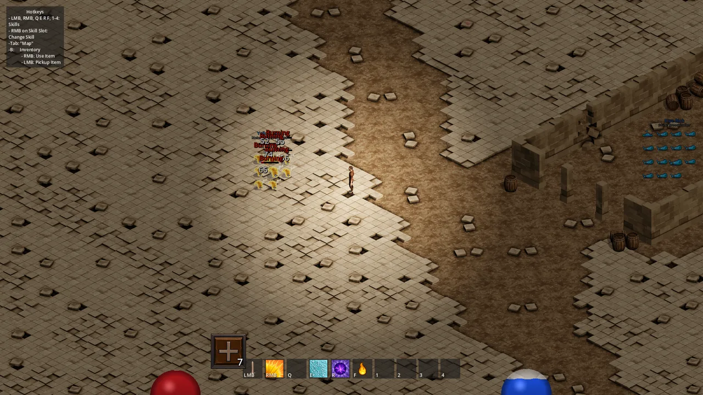
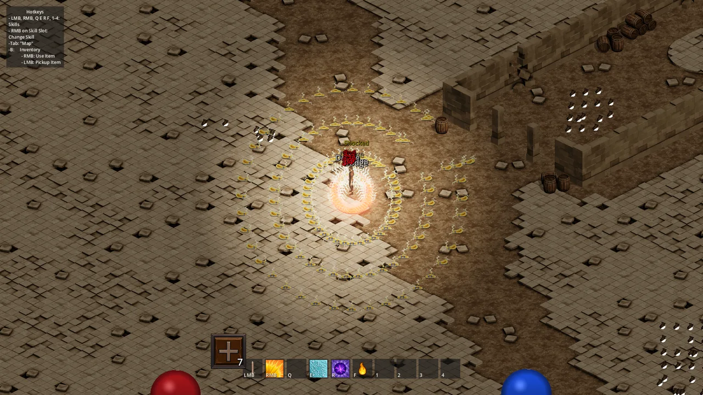
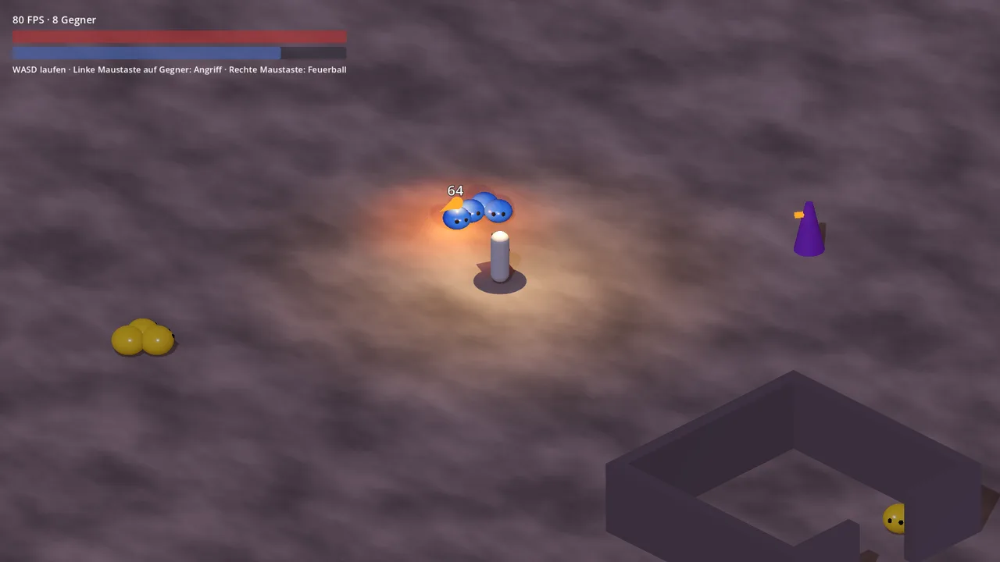
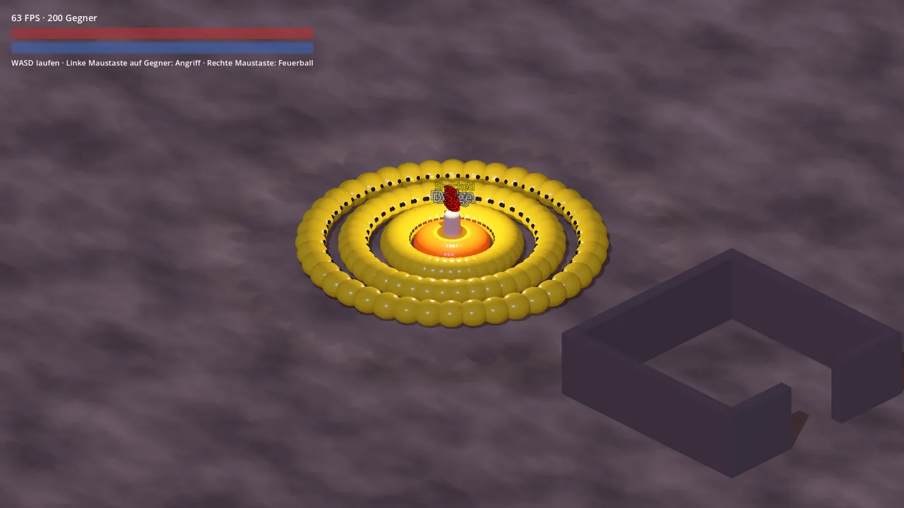
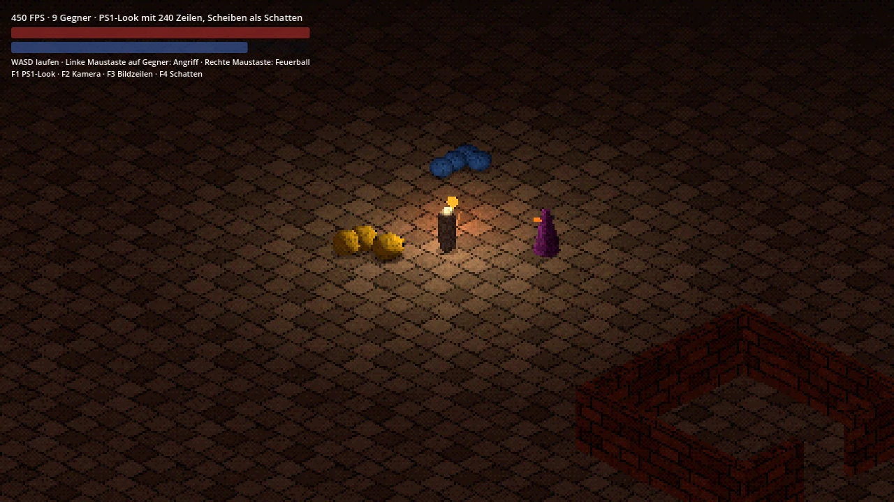
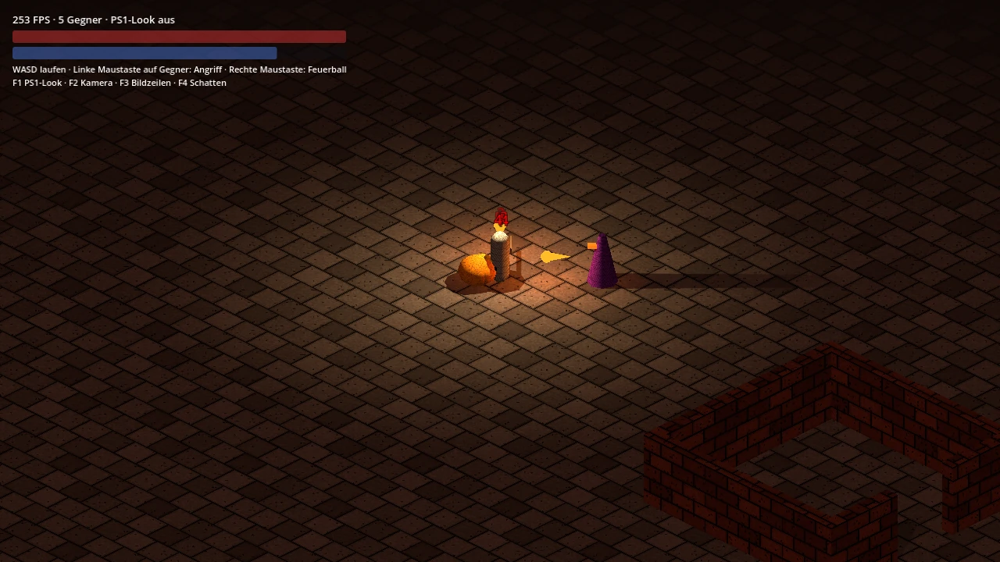

# Vergleich 2D und 3D

Hinweis vom 29.09.2026: Dieses Dokument hält den Vergleich fest, wie er gebaut wurde. Mit dem Abschluss von M5.5 ist die 2D-Fassung entfallen, und die Ordner `Spike3D` sind aufgelöst. Wo die Teile heute liegen, steht in der [Roadmap](ROADMAP.md) unter M5.5.

Stand: 29.09.2026, Branch `master_Compare3D`.
Das Dokument gehört zum Entscheidungspunkt in der [Roadmap](ROADMAP.md). Es hält den Vergleich fest, wie er zur Entscheidung vorlag. Was seitdem in 3D dazukam, steht in der Roadmap unter M5.5.
Held, Gegner und ein Zauber laufen einmal in 3D auf demselben Logik-Kern wie das 2D-Spiel. Alle Modelle sind Platzhalter aus Grundkörpern.

## Ergebnis in Kürze

| Frage | Befund |
|---|---|
| Läuft der Kern in 3D | Ja, ohne eine geänderte Zeile. Alle 547 Unit-Tests sind grün. |
| Laufen die Daten in 3D | Ja. Gegner und Skills benutzen dieselben Resources wie das 2D-Spiel. Nur die Szene dahinter ist eine andere. |
| Was musste neu geschrieben werden | Die Hüllen um den Kern: 2.204 Zeilen in 19 Dateien. Sie decken Held, Gegner, Projektil, Wegfindung und Anzeige ab. |
| Rechenzeit der Logik | Kein Unterschied von Belang. 200 kämpfende Gegner brauchen in beiden Varianten unter 4 ms pro Physik-Frame. |
| Bildrate | Im Testlevel gleich. Mit 200 Gegnern im Bild liegt 3D bei 63 Bildern pro Sekunde, 2D bei 107. Ohne Schatten liegt 3D gleichauf. |
| Aufwand pro Gegner | In 3D deutlich kleiner, sobald ein Modell da ist. In 2D wächst er mit jeder Blickrichtung und jeder Animation. |
| Das größte Risiko | In beiden Varianten die Grafik, nicht der Code. |

Entscheidung vom 29.09.2026: 3D im [PS1-Look](#nachtrag-ps1-look). Die Abwägung dazu steht am [Ende](#empfehlung).

## So startest du den Vergleich

1. Im Godot-Editor die Szene `Scenes/Spike3D/spike_3d.tscn` öffnen.
2. Mit F6 die aktuelle Szene starten.

| Eingabe | Wirkung |
|---|---|
| W, A, S, D | Laufen, bezogen auf den Bildschirm |
| Linke Maustaste auf einen Gegner | Hinlaufen und mit 100 % Waffenschaden angreifen |
| Rechte Maustaste | Feuerball in Richtung Maus oder auf den Gegner unter der Maus |
| F1 | PS1-Look an und aus |
| F2 | Kamera orthogonal oder perspektivisch |
| F3 | 240, 360 oder 480 Bildzeilen |
| F4 | Schatten aus Lichtern statt dunkler Scheiben |
| B | Charakterbogen und Inventar, seit M5.5 |

Links oben stehen Bildrate, Zahl der Gegner, Leben und Mana. Nach dem Tod steht der Held nach 2 Sekunden wieder am Startpunkt.

Seit dem [Nachtrag](#nachtrag-ps1-look) startet das Level mit dem PS1-Look. Die Bilder hier und alle Messwerte stammen aus der Zeit davor.

| | Testlevel | 200 Gegner |
|---|---|---|
| 2D |  |  |
| 3D |  |  |

## Was gebaut wurde

| Baustein | Inhalt | Datei |
|---|---|---|
| Einheit | Stat-Blatt, Statuseffekte, Abklingzeiten, Leben, Treffer annehmen | [Unit3D.cs](../Scripts/Spike3D/Unit3D.cs) |
| Held | Laufen, Angriff mit Hinlaufen und Schwungtakt, Zauber, Mana, Tod und Respawn, Lichtradius | [Hero3D.cs](../Scripts/Spike3D/Hero3D.cs) |
| Gegner | Werte aus der Gegner-Resource, `EnemyBrain`, Verfolgen, Ausholen, Aufgeben, Rückweg, Sichtlinie | [Enemy3D.cs](../Scripts/Spike3D/Enemy3D.cs) |
| Projektil | Flug, Treffer, Wand, Forks | [Projectile3D.cs](../Scripts/Spike3D/Projectile3D.cs) |
| Skill auslösen | Nahkampf und Projektil, auch als Fächer | [SkillExecutor3D.cs](../Scripts/Spike3D/SkillExecutor3D.cs) |
| Wegfindung | Navigationsnetz zur Laufzeit gebacken, Pfad um Wände | [LevelNavigation3D.cs](../Scripts/Spike3D/LevelNavigation3D.cs), [PathFollower3D.cs](../Scripts/Spike3D/PathFollower3D.cs) |
| Anzeige | Schadenszahlen, Lebensbalken, Kamera | [CombatText3D.cs](../Scripts/Spike3D/CombatText3D.cs), [HealthBar3D.cs](../Scripts/Spike3D/HealthBar3D.cs), [IsoCamera3D.cs](../Scripts/Spike3D/IsoCamera3D.cs) |
| Level | Boden, ummauerter Hof mit Tor, vier Spawn-Marker, Licht | [spike_3d.tscn](../Scenes/Spike3D/spike_3d.tscn) |
| Gegner-Szenen | Blue Blob, Yellow Blob, Test Enemy | [Scenes/Spike3D/Enemies](../Scenes/Spike3D/Enemies) |

Die Kamera blickt orthogonal im Winkel von 30 Grad auf den Boden. Das ergibt dasselbe Seitenverhältnis 2:1 wie die isometrischen Tiles, und der Bildausschnitt ist so groß wie im 2D-Spiel.

Nicht Teil des Vergleichs: Flächenzauber, Monster-Mods, Elite, Beute, Items am Helden, XP, Speichern, Skill-Leiste und Charakterbogen. Items am Helden und der Charakterbogen sind mit M5.5 dazugekommen.

## Was unverändert weiterläuft

| Bereich | Umfang | Anmerkung |
|---|---|---|
| Kern unter `Scripts/Core` | 70 Dateien, 3.819 Zeilen | Stats, Trefferauflösung, Statuseffekte, Schwungtakt, Abklingzeiten, `EnemyBrain`, Skalierung, Raster, Takt der Pfadsuche |
| Gegner-Resources | `blue_blob`, `yellow_blob`, `test_enemy` | Attribute, Waffe, Reichweite, Verhalten. Das Feld `Scene` zeigt weiter auf die 2D-Szene. |
| Skill-Resources | `attack`, `fireball`, `fire_spit` | Kosten, Abklingzeit, Schaden, Tempo, Forks. Das Feld `EffectScene` zeigt weiter auf die 2D-Szene. |
| Eingabeaktionen | `InputActions` | Dieselben Aktionen wie im 2D-Spiel |
| Kollisionsebenen | `CollisionLayers` | Dieselben Bits, dazu eine Ebene für den Boden |

Die Oberfläche besteht aus `Control`-Knoten und hängt nicht an 2D oder 3D. 15 ihrer Skripte nennen aber den Typ `Player2D` oder `BaseUnit`. Nach einem Wechsel müssten sie auf den neuen Typ zeigen.

Der Kern enthält genau eine Annahme über die Darstellung: `AreaSettings.GroundYScale`. Der Wert 0,5 staucht Flächen wie den isometrischen Boden. In 3D müsste er 1 sein.

## Was neu geschrieben wurde

| Aufgabe | 2D | Zeilen | 3D | Zeilen |
|---|---|---|---|---|
| Einheit | `BaseUnit` | 487 | `Unit3D` | 287 |
| Held | `Player2D` | 861 | `Hero3D` | 587 |
| Gegner | `Enemy`, `MonsterModRuntime` | 800 | `Enemy3D` | 430 |
| Skills | `SkillExecutor`, `SkillCast`, `SkillAim`, `SkillProjectile`, `SkillArea` | 452 | `SkillExecutor3D`, `Cast3D`, `Aim3D`, `Projectile3D`, `EffectScenes3D` | 278 |
| Wegfindung | `PathFollower`, `LevelNavigation` | 152 | `PathFollower3D`, `LevelNavigation3D` | 123 |
| Einheiten finden | `UnitRegistry` | 43 | `UnitRegistry3D` | 41 |
| Schadenszahlen | `FCTExtensions`, `FloatingCombatText` | 170 | `CombatText3D`, `FloatingText3D` | 164 |
| Level und Spawns | `EnemyController`, `SpawnMarker` | 252 | `Spike3DLevel`, `SpawnMarker3D` | 171 |
| Nur in 3D | | | `WorldScale`, `Layers3D`, `HealthBar3D`, `IsoCamera3D` | 123 |

Die 3D-Klassen sind kürzer, weil ihnen Funktionen fehlen, nicht weil 3D weniger Code braucht. Wo beide dasselbe tun, ist der Code fast Zeile für Zeile gleich. Aus `Vector2` wird `Vector3`, aus `NavigationAgent2D` wird `NavigationAgent3D`.

## Geprüft

| Prüfung | Ergebnis |
|---|---|
| Unit-Tests des Kerns | 547 von 547 grün |
| Laufzeitprüfung im 3D-Level, headless | 58 Schritte, siebenmal hintereinander fehlerfrei |
| Sichtprüfung | Bildschirmfotos oben |
| 2D-Spiel | Startet wie vorher, keine Datei des 2D-Spiels ist geändert |

Die Laufzeitprüfung deckt ab:

- Werte aus dem Kern: Held 60 Leben und 9 Mana, Blue Blob 9 Leben, Yellow Blob 76, Test Enemy 263.
- Laufen: 1000 Pixel pro Sekunde ergeben 5 Meter in einer halben Sekunde.
- Anklicken: Kopf und Füße treffen den Gegner, ein Klick daneben trifft niemanden.
- Feuerball: Mana, Abklingzeit, Treffer, Forks auf weitere Blobs, höchstens 7 Projektile, Burn über 4 Sekunden.
- Nahkampf: Hinlaufen, Treffer mit Crush in Reichweite.
- Gegner: Verfolgen, Ausholen, Treffer mit Lightning, Aufgeben nach 6 Sekunden, Rückweg.
- Wegfindung: Ein Gegner läuft aus dem Hof durch das Tor um die Mauer zum Helden. Der Held findet denselben Weg zu einem Gegner im Hof.
- Fraktion: Der Test Enemy trifft mit Fire Spit den Helden, aber kein Monster.
- Sichtlinie: Hinter der Mauer schießt der Test Enemy nicht.
- Tod und Respawn des Helden.

Die Prüfszenen sind wie bei M2 bis M5 wieder gelöscht. Nach dem letzten Prüflauf habe ich noch eine Eigenschaft umbenannt und die Messhilfen entfernt. Danach liefen Build und ein Start der Szene ohne Fehler, die 58 Schritte aber nicht noch einmal.

## Messung

Gemessen am 29.09.2026 auf deinem Rechner. In beiden Varianten standen genau 200 Yellow Blobs im Level, die Gegner aus den Spawn-Markern waren vorher entfernt.

### Rechenzeit pro Physik-Frame

Headless und damit ohne Zeichnen, Verfahren wie in M5. Zwei Läufe je Variante. Bei 60 Bildern pro Sekunde stehen 16,7 ms zur Verfügung.

| Lage | 2D | 3D |
|---|---|---|
| Leeres Level | 0,17 ms | 0,17 ms |
| 200 Gegner ruhen, Held weit weg | 1,29 bis 1,34 ms | 1,05 bis 1,18 ms |
| 200 Gegner ruhen, Held im Level | 1,38 bis 1,42 ms | 1,22 bis 1,25 ms |
| 200 Gegner kämpfen | 3,10 bis 3,25 ms | 1,77 bis 1,82 ms |

Der Vorsprung von 3D ist kein Vorteil der Technik. Den 3D-Gegnern fehlen `AnimationTree`, Monster-Mods und Namensschild. Mit animierten Modellen rücken die Werte zusammen.

### Bildrate

Fenster mit 1920x1080, ohne VSync.

| Lage | 2D | 3D |
|---|---|---|
| Leeres Level | 151 | 152 bis 161 |
| Testlevel, wie es in der Szene steht | 139 bis 143 mit 98 Gegnern | 129 bis 146 mit 8 Gegnern |
| 200 Gegner stehen am Helden und greifen an | 107 | 62 bis 64 |

Woher der Abstand bei 200 Gegnern kommt, zeigt die zweite Messung. Jede Zeile schaltet zusätzlich zur vorigen etwas ab:

| 3D mit 200 Gegnern | Bilder pro Sekunde |
|---|---|
| Ausgangslage | 63 |
| Mondlicht ohne Schatten | 83 |
| Licht des Helden ohne Schatten | 106 |
| Ein Netz pro Gegner statt drei, also ohne Augen | 124 |
| Ein Material für alle Körper statt eines pro Gegner | 133 |

- Schatten kosten am meisten. Jedes Licht mit Schatten zeichnet alle Gegner noch einmal.
- Danach zählt die Zahl der Netze. Ein Blob aus drei Grundkörpern ist teurer als ein fertiges Modell aus einem Netz.
- Ein animiertes Modell mit Skelett kostet zusätzlich. Das hat der Vergleich nicht gemessen.

Schadenszahlen, ebenfalls mit 200 Gegnern:

| Anzeige | Bilder pro Sekunde |
|---|---|
| Zahlen auf der 2D-Ebene, an einen Punkt der Welt geheftet | 62 bis 63 |
| `Label3D`, das sich nicht ändert | 63 |
| `Label3D`, das langsam ausblendet | 34 |
| Keine Zahlen | 67 bis 68 |

Ein `Label3D` baut sein Netz bei jeder Farbänderung neu. Die Zahlen liegen deshalb auf der 2D-Ebene.

## Aufwand pro neuem Gegner

| Schritt | 2D | 3D |
|---|---|---|
| Grafik | Ein Spritesheet pro Animation, darin eine Zeile pro Blickrichtung. Der Blue Blob hat 6 Sheets mit je 4 Richtungen. | Ein Modell. Im Vergleich drei Grundkörper. |
| Blickrichtung | Eine Animation pro Richtung und Aktion, dazu Blend-Spaces im `AnimationTree` | Eine Drehung des Modells, eine Zeile Code |
| Animationen | Blue Blob 9, Grundszene der Gegner 16, Held 34 bei 8 Richtungen | Eine pro Aktion, egal in welche Richtung |
| Szene | 308 Zeilen beim Blue Blob, 940 beim Helden | 50 Zeilen beim Blue Blob, 67 beim Helden |
| Daten | `EnemyResource` anlegen | Dieselbe `EnemyResource` |
| Ausholen und Tod | Eigene Sprites | Im Vergleich Farbe, Vorstoß und Zusammensacken per Tween. Mit Modell je eine Animation. |
| Ausrüstung am Körper sichtbar | Ein Satz Sprites pro Item, Richtung und Animation | Ein Netz pro Item, an einen Knochen gehängt |

Die Zeile zur Ausrüstung ist eine Einschätzung, gebaut habe ich sie nicht.

## Aufwand pro Raum

| Punkt | 2D | 3D |
|---|---|---|
| Bausteine | Isometrische Tiles. Jede Richtung ist eine eigene Grafik, etwa `doorway_N` und `stoneWallGateClosed_W`. | Netze oder Grundkörper |
| Raum drehen | Jedes Tile gegen sein Gegenstück der neuen Richtung tauschen | Den Raum drehen |
| Reihenfolge beim Zeichnen | Y-Sortierung und Z-Index von Hand | Tiefenpuffer |
| Licht und Schatten | 2D-Lichter, Schatten brauchen Verdecker an den Tiles | Folgen aus der Geometrie |
| Navigationsnetz | Wird aus den Kollisionsformen gebacken | Genauso, mit einer Falle bei dicken Blöcken, siehe unten |
| Wände vor dem Helden | Verdecken ihn | Verdecken ihn ebenfalls. Eine 2,5 Meter hohe Wand verdeckt 4,3 Meter Boden. |

Das Verdecken braucht in M6 in beiden Varianten eine Lösung, etwa Wände, die durchsichtig werden.

## Was in 3D neu dazukommt

Alle Punkte sind beim Bauen aufgetreten, nicht aus der Theorie.

1. **Einheiten.** Kern und Resources rechnen in Pixeln, die 3D-Welt in Metern. `WorldScale` rechnet mit 100 Pixeln pro Meter um. Jede Stelle, die den Kern fragt, muss daran denken.
2. **Anklicken.** Der Kopf eines Gegners liegt auf dem Bildschirm über seinen Füßen. Der Bodenpunkt unter der Maus liegt dann über 2 Meter hinter ihm. Der Held prüft deshalb den Strahl der Maus gegen die Achse jedes Modells.
3. **Höhe.** Ein Projektil auf Brusthöhe fliegt über einen flachen Blob hinweg. Die Kollisionsform des Projektils ist deshalb ein 2 Meter hoher Zylinder.
4. **Körpergröße und Reichweite.** Mein erster Blob hatte 0,5 Meter Radius und kam nie in seine Angriffsreichweite von 80 Pixeln. Die Kollisionsformen sind jetzt so klein wie in 2D, das Modell ist größer.
5. **Navigationsnetz.** Für den Bäcker ist ein Quader hohl. In dicken Blöcken entstehen begehbare Inseln. Wände müssen dünner als der doppelte Radius der Einheiten sein oder niedriger als ihre Höhe.
6. **Netz über dem Boden.** Das Netz liegt eine Zellenhöhe über dem Boden. Die Abstände des `NavigationAgent3D` müssen diesen Versatz überbrücken, sonst gilt kein Wegpunkt als erreicht.
7. **Schatten und Zeichenaufrufe.** Siehe Messung. In 2D gab es diese Stellschraube nicht.
8. **Effekte.** Die Shader für Feuerball, Nova und Blitz sind 2D-Shader. In 3D entstehen die Effekte neu.
9. **Abstände fühlen sich anders an.** In 2D ist ein Aggroradius ein Kreis auf dem Bildschirm, in 3D ein Kreis auf dem Boden und damit auf dem Bildschirm halb so hoch. Der Held läuft in 2D nach oben so schnell wie zur Seite, in 3D wirkt der Weg nach oben halb so schnell.

## Aufwand für einen Wechsel

| Bereich | Stand im Vergleich | Rest |
|---|---|---|
| Held und Gegner | Als Vorlage gebaut | Items, XP, Speichern, Monster-Mods und Elite aus den 2D-Klassen übernehmen |
| Skills | Nahkampf und Projektil | Flächen, dazu 7 weitere Effekt-Szenen |
| Wegfindung | Fertig | Nichts |
| Oberfläche | Läuft unverändert | Typ des Helden in 15 Skripten tauschen |
| Beutel, Karte, Kellertür | Nicht gebaut | Neu bauen |
| Grafik | Grundkörper | Modelle, Animationen, Effekte, Level-Bausteine |

Den Code schätze ich auf Größe M, also ein bis zwei Wochen Hobbyzeit. Die Grafik ist der größere Posten und hängt davon ab, woher die Modelle kommen.

## Nachtrag: PS1-Look

Am 29.09.2026 kam der Wunsch dazu: Wenn 3D, dann im Stil von Silent Hill auf der PlayStation 1. Der Look ist in den Vergleich eingebaut und lässt sich im laufenden Spiel umschalten.

| Orthogonal, 240 Zeilen | Perspektivisch, 240 Zeilen | PS1-Look aus |
|---|---|---|
|  |  |  |

Der Look besteht aus sechs Zutaten:

| Zutat | Was die PS1 tat | Umsetzung |
|---|---|---|
| Wackelnde Eckpunkte | Sie kannte keine Bruchteile von Pixeln | Der Vertex-Shader rastet jeden Eckpunkt auf dem Raster der Auflösung ein |
| Verzogene Texturen | Sie verteilte Texturen gerade über den Bildschirm, ohne die Tiefe zu beachten | Der Shader hebt die Korrektur der Perspektive wieder auf |
| Grobe Pixel | 320x240 Bildpunkte | Eine Nachbearbeitung fasst das Bild zu 240 Zeilen zusammen |
| Wenige Farben mit Raster | 15 Bit Farbtiefe, gemildert durch ein Punktmuster | Dieselbe Nachbearbeitung: 32 Stufen pro Kanal, Bayer-Muster 4x4 |
| Harte, kleine Texturen | Keine Filterung, 64x64 Pixel waren üblich | Texturen mit 32 und 64 Pixeln, im Shader ungefiltert |
| Dunkelheit und Nebel | Verbargen die geringe Sichtweite | Kaum Umgebungslicht, Licht des Helden, Tiefennebel |

Dazu kommen grobe Netze mit 6 bis 10 Segmenten und dunkle Scheiben statt Schatten.

| Datei | Inhalt |
|---|---|
| [ps1_surface.gdshader](../Shaders/Spike3D/ps1_surface.gdshader) | Material für alle Netze: Einrasten, affine Texturen, Texturen nach Weltkoordinaten, Färbung |
| [ps1_screen.gdshader](../Shaders/Spike3D/ps1_screen.gdshader) | Nachbearbeitung: Bildzeilen, Farbtiefe, Punktmuster |
| [Ps1Look.cs](../Scripts/Spike3D/Ps1Look.cs) | Stellt alle Werte ein, im Inspector und über F1, F3 und F4 |
| [Textures/Spike3D](../Textures/Spike3D) | Vier erzeugte Platzhalter: Pflaster, Ziegel, Haut, Stoff |

Bildrate im Testlevel bei 1920x1080: 218 mit PS1-Look, 160 ohne. Der Look ist schneller, weil er die Schatten abschaltet.

Befunde:

- Bei orthogonaler Kamera gibt es keine verzogenen Texturen, weil dort nichts in die Tiefe schrumpft. Das Wackeln der Eckpunkte bleibt. Wer den vollen Effekt will, braucht die perspektivische Kamera.
- Große Flächen müssen in Kacheln zerlegt sein. Der Boden besteht aus 30 mal 30 Feldern, sonst verzieht sich die Textur über das ganze Level.
- Bei 240 Zeilen ist der Held 24 Pixel hoch. Steine und Ziegel müssen mindestens einen Meter groß sein, kleinere Muster flimmern.
- Schadenszahlen und Oberfläche bleiben scharf, sie liegen über der Nachbearbeitung.
- Das Einrasten gilt auch für den Durchlauf der Schatten. Schatten aus Lichtern zittern deshalb leicht.

Bewusst offen gelassen:

- Das Spiel rechnet weiter in voller Auflösung, erst die Nachbearbeitung vergröbert. Ein kleines Renderziel wäre schneller und ergibt dasselbe Bild.
- Die PS1 beleuchtete pro Eckpunkt. Der Vergleich beleuchtet pro Pixel, weil der Boden dafür fein genug zerlegt sein müsste.
- Wände im Licht des Helden werfen ohne Schatten kein Dunkel hinter sich. Das Licht scheint durch Mauern.

## Empfehlung

Entscheidung vom 29.09.2026: 3D im PS1-Look. Der Abschnitt hält fest, was dafür und dagegen sprach.

Deine Rückmeldung vor der Entscheidung: Du magst den 2D-Stil, scheust aber den Aufwand der Sprites. Modelle in Low-Poly würdest du selbst bauen, und 3D soll nach PS1 aussehen.

Der PS1-Look senkt den Aufwand für Grafik weiter: Modelle mit wenigen hundert Dreiecken, Texturen mit 64 Pixeln, keine Normal Maps. Er verzeiht einfache Modelle, weil Auflösung und Dunkelheit Details ohnehin schlucken.

Ich empfehle 3D, wenn du mit fertigen Modellen im Low-Poly-Stil leben kannst. Sonst empfehle ich, bei 2D zu bleiben.

| Kriterium | Spricht für |
|---|---|
| Neun Höllenkreise mit je vier bis fünf Gegnertypen und einem Boss, also rund 50 Gegner | 3D. In 2D braucht jeder davon Sprites für jede Richtung und jede Animation. |
| Sichtbare Ausrüstung bei 16 Plätzen | 3D |
| Handgebaute Räume, die der Generator dreht und einstreut | 3D |
| Dunkelheit und Lichtradius als Spielmechanik | 3D |
| Alles Vorhandene läuft und sieht schon nach Spiel aus | 2D |
| Kein neuer Arbeitsablauf für Modelle, Materialien und Animationen | 2D |
| Bildrate bei vielen Gegnern ohne Nacharbeit | 2D |
| Handgezeichneter Stil | 2D |

Drei Fragen entscheiden es:

1. Woher kommen die Gegner für neun Kreise, als Spritesheets oder als Modelle?
2. Soll man Ausrüstung am Helden sehen?
3. Welchen Stil soll das Spiel haben?

Mit der Wahl von 3D wird der Ordner `Scripts/Spike3D` zur Vorlage. Die 2D-Klassen wandern Funktion für Funktion hinüber, danach entfällt die 2D-Schicht.
